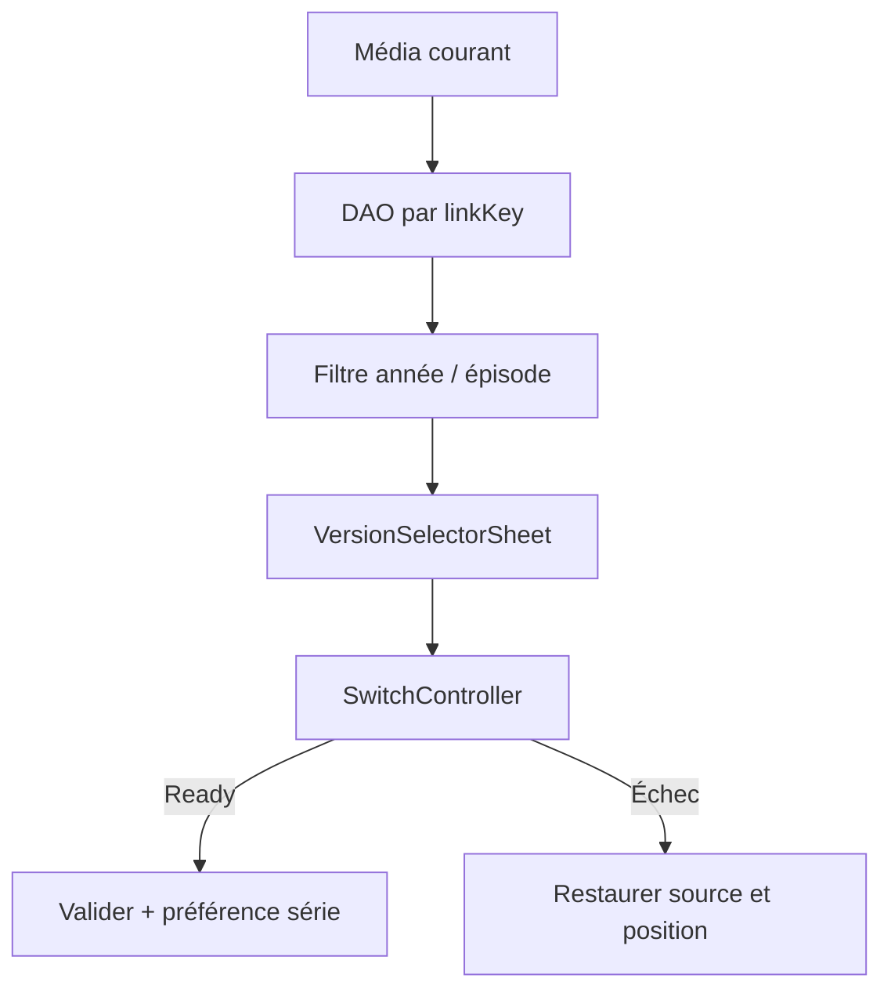

# F39 - Étiquettes de version dans les listes et sélecteur de versions dans le lecteur

## Informations générales

Status:
ARCHITECTURE

Created:
2026-08-15

Dépendances:
T21 (titre nettoyé, attributs extraits, clé de liaison) — bloquant.

---

# 1. Description

Deux usages de la donnée produite par T21, pour les films et les séries :

1. **Étiquettes.** Les vignettes des listes affichent la langue et la qualité de
   la version (deux badges au maximum, ex. « VF · 4K »), pour choisir sans ouvrir
   la fiche.
2. **Sélecteur de versions dans le lecteur.** Un bouton « Version » liste les
   autres entrées du catalogue partageant la même clé de liaison. Le choix d'une
   autre version relance la lecture **à la même position**, sans repasser par la
   fiche.

Le sélecteur reprend l'emplacement et les codes des sélecteurs de pistes audio
et de sous-titres déjà présents dans le lecteur, sur mobile comme sur Android TV.

---

# 2. Contexte

Le catalogue contient plusieurs versions de la même œuvre, réparties dans les
listes sans lien visible entre elles. Aujourd'hui, changer de version impose de
quitter la lecture, revenir à la liste ou à la recherche, retrouver l'autre
entrée à l'œil et relancer depuis le début — la position de lecture mémorisée
étant propre à chaque entrée, elle est perdue.

Ce parcours est fréquent : on découvre en cours de lecture que la version lancée
n'est pas dans la bonne langue, que sa qualité est mauvaise, ou que son flux est
défaillant.

Les étiquettes attaquent le problème en amont (choisir la bonne version du
premier coup), le sélecteur en aval (corriger sans perdre sa place).

---

# 3. Objectif

- Depuis une liste, identifier la langue et la qualité d'une entrée sans l'ouvrir.
- Depuis le lecteur, voir toutes les versions disponibles de l'œuvre en cours.
- Basculer sur une autre version en conservant la position de lecture.
- Ne jamais laisser l'utilisateur devant un écran noir : un changement de version
  qui échoue revient à la version précédente.
- Pour une série, ne pas rechoisir sa version à chaque épisode.

---

# 4. Décisions produit prises à l'étape 1

| Sujet | Décision |
|---|---|
| Emplacement du sélecteur | Dans le lecteur uniquement, aux côtés des sélecteurs de pistes existants. Pas de sélection préalable depuis la fiche média. |
| Contenu des étiquettes | Langue **et** qualité, deux badges au maximum (ex. « VF · 4K »). Ni la qualité seule, ni un compteur de versions. |
| Échec d'un changement de version | Retour automatique à la version précédente, à la même position, avec un message bref. Pas d'écran d'erreur, pas d'enchaînement automatique vers une troisième version. |
| Mémorisation (séries) | La version choisie est mémorisée pour toute la série, par profil — cohérent avec la mémorisation existante des pistes audio et sous-titres (`TrackPreferenceEntity`). |
| Périmètre média | Films et séries. Les chaînes en direct relèvent de F40. |
| Plateformes | Mobile et Android TV dès la première livraison. |

## Décisions produit prises à l'étape 2

| Sujet | Décision |
|---|---|
| Entrée sans attribut détecté | Aucun badge affiché — pas d'information fabriquée, vignette inchangée par rapport à aujourd'hui. |
| Nommage des versions dans le sélecteur | Attributs extraits (T21) sous forme lisible, ex. « VF · 4K » — pas le libellé Xtream brut. |
| Version cible plus courte que la position courante | Reprise près de la fin de la version cible, plutôt qu'au début ou refus du changement. |
| Version en cours dans la liste du sélecteur | Affichée et marquée comme active, comme les sélecteurs de pistes audio et sous-titres existants. |
| Sélecteur en lecture hors ligne | Hors périmètre : n'apparaît pas dans le lecteur des contenus téléchargés, qui n'a qu'une seule version présente sur l'appareil. |

---

# 5. Hypothèses

- T21 est livré et la clé de liaison est fiable : les versions listées désignent
  bien la même œuvre.
- La position de lecture est transposable telle quelle entre deux versions : les
  fichiers d'une même œuvre partagent approximativement le même montage et la
  même durée. Les écarts (génériques distribués, coupures) restent de l'ordre de
  quelques secondes.
- Le nombre de versions par œuvre reste faible : une liste simple suffit, sans
  recherche ni pagination.
- La place disponible sur une vignette permet deux badges sans masquer l'affiche
  ni casser la grille existante.
- Les attributs extraits sont suffisamment homogènes pour être affichés bruts,
  sans table de correspondance de libellés.

---

# 6. Questions ouvertes

| Point traité à l'étape 3 | Décision |
|---|---|
| Préférence de série | Nouvelle table `series_version_preferences`, indexée par profil et clé de liaison. `TrackPreferenceEntity` reste dédiée aux langues audio/sous-titres d'un média précis. |
| Une seule version | Le bouton « Version » est masqué. Un contrôle désactivé n'apporte aucune action et alourdit la navigation D-pad. |
| Épisode équivalent | Une version de série n'est sélectionnable que si elle contient le même couple saison/épisode ; les versions incomplètes sont filtrées avant affichage. |

Aucune question bloquante ne reste ouverte pour l'étape 4.

---

# 7. Spécification fonctionnelle

## 7.1 User stories

- En tant qu'utilisateur qui parcourt une liste de films ou séries, je veux
  voir la langue et la qualité d'une entrée sans l'ouvrir, pour choisir la
  bonne version du premier coup.
- En tant qu'utilisateur en cours de lecture, je veux changer de version
  sans perdre ma position, pour corriger un choix de langue ou de qualité
  sans devoir recommencer.
- En tant qu'utilisateur qui regarde une série, je veux que mon choix de
  version soit retenu pour les épisodes suivants, pour ne pas le refaire à
  chaque épisode.

## 7.2 Parcours utilisateur

**Étiquettes dans les listes**

1. L'utilisateur parcourt une liste de films ou de séries (accueil,
   catalogue, recherche, favoris).
2. Chaque vignette affiche, au maximum, deux badges : langue puis qualité
   (ex. « VF · 4K »).
3. Une entrée sans attribut détecté n'affiche aucun badge (décision étape 2).

**Sélecteur de versions dans le lecteur**

1. Pendant la lecture d'un film ou d'un épisode, l'utilisateur ouvre le
   bouton « Version », à l'emplacement des sélecteurs de piste audio et de
   sous-titres déjà présents dans le lecteur.
2. La liste affiche toutes les entrées partageant la clé de liaison (T21) de
   l'œuvre en cours, nommées par leurs attributs extraits (ex. « VF · 4K »),
   avec la version en cours marquée comme active (décisions étape 2).
3. L'utilisateur sélectionne une autre version.
4. La lecture bascule sur cette version, reprise à la même position — ou
   près de la fin si la version cible est plus courte que la position
   courante (décision étape 2).
5. Si le changement échoue, retour automatique à la version précédente, à
   la même position, avec un message bref (voir 7.5).
6. Pour une série, le choix est mémorisé par profil et réappliqué
   automatiquement aux épisodes suivants de la série, sans repasser par le
   sélecteur.

## 7.3 Règles métier

- Deux badges maximum par vignette, dans l'ordre langue puis qualité —
  jamais un compteur de versions, jamais la qualité seule (décision étape 1).
- Le sélecteur ne liste que les entrées partageant la clé de liaison T21 de
  l'œuvre en cours.
- Pour une série, la mémorisation s'applique à toute la série, par profil
  (décision étape 1) : un changement explicite sur un épisode ultérieur
  écrase la préférence mémorisée pour le reste de la série.
- Le sélecteur n'existe que dans le lecteur, jamais en présélection depuis
  la fiche média (décision étape 1).
- N'apparaît pas dans le lecteur des contenus téléchargés hors ligne
  (décision étape 2).

## 7.4 Cas limites

- **Une seule version disponible** pour une œuvre : le bouton « Version »
  n'apparaît pas ou est désactivé (détail d'implémentation renvoyé à
  l'étape 3, sans différence de comportement observable pour
  l'utilisateur).
- **Versions aux attributs identiques** (ex. deux entrées « VF · HD ») :
  affichées telles quelles dans la liste, sans distinction supplémentaire —
  l'utilisateur choisit entre deux entrées qui paraissent identiques
  (limite acceptée : la clé de liaison T21 ne garantit pas l'unicité des
  attributs entre versions).
- **Changement de version explicite en cours de série** : la préférence
  s'applique aux épisodes suivants même non encore ouverts.
- **Version cible elle-même défaillante dès l'ouverture** : traitée comme
  un échec de changement (7.5), retour à la version précédente.

## 7.5 Gestion des erreurs

- Échec technique lors du changement de version (flux injoignable, timeout,
  erreur de lecture immédiate) : retour automatique et silencieux à la
  version précédente, à la même position, avec un message bref à l'écran
  (ex. « Cette version n'est pas disponible, retour à la version
  précédente. »). Jamais d'écran noir, jamais d'enchaînement automatique
  vers une troisième version (décision étape 1).
- Catalogue indisponible au moment d'ouvrir le sélecteur (absence de
  connexion, service en erreur) : le bouton reste accessible, la liste
  affiche un état vide ou un message d'indisponibilité temporaire, sans
  jamais interrompre la lecture en cours.

## 7.6 Critères d'acceptation

- Une vignette de film ou de série affiche au maximum deux badges (langue,
  qualité), jamais plus, jamais un compteur.
- Depuis le lecteur, le bouton « Version » liste toutes les entrées
  partageant la clé de liaison T21 de l'œuvre en cours, avec la version
  active identifiée.
- Choisir une autre version reprend la lecture à la même position (ou près
  de la fin si la cible est plus courte), sans repasser par la fiche.
- Un changement de version qui échoue revient à la version précédente, à la
  même position, avec un message — jamais un écran noir.
- Pour une série, le choix de version se maintient sur les épisodes
  suivants sans nouvelle sélection, par profil.
- Le sélecteur n'apparaît pas dans le lecteur des contenus téléchargés hors
  ligne.

---

# 8. Spécification technique

## 8.1 Contrat fourni par T21

F39 consomme exclusivement `linkKey`, `releaseYear`, `languageTag` et
`qualityTag` persistés par T21. Aucun parsing du libellé Xtream n'est autorisé
dans les écrans ou le lecteur.

Les modèles `VodStream`, `SeriesStream` et les projections de cartes exposent un
`MediaVersionLabel(language, quality)`. Le formatage (`VF`, `VOSTFR`, `4K`...)
est centralisé dans un mapper UI et n'utilise jamais le fragment brut pour la
V1 ; le fragment brut reste disponible pour diagnostic/évolutions.

## 8.2 Accès aux versions

Nouvelles requêtes DAO, indexées par `linkKey` :

```sql
SELECT * FROM vod_streams
WHERE linkKey = :linkKey
  AND (:year IS NULL OR :year <= 0 OR releaseYear IS NULL
       OR releaseYear <= 0 OR releaseYear = :year)
ORDER BY qualityRank DESC, streamId ASC;
```

Le rang qualité est calculé côté Kotlin depuis `qualityTag` pour ne pas ajouter
une septième colonne T21 ; les groupes ne contiennent que quelques lignes. Les
séries utilisent la même règle dans `SeriesDao`.

Pour un épisode, `SeriesVersionResolver` :

1. charge les séries compatibles par `linkKey` et année ;
2. demande à `SeriesDao` l'épisode de même `seasonNum + episodeNum` pour chaque
   série candidate ;
3. élimine les candidates sans épisode équivalent ;
4. construit un `PlayableVersion` avec l'URL Xtream et les attributs d'affichage.

Cette résolution est locale et ne déclenche pas `get_series_info` pendant la
lecture. Une série dont les épisodes ne sont pas encore en cache n'est donc pas
proposée jusqu'à l'ouverture/enrichissement normal de sa fiche.

## 8.3 Persistance de la préférence série

```kotlin
@Entity(
    tableName = "series_version_preferences",
    primaryKeys = ["profileId", "linkKey"],
    foreignKeys = [ForeignKey(
        entity = ProfileEntity::class,
        parentColumns = ["id"],
        childColumns = ["profileId"],
        onDelete = ForeignKey.CASCADE
    )],
    indices = [Index("profileId"), Index("linkKey")]
)
data class SeriesVersionPreferenceEntity(
    val profileId: Int,
    val linkKey: String,
    val preferredSeriesId: Int,
    val updatedAt: Long
)
```

La préférence est locale et par profil, cohérente avec la décision produit.
Elle n'est pas synchronisée tant qu'aucun namespace cloud correspondant n'est
spécifié. Si la série préférée ou l'épisode équivalent n'existe plus, le
resolver retombe sur la série ouverte et supprime paresseusement la préférence
obsolète.

## 8.4 Badges dans les listes

Les projections `VodStreamListRow` et `SeriesStreamListRow` sélectionnent les
deux tags T21. Le mapper construit zéro, un ou deux badges dans l'ordre langue
puis qualité. Les cartes communes de l'accueil, catalogue, recherche et favoris
reçoivent la même liste de badges afin d'éviter quatre implémentations
divergentes.

Les badges n'ajoutent aucune requête par carte. Les données viennent de la
projection couvrante/du flux de liste existant. L'index couvrant T9 n'est pas
élargi par F39 : T21 décide explicitement des colonnes de projection, et le coût
est vérifié avec `EXPLAIN QUERY PLAN` avant livraison. Si l'ajout fait perdre la
couverture de l'onglet « Tout », l'index T9 est étendu une seule fois dans la
migration T21.

## 8.5 Sélecteur et bascule transactionnelle

`VersionSelectorSheet` réutilise le composant et le focus des sélecteurs audio
et sous-titres. Il reçoit une liste déjà résolue ; la version active est
identifiée par son identifiant fournisseur, pas par son libellé.

`MediaVersionSwitchController` réalise la bascule :

1. capture média courant, position, `playWhenReady`, vitesse et préférences de
   pistes ;
2. prépare la cible sans effacer cet instantané ;
3. attend `STATE_READY` avec un timeout de 8 secondes ; T23 peut exécuter sa
   réparation dans ce délai global avant de conclure à l'échec ;
4. obtient la durée réelle et cherche à
   `min(positionSource, max(0, durationCible-2s))` ;
5. après trois secondes stables, valide la cible et, pour une série, persiste la
   préférence ;
6. sur échec, reconstruit la source précédente et restaure sa position ; la
   préférence n'est jamais modifiée.

Une génération de switch empêche une réponse tardive de la cible A d'écraser
une cible B choisie ensuite. Pendant le chargement, le sélecteur est fermé et
les nouveaux changements sont ignorés jusqu'au succès/rollback.

## 8.6 Intégration des lecteurs

- `VodPlayerScreen` obtient les versions via un `VodVersionsViewModel` ou le
  ViewModel VOD existant et délègue la bascule au contrôleur partagé ;
- `SeriesPlayerScreen` résout l'épisode équivalent et applique la préférence de
  série avant de construire le premier `MediaItem` ;
- le lecteur hors ligne reçoit `versionsEnabled = false`, donc ne crée ni
  requête DAO ni bouton ;
- un groupe de zéro/une candidate masque le bouton ; deux candidates ou plus
  l'affichent.

## 8.7 Performance, compatibilité et erreurs

- toutes les requêtes de groupe passent par l'index `linkKey` de T21 ;
- aucune pagination : un plafond défensif de 20 versions protège d'une clé
  anormalement large, avec log agrégé ;
- aucune nouvelle dépendance ;
- les médias favoris ou historiques reconstruits depuis `MediaRef` doivent
  rejoindre leur entité catalogue pour obtenir les tags et la clé ; sans ligne
  catalogue, ils restent lisibles mais sans badges/sélecteur ;
- le message de rollback est une ressource localisée et ne contient aucun
  détail réseau ou codec.

## 8.8 Tests automatisés

Tests DAO SQLite des groupes, années, ordre et épisode équivalent ; tests du
resolver de préférence obsolète ; tests des badges 0/1/2 ; tests purs du
switch controller (succès, durée plus courte, timeout, rollback, double clic,
interaction T23) ; tests de ViewModel mobile/TV sans appareil.

## 8.9 Fichiers impactés ou nouveaux

**Nouveaux** : `SeriesVersionPreferenceEntity.kt`, DAO/repository associé,
`SeriesVersionResolver.kt`, `MediaVersionSwitchController.kt`,
`VersionSelectorSheet.kt` et tests.

**Modifiés** : `AppDatabase.kt`, `Migrations.kt`, `AppModule.kt`, `VodDao.kt`,
`SeriesDao.kt`, `CatalogListRow.kt`, modèles VOD/série, mappers repositories,
cartes partagées des listes, `VodPlayerScreen.kt`, `SeriesPlayerScreen.kt`,
ViewModels VOD/série, ressources `strings.xml` FR/EN et tests existants.

---

# 9. Architecture

## 9.1 Flux de lecture



## 9.2 Responsabilités

- **T21/DAO** : identité des groupes et attributs ;
- **Resolvers** : compatibilité année, présence de l'épisode et préférence ;
- **UI** : badges et choix, aucune orchestration réseau ;
- **Switch controller** : transaction de lecture et rollback ;
- **Repository de préférence** : état profil+série uniquement.

## 9.3 Dépendances et risques

- T21 est strictement bloquant ;
- le montage de deux versions peut différer : le seek est borné mais aucun
  recalage sémantique n'est possible en V1 ;
- une série alternative incomplète est volontairement masquée pour l'épisode
  courant ;
- la bascule doit rester compatible avec T23 : un seul contrôleur de moteur,
  pas deux listeners concurrents.

---

# 10. Plan de développement

_À compléter — étape 4._

---

# 11. Notes de développement

---

# 12. Review

## Critique

## Majeur

## Mineur

## Corrections demandées

---

# 13. Release

Version :

Commit :

Date :
