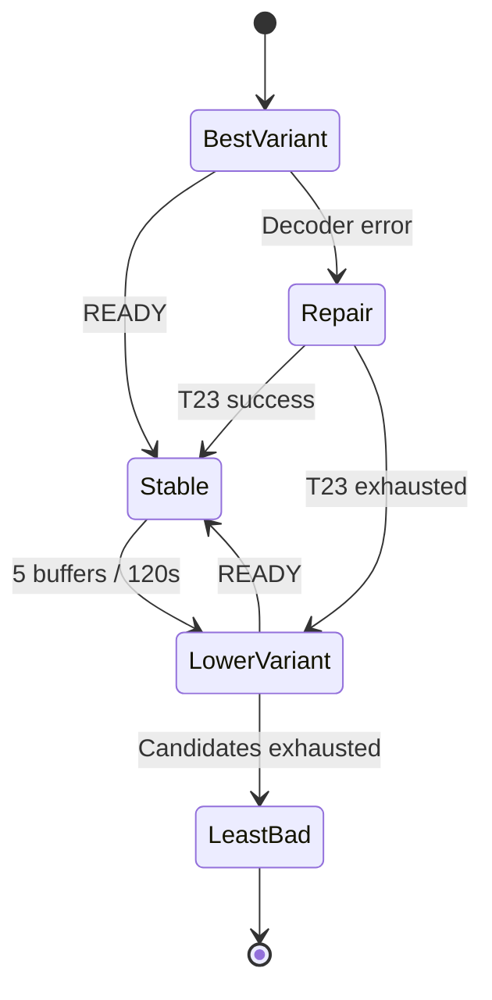

# F40 - Sélecteur de qualité des chaînes et mode automatique avec repli

## Informations générales

Status:
ARCHITECTURE

Created:
2026-08-15

Dépendances:
T21 (clé de liaison des chaînes) — bloquant.

---

# 1. Description

Un bouton « Qualité » dans le lecteur de direct liste les variantes de la chaîne
en cours (les entrées partageant sa clé de liaison T21 : `TF1 4K`, `TF1 FHD`,
`TF1 HD`, `TF1 SD`…) et permet d'en changer immédiatement. Le direct n'ayant pas
de position de lecture, la bascule est un simple changement de flux.

S'ajoute un **mode automatique** : l'application ouvre la meilleure qualité
disponible et, si le flux échoue ou se révèle instable, se replie sur la qualité
inférieure, puis de proche en proche. Si aucune variante n'est stable, elle se
fixe sur la moins mauvaise mesurée pendant les essais.

Le mode automatique n'est pas actif par défaut : un réglage dans les Paramètres
permet d'en faire le comportement par défaut de toutes les chaînes.

---

# 2. Contexte

La qualité des flux de direct est très inégale d'une variante à l'autre et varie
dans le temps : un flux 4K peut être parfait le matin et injouable le soir.
Aujourd'hui, l'utilisateur qui tombe sur un flux mort ou saccadé doit revenir à
la liste, deviner quelle autre entrée correspond à la même chaîne, et relancer —
en pleine émission.

Ce ticket transforme ce parcours en une action d'un geste, et offre à qui le
souhaite un repli entièrement automatique.

Le mode automatique reste opt-in : une bascule de flux non demandée pendant une
émission est perçue comme une panne, pas comme un service. Le réglage global
permet à l'utilisateur averti d'en faire son défaut.

---

# 3. Objectif

- Changer de qualité sur une chaîne sans quitter le lecteur.
- Offrir, en option, une lecture qui se répare seule sans intervention.
- Ne jamais s'acharner sur un flux défaillant, ni osciller entre deux flux.
- Quand rien ne fonctionne parfaitement, rester sur le flux le moins mauvais
  plutôt que sur un écran noir.

---

# 4. Décisions produit prises à l'étape 1

| Sujet | Décision |
|---|---|
| Activation du mode automatique | **Manuel par défaut.** Un réglage dans les Paramètres permet de choisir le mode automatique comme comportement par défaut. |
| Déclencheur du repli | Erreur de lecture **ou** plusieurs coupures de mise en mémoire tampon rapprochées (seuils à caler à l'étape 2). |
| Remontée en qualité | Aucune remontée automatique : la qualité stable est conservée jusqu'à ce qu'on quitte la chaîne. La meilleure qualité est retentée au prochain zapping. |
| Toutes les variantes instables | On se fixe sur la moins mauvaise mesurée pendant les essais (score fondé sur la réussite d'ouverture et le nombre de coupures), pas systématiquement sur la plus basse. |
| Périmètre | Chaînes en direct uniquement. Films et séries relèvent de F39. |
| Plateformes | Mobile et Android TV dès la première livraison. |

## Décisions produit prises à l'étape 2

| Sujet | Décision |
|---|---|
| Seuil de déclenchement du repli | 5 coupures de mise en mémoire tampon en moins de 2 minutes, ou une erreur de lecture franche qui déclenche toujours immédiatement. |
| Signalement du repli | Message bref et discret à l'écran au moment du repli (ex. « Qualité ajustée automatiquement »), sans interrompre le visionnage. |
| Choix manuel pendant le mode automatique | Désactive l'automatisme pour cette chaîne uniquement, le temps de la session en cours. Le réglage global des Paramètres n'est pas modifié. |
| Mémorisation d'une qualité préférée hors mode automatique | Aucune mémoire : un choix manuel de qualité ne survit pas au zapping suivant sur la même chaîne. |

*Note : la question « le mode automatique retient-il, au prochain zapping, la qualité qui avait fonctionné, ou repart-il toujours de la plus haute ? » était déjà tranchée à l'étape 1 (ligne « Remontée en qualité ») : la meilleure qualité est retentée à chaque nouveau zapping sur la chaîne, sans mémoire de la qualité stable précédente.*

---

# 5. Hypothèses

- T21 regroupe correctement les variantes d'une chaîne, et l'ordre de qualité se
  déduit des attributs extraits (4K > FHD/1080p > HD > SD).
- Les indicateurs disponibles dans Media3 (erreurs de lecture, événements de mise
  en mémoire tampon, délai d'ouverture) suffisent à qualifier l'instabilité ; il
  n'est pas nécessaire de sonder le réseau séparément.
- Une bascule de flux coûte quelques secondes de noir : acceptable face à un flux
  défaillant, inacceptable sur un flux qui fonctionne — d'où l'absence de
  remontée automatique.
- Les mesures de stabilité n'ont pas besoin de survivre à la session : elles
  concernent des conditions réseau instantanées.
- Une chaîne sans variante n'affiche pas le bouton, ou l'affiche désactivé.

---

# 6. Questions ouvertes

| Point traité à l'étape 3 | Décision |
|---|---|
| Variantes de même qualité | Ordre stable : rang qualité décroissant, puis `num`, puis `streamId`. En mode automatique, une variante déjà essayée ne l'est plus durant la session, même si son étiquette est identique. |
| Chaîne sans variante | Le bouton « Qualité » est masqué lorsqu'il n'existe qu'un flux exploitable. |
| T23 | Une erreur de décodage est réparée par T23 sur la variante courante ; une erreur réseau ou l'épuisement de T23 autorise F40 à passer à la variante suivante. |
| F41 | Toute bascule de qualité clôt et purge le tampon local courant, puis démarre un nouveau tampon au direct sur la nouvelle variante. Deux encodages ne sont pas concaténés dans une même fenêtre temporelle. |

Aucune question bloquante ne reste ouverte pour l'étape 4.

---

# 7. Spécification fonctionnelle

## 7.1 User stories

- En tant qu'utilisateur qui regarde une chaîne en direct, je veux changer
  de qualité sans quitter le lecteur, pour corriger un flux mauvais sans
  interrompre l'émission plus que nécessaire.
- En tant qu'utilisateur qui subit régulièrement des flux instables, je veux
  une lecture qui se répare seule, pour ne plus avoir à zapper manuellement
  entre les variantes d'une même chaîne.
- En tant qu'utilisateur satisfait du direct tel quel, je veux que rien ne
  change sans mon accord : le mode automatique doit rester une option que
  j'active moi-même.

## 7.2 Parcours utilisateur

**Changement manuel de qualité**

1. Pendant la lecture d'une chaîne en direct, l'utilisateur ouvre le bouton
   « Qualité » dans le lecteur.
2. La liste affiche les variantes de la chaîne (entrées partageant sa clé de
   liaison T21), avec la qualité en cours marquée comme active.
3. L'utilisateur sélectionne une autre variante ; le flux bascule
   immédiatement (pas de position à conserver, le direct n'en a pas).
4. Si le mode automatique était actif pour cette chaîne, ce choix manuel le
   désactive pour cette chaîne, pour le reste de la session en cours
   (décision étape 2) ; le réglage global des Paramètres n'est pas modifié.

**Mode automatique (activé par chaîne ou par défaut via les Paramètres)**

1. À l'ouverture de la chaîne, l'application tente la meilleure qualité
   disponible.
2. Si le flux échoue à l'ouverture, ou si 5 coupures de mise en mémoire
   tampon surviennent en moins de 2 minutes (décision étape 2), l'application
   se replie sur la qualité immédiatement inférieure.
3. Le repli est signalé par un message bref et discret à l'écran (décision
   étape 2), sans interrompre le visionnage.
4. Le repli se répète de proche en proche si l'instabilité persiste, jusqu'à
   trouver une qualité stable ou épuiser les variantes disponibles.
5. Si aucune variante n'est stable, l'application se fixe sur la moins
   mauvaise mesurée pendant les essais (score fondé sur la réussite
   d'ouverture et le nombre de coupures — décision étape 1), plutôt que
   systématiquement sur la plus basse.
6. La qualité stable trouvée est conservée jusqu'à ce que l'utilisateur
   quitte la chaîne. Aucune remontée automatique n'est tentée pendant que la
   chaîne reste ouverte.
7. Au prochain zapping sur cette même chaîne (nouvelle ouverture), la
   meilleure qualité est retentée depuis le début, sans mémoire de la
   qualité stable trouvée la fois précédente (décision étape 1, confirmée
   étape 2).

## 7.3 Règles métier

- Le bouton « Qualité » liste uniquement les entrées partageant la clé de
  liaison T21 de la chaîne en cours.
- Le mode automatique est **désactivé par défaut** ; un réglage dans les
  Paramètres permet d'en faire le comportement par défaut de toutes les
  chaînes (décision étape 1).
- Déclencheurs du repli automatique : une erreur de lecture franche
  (immédiate), ou 5 coupures de mise en mémoire tampon en moins de 2 minutes
  (décision étape 2).
- Aucune mémorisation d'une qualité préférée, ni en mode manuel hors
  automatique, ni entre deux sessions (décision étape 2) : chaque ouverture
  de chaîne repart de zéro.
- Le direct n'a pas de position de lecture : un changement de qualité est un
  simple changement de flux, jamais une reprise à une position précise
  (contrairement à F39 pour les films et séries).

## 7.4 Cas limites

- **Chaîne sans variante** : le bouton « Qualité » n'apparaît pas ou est
  affiché désactivé (détail d'implémentation renvoyé à l'étape 3, sans
  différence de comportement observable).
- **Toutes les variantes échouent dès l'ouverture** : l'application se fixe
  sur la moins mauvaise mesurée pendant les essais (décision étape 1),
  jamais sur un écran noir.
- **Variantes aux attributs identiques** (ex. deux flux « HD ») : ordre de
  priorité renvoyé à l'étape 3 (voir Questions ouvertes) ; le comportement
  reste stable (jamais d'oscillation entre les deux au sein d'une même
  session).
- **Choix manuel puis nouvelle instabilité sur la variante choisie** : le
  mode automatique restant désactivé pour cette chaîne le temps de la
  session, aucun repli automatique n'intervient — l'utilisateur doit
  rouvrir le sélecteur lui-même.
- **Changement du réglage global en Paramètres pendant qu'une chaîne est
  déjà ouverte** : s'applique à la prochaine ouverture de chaîne, pas
  rétroactivement à la lecture en cours.

## 7.5 Critères d'acceptation

- Le bouton « Qualité » liste toutes les variantes de la chaîne en cours,
  avec la qualité active identifiée, et bascule immédiatement sans reprise
  de position.
- Avec le mode automatique actif, un flux qui échoue à l'ouverture ou
  accumule 5 coupures en moins de 2 minutes déclenche un repli vers la
  qualité inférieure, signalé par un message bref.
- Aucune remontée automatique de qualité ne se produit tant que la chaîne
  reste ouverte ; la meilleure qualité est retentée au zapping suivant.
- Quand toutes les variantes sont instables, l'application reste sur la
  moins mauvaise mesurée plutôt que d'afficher un écran noir.
- Un choix manuel de qualité pendant le mode automatique désactive
  l'automatisme pour cette chaîne, pour la session en cours seulement.
- Le réglage global des Paramètres change le comportement par défaut des
  prochaines ouvertures de chaîne, sans mémoire de qualité persistante par
  ailleurs.

## 7.6 Gestion des erreurs

- Échec de toutes les variantes dès l'ouverture (mode automatique) :
  l'application affiche la moins mauvaise mesurée pendant les essais plutôt
  que d'abandonner ; si même cet essai échoue totalement, le comportement
  d'erreur de lecture existant du lecteur s'applique (message clair, jamais
  de stack trace, conformément à AGENTS.md § Gestion des erreurs).
- Absence de variante exploitable pour la chaîne (bouton « Qualité »
  masqué ou désactivé) : le mode automatique n'a rien à essayer et se
  comporte comme si la chaîne n'avait qu'une seule qualité, sans erreur
  spécifique.

---

# 8. Spécification technique

## 8.1 Résolution et ordre des variantes

`LiveVariantRepository` interroge `LiveTvDao` par `linkKey` T21 et retourne des
`LiveVariant` contenant flux, qualité normalisée, rang et identité stable.

Ordre déterministe :

1. `UHD_4K > FHD > HD > SD > UNKNOWN` ;
2. numéro de chaîne `num` croissant (`0`/absent en dernier) ;
3. `streamId` croissant.

Deux variantes portant la même qualité restent deux candidates distinctes. Un
`attemptedStreamIds` de session interdit toute oscillation ou nouvel essai d'un
flux déjà rejeté. Une liste d'une seule candidate masque le bouton et désactive
la machine automatique sans état d'erreur.

## 8.2 État de session

`LiveQualitySession` est créé à chaque ouverture de chaîne logique :

```kotlin
data class LiveQualitySession(
    val linkKey: String,
    val mode: QualityMode,
    val candidates: List<LiveVariant>,
    val attempted: Set<Int>,
    val measurements: Map<Int, VariantMeasurement>,
    val automaticDisabledByUser: Boolean
)
```

Il ne survit ni au zapping ni à la fermeture du lecteur. Le choix manuel met
`automaticDisabledByUser = true` pour cette session seulement et ne modifie pas
le réglage global.

Le réglage `liveQualityModeDefault` est stocké dans `SettingsManager` sous forme
de booléen/enum stable, exposé par `SettingsState` et modifiable dans
`SettingsScreen`. Il n'est pas lié au profil et s'applique aux prochaines
ouvertures.

## 8.3 Mesure de stabilité

`LiveStabilityMonitor`, branché sur un unique `Player.Listener`, mesure :

- succès d'ouverture (`STATE_READY`) et délai d'ouverture ;
- transitions vers `STATE_BUFFERING` après le premier `READY` ;
- durée cumulée de buffering ;
- erreur finale qualifiée par `PlaybackFailureClassifier` T23.

Une deque d'horodatages monotoniques conserve uniquement les événements des
120 dernières secondes. Le cinquième buffering déclenche un repli. Les
transitions initiales `IDLE → BUFFERING → READY` ne comptent pas comme coupure.
Deux événements séparés par moins de 500 ms sont fusionnés pour absorber les
callbacks dupliqués.

## 8.4 Machine automatique

1. ouvre la première candidate triée ;
2. sur erreur réseau/source ou seuil 5/120 s, clôt sa mesure et sélectionne la
   candidate non essayée suivante ;
3. sur erreur de décodage, délègue à T23 ; F40 n'avance qu'après son échec final ;
4. ne remonte jamais en qualité et ne réessaie jamais un `streamId` ;
5. après épuisement, choisit la « moins mauvaise » par score lexicographique :
   `a atteint READY` d'abord, puis moins de coupures, puis moindre durée de
   buffering, puis meilleur délai d'ouverture, puis rang qualité ;
6. réouvre cette candidate une seule fois. Si elle échoue totalement, le message
   d'erreur standard du lecteur est affiché.

Chaque tentative porte un token de génération. Les callbacks de l'ancien flux
sont ignorés après la bascule. Un cooldown de 3 secondes après `READY` évite de
compter les transitions induites par la reconstruction elle-même.

## 8.5 Bascule manuelle et UI

`QualitySelectorSheet` réutilise les patterns de focus du lecteur. La variante
active est identifiée par `streamId`; les doublons de libellé sont conservés
dans l'ordre stable. Le choix manuel :

- invalide la machine automatique de la session ;
- arrête l'ancienne source ;
- demande au contrôleur de lecture partagé de préparer la nouvelle ;
- affiche le chargement existant et ne conserve aucune position live ;
- en cas d'échec, laisse le comportement d'erreur existant, sans lancer un
  autre repli automatique puisque l'utilisateur a explicitement repris la main.

Le toast/snackbar de repli automatique est une ressource brève localisée, par
exemple « Qualité réduite pour stabiliser la lecture », sans nom de codec ni
URL.

## 8.6 Coordination avec T23 et F41

`PlaybackRecoveryCoordinator` est l'unique arbitre d'une erreur :

- `NETWORK_SOURCE` ou instabilité → F40 ;
- `DECODER` → T23, puis F40 si aucune réparation ne réussit ;
- `BEHIND_LIVE_WINDOW` → retour au direct/F41, pas changement de qualité.

Une bascule F40 appelle `TimeshiftSession.close(PURGE)` avant de préparer le
nouveau flux. Une fois la variante `READY`, F41 crée un nouveau tampon. La barre
timeshift revient donc au direct avec une fenêtre vide ; concaténer des segments
de bitrate, codec ou timestamps différents est explicitement interdit en V1.

## 8.7 Performance, logs et compatibilité

- requête locale indexée par `linkKey`, plafond défensif de 20 variantes ;
- aucune persistance de mesures et aucune nouvelle table ;
- structures de mesure bornées (deque maximale pratique de quelques dizaines
  d'événements) ;
- logs agrégés par `streamId` hashé : raison, rang, temps d'ouverture, coupures,
  résultat ; aucune URL/identifiant de connexion ;
- pas de nouvelle dépendance ; mobile et TV partagent ViewModel/controller, seul
  le composant de focus diffère déjà dans l'UI.

## 8.8 Tests automatisés

Tests DAO de groupement/ordre ; tests de la fenêtre 5/120 s et fusion 500 ms ;
machine auto avec erreurs, doublons, épuisement et score ; choix manuel qui coupe
l'automatisme ; nouvelle session qui repart de la meilleure ; coordination
T23/F41 ; tests de `SettingsViewModel`. Tout le temps passe par un `Clock` faux.

## 8.9 Fichiers impactés ou nouveaux

**Nouveaux** : `LiveVariantRepository.kt`, `LiveQualitySession.kt`,
`LiveStabilityMonitor.kt`, `LiveQualityController.kt`,
`QualitySelectorSheet.kt` et tests.

**Modifiés** : `LiveTvDao.kt`, `LiveTvRepository.kt`/impl,
`LiveTvViewModel.kt`, `PlayerScreen.kt`, contrôleur de lecture partagé,
`SettingsManager.kt`, `SettingsState.kt`, `SettingsViewModel.kt`,
`SettingsScreen.kt`, ressources FR/EN et tests associés.

---

# 9. Architecture

## 9.1 Orchestration



## 9.2 Responsabilités

- **Variant repository** : groupe et ordre ;
- **Stability monitor** : événements Media3, sans décision de produit ;
- **Quality controller** : session, candidats, score et choix manuel ;
- **Recovery coordinator** : exclusivité T23/F40/F41 ;
- **UI** : sélection et message discret.

## 9.3 Risques

- faux positif de buffering : exclusion du démarrage, fusion et fenêtre
  monotone ;
- boucle entre qualités : ensemble `attempted` et token de génération ;
- toutes les variantes mauvaises : score déterministe puis une dernière
  tentative bornée ;
- perte du timeshift lors d'une bascule : choix explicite nécessaire pour
  garantir la cohérence des timestamps et des codecs.

---

# 10. Plan de développement

_À compléter — étape 4._

---

# 11. Notes de développement

---

# 12. Review

## Critique

## Majeur

## Mineur

## Corrections demandées

---

# 13. Release

Version :

Commit :

Date :
