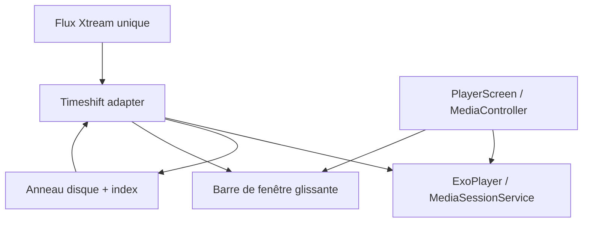

# F41 - Pause et reprise du direct (tampon local)

## Informations générales

Status:
TASK BREAKDOWN

Created:
2026-08-15

Dépendances:
Aucune. Bloquant partiel pour F42 (repli quand le panel n'expose pas de flux
décalé).

---

# 1. Description

Le lecteur de direct peut être mis en pause, puis repris là où il s'était
arrêté, avec un retour au direct à tout moment. Le retour en arrière dans ce
qui vient d'être diffusé est également possible.

L'enregistrement du tampon démarre **dès l'ouverture de la chaîne**, dans le
cache disque de l'application, sur une profondeur de **30 minutes réglable**
dans les Paramètres. Le tampon est purgé quand on quitte la chaîne.

La fonctionnalité est **entièrement locale** : elle ne dépend ni de l'EPG du
fournisseur, ni d'un service de reprise côté panel.

---

# 2. Contexte

Le direct est aujourd'hui strictement temps réel : quitter la pièce, c'est
manquer la scène. Le besoin est le plus fort sur le sport et l'information —
précisément les contenus où l'on veut aussi revoir une action.

Le choix d'un tampon local est délibéré : il ne dépend d'aucune capacité du
panel Xtream et fonctionne donc sur toutes les chaînes, y compris celles dont
l'EPG est absent ou faux.

**Écart de périmètre assumé.** AGENTS.md exclut « catch-up/timeshift » sauf
demande explicite du PO. La demande est faite : AGENTS.md doit être mis à jour
lors de la livraison.

---

# 3. Objectif

- Mettre le direct en pause et le reprendre sans perdre le fil.
- Revenir en arrière sur ce qui vient de passer, puis revenir au direct.
- Ne pas dépendre du fournisseur IPTV ni de la qualité de son EPG.
- Garder l'empreinte disque bornée, connue et réglable.
- Ne rien laisser derrière soi : le tampon disparaît quand on quitte la chaîne.

---

# 4. Décisions produit prises à l'étape 1

| Sujet | Décision |
|---|---|
| Début de l'enregistrement | Dès l'ouverture de la chaîne, ce qui autorise aussi le retour en arrière — pas seulement à partir de l'appui sur Pause. |
| Profondeur | 30 minutes par défaut, réglable dans les Paramètres. |
| Stockage | Cache disque de l'application, purgé en quittant la chaîne. Ni tampon en mémoire vive seule, ni conservation entre les chaînes (ce qui s'approcherait d'un enregistrement PVR, hors périmètre). |
| Dépendance à l'EPG | Aucune. Fonctionnalité entièrement locale. |
| Plateformes | Mobile et Android TV dès la première livraison. |

## Décisions produit prises à l'étape 2

| Sujet | Décision |
|---|---|
| Pause au-delà de la profondeur du tampon | Reprise au point le plus ancien encore disponible, plutôt qu'un retour forcé au direct. |
| Interface de retour en arrière | Barre de progression à fenêtre glissante représentant le tampon disponible, pas des sauts fixes de N secondes. |
| Bouton « Revenir au direct » | Explicite, visible dès que la position n'est plus la plus récente, près des contrôles de lecture. |
| Application en arrière-plan / écran éteint | Le tampon continue d'enregistrer tant que la chaîne reste ouverte ; seule sa fermeture réelle le purge. |
| Espace disque insuffisant | Réduction automatique et silencieuse de la profondeur effective, sans désactiver la fonctionnalité ni afficher d'erreur. |

---

# 5. Hypothèses

- Media3 permet de conserver et de relire le flux de direct déjà reçu (cache de
  contenu déjà utilisé pour les téléchargements hors ligne, `data/download/`).
  **Hypothèse structurante : à valider techniquement avant l'étape 3.**
- L'écriture continue sur le cache disque reste tenable sur box Android TV : ni
  usure notable, ni saccades dues aux entrées/sorties.
- 30 minutes de flux HD représentent une empreinte disque acceptable (ordre du
  gigaoctet) et le réglage permet de l'ajuster sur les appareils contraints.
- Le zapping fréquent (purge et redémarrage du tampon à chaque changement de
  chaîne) n'introduit pas de latence perceptible.
- Un flux dont la lecture est différée reste valide côté panel : l'URL n'expire
  pas et la session ne se ferme pas parce que le lecteur ne consomme plus en
  temps réel.

---

# 6. Questions ouvertes

| Point traité à l'étape 3 | Décision |
|---|---|
| Faisabilité Media3 | Le `SimpleCache` existant ne suffit pas : Media3 ne permet le seek que dans la fenêtre d'un live adaptatif, et un live progressif TS n'expose qu'une position. F41 nécessite un tampon/MediaSource dédié. |
| Protocoles | Deux adapters : HLS conserve les segments et un manifeste local glissant ; TS brut écrit un anneau de paquets avec index PCR/PTS et le rejoue via une source timeshift dédiée. Aucun fichier de téléchargement permanent n'est réutilisé. |
| Arrière-plan | Le lecteur live et le tampon sont possédés par un `MediaSessionService` de type `mediaPlayback`; l'écran Compose devient contrôleur. C'est nécessaire pour continuer lorsque l'activité passe en arrière-plan. |
| Changement F40 | Le tampon est purgé et recommence au direct à chaque changement de variante/qualité. |
| Dépendances | Aucune bibliothèque tierce supplémentaire ; Media3/NextLib existants et APIs Android suffisent. La première tâche d'implémentation devra être un spike des deux adapters avant l'UI. |

Aucune question d'architecture ne reste ouverte. Le support TS constitue
néanmoins le risque technique principal et un critère go/no-go d'implémentation.

---

## Arbitrages structurants ratifiés à l'étape 3

| Sujet | Décision |
|---|---|
| Propriété du lecteur | **Validé** : `LivePlaybackService : MediaSessionService` devient propriétaire de l'ExoPlayer live, `PlayerScreen` s'y connecte par `MediaController`. C'est la seule façon de tenir la décision d'étape 2 « le tampon continue en arrière-plan », maintenue explicitement par le PO. Gain annexe : notification de lecture, wakelock et cycle de vie enfin standardisés via Media3. |
| Ordre de livraison | **F41 est livré tard dans le lot**, après les tickets sans risque de régression (T21, T22, F39, F40, T23). Motif : ce ticket réécrit la propriété du lecteur direct et concentre le risque de régression du lot ; il ne doit pas déstabiliser des fonctionnalités livrées en parallèle. F42 n'en est pas bloqué pour son mode principal (catch-up panel), seulement pour son repli local. |

---

# 7. Spécification fonctionnelle

## 7.1 User stories

- En tant qu'utilisateur qui regarde le direct, je veux pouvoir mettre sur
  pause pour répondre à une interruption, sans manquer ce qui se joue
  pendant ce temps.
- En tant qu'utilisateur qui vient de rater une action (but, réplique,
  scène), je veux revenir de quelques instants en arrière sans quitter le
  direct pour de bon.
- En tant qu'utilisateur en différé, je veux revenir au direct d'un geste
  simple dès que je le souhaite.

## 7.2 Parcours utilisateur

**Mise en pause et reprise**

1. Dès l'ouverture d'une chaîne, l'application enregistre le flux reçu dans
   un tampon local de 30 minutes par défaut (réglable dans les Paramètres).
2. L'utilisateur met la lecture en pause à tout moment.
3. Il la reprend : la lecture continue exactement où elle a été arrêtée,
   pas au direct.
4. Si la pause a duré plus longtemps que la profondeur du tampon (le point
   de pause a été évincé), la reprise se fait au point le plus ancien
   encore disponible dans le tampon (décision étape 2), pas un retour forcé
   au direct.

**Retour en arrière**

1. Pendant la lecture (en pause ou non), l'utilisateur ouvre une barre de
   progression à fenêtre glissante représentant le tampon disponible
   (jusqu'à 30 minutes, moins si la chaîne vient d'être ouverte ou si
   l'espace disque a réduit la profondeur effective — décision étape 2).
2. Il déplace le curseur vers un instant déjà diffusé et reprend la lecture
   à cet instant.
3. Tant que la position n'est pas la plus récente disponible, un bouton
   « Revenir au direct » reste visible près des contrôles de lecture
   (décision étape 2).
4. L'utilisateur appuie sur ce bouton pour revenir instantanément au direct.

**Continuité en arrière-plan**

1. L'utilisateur quitte l'écran de lecture (mise en veille, changement
   d'application) sans fermer la chaîne.
2. Le tampon continue d'enregistrer tant que la chaîne reste ouverte
   (décision étape 2).
3. À son retour, l'utilisateur retrouve le tampon intact : le direct et les
   30 dernières minutes (ou la profondeur réglée) sont toujours disponibles.
4. Fermer réellement la chaîne (quitter le lecteur, changer de chaîne) purge
   le tampon (décision étape 1) : rouvrir la même chaîne redémarre un
   tampon vide.

## 7.3 Règles métier

- L'enregistrement démarre dès l'ouverture de la chaîne, pas seulement au
  premier appui sur Pause (décision étape 1) — c'est ce qui permet le retour
  en arrière sans avoir mis en pause au préalable.
- Profondeur par défaut : 30 minutes, réglable dans les Paramètres (décision
  étape 1).
- Le tampon est strictement local à l'appareil et à la session de visionnage
  de la chaîne ; il ne dépend d'aucun service ni EPG du fournisseur.
- Le tampon est purgé au changement ou à la fermeture de la chaîne — jamais
  conservé entre deux chaînes différentes (décision étape 1, pour rester
  distinct d'un enregistrement PVR hors périmètre).
- Une réduction automatique de la profondeur effective, en cas d'espace
  disque insuffisant, ne désactive jamais la fonctionnalité (décision
  étape 2) : le retour en arrière reste possible sur une fenêtre plus
  courte que le réglage choisi.

## 7.4 Cas limites

- **Pause dépassant la profondeur du tampon** : reprise au point le plus
  ancien disponible (décision étape 2), pas un saut forcé au direct — voir
  7.2.
- **Réglage de la profondeur modifié dans les Paramètres pendant une chaîne
  déjà ouverte** : s'applique à la prochaine ouverture de chaîne, pas
  rétroactivement au tampon déjà en cours de constitution.
- **Zapping fréquent** : chaque changement de chaîne purge et redémarre le
  tampon (décision étape 1) — pas de retour en arrière possible dans les
  premières secondes suivant l'ouverture d'une nouvelle chaîne, le temps que
  le tampon se constitue.
- **Espace disque qui se libère après une réduction automatique** : la
  profondeur effective peut se réétendre progressivement vers le réglage
  choisi, sans action de l'utilisateur (détail exact du comportement
  progressif renvoyé à l'étape 3, sans impact sur le principe).

## 7.5 Critères d'acceptation

- Mettre en pause puis reprendre restitue exactement la même image, sans
  saut vers le direct.
- Une barre de progression à fenêtre glissante permet de revenir à un
  instant précis des dernières minutes diffusées, jusqu'à la profondeur
  réglée.
- Le bouton « Revenir au direct » est visible dès que la position n'est
  plus la plus récente, et ramène instantanément au direct.
- Quitter l'écran de lecture sans fermer la chaîne (arrière-plan, écran
  éteint) ne fait perdre aucune portion du tampon.
- Fermer la chaîne purge le tampon ; la rouvrir démarre un nouveau tampon
  vide.
- Un espace disque insuffisant réduit silencieusement la profondeur
  effective sans jamais désactiver la fonctionnalité ni afficher d'erreur.

## 7.6 Gestion des erreurs

- Espace disque insuffisant : dégradation silencieuse par réduction de la
  profondeur effective (décision étape 2), jamais de message d'erreur
  bloquant.
- Écriture sur le cache disque en échec (device plein malgré la réduction,
  erreur système) : le direct continue d'être lisible normalement, seule la
  fonctionnalité de pause/retour en arrière se dégrade — jamais
  d'interruption du direct lui-même pour une cause liée au tampon.
- Perte du flux source pendant l'enregistrement (déconnexion réseau) :
  traitée comme une erreur de lecture classique du direct (comportement
  existant), le tampon conserve ce qui a été enregistré jusque-là.

---

# 8. Spécification technique

## 8.1 Conclusion de faisabilité

La documentation Media3 distingue :

- les lives adaptatifs (HLS), qui possèdent une fenêtre dynamique dans laquelle
  `Player.seekTo` fonctionne ;
- les lives progressifs, qui n'ont pas de fenêtre et ne se lisent qu'à une
  position.

Le cache à la volée de Media3 conserve des octets et aide à relire un média,
mais il n'étend pas le manifeste HLS du fournisseur et ne transforme pas un TS
progressif en timeline seekable. `OfflineDownloadUtil` est en outre un cache
permanent `NoOpCacheEvictor`, conçu pour les téléchargements : le partager avec
un anneau live ferait entrer les deux politiques d'éviction en conflit.

F41 introduit donc une couche timeshift autonome, avec cache et index propres.
Références techniques : documentation Android Media3 « Live streaming » et
« Network stacks / Caching media ».

## 8.2 Propriété du lecteur et cycle de vie

Un nouveau `LivePlaybackService : MediaSessionService` possède :

- l'ExoPlayer live ;
- la `TimeshiftSession` active ;
- la notification de lecture et le wakelock gérés par Media3 ;
- le changement de chaîne/qualité ;
- les commandes play, pause, seek et retour au direct.

`PlayerScreen` se connecte au service par `MediaController` et n'instancie plus
son propre ExoPlayer. La fermeture explicite du lecteur envoie `STOP_CHANNEL`,
qui libère le flux, ferme le service et purge le cache. Une simple mise en
arrière-plan, extinction d'écran ou perte de l'activité ne ferme pas la session.

Le manifeste ajoute le service, `FOREGROUND_SERVICE` et
`FOREGROUND_SERVICE_MEDIA_PLAYBACK` selon le niveau Android, avec
`foregroundServiceType="mediaPlayback"`. Aucune permission de stockage : les
fichiers restent dans `context.cacheDir/cstv_timeshift`.

## 8.3 Abstraction de session

```kotlin
interface TimeshiftSession : Closeable {
    val window: StateFlow<TimeshiftWindow>
    fun mediaSource(): MediaSource
    suspend fun seekToWallClock(epochMs: Long)
    suspend fun seekToLiveEdge()
    suspend fun close(purge: Boolean)
}

data class TimeshiftWindow(
    val oldestEpochMs: Long,
    val liveEdgeEpochMs: Long,
    val playbackEpochMs: Long,
    val effectiveDepthMs: Long,
    val isAtLiveEdge: Boolean
)
```

`TimeshiftSessionFactory` inspecte le type de source effectivement détecté par
Media3 : HLS → `HlsTimeshiftSession`, MPEG-TS progressif →
`TsTimeshiftSession`. Un type inconnu ou chiffré non supporté désactive les
commandes timeshift mais laisse la lecture live normale fonctionner.

## 8.4 Adapter HLS

`HlsTimeshiftSession` intercepte les chargements du manifeste et des segments :

1. chaque snapshot de playlist est parsé par l'intégration HLS Media3 ;
2. les segments consommés sont écrits une seule fois dans le cache timeshift via
   un `CacheDataSource` dédié ;
3. un `HlsSegmentIndex` conserve URI/cacheKey, séquence, début absolu, durée et
   discontinuité ;
4. un manifeste local synthétique glissant référence tous les segments encore
   présents, y compris ceux retirés du manifeste distant ;
5. `HlsMediaSource` lit ce manifeste via un `DataSource` virtuel
   `cstv-timeshift://session/index.m3u8`, sans serveur HTTP local.

Les balises de chiffrement et clés HLS sont conservées uniquement dans le cache
de session. Les playlists avec DRM ou clés non rejouables après expiration sont
déclarées non compatibles plutôt que de promettre un retour arrière erroné.

## 8.5 Adapter MPEG-TS progressif

`TsTimeshiftSession` utilise une source tee : les mêmes octets reçus par le
lecteur sont transmis au décodeur et écrits dans un anneau de fichiers. Aucune
seconde connexion Xtream n'est ouverte.

- segments physiques de 8 MiB, bornés par une politique FIFO ;
- écriture alignée sur paquets TS de 188 octets ;
- `TsTimestampIndexer` lit PAT/PMT et PCR/PTS à la volée, sans décoder audio ou
  vidéo, et enregistre les offsets des points de reprise ;
- lors d'un seek, `TimeshiftTsDataSource` démarre au point indexé précédent,
  réinjecte les tables programme nécessaires, lit les anciens segments puis
  rejoint l'anneau en cours d'écriture ;
- la timeline affichée est celle de `TimeshiftWindow`, pas la durée déclarée par
  le `ProgressiveMediaSource`.

Ce composant est isolé derrière `TimeshiftTsEngine` afin que son parseur/indexeur
soit testable en JVM avec des fixtures `.ts`. Le spike initial doit prouver :
lecture simultanée/écriture, seek à -30 s, pause au moins 2 min, reprise et
éviction du point le plus ancien. Si le TS réel ne contient pas de PCR/PTS
exploitables, la session se replie sur lecture live sans timeshift ; elle ne
segmente jamais arbitrairement des octets non indexés.

## 8.6 Cache disque et profondeur effective

Un singleton `TimeshiftCache` distinct du cache de téléchargement utilise un
répertoire unique par session et une limite en octets recalculée depuis le débit
mesuré sur les 30 premières secondes :

`targetBytes = bitrateBytesPerSecond × configuredDepthSeconds × 1.20`.

La limite effective est le minimum de cette cible, 20 % de l'espace libre au
démarrage et 2 Gio. Un plancher de 64 Mio permet une petite fenêtre ; en dessous,
la session reste live sans timeshift. L'éviction FIFO retire d'abord les
segments les plus anciens et met à jour atomiquement l'index. La profondeur
affichée provient des timestamps réellement présents, jamais du réglage nominal.

Une purge est exécutée : fermeture, changement de chaîne, bascule F40, crash
détecté au lancement suivant (répertoires orphelins de plus de 6 h). Les
téléchargements hors ligne ne sont jamais touchés.

## 8.7 Commandes et UI

La barre de progression live travaille en temps absolu : gauche =
`oldestEpochMs`, droite = `liveEdgeEpochMs`. Les actions :

- Play/Pause → commande MediaController ; l'ingestion continue pendant la pause ;
- seek → position absolue bornée dans la fenêtre ;
- « Revenir au direct » → `seekToLiveEdge`, visible lorsque le décalage dépasse
  3 secondes ;
- point de pause évincé → reprise à `oldestEpochMs` et message bref localisé ;
- profondeur modifiée en Paramètres → valeur lue lors de la prochaine session.

Le composant transport partagé est utilisé sur mobile et TV ; la TV conserve les
règles D-pad existantes. Le live edge est recalculé depuis le flux, pas depuis
l'horloge seule.

## 8.8 Interaction F40 et F42

- F40 ferme/purge la session avant de changer de variante, puis en crée une
  nouvelle après `READY` ; mélanger deux encodages est interdit ;
- F42 peut demander `seekToWallClock(programStart)` si l'heure est déjà dans la
  fenêtre locale ; sinon il résout une source catch-up distante ;
- une erreur `BEHIND_LIVE_WINDOW` borne la position au plus ancien point local
  encore présent, puis au live edge si le cache ne peut plus la servir.

## 8.9 Performance et sécurité

- aucune deuxième connexion au panel ;
- écriture séquentielle, parsing TS sans décodage, index compact en mémoire et
  checkpoint atomique sur disque ;
- buffers d'I/O réutilisés, aucune copie complète de segment en RAM ;
- noms de fichiers aléatoires et répertoire app-privé ; aucune URL/credential
  dans les fichiers d'index ou logs ;
- profondeur bornée en octets et en temps, avec surveillance d'erreurs disque ;
- une erreur d'ingestion désactive le timeshift mais n'arrête pas le live.

## 8.10 Tests automatisés

Tests purs de calcul de budget, fenêtre glissante, éviction, seek borné,
purge/corruption et modèle UI. HLS : fixtures de playlists successives,
discontinuités et segments retirés. TS : fixtures binaires versionnées de petite
taille pour index PCR/PTS, rotation, seek et passage ancien→live. Service et
contrôleur sont testés derrière interfaces ; aucun appareil/émulateur requis.

## 8.11 Fichiers impactés ou nouveaux

**Nouveaux** : package `data/timeshift/` (`TimeshiftSession`, factory, cache,
adapters HLS/TS, index), `playback/LivePlaybackService.kt`, contrôleur live,
modèles de fenêtre, composants UI et tests/fixtures.

**Modifiés** : `AndroidManifest.xml`, `ExoPlayerCore.kt`, `PlayerScreen.kt`,
`PlayerUiComponents.kt`, navigation live, `SettingsManager.kt`,
`SettingsState/ViewModel/Screen`, ressources FR/EN, `AppModule.kt` si nécessaire.

Aucune table Room ni dépendance tierce supplémentaire.

---

# 9. Architecture

## 9.1 Architecture



## 9.2 Responsabilités

- **Service live** : durée de vie en arrière-plan, ExoPlayer et commandes ;
- **Adapters HLS/TS** : transformer les octets déjà consommés en fenêtre
  rejouable ;
- **Cache/index** : budget, ordre temporel, éviction et purge ;
- **MediaController/UI** : interaction et rendu de la fenêtre ;
- **Settings** : profondeur nominale pour les nouvelles sessions.

## 9.3 Risques et portes de sortie

- TS sans timestamps fiables : timeshift désactivé pour ce flux, live préservé ;
- playlist HLS chiffrée/DRM non rejouable : pas de fausse promesse de fenêtre ;
- I/O lente : réduction automatique de profondeur, jamais blocage du thread de
  lecture ;
- service tué par le système : purge au prochain lancement, pas de reprise PVR ;
- complexité élevée : spike protocoles obligatoire avant tout travail UI et
  architecture gardée derrière une interface afin de pouvoir retirer un adapter
  sans réécrire le lecteur.

---

# 10. Plan de développement

Dernier ticket du lot (Arbitrages structurants). À ce stade, T23, F40 et F42
sont déjà livrés : leurs points d'extension (T23 §10 tâche 6, F40 §10 tâche
6, F42 §10 tâche 6) existent et attendent d'être branchés pour de vrai — ce
n'est qu'ici que ça se fait, pas avant. La tâche 1 est un **spike go/no-go
obligatoire avant toute tâche UI** (§6, §9.3) : le risque technique
principal du ticket (TS sans PCR/PTS exploitables) doit être tranché tôt.

- [ ] 1. Spike go/no-go — adapters HLS et TS

Objectif:
Prouver, avant d'engager le reste du ticket, que les deux adapters (§8.4,
§8.5) sont réalisables sur des flux réels du catalogue : lecture
simultanée/écriture, seek à -30 s, pause au moins 2 minutes, reprise, et
éviction du point le plus ancien.

Fichiers:
- prototype non définitif, à jeter ou à faire évoluer vers `TsTimeshiftEngine`

Validation:
Sur un flux HLS et un flux TS réels du catalogue : les quatre
comportements ci-dessus sont démontrés. **Porte de sortie explicite** : si
le flux TS ne contient pas de PCR/PTS exploitables, la conclusion est
consignée dans les Notes de développement (§11) et la session se repliera
sur « live sans timeshift » pour ce type de flux (§8.5) — décision à
signaler avant de poursuivre, pas après coup.

---

- [ ] 2. `TimeshiftSession` — abstraction et factory

Objectif:
Poser l'interface commune (§8.3) et `TimeshiftSessionFactory` qui choisit
l'adapter selon le type de source détecté par Media3.

Fichiers:
- `data/timeshift/TimeshiftSession.kt`, `TimeshiftWindow.kt`,
  `TimeshiftSessionFactory.kt` (nouveau)

Validation:
Test unitaire : un type de source inconnu ou chiffré non supporté désactive
les commandes timeshift sans empêcher la lecture live normale (§8.3).

---

- [ ] 3. `HlsTimeshiftSession`

Objectif:
Adapter HLS (§8.4) : indexation des segments consommés, manifeste local
glissant, lecture via `DataSource` virtuel.

Fichiers:
- `data/timeshift/hls/HlsTimeshiftSession.kt`, `HlsSegmentIndex.kt`
  (nouveau)
- tests unitaires avec fixtures de playlists (nouveau)

Validation:
Tests JVM avec fixtures de playlists successives (§8.10) : segments retirés
du manifeste distant restent lisibles depuis le manifeste local tant qu'ils
sont dans le cache, discontinuités gérées. Une playlist chiffrée/DRM non
rejouable est déclarée non compatible plutôt que de promettre une fenêtre
erronée (§8.4).

---

- [ ] 4. `TsTimeshiftSession` et `TimeshiftTsEngine`

Objectif:
Adapter TS progressif (§8.5) : source tee, anneau de fichiers FIFO,
indexation PCR/PTS sans décodage, reprise à un point indexé.

Fichiers:
- `data/timeshift/ts/TsTimeshiftSession.kt`, `TsTimestampIndexer.kt`,
  `TimeshiftTsEngine.kt`, `TimeshiftTsDataSource.kt` (nouveau)
- tests unitaires avec fixtures binaires `.ts` versionnées (nouveau)

Validation:
Tests JVM (§8.10) : indexation correcte de fixtures `.ts` de petite taille,
rotation FIFO, seek borné, transition ancien→live. Si le spike (tâche 1) a
conclu à l'absence de PCR/PTS exploitables sur un flux donné, ce composant
se replie sur « live sans timeshift » pour ce flux plutôt que de segmenter
des octets non indexés (§8.5) — comportement testé explicitement.

---

- [ ] 5. `TimeshiftCache` — budget disque et éviction

Objectif:
Cache disque distinct du cache de téléchargement (§8.6) : budget calculé
depuis le débit mesuré, éviction FIFO, purge sur fermeture/changement de
chaîne/bascule F40/crash détecté.

Fichiers:
- `data/timeshift/TimeshiftCache.kt` (nouveau)
- tests unitaires associés (nouveau)

Validation:
Tests JVM : calcul du budget (`bitrate × profondeur × 1.20`, borné par 20 %
de l'espace libre et 2 Gio, plancher 64 Mio), éviction du segment le plus
ancien en premier avec mise à jour atomique de l'index, purge des
répertoires orphelins de plus de 6 h au lancement. Les téléchargements hors
ligne ne sont jamais touchés (test négatif explicite, §8.6).

---

- [ ] 6. `LivePlaybackService` — propriété du lecteur live

Objectif:
Le refactor central du ticket (§8.2, arbitrage ratifié) : un
`MediaSessionService` possède l'ExoPlayer live et la session timeshift ;
`PlayerScreen` s'y connecte par `MediaController` et n'instancie plus son
propre ExoPlayer. **Ne concerne que le lecteur live** : `VodPlayerScreen`
et `SeriesPlayerScreen` restent sur le `PlaybackEngineController` direct de
T23, sans service de premier plan (aucun besoin de survivre en
arrière-plan pour ces écrans).

Fichiers:
- `playback/LivePlaybackService.kt` (nouveau)
- `presentation/player/PlayerScreen.kt` (connexion par `MediaController`)
- `AndroidManifest.xml` (service, `FOREGROUND_SERVICE_MEDIA_PLAYBACK`)
- `presentation/player/core/ExoPlayerCore.kt` (adapté si la fabrique est
  partagée avec le service)

Validation:
Non-régression manuelle et par les tests existants du lecteur live : une
lecture normale se comporte comme avant. Test : mise en arrière-plan,
extinction d'écran ou perte d'activité ne ferme pas la session (§8.2) ;
seule la fermeture explicite (`STOP_CHANNEL`) libère le flux et purge le
cache. Notification de lecture et wakelock gérés par Media3, pas par du
code applicatif (§9.2).

---

- [ ] 7. Commandes et UI — barre de fenêtre glissante

Objectif:
Barre de progression en temps absolu, bouton « Revenir au direct », gestion
du point de pause évincé (§8.7).

Fichiers:
- composant transport partagé mobile/TV (nouveau ou adapté de l'existant)
- `presentation/player/PlayerUiComponents.kt`, `PlayerScreen.kt`
- `SettingsManager.kt`, `SettingsState/ViewModel/Screen` (profondeur
  réglable)
- `strings.xml` FR/EN

Validation:
Tests de ViewModel : bouton « Revenir au direct » visible dès que le
décalage dépasse 3 secondes, position bornée dans la fenêtre lors d'un
seek, message bref lors d'une reprise au point le plus ancien après
éviction. Réglage de profondeur appliqué à la prochaine session, jamais
rétroactivement. Vérification manuelle D-pad mobile/TV, hors critères
automatisés.

---

- [ ] 8. Câblage réel des points d'extension T23, F40 et F42

Objectif:
Brancher pour de vrai ce que T23, F40 et F42 ont laissé en points
d'extension à leur propre livraison (§8.8) : purge/recréation de session
sur bascule F40, `seekToWallClock` pour F42 quand l'heure demandée est déjà
dans la fenêtre locale, bornage `BEHIND_LIVE_WINDOW` au point local le plus
ancien puis au live edge.

Fichiers:
- `presentation/player/core/LiveQualityController.kt` (F40 — remplace le
  no-op par l'appel réel à `TimeshiftSession.close(purge)`)
- `domain/live/StartOverAvailability.kt`, `playback/CatchupSession.kt`
  (F42 — remplace le faux fournisseur de tampon local par
  `TimeshiftSession` réel)
- `presentation/player/core/PlaybackRecoveryCoordinator.kt` (T23 — position
  de tampon fournie au lieu du live edge par défaut)

Validation:
Les tests d'intégration écrits par T23 §10 tâche 6, F40 §10 tâche 6 et F42
§10 tâche 6 avec de faux consommateurs sont **remplacés ou complétés** par
des tests avec les vraies implémentations F41. Comportement observable
inchangé pour l'utilisateur par rapport à ce que ces tickets décrivaient
déjà (F40 : bascule qui ferme et purge avant de préparer le nouveau flux,
§8.8 ; F42 : reprise au point le plus ancien du tampon si le catch-up panel
n'est pas éligible).

---

- [ ] 9. Documentation — mise à jour AGENTS.md

Objectif:
Documenter l'écart de périmètre assumé (§2 : catch-up/timeshift,
explicitement hors périmètre par défaut). **Coordonner avec F42**, qui
documente le même écart pour sa propre part (F42 §10, dernière tâche) —
une seule mise à jour, pas deux qui se marchent dessus.

Fichiers:
- `AGENTS.md` (section Périmètre strict du projet)

Validation:
Relecture manuelle : la ligne d'exclusion « catch-up/timeshift » est
retirée ou nuancée pour refléter F41 et F42 comme exception désormais
implémentée, sans doublon avec la modification déjà faite par F42 si elle a
été livrée en premier.

---

- [ ] 10. Non-régression globale

Objectif:
Vérifier l'ensemble avant review — c'est le ticket qui concentre le plus de
risque de régression du lot (arbitrage étape 3).

Fichiers:
- l'ensemble des fichiers listés en §8.11

Validation:
`./gradlew assembleDebug`, `./gradlew testDebugUnitTest`, `./gradlew
lintDebug` verts. Tests de lecture live, VOD et série tous verts (VOD/série
ne doivent montrer aucune régression malgré le refactor limité au live).
Aucune nouvelle table Room ni dépendance tierce (§8.11). Vérification
manuelle sur box Android TV bas de gamme : pas de saccade audio/vidéo
imputable à l'écriture continue du tampon, hors critères automatisés.

---

# 11. Notes de développement

---

# 12. Review

## Critique

## Majeur

## Mineur

## Corrections demandées

---

# 13. Release

Version :

Commit :

Date :
