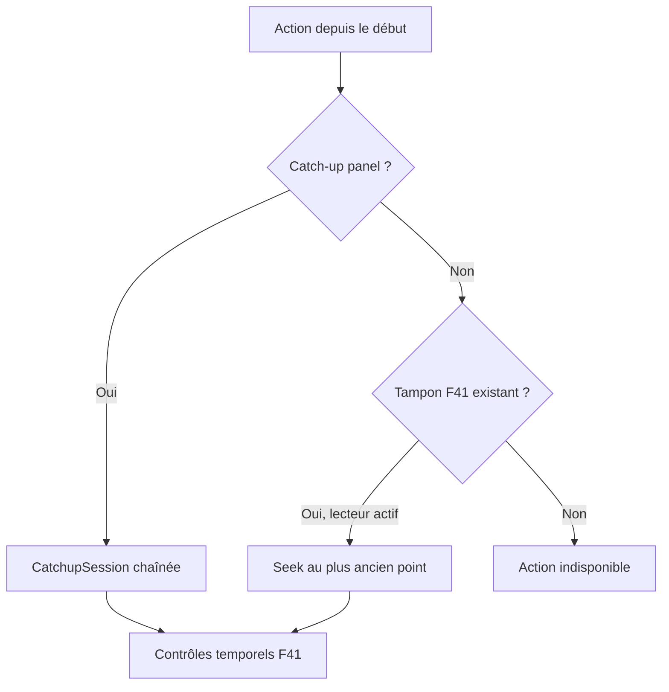

# F42 - Lancer une chaîne depuis le début du programme (appui long)

## Informations générales

Status:
TASK BREAKDOWN

Created:
2026-08-15

Dépendances:
F41 (tampon local) pour le mode de repli. Le mode principal dépend du support
du flux décalé par le panel Xtream.

---

# 1. Description

Dans les listes de chaînes, un appui long sur une chaîne propose, en plus des
actions existantes, **« Lancer depuis le début du programme »**. L'action ouvre
la chaîne au début de l'émission en cours plutôt qu'au direct — cas d'usage
principal : arriver en cours de match ou de film.

Deux sources, par ordre de préférence :

1. le **flux décalé du panel Xtream**, quand il est disponible, qui permet de
   vraiment remonter au début du programme ;
2. à défaut, le **tampon local de F41**, qui ne remonte qu'au moment où la
   chaîne a été ouverte.

Si aucune des deux sources ne permet de remonter, l'action est proposée
désactivée ou absente.

---

# 2. Contexte

Le zapping arrive rarement au bon moment. L'EPG affiche déjà l'heure de début du
programme en cours : l'information nécessaire est là, mais aucune action ne
l'exploite.

L'appui long sur une chaîne est déjà un point d'entrée connu de l'application
(l'ajout et le retrait de favori s'y font depuis les correctifs récents), ce qui
en fait l'emplacement naturel pour cette action.

**Écart de périmètre assumé.** Comme F41, cette fonctionnalité relève du
catch-up/timeshift, exclu par AGENTS.md sauf demande explicite du PO. La demande
est faite : AGENTS.md doit être mis à jour lors de la livraison.

---

# 3. Objectif

- Rattraper le début d'un programme déjà commencé, d'un seul geste depuis la
  liste des chaînes.
- Fonctionner au mieux des capacités disponibles, sans jamais promettre ce qui
  n'est pas possible.
- Ne pas encombrer l'interface quand la fonctionnalité n'est pas disponible.

---

# 4. Décisions produit prises à l'étape 1

| Sujet | Décision |
|---|---|
| Source | Flux décalé du panel Xtream en priorité, repli sur le tampon local de F41. Action grisée ou masquée si aucune source ne permet de remonter. |
| Point d'entrée | Appui long sur une chaîne dans les listes, aux côtés des actions existantes. |
| Détermination du début du programme | EPG (déjà en cache, `EpgCacheEntity`). |
| Plateformes | Mobile et Android TV dès la première livraison. |

## Décisions produit prises à l'étape 2

| Sujet | Décision |
|---|---|
| Titre du programme dans l'action | Affiché quand l'EPG le fournit (« Depuis le début de *Nom du programme* »). |
| Libellé du repli local (F41) | Distinct du mode principal — ne promet pas le vrai début, seulement le moment d'ouverture de la chaîne. |
| Fin du programme repris | Poursuite en différé au-delà de la fin du programme, dans la limite de la source (flux décalé Xtream ou tampon F41) — pas de bascule automatique au direct. |
| Accessible depuis le lecteur | Oui, en plus de l'appui long dans les listes, sur la chaîne déjà en cours de lecture. |
| Marge de sécurité EPG | Une marge fixe modeste est appliquée avant l'heure de début annoncée, pour absorber les imprécisions connues de l'EPG (valeur exacte à l'étape 3). |

---

# 5. Hypothèses

- ~~Le panel Xtream utilisé expose un mécanisme de flux décalé exploitable.~~
  **Hypothèse vérifiée et confirmée à l'étape 3** : `tv_archive: 1`,
  `tv_archive_duration: 5` jours sur les variantes HD du panel réel. Seul le
  format exact de l'URL reste à calibrer à l'implémentation.
- L'EPG en cache donne une heure de début fiable pour le programme en cours ; un
  décalage de quelques minutes est acceptable, un décalage systématique ne l'est
  pas.
- L'appui long dispose encore de place pour une action supplémentaire sans
  surcharger le menu contextuel existant.
- Les chaînes sans EPG ne proposent pas l'action : le début du programme est
  alors inconnu.

---

# 6. Questions ouvertes

| Point traité à l'étape 3 | Décision |
|---|---|
| Support panel | Détecté **par entrée** via `tv_archive` et `tv_archive_duration` du catalogue Xtream, puis validé par la première ouverture catch-up. Aucune capacité globale n'est supposée. Confirmé sur le panel réel, voir les arbitrages ci-dessous. |
| URL | Adapter `XtreamCatchupUrlBuilder` pour le format timeshift du panel (`/timeshift/{user}/{password}/{duration}/{start}/{streamId}.ts`), isolé et remplaçable si le serveur annonce un format différent. |
| Marge EPG | 2 minutes avant le début annoncé, bornées par la rétention disponible et jamais dans le futur. |
| Poursuite différée | Le catch-up est consommé par fenêtres chaînées ; lorsqu'une fenêtre se termine, la suivante est devenue archivée. Le bouton et la barre utilisent le même modèle temporel que F41. |
| Repli local depuis une liste | Impossible si la chaîne n'était pas déjà ouverte : F41 n'enregistre qu'une session active. Depuis une liste sans session existante, seul le catch-up panel peut proposer « depuis le début ». Le repli local n'existe que depuis le lecteur actif. |

Le dernier point corrige une impossibilité de la spécification fonctionnelle :
conserver trente minutes de toutes les chaînes en arrière-plan serait un PVR
multi-chaînes, hors périmètre et incompatible avec les limites de connexions.

---

## Arbitrages structurants ratifiés à l'étape 3

| Sujet | Décision |
|---|---|
| Support réel du flux décalé | **Confirmé sur le panel réel.** `get_live_streams` renvoie `tv_archive: 1` avec `tv_archive_duration: 5` (5 jours de rétention). L'hypothèse la plus risquée du ticket est levée : le ticket a un mode principal. |
| Capacité par variante, pas par chaîne | Observation du panel : le catch-up est déclaré sur les variantes **HD** (`\|FR\| TF1 HD`, `\|FR\| FRANCE 2 HD`) et **absent des SD** (`tv_archive: 0`). La capacité est donc un attribut de l'entrée, jamais de la chaîne logique — voir l'interaction avec F40 ci-dessous. |
| Format d'URL | **Reste à calibrer à l'implémentation**, contre le panel réel. Ce n'est plus un risque de ticket mais un détail localisé : le builder est déjà conçu comme un port remplaçable (§8.3). Le développeur devra essayer, dans l'ordre, l'heure locale du panel puis l'UTC — les dates de l'EPG sont en UTC+2 alors que `start_timestamp` est en epoch UTC, donc le format attendu par les URLs n'est pas déductible de l'API. |
| Éligibilité d'un programme | Deux conditions cumulatives, et non plus la seule capacité de chaîne : `tv_archive = 1` sur l'entrée **et** `has_archive = 1` sur le programme EPG visé. Le panel observé annonce des chaînes archivables dont les programmes courants sont à `has_archive: 0` : sans cette seconde condition, l'action serait proposée puis échouerait. Implique de persister `has_archive` dans `EpgCacheEntity` (nouvelle colonne, migration selon la règle de T21 §8.5). |
| Résolution de l'instant de départ | Aucune analyse de date texte : `EpgCacheEntity` stocke déjà `startTimestamp`/`endTimestamp` en epoch, alimentés par `parseJsonTimestamp` depuis `start_timestamp`. Le `ProgramStartResolver` travaille donc exclusivement en epoch UTC, ce qui supprime toute ambiguïté de fuseau côté domaine — la conversion éventuelle reste confinée au builder d'URL. |
| Interaction avec F40 | Sur ce panel, TF1 HD est archivable et TF1 SD ne l'est pas : un repli automatique de qualité ferait perdre la capacité de rattrapage en silence. **Tranché : quand une session catch-up est en cours, F40 ne considère que les variantes déclarant `tv_archive = 1`.** Si aucune n'est disponible, F40 ne bascule pas et laisse T23 puis la gestion d'erreur normale opérer — interrompre la session pour cause d'instabilité serait pire que la subir. En sélection manuelle pendant une session catch-up, les variantes sans archive restent visibles mais désactivées, avec la raison affichée. Reporté à l'identique dans F40. |
| F42 pour l'étape 4 | **Débloqué.** La capacité du panel étant établie, l'inconnue résiduelle (format d'URL) est confinée à une classe remplaçable et se calibre pendant l'implémentation, avec accès au panel. Elle ne justifie plus de retenir le ticket. |
| Ordre F42 avant F41 | **Correction de cohérence.** F41 a été tranché, après cette étape 3, pour être livré en dernier du lot (Arbitrages structurants de F41). Or la spécification technique ci-dessous (§8.5, §8.6, §9.2) mentionne `LivePlaybackService` et `TimeshiftWindow`, qui sont des composants **de F41**, non livrés au moment où F42 se construit. F42 s'appuie donc sur le `PlaybackEngineController` partagé de T23 (déjà livré) et sur `PlayerScreen` tels qu'ils existent à ce stade — pas sur un service de premier plan qui n'existe pas encore. `CatchupSession` définit son propre modèle de fenêtre temporelle (structurellement proche du futur `TimeshiftWindow` de F41, sans en dépendre). Quand F41 se livre, il absorbe `CatchupSession` dans `LivePlaybackService` au même titre que le reste du lecteur live — c'est le sens même de son refactor, déjà accepté comme le risque principal de ce ticket. §8.5, §8.6 et §9.2 sont corrigés en conséquence. |

---

# 7. Spécification fonctionnelle

## 7.1 User stories

- En tant qu'utilisateur qui arrive en cours de match ou de film, je veux
  lancer la chaîne depuis le début du programme en cours, pour ne rien
  avoir manqué.
- En tant qu'utilisateur déjà en train de regarder une chaîne, je veux
  pouvoir revenir au début du programme sans quitter le lecteur pour
  retourner à la liste.
- En tant qu'utilisateur sur un panel ou une chaîne sans flux décalé, je
  veux que l'action reste honnête sur ce qu'elle peut m'offrir, plutôt que
  de promettre un vrai début qu'elle ne peut pas fournir.

## 7.2 Parcours utilisateur

**Depuis les listes de chaînes**

1. L'utilisateur fait un appui long sur une chaîne dans une liste.
2. Le menu contextuel propose, en plus des actions existantes (favoris),
   « Depuis le début de *Nom du programme* » si l'EPG fournit un titre pour
   le programme en cours (décision étape 2), ou un libellé générique sinon.
3. L'utilisateur sélectionne l'action.
4. La chaîne s'ouvre au vrai début du programme en cours, via le flux décalé
   du panel, avec la marge de sécurité EPG (décision étape 2).
5. Si le panel n'expose pas de flux décalé exploitable pour cette chaîne,
   l'action n'apparaît pas ou est proposée désactivée (décision étape 1).
   **Le repli local F41 n'est pas disponible depuis une liste** : le tampon
   n'existe que pour la chaîne en cours de lecture, il n'y a donc rien à
   remonter pour une chaîne qu'on n'a pas encore ouverte (voir 7.3).

**Depuis le lecteur, sur la chaîne déjà ouverte**

1. Pendant la lecture d'une chaîne, l'utilisateur accède à la même action
   directement dans le lecteur (décision étape 2), sans revenir à la liste.
2. La bascule utilise le flux décalé du panel s'il est exploitable, exactement
   comme depuis une liste.
3. À défaut, et **uniquement ici**, le tampon local F41 de la session en cours
   sert de repli : la lecture reprend au point le plus ancien qu'il contient,
   sous un libellé distinct annonçant explicitement ce repli (décision
   étape 2).
4. Si aucune des deux sources ne permet de remonter, l'action n'apparaît pas
   ou est proposée désactivée (décision étape 1).

**Poursuite après la fin du programme**

1. Le programme rattrapé en différé se termine (heure de fin connue via
   l'EPG).
2. La lecture se poursuit en différé au-delà de cette fin plutôt que de
   basculer automatiquement au direct (décision étape 2), dans la limite de
   ce que permet la source (flux décalé du panel, ou tampon F41).
3. Le contrôle explicite du retour au direct (bouton dédié, comportement
   exact renvoyé à l'étape 3) reste à la main de l'utilisateur, à l'image du
   bouton « Revenir au direct » de F41.

## 7.3 Règles métier

- Deux sources par ordre de préférence : flux décalé du panel Xtream en
  priorité, repli sur le tampon local F41 sinon (décision étape 1).
- **Le repli local F41 n'est possible que depuis le lecteur, sur la chaîne
  déjà ouverte** (précision apportée à l'étape 3). F41 n'enregistre que la
  session de lecture active : une chaîne jamais ouverte n'a aucun tampon, et
  maintenir un tampon pour toutes les chaînes en arrière-plan serait un PVR
  multi-chaînes, hors périmètre du projet. Depuis une liste, seul le flux
  décalé du panel peut donc alimenter l'action.
- L'action est masquée ou désactivée si aucune source disponible **à ce point
  d'entrée** ne permet de remonter dans le temps pour cette chaîne (décision
  étape 1) — jamais proposée pour promettre un résultat impossible.
- Le repli local (F41) porte un libellé distinct du mode principal, pour ne
  jamais annoncer un vrai début de programme qu'il ne peut pas fournir
  (décision étape 2).
- L'heure de début du programme provient de l'EPG en cache
  (`EpgCacheEntity`), avec une marge de sécurité fixe avant cette heure pour
  absorber ses imprécisions connues (décision étape 2).
- L'action est accessible aux deux points d'entrée : appui long dans les
  listes de chaînes, et depuis le lecteur sur la chaîne déjà ouverte
  (décision étape 2).

## 7.4 Cas limites

- **Chaîne sans EPG** : aucune heure de début connue, l'action n'apparaît
  pas (décision étape 1, hypothèse étape 1).
- **Chaîne tout juste ouverte** (tampon F41 quasi vide) : depuis le lecteur,
  le repli local ne peut remonter qu'à quelques secondes avant le direct.
  Comme ce repli n'apporterait alors aucun bénéfice réel, il n'est pas
  présenté comme tel (précision étape 3).
- **Chaîne sans flux décalé, ouverte depuis une liste** : l'action est
  absente ou désactivée, même si la même chaîne proposerait le repli local
  une fois ouverte dans le lecteur. Asymétrie assumée, conséquence directe de
  la portée de F41 (voir 7.3).
- **Flux décalé du panel qui échoue à l'ouverture** malgré sa disponibilité
  annoncée : traité comme un échec de source, avec repli sur le tampon
  local F41 si la chaîne est déjà en lecture, sinon comportement d'erreur de
  lecture standard.
- **Programme en cours dont l'heure de début EPG est manifestement fausse**
  (ex. dans le futur) : l'action ne doit pas lancer une lecture à un
  instant qui n'existe pas encore — traitement exact renvoyé à l'étape 3.

## 7.5 Critères d'acceptation

- Sur une chaîne avec EPG et flux décalé supporté par le panel, l'action
  ouvre la chaîne au début réel du programme en cours (± la marge de
  sécurité).
- Sur une chaîne avec EPG mais sans flux décalé, **déjà en cours de lecture**,
  l'action propose le repli local sous un libellé distinct, ouvrant au point
  le plus ancien du tampon F41.
- Sur cette même chaîne atteinte depuis une liste (donc sans session de
  lecture en cours), l'action n'apparaît pas ou est visiblement désactivée :
  aucun tampon n'existe pour une chaîne non ouverte.
- Sur une chaîne sans EPG, ou sans aucune source exploitable au point
  d'entrée considéré, l'action n'apparaît pas ou est visiblement désactivée.
- L'action est accessible depuis l'appui long dans les listes et depuis le
  lecteur, avec la seule différence de sources décrite ci-dessus.
- À la fin du programme rattrapé, la lecture continue en différé plutôt que
  de basculer automatiquement au direct.

## 7.6 Gestion des erreurs

- Échec d'ouverture du flux décalé malgré sa disponibilité annoncée par le
  panel : repli automatique sur le tampon local F41 si la chaîne est déjà en
  lecture et que son tampon couvre l'instant demandé, sinon message d'erreur
  de lecture standard — jamais d'écran noir sans explication.
- EPG absent ou incohérent au moment de l'appui long : l'action se comporte
  comme si aucune heure de début n'était connue (masquée ou désactivée),
  jamais un lancement à une heure incorrecte.

---

# 8. Spécification technique

## 8.1 Données de capacité

`LiveStreamDto` ajoute les champs Xtream tolérants :

```kotlin
@SerializedName("tv_archive") val tvArchive: Int? = null
@SerializedName("tv_archive_duration") val tvArchiveDurationDays: Int? = null
```

Ils sont mappés dans `LiveStreamEntity`/`LiveStream` sous forme
`catchupAvailable: Boolean` et `catchupRetentionDays: Int?`, avec colonnes Room
et migration de backfill par défaut (`false`/`null`). La synchronisation suivante
met les valeurs à jour ; aucune requête individuelle par carte.

> Ces colonnes sont ajoutées dans la **prochaine migration Room disponible au
> moment de la livraison** de F42 : aucun numéro de version n'est figé ici,
> plusieurs tickets du lot touchent au schéma. Vérifier `AppDatabase.kt` avant
> d'écrire la migration (voir T21 §8.5).

Une chaîne est éligible au catch-up si : drapeau actif, rétention positive, EPG
courant cohérent, début demandé dans la rétention et credentials disponibles.
Le premier 404/403/format illisible marque uniquement ce `streamId` comme
`unsupported` pour la session ; le catalogue persistant n'est pas modifié sur
une panne temporaire.

## 8.2 Résolution de l'instant de départ

`ProgramStartResolver` reçoit le programme EPG courant et l'heure monotone/UTC :

1. rejette un début absent ou futur de plus d'une minute ;
2. calcule `requested = program.startEpochMs - 2 minutes` ;
3. borne à `now - retention` puis à `now - 5 secondes` ;
4. conserve le vrai `program.startEpochMs` pour l'affichage, la marge ne change
   pas le libellé utilisateur.

Les timestamps sont convertis dans le fuseau/format exigé par le panel seulement
dans l'adapter URL. Le domaine reste en epoch UTC et ne dépend pas du fuseau de
l'appareil.

## 8.3 Construction des URLs

`XtreamCatchupUrlBuilder` utilise la base Xtream et les credentials déjà détenus
localement :

`{base}/timeshift/{username}/{password}/{durationMinutes}/{yyyy-MM-dd:HH-mm}/{streamId}.ts`

Les segments de chemin sont encodés ; l'URL n'est jamais journalisée. La durée
demandée est une fenêtre de 15 minutes, avec un minimum couvrant la marge. Le
builder est un port : si le panel réel expose une variante (`streaming/timeshift`
ou paramètres query), seul son adapter change.

L'application ne lance aucun `curl` ou probe indépendant. La validation est la
préparation normale du premier `MediaItem`, avec timeout de 8 secondes et
qualification d'erreur par le lecteur.

## 8.4 Lecture différée par fenêtres

`CatchupSession` maintient un curseur absolu et une file d'au plus deux fenêtres
de 15 minutes : la fenêtre lue et la suivante. À l'approche de la fin, elle
construit l'URL de la tranche suivante, désormais située dans le passé, et
l'ajoute au player. Les périodes sont concaténées sans modifier la position
absolue affichée.

Cette stratégie permet de poursuivre en différé : pendant que l'utilisateur
regarde une tranche ancienne, la suivante devient disponible dans l'archive.
Lorsque le décalage descend sous 5 secondes, le contrôleur bascule sur le direct
normal et F41 redémarre son tampon local. Un bouton « Revenir au direct » peut
forcer cette bascule à tout moment.

Si le panel ne permet pas le chaînage ou renvoie une fin prématurée :

1. F41 est utilisé si une fenêtre locale de la session active couvre la position ;
2. sinon la lecture bascule au direct avec un message bref, sans écran noir.

## 8.5 Repli F41 et points d'entrée

Depuis le **lecteur déjà ouvert**, le resolver choisit :

1. catch-up panel si le début EPG est dans sa rétention ;
2. sinon F41 si `oldestEpochMs < now - 5s`, sous le libellé distinct décidé à
   l'étape 2 ;
3. sinon action masquée.

Depuis une **liste de chaînes**, aucun tampon local n'existe pour une chaîne
non ouverte — ni celui de F41 une fois livré, ni aucun équivalent avant. L'action
« Lancer depuis le début » est donc affichée uniquement si le catch-up panel
est éligible. Ouvrir la chaîne pour commencer un tampon vide ne permettrait
pas de remonter et n'est pas présenté comme repli.

`StartOverAvailability` est calculé dans `LiveTvViewModel` à partir de la ligne
catalogue + EPG, et recalculé dans le service au clic pour éviter une action
devenue périmée.

## 8.6 UI et commandes

- le menu d'appui long reçoit une action conditionnelle ;
- le lecteur reçoit la même action dans ses contrôles lorsqu'elle est disponible ;
- `CatchupSession` expose son propre modèle de fenêtre temporelle (curseur
  absolu, bornes de rétention) — pas un `TimeshiftWindow` de F41, qui n'existe
  pas encore à ce stade de la livraison (voir Arbitrages structurants,
  « Ordre F42 avant F41 ») ;
- Play/Pause, seek et « Revenir au direct » transitent par le
  `PlaybackEngineController` partagé de T23 (déjà livré), pas par un service
  de premier plan qui n'existe pas encore ;
- le titre du programme reste celui de l'EPG courant au démarrage, puis suit
  l'EPG correspondant à `playbackEpochMs` si le cache contient la fenêtre.

## 8.7 Erreurs, performance et sécurité

- une seule source catch-up active ; préchargement limité à une fenêtre pour ne
  pas consommer une connexion supplémentaire durable ;
- timeouts et erreurs panel ne modifient jamais la capacité persistée ;
- credentials uniquement dans le builder/source réseau, URLs redacted dans
  OkHttp et logs ;
- EPG incohérent → action absente, jamais seek approximatif ;
- cache/positions F41 restent locaux, aucun appel backend CSTV ;
- aucune nouvelle dépendance.

## 8.8 Tests automatisés

Tests DTO et migration ; `ProgramStartResolver` (futur, marge, rétention,
fuseaux) ; builder URL avec encodage/redaction ; disponibilité liste vs lecteur ;
chaînage des fenêtres, EOF, catch-up refusé, repli F41 et retour direct. Le
player est faux, aucun appel au panel réel dans les tests.

## 8.9 Fichiers impactés ou nouveaux

**Nouveaux** : `data/catchup/XtreamCatchupUrlBuilder.kt`,
`domain/live/ProgramStartResolver.kt`, `StartOverAvailability.kt`,
`playback/CatchupSession.kt` et tests.

**Modifiés** : `LiveStreamDto.kt`, `LiveStreamEntity.kt`, `LiveStream.kt`,
`LiveTvDao.kt`, `AppDatabase.kt`, `Migrations.kt`, repositories/mappers live,
`LiveTvViewModel.kt`, composants de menu d'appui long, `PlayerScreen.kt`,
`LivePlaybackService`, composants timeshift F41 et ressources FR/EN.

---

# 9. Architecture

## 9.1 Sélection de source



## 9.2 Responsabilités

- **DTO/catalogue** : capacité déclarée et rétention ;
- **ProgramStartResolver** : cohérence EPG, marge et bornes ;
- **URL adapter** : format panel et secret redaction ;
- **CatchupSession** : fenêtres, poursuite différée et bascule live, posée
  sur le `PlaybackEngineController` de T23 — pas sur le `LivePlaybackService`
  de F41, livré après (voir Arbitrages structurants) ;
- **F41** (une fois livré) : repli uniquement pour la chaîne déjà
  enregistrée, et absorption de `CatchupSession` dans son refactor du
  lecteur live ;
- **UI** : disponibilité exacte par point d'entrée.

## 9.3 Risques

- le format timeshift Xtream varie selon les panels : adapter isolé et validation
  par la vraie préparation ;
- le panel peut annoncer une archive inutilisable : repli session, sans polluer
  la base ;
- l'EPG peut être faux : marge 2 minutes et rejets stricts ;
- le repli local depuis une liste était techniquement impossible : le périmètre
  est corrigé explicitement au lieu de simuler une fonctionnalité vide.

---

# 10. Plan de développement

F42 se livre après T21/T22/T23/F39/F40, mais **avant F41** (ordre du lot).
Toutes les tâches ci-dessous construisent donc sur le
`PlaybackEngineController` de T23, jamais sur le `LivePlaybackService` de
F41 qui n'existe pas encore — voir la correction de cohérence dans les
Arbitrages structurants. La tâche 6 pose le point d'extension que F41
branchera plus tard, même principe que T23 §10 tâche 6 et F40 §10 tâche 6.

- [ ] 1. Données de capacité catch-up

Objectif:
Ajouter `tv_archive`/`tv_archive_duration` au DTO et aux entités catalogue
(§8.1), avec backfill par défaut.

Fichiers:
- `data/remote/dto/LiveStreamDto.kt`
- `data/local/entity/LiveStreamEntity.kt`, `domain/model/LiveStream.kt`
- migration Room — **vérifier le numéro réellement disponible dans
  `AppDatabase.kt` avant d'écrire** (règle T21 §8.5)

Fichiers modifiés:
- `data/local/db/AppDatabase.kt`, `Migrations.kt`

Validation:
Tests DTO sur des réponses « sales » (champ absent, valeur non entière —
AGENTS.md § Stratégie de tests). Test de migration : backfill
`false`/`null` sur les lignes existantes. Une panne temporaire (404/403) ne
modifie jamais la capacité persistée (§8.7).

---

- [ ] 2. `ProgramStartResolver`

Objectif:
Résoudre l'instant de départ demandé à partir du programme EPG courant
(§8.2) : marge de sécurité, bornes de rétention, rejet d'un début futur.

Fichiers:
- `domain/live/ProgramStartResolver.kt` (nouveau)
- tests unitaires associés (nouveau)

Validation:
Tests JVM avec horloge fixe : marge de 2 minutes appliquée, bornage à
`now - retention` et `now - 5s`, rejet d'un début futur de plus d'une
minute, titre affiché toujours celui du vrai `startEpochMs` (jamais
décalé par la marge). Travail exclusivement en epoch UTC, aucune conversion
de fuseau dans cette couche (§8.2).

---

- [ ] 3. `XtreamCatchupUrlBuilder`

Objectif:
Construire l'URL timeshift (§8.3) comme port remplaçable, credentials
jamais journalisés.

Fichiers:
- `data/catchup/XtreamCatchupUrlBuilder.kt` (nouveau)
- tests unitaires associés (nouveau)

Validation:
Test d'encodage des segments de chemin. Test confirmant que l'URL complète
n'apparaît dans aucun log (OkHttp interceptor redaction, §8.7). **Calibrage
contre le panel réel avant de considérer la tâche terminée** : le format
exact (heure locale vs UTC, voir vérification faite à l'étape 3) doit être
confirmé par un essai réel, pas seulement supposé.

---

- [ ] 4. `StartOverAvailability` — éligibilité par point d'entrée

Objectif:
Calculer la disponibilité de l'action (§8.5) : catch-up panel éligible
(capacité + `has_archive` du programme EPG visé), sinon néant depuis une
liste, sinon repli local **seulement depuis le lecteur** sur une session
déjà active.

Fichiers:
- `domain/live/StartOverAvailability.kt` (nouveau)
- `presentation/livetv/LiveTvViewModel.kt` (calcul pour l'affichage du menu)
- tests unitaires associés (nouveau)

Validation:
Tests couvrant la matrice complète des cas limites (§7.4) : chaîne sans
EPG, chaîne avec EPG mais sans catch-up ni session active, chaîne avec
catch-up mais programme non archivé (`has_archive: 0`), chaîne déjà ouverte
avec repli local disponible. Recalcul au clic pour éviter une action
devenue périmée entre l'ouverture du menu et la sélection (§8.5).

---

- [ ] 5. `CatchupSession` — lecture différée par fenêtres

Objectif:
Fenêtres chaînées de 15 minutes sur le `PlaybackEngineController` de T23
(§8.4, corrigé) : curseur absolu, préchargement de la fenêtre suivante,
bascule automatique au direct sous 5 secondes de décalage, bouton « Revenir
au direct » explicite.

Fichiers:
- `playback/CatchupSession.kt` (nouveau)
- `presentation/player/PlayerScreen.kt` (intégration des contrôles)
- tests unitaires associés (nouveau)

Validation:
Tests JVM avec moteur de lecture faux (patron `FakePlaybackEngine` de T23) :
chaînage correct des fenêtres, fin prématurée d'une fenêtre traitée comme
un repli (voir tâche 4), retour au direct forcé par le bouton, bascule
automatique sous le seuil de 5 secondes. Aucune concaténation de segments
de bitrate/codec différents (§8.4, interdit en V1).

---

- [ ] 6. Point d'extension pour F41 — sans implémentation F41

Objectif:
Exposer le seam que F41 branchera à sa propre livraison : reprise du
tampon local en repli quand le catch-up panel n'est pas éligible, et futur
transfert de `CatchupSession` sous `LivePlaybackService`. Aucune logique
F41 réelle n'est écrite ici.

Fichiers:
- `domain/live/StartOverAvailability.kt`, `playback/CatchupSession.kt`
  (interfaces d'extension)

Validation:
Test avec un faux fournisseur de tampon local, vérifiant qu'il est consulté
au bon moment (uniquement depuis le lecteur, sur une session active) et que
son absence ne casse rien — comportement identique à aujourd'hui, où le
repli n'existe simplement pas encore.

---

- [ ] 7. Non-régression globale

Objectif:
Vérifier l'ensemble avant review.

Fichiers:
- l'ensemble des fichiers listés en §8.9

Validation:
`./gradlew assembleDebug`, `./gradlew testDebugUnitTest`, `./gradlew
lintDebug` verts. Aucune nouvelle dépendance Gradle (§8.7). AGENTS.md mis à
jour pour documenter l'écart de périmètre assumé (catch-up/timeshift),
comme engagé en §2 de la fiche — à coordonner avec la même mise à jour
prévue par F41 pour ne pas se marcher dessus.

---

# 11. Notes de développement

---

# 12. Review

## Critique

## Majeur

## Mineur

## Corrections demandées

---

# 13. Release

Version :

Commit :

Date :
