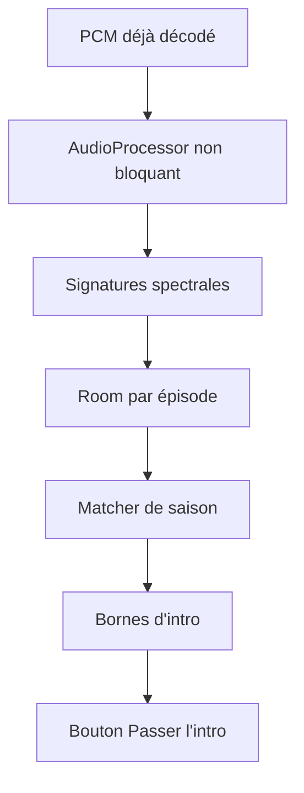

# F43 - Détection et saut de l'intro des séries par empreinte audio

## Informations générales

Status:
ARCHITECTURE

Created:
2026-08-15

Dépendances:
Aucune. Ticket le plus exploratoire du lot, livré en dernier.

---

# 1. Description

Pendant la lecture d'un épisode de série, l'application détecte le générique
d'ouverture et affiche un bouton **« Passer l'intro »** le temps de sa durée.

La détection repose sur une **empreinte audio calculée localement** : le
générique est le segment sonore commun à plusieurs épisodes d'une même saison.
Aucun service externe n'est sollicité.

---

# 2. Contexte

Les génériques durent souvent une à deux minutes et se répètent à chaque
épisode. En visionnage enchaîné, l'avance manuelle devient un réflexe fastidieux,
et la fonction est devenue un standard chez les plateformes de streaming.

Aucune source de métadonnées du projet ne fournit les bornes d'un générique :
ni Xtream, ni TMDB. L'information doit donc être déduite du contenu lui-même.

L'empreinte audio est retenue parce qu'elle est robuste aux différences
d'encodage entre versions d'un même épisode, là où une comparaison d'images
serait plus coûteuse et plus fragile.

Ce ticket est explicitement exploratoire : son coût en téléchargement et en
calcul sur box Android TV conditionne sa faisabilité, et le passage à l'étape 3
doit être précédé d'une validation technique.

---

# 3. Objectif

- Passer le générique d'un épisode d'un seul geste, sans chercher sa fin à la
  main.
- Ne jamais dégrader l'expérience : une détection ratée reste sans conséquence
  puisque le saut n'est jamais automatique.
- Rester entièrement local, sans nouvelle dépendance réseau.
- Garder le coût en données et en calcul sous contrôle.

---

# 4. Décisions produit prises à l'étape 1

| Sujet | Décision |
|---|---|
| Méthode de détection | Empreinte audio calculée localement, comparée entre épisodes d'une même saison. Ni service externe, ni heuristique fondée sur les avances manuelles de l'utilisateur. |
| Comportement à la détection | Bouton « Passer l'intro » affiché pendant le générique. Pas de saut automatique, même annulable, et pas d'option de saut automatique dans les Paramètres. |
| Périmètre média | Séries uniquement. Ni films, ni direct. |
| Portée de la détection | Générique d'ouverture. Le générique de fin n'est pas couvert. |
| Plateformes | Mobile et Android TV dès la première livraison. |

## Décisions produit prises à l'étape 2

| Sujet | Décision |
|---|---|
| Déclenchement de l'analyse | Dès la première lecture d'un épisode de la saison, en tâche de fond, sans action de l'utilisateur. |
| Premier épisode analysé | Aucun bouton « Passer l'intro » tant qu'aucun point de comparaison n'est disponible — pas d'estimation par défaut. |
| Durée d'affichage du bouton | Toute la durée du générique détecté, disparition automatique à la fin. |
| Signalement d'une détection erronée | Action simple disponible pour effacer la borne mémorisée et relancer l'analyse. |
| Restriction réseau | Aucune : l'analyse tourne quelle que soit la connexion (Wi-Fi ou données mobiles), sans réglage dédié. |

---

# 5. Hypothèses

- Le générique est bien identique d'un épisode à l'autre au sein d'une saison :
  vrai pour la plupart des séries, faux pour celles qui font varier leur intro.
- Il est possible d'extraire l'audio d'une portion d'un autre épisode sans
  télécharger le fichier entier (lecture par plage HTTP), et le panel supporte
  les requêtes partielles. **À valider avant l'étape 3.**
- Le calcul d'empreinte reste tenable sur box Android TV en tâche de fond,
  pendant la lecture, sans provoquer de saccades.
- Le générique se situe dans les premières minutes de l'épisode : l'analyse peut
  se limiter à cette fenêtre.
- Les bornes détectées pour une saison sont réutilisables pour tous ses épisodes,
  donc calculées une fois et mises en cache.
- Le résultat est propre à l'appareil et n'a pas à être synchronisé dans le cloud.

---

# 6. Questions ouvertes

| Point traité à l'étape 3 | Décision |
|---|---|
| Acquisition audio | Capture du PCM déjà décodé pendant la lecture via un `AudioProcessor` Media3. Aucun second téléchargement, aucune requête HTTP Range et aucune connexion supplémentaire au panel. |
| Algorithme | Empreinte locale par signatures spectrales : mono 8 kHz, trames FFT, hash perceptuel et recherche d'un décalage commun. Implémentation Kotlin pure, versionnée, sans dépendance lourde. |
| Faisabilité | Mémoire et données bornées : empreinte calculée en streaming sur les 12 premières minutes, stockage des seuls hashes. Le traitement CPU lourd quitte immédiatement le thread audio. |
| Signalement erroné | Action dans le menu du lecteur série, visible uniquement lorsqu'une détection existe pour la saison. Pas d'entrée globale dans Paramètres. |

Aucune question bloquante ne reste ouverte. La précision et le budget CPU
restent protégés par un seuil conservateur : en cas de doute, aucun bouton.

---

# 7. Spécification fonctionnelle

## 7.1 User stories

- En tant qu'utilisateur qui enchaîne les épisodes d'une série, je veux
  passer le générique d'ouverture d'un geste, sans avancer manuellement à
  l'aveugle.
- En tant qu'utilisateur qui commence une nouvelle saison, je veux que la
  détection s'affine au fil des épisodes sans que j'aie à la déclencher
  moi-même.
- En tant qu'utilisateur confronté à une détection erronée, je veux pouvoir
  la corriger sans attendre qu'elle se corrige toute seule.

## 7.2 Parcours utilisateur

1. L'utilisateur lance la lecture d'un épisode d'une série.
2. En tâche de fond, pendant la lecture, l'application calcule l'empreinte
   audio du début de l'épisode et la compare à celle des épisodes déjà
   analysés de la même saison (décision étape 2 : démarre dès la première
   lecture, pas d'attente d'un nombre minimal d'épisodes).
3. **Premier épisode analysé d'une saison** : aucun point de comparaison
   n'existe encore, donc aucun bouton « Passer l'intro » n'apparaît
   (décision étape 2) — pas d'estimation approximative.
4. **Dès qu'un second épisode de la même saison est analysé** et qu'un
   segment commun est détecté au début des deux, les bornes du générique
   sont déduites et mises en cache pour la saison entière.
5. Aux lectures suivantes d'un épisode de cette saison (y compris rétro-
   activement pour le premier épisode déjà vu), un bouton « Passer l'intro »
   s'affiche pendant toute la durée détectée du générique, puis disparaît
   automatiquement à sa fin (décision étape 2).
6. L'utilisateur appuie sur le bouton : la lecture saute directement à la
   fin du générique.
7. Si la détection est manifestement erronée (le bouton apparaît au mauvais
   moment, ou saute une partie du contenu), l'utilisateur dispose d'une
   action pour l'effacer et provoquer une nouvelle analyse (décision
   étape 2 ; emplacement exact renvoyé à l'étape 3).

## 7.3 Règles métier

- Analyse strictement locale, sans service externe, fondée sur une
  empreinte audio comparée entre épisodes d'une même saison (décision
  étape 1).
- Aucun saut automatique, même annulable : le bouton reste une action
  volontaire de l'utilisateur (décision étape 1).
- Une fois calculées, les bornes d'une saison sont réutilisées pour tous
  ses épisodes sans recalcul (décision étape 1) — sauf effacement explicite
  suite à un signalement d'erreur (décision étape 2).
- Aucune restriction réseau (Wi-Fi/données mobiles) ne conditionne
  l'analyse (décision étape 2) : elle se déclenche dans les mêmes
  conditions quelle que soit la connexion.
- Le résultat est propre à l'appareil, non synchronisé dans le cloud
  (hypothèse étape 1).

## 7.4 Cas limites

- **Série dont le générique varie d'un épisode à l'autre** : la comparaison
  ne trouve pas de segment commun fiable — aucun bouton n'apparaît plutôt
  que d'afficher une détection incorrecte (hypothèse étape 1 assumée comme
  limite connue).
- **Deux premiers épisodes visionnés dans le désordre** (ex. épisode 3 puis
  épisode 1) : la comparaison fonctionne dès que deux épisodes de la même
  saison ont été analysés, sans dépendre de l'ordre de visionnage.
- **Signalement d'une détection erronée puis nouvelle analyse toujours
  fausse** : aucune limite au nombre de signalements ; chaque signalement
  efface et relance, sans mécanisme de blocage après plusieurs échecs (V1).
- **Génériques de durée variable au sein d'une même saison** (rare) : les
  bornes mémorisées, calculées une fois, peuvent devenir imprécises pour un
  épisode atypique — corrigible via le signalement d'erreur, pas de
  détection par épisode individuel en V1 (hypothèse étape 1 : bornes
  réutilisables pour tous les épisodes de la saison).

## 7.5 Critères d'acceptation

- Aucun bouton « Passer l'intro » n'apparaît sur le tout premier épisode
  analysé d'une saison.
- Dès qu'un second épisode de la saison a été analysé avec succès, le
  bouton apparaît sur les épisodes suivants (et rétroactivement sur le
  premier, à sa prochaine lecture) pendant la durée exacte du générique
  détecté.
- Appuyer sur le bouton saute directement à la fin du générique détecté.
- Une action de signalement efface la détection mémorisée pour la saison et
  déclenche une nouvelle analyse.
- L'analyse se déclenche identiquement en Wi-Fi et en données mobiles.

## 7.6 Gestion des erreurs

- Échec du calcul d'empreinte pour un épisode (fichier illisible en tâche
  de fond, erreur de lecture par plage) : n'affecte pas la lecture normale
  de l'épisode en cours ; l'épisode est simplement ignoré pour la
  comparaison, sans bouton affiché tant qu'aucune autre paire ne fonctionne.
- Détection ratée ou absente : sans conséquence pour l'utilisateur au-delà
  de l'absence du bouton — jamais un saut incorrect, conformément à
  l'objectif « une détection ratée reste sans conséquence ».
- Détection signalée comme erronée : traitement immédiat de l'effacement,
  sans attendre une confirmation supplémentaire ni bloquer l'écran de
  lecture.

---

# 8. Spécification technique

## 8.1 Acquisition sans trafic supplémentaire

La faisabilité ne dépend plus des requêtes partielles du panel. Le renderer audio
produit déjà du PCM pour l'`AudioSink`; un `IntroFingerprintAudioProcessor`
non bloquant reçoit une copie bornée des premières minutes de chaque épisode.

Le processor :

- n'altère jamais le buffer transmis au sink ;
- downmixe en mono et échantillonne à 8 kHz ;
- pousse de petits blocs dans un canal borné consommé sur `Dispatchers.Default` ;
- abandonne silencieusement des blocs si le calcul prend du retard plutôt que de
  bloquer l'audio ;
- s'arrête à 12 minutes de position média ou dès qu'une empreinte complète est
  finalisée.

`ExoPlayerCore` configure le processor dans le `DefaultAudioSink` utilisé par la
fabrique de renderers. NextLib continue de décoder les codecs non supportés ; le
processor ne dépend que du PCM final et fonctionne donc aussi sur une lecture
hors ligne. L'analyse n'ouvre aucune URL et ne consomme aucune donnée mobile en
plus de la lecture demandée.

## 8.2 Empreinte versionnée

Pipeline `algorithmVersion = 1` :

1. mono PCM 16 bits à 8 kHz ;
2. fenêtres de 2048 échantillons, pas de 1024, fenêtre de Hann ;
3. FFT radix-2 Kotlin réutilisant ses buffers ;
4. énergie logarithmique agrégée en 32 bandes ;
5. signature 64 bits par trame à partir des variations temporelles et
   fréquentielles ;
6. stockage `(timeMs, signature)` uniquement.

À environ huit signatures par seconde, douze minutes représentent moins de
6 000 signatures, soit moins de 100 Kio par épisode avec les timestamps. Aucun
PCM complet n'est conservé.

`SeasonIntroMatcher` compare deux épisodes : il regroupe les signatures dont la
distance de Hamming est inférieure ou égale à 8, vote pour leur décalage
temporel, puis recherche la plus longue séquence continue au décalage dominant.
Une détection est acceptée seulement si :

- segment commun entre 15 secondes et 5 minutes ;
- début du segment dans les 12 premières minutes ;
- couverture d'au moins 85 % des fenêtres du segment ;
- second meilleur décalage au moins 20 % moins bien noté ;
- deux épisodes distincts minimum.

Les bornes sont élargies au dernier bloc audio concordant puis arrondies à
100 ms. Un résultat sous le seuil reste `NO_MATCH` et ne produit aucun bouton.

## 8.3 Modèle Room

> Tables créées dans la **prochaine migration Room disponible au moment de la
> livraison** de F43 : aucun numéro de version n'est figé ici, plusieurs
> tickets du lot touchent au schéma. Vérifier `AppDatabase.kt` avant d'écrire
> la migration (voir T21 §8.5).

```kotlin
@Entity(tableName = "episode_audio_fingerprints",
    primaryKeys = ["accountKey", "episodeId", "algorithmVersion"])
data class EpisodeAudioFingerprintEntity(
    val accountKey: String,
    val episodeId: Int,
    val seriesId: Int,
    val seasonNum: Int,
    val algorithmVersion: Int,
    val signatures: ByteArray,
    val analyzedDurationMs: Long,
    val createdAt: Long
)

@Entity(tableName = "season_intro_detections",
    primaryKeys = ["accountKey", "seriesId", "seasonNum"])
data class SeasonIntroDetectionEntity(
    val accountKey: String,
    val seriesId: Int,
    val seasonNum: Int,
    val algorithmVersion: Int,
    val startMs: Long,
    val endMs: Long,
    val confidence: Double,
    val sourceEpisodeCount: Int,
    val updatedAt: Long
)
```

Les données sont propres au compte IPTV et à l'appareil, sans `profileId`, car
le contenu audio de la saison est identique pour tous les profils. Elles ne
sont pas synchronisées. Les blobs utilisent un codec binaire interne stable :
version, compteur, puis deltas varint de temps et signatures 64 bits. Pas de
JSON volumineux.

Lorsqu'une empreinte d'une version d'algorithme antérieure est lue, elle est
ignorée et recalculée à la prochaine lecture. Une migration de blob n'est pas
nécessaire.

## 8.4 Orchestration de l'analyse

`IntroDetectionRepository` reçoit les hashes finalisés :

1. upsert de l'empreinte de l'épisode ;
2. charge au maximum trois autres empreintes récentes de la même saison ;
3. compare jusqu'à obtenir un match au-dessus du seuil ;
4. persiste une seule détection de saison ;
5. cesse les comparaisons tant que cette détection existe.

L'analyse du premier épisode ne produit aucun bouton. Dès la seconde empreinte
compatible, la détection devient observable par `SeriesPlayerViewModel`. Les
épisodes ultérieurs réutilisent les bornes sans nouveau calcul, conformément à
la décision produit.

La charge est annulée si le média change ; une empreinte partielle de moins de
15 secondes n'est pas persistée. Le calcul a une priorité de coroutine basse et
ne tourne jamais sur le thread main ou le callback audio.

## 8.5 UI et signalement

Le bouton « Passer l'intro » est affiché si : série/season correspondante,
detection présente, `currentPosition` compris entre `startMs - 500` et
`endMs`. L'action cherche à `endMs` et disparaît immédiatement. Elle ne
réapparaît pas si l'utilisateur revient en arrière au cours de la même lecture,
afin d'éviter un bouton insistant ; elle réapparaît à une lecture ultérieure.

Le menu d'actions du lecteur série affiche « Signaler une intro incorrecte »
uniquement lorsqu'une détection existe. L'action supprime la détection et les
empreintes sources de la saison dans une transaction, puis autorise une nouvelle
analyse à partir de la lecture suivante. Elle n'envoie aucune donnée au backend.

## 8.6 Performance, compatibilité et sécurité

- canal audio borné à quelques blocs, buffers/FFT réutilisés ;
- aucune donnée audio brute persistée ;
- calcul limité à 12 minutes puis arrêté ;
- maximum quatre empreintes chargées pour une comparaison ;
- cache app-privé Room, aucune permission et aucune donnée réseau nouvelle ;
- logs : durée, confiance et résultat seulement, jamais signatures ou titres ;
- pas de dépendance native/ABI supplémentaire, donc pas d'augmentation massive
  de l'APK ni de conflit avec NextLib.

## 8.7 Tests automatisés et seuil de validation

Le processor est séparé de l'algorithme pur. Tests JVM avec PCM synthétique :
intro commune décalée, changement de volume, bruit léger, silence, dialogues
semblables sans intro et intros différentes. Tests du codec binaire, du matcher,
de l'orchestration premier/deuxième épisode, invalidation et état du bouton.

Un benchmark JVM vérifie mémoire bornée et temps de calcul. Il ne remplace pas
une mesure appareil, interdite comme critère agent par `AGENTS.md`; si le
benchmark dépasse 2 secondes de CPU pour 12 minutes de signatures sur la CI de
référence, F43 reste derrière un feature flag désactivé jusqu'à optimisation.

## 8.8 Fichiers impactés ou nouveaux

**Nouveaux** : package `domain/intro/` (fingerprinter, FFT, matcher, codec),
`IntroFingerprintAudioProcessor.kt`, entités/DAO/repository Room,
`IntroDetectionController.kt`, composants UI et tests/fixtures PCM.

**Modifiés** : `ExoPlayerCore.kt`/fabrique audio sink,
`SeriesPlayerScreen.kt` et ViewModel, `AppDatabase.kt`, `Migrations.kt`,
`AppModule.kt`, ressources FR/EN et tests du lecteur.

Aucune dépendance Gradle nouvelle.

---

# 9. Architecture

## 9.1 Pipeline



## 9.2 Responsabilités

- **AudioProcessor** : acquisition bornée sans perturber la sortie ;
- **Fingerprinter** : PCM vers signatures versionnées ;
- **Matcher** : segment commun et confiance ;
- **Repository Room** : empreintes et résultat local ;
- **Controller/UI** : cycle de lecture, bouton et invalidation.

## 9.3 Risques

- CPU sur petites box : travail hors thread audio, limites strictes et feature
  flag de sécurité ;
- faux positifs : seuil conservateur et absence de bouton sous le seuil ;
- générique variable : absence de match, comportement attendu ;
- changements d'algorithme : `algorithmVersion` invalide sans migration fragile ;
- aucune hypothèse de HTTP Range ne subsiste : la faisabilité dépend seulement
  du PCM réellement lu par l'utilisateur.

---

# 10. Plan de développement

_À compléter — étape 4._

---

# 11. Notes de développement

---

# 12. Review

## Critique

## Majeur

## Mineur

## Corrections demandées

---

# 13. Release

Version :

Commit :

Date :
