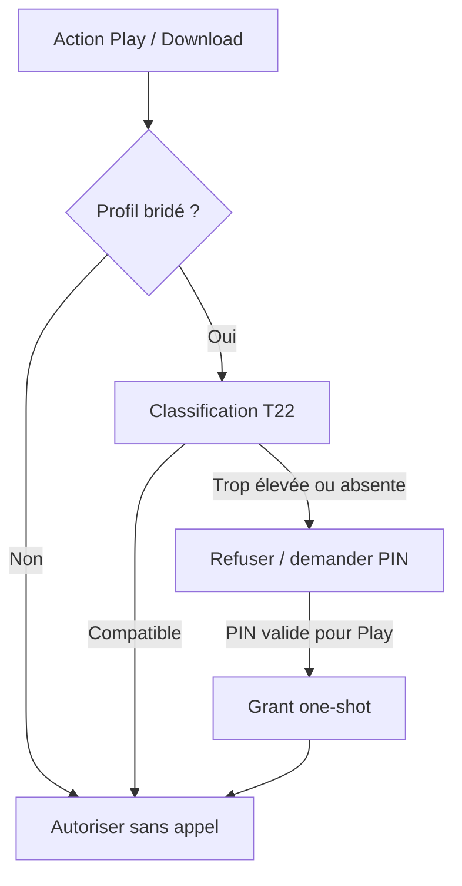

# F44 - Restriction par âge sur un profil (contrôle parental)

## Informations générales

Status:
VALIDATED

Created:
2026-08-15

Dépendances:
T22 (classification d'âge servie par le backend) — bloquant.

---

# 1. Description

Un profil local peut être **bridé sur un âge** (classification française : Tous
publics, 10, 12, 16, 18). Quand ce profil ouvre la fiche d'un film ou d'une
série, l'application récupère la classification d'âge de l'œuvre. Si elle
dépasse le niveau autorisé, la lecture est refusée et l'écran l'explique.

La règle est **défensive** : si la classification ne peut pas être déterminée
(œuvre inconnue de la source, service indisponible, appariement impossible), la
lecture est refusée.

Le déverrouillage ponctuel d'un contenu, comme la modification du niveau
autorisé, exige un **code PIN à 4 chiffres**.

---

# 2. Contexte

Le projet gère depuis la Phase 27 plusieurs profils locaux de type Netflix
(favoris, historique et reprise de lecture séparés), mais aucun n'a de
restriction de contenu : le catalogue IPTV, qui contient des catégories adultes
et des œuvres non adaptées, est intégralement accessible depuis un profil enfant.

TMDB expose des certifications par pays, y compris la classification française.
T22 rendant ces données accessibles via le backend avec cache partagé, la donnée
nécessaire devient disponible sans multiplier les appels.

**Écart de périmètre assumé.** AGENTS.md exclut explicitement « code PIN /
restriction parentale par profil » sauf demande explicite du PO. La demande est
faite et le PIN est retenu : AGENTS.md doit être mis à jour lors de la livraison.

---

# 3. Objectif

- Confier un profil à un enfant sans lui donner accès à l'ensemble du catalogue.
- Ne jamais autoriser par défaut : l'absence d'information vaut refus.
- Rendre la restriction non contournable depuis le profil bridé lui-même.
- Ne pas dégrader la navigation des profils non bridés (aucun surcoût, aucun
  appel supplémentaire).

---

# 4. Décisions produit prises à l'étape 1

| Sujet | Décision |
|---|---|
| Échelle d'âge | Classification française : Tous publics, 10, 12, 16, 18 — alignée sur les certifications FR de TMDB. |
| Visibilité des contenus interdits | Le média reste **visible** dans les listes et la recherche ; seule la lecture est bloquée, avec une explication. Pas de masquage ni de cadenas (la classification n'est connue qu'après consultation de la fiche). |
| Contenu non classifié | Lecture **refusée** (règle défensive), avec un message distinct de celui du contenu explicitement trop mature. |
| Déverrouillage | Code PIN à 4 chiffres, exigé pour débloquer ponctuellement un contenu **et** pour modifier le niveau autorisé d'un profil. Écart assumé au périmètre AGENTS.md, à répercuter dans le document. |
| Séries | Classification de la série entière ; pas de granularité par saison ni par épisode. |
| Chaînes en direct | Hors périmètre : aucune source de classification fiable pour le direct. |
| Plateformes | Mobile et Android TV dès la première livraison. |

## Décisions produit prises à l'étape 2

| Sujet | Décision |
|---|---|
| Portée du PIN | Un seul PIN pour l'appareil, commun à tous les profils non bridés. |
| Durée du déverrouillage ponctuel | La lecture en cours uniquement — la restriction se réapplique à la relecture ultérieure du même média. |
| Création d'un profil | Non bridé par défaut ; le bridage est une action explicite ultérieure. |
| Contenus téléchargés hors ligne | Le niveau autorisé est vérifié **au moment du téléchargement** (impossible de télécharger un contenu au-dessus du niveau du profil) ; **pas de revalidation à la lecture** d'un fichier déjà téléchargé. **Écart assumé** : un contenu téléchargé avant que le profil ne soit bridé (ou avant un abaissement du niveau autorisé) reste lisible hors ligne sans PIN — contredit partiellement l'objectif « restriction non contournable », accepté comme limite connue de la V1 après confirmation explicite. |
| Bandes-annonces et vignettes | Seule la lecture du média principal est bloquée ; les bandes-annonces ne sont pas concernées par la restriction. |
| PIN oublié | Réinitialisation via le compte CSTV : l'utilisateur principal, ré-authentifié, réinitialise le PIN depuis les Paramètres. |

---

# 5. Hypothèses

- T22 est livré et expose la classification d'âge d'un film ou d'une série,
  avec un cache serveur suffisant pour que la consultation d'une fiche
  n'introduise pas de latence perceptible.
- La certification française est disponible pour une part significative du
  catalogue ; à défaut, la règle défensive rendrait un profil bridé inutilisable.
  **À mesurer avant l'étape 3.**
- L'appariement œuvre ↔ source (T21/T22) est assez fiable pour ne pas bloquer
  massivement des contenus par simple échec de correspondance.
- Le PIN protège d'un enfant, pas d'un adversaire : un stockage local chiffré
  (DataStore chiffré, déjà en place pour les identifiants) suffit.
- Le PIN est un réglage d'appareil ou de compte, pas un secret synchronisé dans
  le cloud (à confirmer étape 2).

---

# 6. Questions ouvertes

| Point traité à l'étape 3 | Décision |
|---|---|
| Synchronisation | Le niveau d'âge est un champ du profil et se synchronise via le backend existant. Le PIN reste unique à l'appareil, chiffré localement, et ne rejoint jamais le cloud. |
| Anti-bruteforce | 5 échecs consécutifs, puis temporisation de 30 s ; chaque nouveau blocage double jusqu'à 15 min. Compteurs et échéance sont persistés localement. Une saisie correcte réinitialise tout. |
| Classification inconnue au téléchargement | Refus défensif, comme pour la lecture. Le bouton reste bloqué tant que T22 ne fournit pas une classification exploitable. |
| Téléchargements existants | Aucune purge/revalidation en V1, conformément à la décision étape 2. Une action future nécessitera un nouveau ticket ; elle n'est pas anticipée dans le schéma. |
| Réinitialisation du PIN | Nouvelle vérification OTP CSTV, puis remplacement local du PIN. Le backend n'a aucun endpoint de PIN et ne peut pas le révéler. |

Aucune question bloquante ne reste ouverte pour l'étape 4.

---

## Arbitrages structurants ratifiés à l'étape 3

| Sujet | Décision |
|---|---|
| Synchronisation du niveau d'âge | **Synchronisé dans le cloud** avec le profil (colonne backend `max_age_rating`, exposée dans l'API profils) : un profil enfant reste bridé sur tous les appareils du foyer. Complète la décision d'étape 1, qui ne tranchait que le cas du PIN. |
| Synchronisation du PIN | **Jamais** : le PIN reste local et chiffré sur l'appareil, le backend ne le connaît pas et ne peut pas le révéler. Conséquence acceptée : le PIN se saisit une fois par appareil. |

---

# 7. Spécification fonctionnelle

## 7.1 User stories

- En tant que parent, je veux confier un profil à mon enfant sans lui
  donner accès à l'ensemble du catalogue.
- En tant que parent, je veux que l'absence d'information sur un contenu le
  bloque par défaut plutôt que de l'autoriser par erreur.
- En tant qu'enfant sur un profil bridé, je ne dois pas pouvoir contourner
  la restriction depuis mon propre profil, ni en modifiant le niveau
  autorisé ni en devinant le PIN d'un adulte.
- En tant qu'adulte du foyer, je veux débloquer ponctuellement un contenu
  pour mon enfant sans devoir changer durablement les réglages du profil.

## 7.2 Parcours utilisateur

**Ouverture d'une fiche depuis un profil bridé**

1. Le profil bridé ouvre la fiche d'un film ou d'une série.
2. L'application récupère la classification d'âge de l'œuvre (via T22).
3. Si la classification dépasse le niveau autorisé du profil, ou si elle
   est inconnue (règle défensive, décision étape 1), la lecture est
   refusée : un écran explique le refus, avec un message distinct selon
   qu'il s'agit d'un contenu explicitement trop mature ou d'un contenu non
   classifié.
4. Le média reste visible et accessible depuis les listes et la recherche
   (décision étape 1) ; seule la lecture est bloquée.

**Déverrouillage ponctuel**

1. Depuis l'écran de refus, un adulte saisit le PIN à 4 chiffres de
   l'appareil (décision étape 2 : un seul PIN, commun à tous les profils
   non bridés).
2. Le PIN correct débloque la lecture en cours uniquement (décision
   étape 2) : rouvrir plus tard le même média depuis ce profil redemande le
   PIN.

**Modification du niveau autorisé d'un profil**

1. Un adulte accède aux réglages du profil bridé.
2. Modifier le niveau autorisé exige la saisie du PIN (décision étape 1).
3. Le nouveau niveau s'applique immédiatement aux prochaines ouvertures de
   fiche ; il ne revalide pas rétroactivement les téléchargements déjà
   présents (voir 7.3).

**Création d'un profil**

1. Un profil est créé non bridé par défaut (décision étape 2) : aucune
   étape supplémentaire n'est ajoutée au parcours de création existant.
2. Le bridage se fait ensuite, explicitement, depuis les réglages du
   profil, au moment où l'utilisateur en a l'usage réel.

**Téléchargement depuis un profil bridé**

1. Le profil bridé tente de télécharger un film ou un épisode.
2. Si la classification de l'œuvre dépasse le niveau autorisé (ou est
   inconnue — règle défensive), le téléchargement est refusé au même titre
   que la lecture (décision étape 2).
3. Un contenu déjà présent sur l'appareil avant le bridage du profil, ou
   téléchargé avant un abaissement ultérieur du niveau autorisé, reste
   lisible hors ligne sans revalidation (écart documenté en 7.3).

## 7.3 Règles métier

- Règle défensive : classification inconnue = lecture refusée, avec un
  message distinct de celui d'un contenu explicitement trop mature
  (décision étape 1).
- Échelle : Tous publics, 10, 12, 16, 18 (certifications françaises TMDB via
  T22) — décision étape 1.
- Visibilité : le média reste toujours visible dans les listes et la
  recherche, seule la lecture est bloquée (décision étape 1).
- Séries : classification de la série entière, pas de granularité par
  saison ou épisode (décision étape 1).
- Chaînes en direct hors périmètre (décision étape 1).
- PIN à 4 chiffres, unique par appareil, requis pour : débloquer
  ponctuellement une lecture, et modifier le niveau autorisé d'un profil
  (décisions étape 1 et 2).
- Le niveau autorisé est vérifié au téléchargement, pas revalidé à la
  lecture d'un contenu déjà téléchargé (décision étape 2) — voir écart
  assumé ci-dessous.
- Les bandes-annonces et les vignettes d'aperçu ne sont pas concernées par
  la restriction (décision étape 2) : seule la lecture du média principal
  est bloquée.
- PIN oublié : réinitialisation via le compte CSTV, après une nouvelle
  authentification de l'utilisateur principal (décision étape 2).

## 7.4 Cas limites et écarts assumés

- **Contenu téléchargé avant le bridage du profil, ou avant un abaissement
  du niveau autorisé** : reste lisible hors ligne sans PIN (décision
  étape 2, confirmée après signalement explicite de l'écart avec l'objectif
  « restriction non contournable »). Traité comme une limite connue de la
  V1, pas une omission — à documenter dans le contenu livré à l'utilisateur
  final (aide, notes de version) si le PO le juge utile à l'étape 9.
- **Classification indisponible au moment du téléchargement** (T22 non
  encore répondu, cache serveur froid) : traitement exact renvoyé à
  l'étape 3 (voir Questions ouvertes) — la règle défensive suggère un refus
  par défaut, cohérent avec le reste de la fonctionnalité.
- **Œuvre dont l'appariement T21/T22 échoue** (pas de correspondance
  trouvée) : traitée comme une classification inconnue, donc refusée
  (règle défensive, décision étape 1) — risque déjà identifié comme
  hypothèse à mesurer avant l'étape 3.
- **Profil bridé après que du contenu a déjà été visionné mais pas
  téléchargé** : la reprise de lecture en streaming applique la nouvelle
  restriction immédiatement, à la différence du hors ligne.
- **PIN saisi incorrectement plusieurs fois** : nombre de tentatives et
  temporisation renvoyés à l'étape 3.

## 7.5 Critères d'acceptation

- Un profil bridé ne peut pas lire un contenu dont la classification
  dépasse son niveau autorisé, ni un contenu non classifié.
- Le message affiché distingue un contenu explicitement trop mature d'un
  contenu non classifié.
- Le média reste visible dans les listes et la recherche depuis un profil
  bridé, seule sa lecture est bloquée.
- Le PIN correct débloque la lecture en cours uniquement ; rouvrir le même
  média plus tard redemande le PIN.
- Modifier le niveau autorisé d'un profil exige le PIN.
- Un profil nouvellement créé est non bridé.
- Un téléchargement au-dessus du niveau autorisé d'un profil bridé est
  refusé au moment de la demande.
- La réinitialisation du PIN passe par une nouvelle authentification du
  compte CSTV.

## 7.6 Gestion des erreurs

- Service de classification indisponible (T22 en échec) au moment
  d'ouvrir une fiche : traité comme une classification inconnue — lecture
  refusée par défaut (règle défensive), jamais un accès autorisé par erreur
  réseau.
- PIN incorrect : message clair de refus, sans indiquer si le profil ou le
  PIN lui-même est en cause — pas de stack trace, pas de détail technique
  (AGENTS.md § Gestion des erreurs).
- Échec de la réinitialisation du PIN via le compte CSTV (identifiants
  invalides, service injoignable) : message explicite, le PIN existant
  reste actif tant que la réinitialisation n'a pas abouti.

---

# 8. Spécification technique

## 8.1 Modèle d'âge partagé

Type de domaine unique :

```kotlin
enum class AgeRating(val value: Int) {
    ALL(0), TEN(10), TWELVE(12), SIXTEEN(16), EIGHTEEN(18)
}
```

`Profile`/`ProfileEntity` ajoutent `maxAgeRating: Int?`; `null` signifie profil
non bridé. Migration Room : colonne nullable, donc tous les profils existants
restent non bridés. Elle est écrite dans la **prochaine migration Room
disponible au moment de la livraison** de F44 — aucun numéro de version n'est
figé ici, plusieurs tickets du lot touchent au schéma ; vérifier
`AppDatabase.kt` au préalable (voir T21 §8.5). Côté backend, la migration
PostgreSQL prend de même le numéro suivant libre dans `backend/migrations/`.

Migration PostgreSQL dédiée :

```sql
ALTER TABLE profiles ADD COLUMN max_age_rating SMALLINT NULL
    CHECK (max_age_rating IN (0, 10, 12, 16, 18));
```

`ProfilePresenter`, create/update DTO, OpenAPI et gateway Android exposent
`maxAgeRating`. La création omet le champ et garde `null`. Toute modification
cloud est appliquée seulement après validation locale du PIN ; le backend valide
la valeur et l'ownership, mais ne connaît pas le secret parental.

## 8.2 Classification fournie par T22

Le modèle produit T22 expose `ageRatingFr: Int?` pour le résultat apparié. Le
backend mappe les certifications françaises vers l'échelle fermée ; une valeur
absente/inconnue reste `null` et n'est jamais convertie en « Tous publics ».

`ContentClassificationRepository` cache le résultat sous l'identité canonique
T22 et applique ses TTL. Pour un profil non bridé, `ParentalAccessPolicy`
retourne immédiatement `Allowed` sans appeler ce repository, garantissant aucun
surcoût sur le parcours adulte.

## 8.3 PIN local

`ParentalPinStore` utilise un stockage chiffré app-privé distinct des préférences
UI. Le PIN n'est jamais stocké en clair :

- sel aléatoire 128 bits ;
- dérivation PBKDF2-HMAC-SHA256 (120 000 itérations, paramètres versionnés) ;
- comparaison constante ;
- hash, sel, version, échecs et `lockedUntilEpochMs` protégés par la clé Android
  Keystore via `EncryptedSharedPreferences`/le mécanisme sécurisé déjà utilisé
  pour les credentials.

Le modèle de menace reste celui décidé : protection contre un enfant, pas
contre un appareil rooté. Aucun log, backup cloud ou snapshot de profil ne
contient le PIN ou son hash.

Politique : cinq erreurs → 30 secondes ; les blocages suivants doublent
`30s, 60s, 120s…` jusqu'à 15 minutes. L'horloge utilisée combine échéance murale
persistée et durée monotone pendant le process pour limiter le contournement par
retour d'horloge. Un PIN correct remet compteurs et niveau de blocage à zéro.

## 8.4 Garde d'accès centralisé

`ParentalAccessPolicy` est une règle pure :

```kotlin
sealed interface AccessDecision {
    data object Allowed : AccessDecision
    data class PinRequired(val reason: BlockReason) : AccessDecision
}
```

Elle reçoit profil, classification et type d'action (`PLAY`, `DOWNLOAD`). Elle
est appelée dans les use cases qui lancent réellement la lecture ou le
téléchargement, pas seulement dans le composable. Un deep link, une reprise ou
un second écran ne peut donc pas contourner la règle.

Un PIN valide crée un `OneShotPlaybackGrant` uniquement en mémoire, lié à
`profileId + mediaUid + requestNonce`. Il est consommé au lancement de cette
lecture et n'autorise ni une relecture, ni un autre média, ni un téléchargement.
La modification d'âge utilise une autorisation séparée et n'accepte pas le grant
de lecture.

Pour `DOWNLOAD`, classification absente ou T22 indisponible → refus défensif.
La requête peut être réessayée manuellement lorsque la fiche est enrichie ;
aucune file d'attente n'autorise plus tard le téléchargement sans réévaluation.

## 8.5 Parcours de réinitialisation

Le bouton « PIN oublié » lance le flow OTP existant en mode réauthentification.
Après vérification réussie et jeton/session fraîche (fenêtre maximale 5 minutes),
l'app autorise `ParentalPinStore.replacePin`. Le backend ne stocke pas de PIN ;
il atteste uniquement que l'utilisateur contrôle toujours l'email du compte.

En mode hors ligne ou backend indisponible, aucune réinitialisation n'est
possible et le PIN actuel reste intact. La déconnexion ou suppression des
credentials ne supprime pas silencieusement le PIN.

## 8.6 Intégration UI

- gestion de profil : sélecteur `Tous/10/12/16/18`, protégé par PIN pour toute
  modification d'un niveau existant ;
- première activation : si aucun PIN appareil n'existe, l'adulte en crée un
  avant d'enregistrer un profil bridé ;
- fiche : classification chargée via T22, décision calculée avant l'action Play ;
- écran de refus : raisons `TOO_MATURE` et `UNCLASSIFIED` distinctes, saisie PIN
  TV/mobile et état temporisé ;
- téléchargement : même policy, sans grant de lecture ;
- bandes-annonces et vignettes ne passent pas par la policy, conformément à
  l'étape 2.

## 8.7 Téléchargements existants

Le lecteur hors ligne conserve le comportement explicitement accepté : une
ligne `DownloadedMediaEntity` déjà présente est lisible sans revalidation. F44
ne modifie donc ni son schéma ni le service de lecture hors ligne pour la V1.
Seule la création d'un nouveau `DownloadRequest` est gardée. L'aide/release note
devra documenter cet écart à l'étape 9.

## 8.8 Sécurité, performance et compatibilité

- classification demandée une fois par fiche/cache, jamais pour les profils
  non bridés ;
- PIN vérifié sur dispatcher crypto, pas sur le thread UI ;
- messages identiques quant au format du PIN, sans détail exploitable ;
- limite de saisie à quatre chiffres côté UI et domaine ;
- champ backend nullable et DTO tolérants pour compatibilité avec un ancien
  serveur pendant le déploiement ;
- changement cloud du niveau utilise l'API de profil existante et ses contrôles
  IDOR ;
- aucune synchronisation du hash PIN via les objets gzip.

## 8.9 Tests automatisés

Backend : migration, validation des cinq valeurs/null, CRUD profile, IDOR et
OpenAPI. Android : policy complète, profil non bridé sans appel T22, contenu trop
mature/inconnu, grants one-shot, garde téléchargement, PBKDF2/version, cinq
tentatives/temporisations avec fausse horloge, réauth OTP et échecs réseau,
mapping profil cloud. Tests ViewModel/UI state sans appareil.

## 8.10 Fichiers impactés ou nouveaux

**Backend** : migration profil, `ProfileRepository/Service/Presenter`,
`ProfileAction`, `Validator`, `openapi.yaml` et tests. Aucun endpoint de PIN.

**Android nouveaux** : `ParentalPinStore.kt`, `ParentalAccessPolicy.kt`,
`OneShotPlaybackGrantStore.kt`, `ContentClassificationRepository.kt`,
ViewModel/composables de saisie/refus et tests.

**Android modifiés** : `ProfileEntity.kt`, `Profile.kt`, DAO/repository/gateway
et DTO profiles, `AppDatabase.kt`, `Migrations.kt`, écrans/ViewModel de gestion
des profils, fiches VOD/séries, use cases de lancement et téléchargement,
navigation, ressources FR/EN, `AGENTS.md` à l'étape de livraison documentaire.

---

# 9. Architecture

## 9.1 Décision d'accès



## 9.2 Responsabilités

- **Backend profil** : synchroniser uniquement le niveau d'âge ;
- **T22/classification repository** : donnée de classification, jamais décision ;
- **ParentalAccessPolicy** : règle unique lecture/téléchargement ;
- **PinStore** : secret, dérivation, délai et réinitialisation locale ;
- **Use cases** : garde non contournable ;
- **UI** : explication, saisie et modification du niveau.

## 9.3 Risques

- faible couverture des classifications : métrique T22 et refus défensif assumé ;
- PIN 4 chiffres : stockage chiffré, KDF et temporisation, dans le modèle de
  menace limité ;
- divergence appareils : niveau synchronisé, PIN volontairement local ;
- téléchargement antérieur lisible : écart V1 explicite, pas corrigé en silence ;
- ancien backend sans champ : `null` non bridé lors de la transition, ordre de
  déploiement backend puis app obligatoire.

---

# 10. Plan de développement

F44 se livre après T22 : le contrat backend de classification existe déjà
pour de vrai, aucune tâche n'a besoin de point d'extension. Point d'ordre de
déploiement à respecter (§9.3, risque déjà identifié) : **le backend doit
être déployé avant l'application** — un ancien serveur sans le champ
`max_age_rating` doit répondre `null` (non bridé), jamais faire échouer
l'appel. La tâche 1 doit donc être vérifiée compatible avant que la tâche 6
ne soit livrée en production.

- [x] 1. Backend — champ `maxAgeRating` du profil

Objectif:
Ajouter la colonne et l'exposer dans l'API profil existante (§8.1), sans
endpoint dédié au PIN — le backend ne connaît jamais le PIN.

Fichiers:
- migration PostgreSQL — **vérifier le numéro réellement disponible dans
  `backend/migrations/` avant d'écrire** (règle T21 §8.5, T22 ajoute déjà
  une migration dans ce lot)
- `ProfileRepository`/`Service`/`Presenter`, `ProfileAction`, `Validator`
  côté backend
- `backend/openapi.yaml`

Validation:
Tests backend : validation stricte des cinq valeurs autorisées (`0, 10, 12,
16, 18`) et de `null`, CRUD profil incluant le nouveau champ, contrôle IDOR
existant toujours respecté (un profil ne modifie que ses propres données).
Un payload sans `maxAgeRating` (ancien client) crée un profil non bridé,
jamais une erreur.

---

- [x] 2. Android — modèle d'âge partagé et classification T22

Objectif:
Poser `AgeRating` (§8.1) et `ContentClassificationRepository` qui consomme
le contrat T22 réel (déjà livré) sous l'identité canonique et ses TTL
(§8.2).

Fichiers:
- `domain/model/AgeRating.kt` (nouveau)
- `data/repository/ContentClassificationRepository.kt` (nouveau)
- `data/local/entity/ProfileEntity.kt`, `domain/model/Profile.kt`
  (`maxAgeRating: Int?`)
- migration Room — **vérifier le numéro réellement disponible dans
  `AppDatabase.kt` avant d'écrire** (règle T21 §8.5)

Validation:
Test unitaire central : pour un profil non bridé, aucun appel à
`ContentClassificationRepository` n'est déclenché (§8.2 — « garantit aucun
surcoût sur le parcours adulte »), vérifiable par un mock qui échoue le
test s'il est sollicité. Test de migration Room. Une classification absente
ou `null` du backend n'est jamais convertie en « Tous publics ».

---

- [x] 3. Android — `ParentalPinStore`

Objectif:
Stockage chiffré du PIN (§8.3) : sel, PBKDF2-HMAC-SHA256 120 000
itérations, comparaison à temps constant, anti-bruteforce (5 échecs → 30 s,
doublement jusqu'à 15 min).

Fichiers:
- `data/security/ParentalPinStore.kt` (nouveau)
- tests unitaires associés (nouveau)

Validation:
Tests avec horloge fausse (jamais d'horloge réelle dans un test) : séquence
exacte de temporisation sur échecs consécutifs, remise à zéro sur PIN
correct, résistance à un retour d'horloge (combinaison échéance murale +
durée monotone, §8.3). Aucun test ne vérifie la résistance à un appareil
rooté (hors modèle de menace assumé, §8.3/§9.3).

---

- [x] 4. Android — `ParentalAccessPolicy` et grant one-shot

Objectif:
Règle d'accès pure (§8.4) : `Allowed`/`PinRequired`, `OneShotPlaybackGrant`
en mémoire lié à `profileId + mediaUid + requestNonce`, jamais persisté ni
réutilisable pour un autre média.

Fichiers:
- `domain/model/ParentalAccessPolicy.kt` (nouveau)
- `domain/model/OneShotPlaybackGrantStore.kt` (nouveau, en mémoire)
- tests unitaires associés (nouveau)

Validation:
Tests JVM purs : profil non bridé toujours `Allowed` sans appel
classification ; contenu trop mature vs non classifié produisent des
`BlockReason` distincts ; un grant consommé n'autorise ni une seconde
lecture du même média ni un autre média ; la modification du niveau
autorisé exige une autorisation séparée qui n'accepte pas un grant de
lecture (§8.4).

---

- [x] 5. Android — garde câblée dans lecture et téléchargement

Objectif:
Appeler `ParentalAccessPolicy` dans les use cases qui lancent réellement la
lecture et le téléchargement (§8.4), pas seulement dans le composable —
pour qu'un deep link ou une reprise ne puisse pas contourner la règle.

Fichiers:
- use cases de lancement de lecture et de téléchargement concernés
- `data/download/` (garde sur `DownloadRequest`, §8.4 et §8.7 — la création
  d'un nouveau téléchargement est gardée, un `DownloadedMediaEntity`
  existant ne l'est pas, écart déjà documenté §7.4)

Validation:
Tests d'intégration légers vérifiant que la garde s'applique bien depuis
chaque point d'entrée existant vers la lecture (pas seulement l'écran
fiche principal) et depuis la création d'un `DownloadRequest`. Un
téléchargement dont la classification est absente ou T22 indisponible est
refusé (règle défensive, §8.4), sans mise en file d'attente pour retry
automatique.

---

- [x] 6. Android — UI : gestion de profil, écran de refus, saisie PIN

Objectif:
Sélecteur de niveau protégé par PIN, création du PIN à la première
activation, écran de refus avec les deux raisons distinctes, saisie PIN
mobile/TV avec état temporisé visible (§8.6).

Fichiers:
- écrans/ViewModel de gestion des profils
- écran de refus et composant de saisie PIN (nouveau)
- fiches VOD/séries (déclenchement de la décision avant l'action Play)
- `strings.xml` FR/EN

Validation:
Tests de ViewModel (mobile/TV, sans appareil) : les deux raisons
`TOO_MATURE`/`UNCLASSIFIED` affichent des messages distincts ; l'état
temporisé du PIN store se reflète dans l'UI sans détail exploitable sur la
cause de l'échec (§8.8) ; bandes-annonces et vignettes ne déclenchent
jamais la policy (décision étape 2).

---

- [x] 7. Android — réinitialisation du PIN par OTP

Objectif:
Brancher le flow OTP existant en mode réauthentification (§8.5), fenêtre de
session fraîche de 5 minutes, aucune réinitialisation possible hors ligne
ou backend indisponible.

Fichiers:
- écran/ViewModel de réinitialisation (nouveau, réutilisant le flow OTP
  existant)

Validation:
Tests avec le flow OTP mocké : réinitialisation acceptée seulement dans la
fenêtre de fraîcheur, refusée hors ligne avec le PIN existant intact,
refusée si le backend est indisponible sans jamais supprimer
silencieusement le PIN en place.

---

- [x] 8. Documentation — mise à jour AGENTS.md

Objectif:
Documenter l'écart de périmètre assumé (§2 : PIN/restriction parentale,
explicitement hors périmètre par défaut) une fois la fonctionnalité livrée,
conformément à l'engagement pris dans la description du ticket.

Fichiers:
- `AGENTS.md` (section Périmètre strict du projet)

Validation:
Relecture manuelle : la ligne d'exclusion « code PIN / restriction
parentale par profil » est retirée ou nuancée pour refléter F44 comme
exception désormais implémentée.

---

- [x] 9. Non-régression globale

Objectif:
Vérifier l'ensemble avant review, en particulier l'ordre de déploiement
backend-avant-app (§9.3) et l'absence de surcoût pour les profils non
bridés.

Fichiers:
- l'ensemble des fichiers listés en §8.10

Validation:
`./gradlew assembleDebug`, `./gradlew testDebugUnitTest`, `./gradlew
lintDebug` verts côté Android ; suite backend verte. Test explicite
qu'un ancien client (backend déployé mais app pas encore mise à jour, ou
l'inverse) ne provoque aucune erreur bloquante — seulement une absence de
bridage tant que les deux ne sont pas alignés.

---

# 11. Notes de développement

Étape 5 (implémentation) livrée le 2026-08-19, tâches 1 à 9 toutes terminées
en une session :

- **Backend** : migration `008_profile_max_age_rating.sql`, `Validator::maxAgeRating`,
  `ProfileRepository`/`Service`/`Presenter` mis à jour (COALESCE vs écrasement
  explicite pour distinguer « inchangé » de « débridé »), `openapi.yaml`. 169
  tests backend verts.
- **Android** : `AgeRating`, `ContentClassificationRepository` (cache mémoire
  30 min sur `/v1/catalog/matches`), `ParentalPinStore` (PBKDF2 120k
  itérations, hex — pas de Base64 Android indisponible en test JVM local),
  `ParentalAccessPolicy` (règle pure), `OneShotPlaybackGrantStore`,
  `CanPlayContentUseCase` étendu (choke point unique de tous les écrans de
  lecture), `StartDownloadUseCase` étendu, UI (dialogs PIN, sélecteur de
  niveau, écran PIN oublié réutilisant le flow OTP). Migration Room 35→36.
- **Écart découvert en cours de route** : `ParentalPinStore`/`ParentalAccessPolicy`
  utilisent une classification résolue par le *use case appelant*
  (`CanPlayContentUseCase`/`StartDownloadUseCase`), pas par la policy
  elle-même — plus proche de « policy pure au sens strict » que la
  formulation initiale du §8.4, sans changer le comportement observable.
- **Écart découvert en cours de route (§7.2)** : le téléchargement n'a
  finalement aucun parcours de déverrouillage PIN (relu attentivement,
  cohérent avec §7.2/§8.4 déjà écrits) — seule la lecture bénéficie du grant
  one-shot. `DownloadsViewModel` n'expose donc qu'un message de refus,
  fermable, sans saisie PIN.
- `./gradlew testDebugUnitTest assembleDebug lintDebug` + suite backend
  (`composer test` dans le conteneur `backend-php-test-1`, PHP 8.5) verts à
  la fin de chaque tâche.

---

# 12. Review

## Critique

- **Bypass de la restriction sur un contenu non trouvé en cache**
  - **Description :** Dans `CanPlayContentUseCase` et `StartDownloadUseCase`, si `resolveClassificationTarget` ne trouve pas l'œuvre en base locale (ex: `getStreamById` retourne `null` suite à une désynchronisation ou un accès hors parcours classique), il retourne `null`. L'évaluation parentale l'interprète alors comme "Autorisé" (`return null` dans `evaluateParentalAccess`), ce qui contourne complètement la restriction pour un profil bridé.
  - **Impact :** Un enfant peut lancer la lecture ou le téléchargement d'une œuvre non présente dans le cache local sans que le PIN ne soit demandé. C'est une violation de la règle défensive définie en §1 et §7.3.
  - **Correction attendue :** Si `target` est `null`, la méthode `evaluateParentalAccess` doit retourner un refus défensif (`RequiresParentalPin(BlockReason.UNCLASSIFIED)` pour la lecture, et l'équivalent pour le téléchargement) au lieu de `null`.

## Majeur

- **Mise en cache des échecs réseau pour la classification**
  - **Description :** Dans `ContentClassificationRepository`, si l'appel à `catalogApiService.match` échoue (ex: `IOException`), l'exception est attrapée et la méthode détermine `ageRating = null`. Cependant, cette valeur `null` est ensuite mise en cache pour 30 minutes.
  - **Impact :** Si l'utilisateur subit une micro-coupure réseau au moment d'ouvrir la fiche d'un film, la classification "inconnue" est mise en cache. Pendant les 30 minutes suivantes, même si le réseau est rétabli, l'application continuera de bloquer la lecture (refus défensif) sans même retenter l'appel au backend.
  - **Correction attendue :** Ne pas mettre en cache le résultat si une exception (autre que `CancellationException`) est levée. Retourner `null` est acceptable pour refuser l'accès dans l'instant, mais l'erreur ne doit pas polluer le cache.

## Mineur

- **Fuite de mémoire lente sur les grants non consommés**
  - **Description :** `OneShotPlaybackGrantStore` ajoute les nonces générés dans un `MutableSet`. Si un parent déverrouille un contenu (saisie correcte du PIN) mais qu'il annule l'action avant le lancement effectif de la lecture (ou si le lecteur échoue à s'ouvrir), le grant n'est jamais consommé et reste en mémoire indéfiniment.
  - **Impact :** Accumulation d'objets `OneShotPlaybackGrant` en mémoire durant la vie de l'application. Bien que l'objet soit léger, c'est une fuite conceptuelle.
  - **Correction attendue :** Ajouter un mécanisme d'éviction (ex: vider les grants antérieurs à X minutes lors de l'ajout d'un nouveau, ou utiliser un cache avec TTL léger) ou limiter la taille maximale du `Set`.

## Corrections demandées
- Corriger la faille de contournement dans les Use Cases de lecture et téléchargement.
- Modifier le cache de classification pour ignorer les erreurs réseau.
- Ajouter un nettoyage simple des grants inutilisés.

## Corrections appliquées à l'étape 7

### F44-R1 — Résolu

`CanPlayContentUseCase` et `StartDownloadUseCase` refusent désormais par défaut
avec `UNCLASSIFIED` lorsqu'une œuvre bridée n'est pas retrouvée dans le cache
local. La classification n'est donc plus contournable par une cible absente.
Les deux chemins disposent d'un test de non-régression et aucune requête de
lecture/téléchargement n'est lancée dans ce cas.

### F44-R2 — Résolu

`ContentClassificationRepository` ne conserve plus le résultat `null` produit
par une exception réseau (hors `CancellationException`, qui est toujours
propagée). Le refus défensif s'applique à la tentative courante, puis l'appel
suivant retente le backend. Un test vérifie explicitement le retry après une
première erreur.

### F44-R3 — Résolu

`OneShotPlaybackGrantStore` est maintenant borné à 256 grants en mémoire et
évacue le plus ancien à l'émission d'un nouveau grant lorsque la limite est
atteinte. Un test vérifie l'éviction du grant abandonné et la conservation du
plus récent.

### Évidence de l'étape 7

- Tests ciblés F44 : 31 tests verts.
- Suite Android complète : `./gradlew --no-daemon testDebugUnitTest` — verte.
- Build debug : `./gradlew --no-daemon assembleDebug` — vert.
- Lint : `./gradlew --no-daemon lintDebug` — vert.
- `git diff --check` — propre.

L'étape 8 (documentation de livraison et décision de validation finale) reste
à exécuter séparément.

---

# 13. Release

Version :

Commit :

Date :
