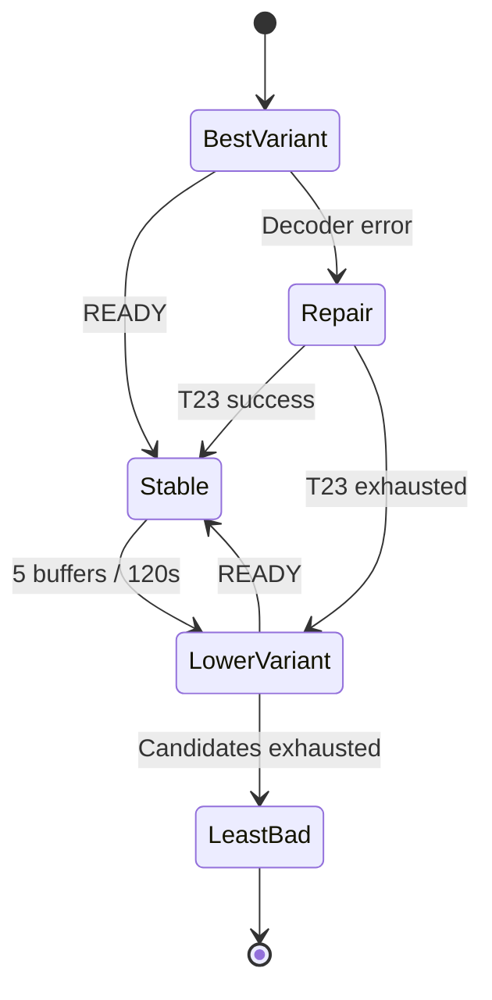

# F40 - Sélecteur de qualité des chaînes et mode automatique avec repli

## Informations générales

Status:
RELEASED

Created:
2026-08-15

Dépendances:
T21 (clé de liaison des chaînes) — bloquant.

---

# 1. Description

Un bouton « Qualité » dans le lecteur de direct liste les variantes de la chaîne
en cours (les entrées partageant sa clé de liaison T21 : `TF1 4K`, `TF1 FHD`,
`TF1 HD`, `TF1 SD`…) et permet d'en changer immédiatement. Le direct n'ayant pas
de position de lecture, la bascule est un simple changement de flux.

S'ajoute un **mode automatique** : l'application ouvre la meilleure qualité
disponible et, si le flux échoue ou se révèle instable, se replie sur la qualité
inférieure, puis de proche en proche. Si aucune variante n'est stable, elle se
fixe sur la moins mauvaise mesurée pendant les essais.

Le mode automatique n'est pas actif par défaut : un réglage dans les Paramètres
permet d'en faire le comportement par défaut de toutes les chaînes.

---

# 2. Contexte

La qualité des flux de direct est très inégale d'une variante à l'autre et varie
dans le temps : un flux 4K peut être parfait le matin et injouable le soir.
Aujourd'hui, l'utilisateur qui tombe sur un flux mort ou saccadé doit revenir à
la liste, deviner quelle autre entrée correspond à la même chaîne, et relancer —
en pleine émission.

Ce ticket transforme ce parcours en une action d'un geste, et offre à qui le
souhaite un repli entièrement automatique.

Le mode automatique reste opt-in : une bascule de flux non demandée pendant une
émission est perçue comme une panne, pas comme un service. Le réglage global
permet à l'utilisateur averti d'en faire son défaut.

---

# 3. Objectif

- Changer de qualité sur une chaîne sans quitter le lecteur.
- Offrir, en option, une lecture qui se répare seule sans intervention.
- Ne jamais s'acharner sur un flux défaillant, ni osciller entre deux flux.
- Quand rien ne fonctionne parfaitement, rester sur le flux le moins mauvais
  plutôt que sur un écran noir.

---

# 4. Décisions produit prises à l'étape 1

| Sujet | Décision |
|---|---|
| Activation du mode automatique | **Manuel par défaut.** Un réglage dans les Paramètres permet de choisir le mode automatique comme comportement par défaut. |
| Déclencheur du repli | Erreur de lecture **ou** plusieurs coupures de mise en mémoire tampon rapprochées (seuils à caler à l'étape 2). |
| Remontée en qualité | Aucune remontée automatique : la qualité stable est conservée jusqu'à ce qu'on quitte la chaîne. La meilleure qualité est retentée au prochain zapping. |
| Toutes les variantes instables | On se fixe sur la moins mauvaise mesurée pendant les essais (score fondé sur la réussite d'ouverture et le nombre de coupures), pas systématiquement sur la plus basse. |
| Périmètre | Chaînes en direct uniquement. Films et séries relèvent de F39. |
| Plateformes | Mobile et Android TV dès la première livraison. |

## Décisions produit prises à l'étape 2

| Sujet | Décision |
|---|---|
| Seuil de déclenchement du repli | 5 coupures de mise en mémoire tampon en moins de 2 minutes, ou une erreur de lecture franche qui déclenche toujours immédiatement. |
| Signalement du repli | Message bref et discret à l'écran au moment du repli (ex. « Qualité ajustée automatiquement »), sans interrompre le visionnage. |
| Choix manuel pendant le mode automatique | Désactive l'automatisme pour cette chaîne uniquement, le temps de la session en cours. Le réglage global des Paramètres n'est pas modifié. |
| Mémorisation d'une qualité préférée hors mode automatique | Aucune mémoire : un choix manuel de qualité ne survit pas au zapping suivant sur la même chaîne. |

*Note : la question « le mode automatique retient-il, au prochain zapping, la qualité qui avait fonctionné, ou repart-il toujours de la plus haute ? » était déjà tranchée à l'étape 1 (ligne « Remontée en qualité ») : la meilleure qualité est retentée à chaque nouveau zapping sur la chaîne, sans mémoire de la qualité stable précédente.*

---

# 5. Hypothèses

- T21 regroupe correctement les variantes d'une chaîne, et l'ordre de qualité se
  déduit des attributs extraits (4K > FHD/1080p > HD > SD).
- Les indicateurs disponibles dans Media3 (erreurs de lecture, événements de mise
  en mémoire tampon, délai d'ouverture) suffisent à qualifier l'instabilité ; il
  n'est pas nécessaire de sonder le réseau séparément.
- Une bascule de flux coûte quelques secondes de noir : acceptable face à un flux
  défaillant, inacceptable sur un flux qui fonctionne — d'où l'absence de
  remontée automatique.
- Les mesures de stabilité n'ont pas besoin de survivre à la session : elles
  concernent des conditions réseau instantanées.
- Une chaîne sans variante n'affiche pas le bouton, ou l'affiche désactivé.

---

# 6. Questions ouvertes

| Point traité à l'étape 3 | Décision |
|---|---|
| Variantes de même qualité | Ordre stable : rang qualité décroissant, puis `num`, puis `streamId`. En mode automatique, une variante déjà essayée ne l'est plus durant la session, même si son étiquette est identique. |
| Chaîne sans variante | Le bouton « Qualité » est masqué lorsqu'il n'existe qu'un flux exploitable. |
| T23 | Une erreur de décodage est réparée par T23 sur la variante courante ; une erreur réseau ou l'épuisement de T23 autorise F40 à passer à la variante suivante. |
| F41 | Toute bascule de qualité clôt et purge le tampon local courant, puis démarre un nouveau tampon au direct sur la nouvelle variante. Deux encodages ne sont pas concaténés dans une même fenêtre temporelle. |

Aucune question bloquante ne reste ouverte pour l'étape 4.

---

## Arbitrages structurants ratifiés à l'étape 3

| Sujet | Décision |
|---|---|
| Catalogue pas encore normalisé | T21 recalcule le stock existant **en tâche de fond après le démarrage** (décision ratifiée à l'étape 3 de T21, qui révise son étape 1). Une chaîne dont `linkKey` est encore vide masque le bouton « Qualité » et ne déclenche aucun repli automatique : comportement identique à celui d'une chaîne sans variante, déjà spécifié. Aucun message d'attente n'est affiché. Une requête par `linkKey` ignore toujours les valeurs vides. |
| Repli de qualité pendant une session catch-up (F42) | Observation du panel réel : la capacité de rattrapage est déclarée **par variante** — `\|FR\| TF1 HD` porte `tv_archive: 1`, `\|FR\| TF1 SD` porte `tv_archive: 0`. Un repli automatique vers une variante sans archive interromprait la session de rattrapage en cours, alors que l'utilisateur n'a rien demandé. **Tranché : tant qu'une session catch-up est active, le mode automatique ne considère que les variantes déclarant `tv_archive = 1`.** Si aucune autre variante archivable n'existe, F40 **ne bascule pas** : il laisse T23 tenter la réparation, puis la gestion d'erreur normale opérer. Subir un flux instable est préférable à perdre la session sans prévenir. |
| Sélection manuelle pendant une session catch-up | Les variantes sans archive restent **visibles mais désactivées** dans le sélecteur, avec la raison affichée (« pas de rattrapage sur cette qualité »). Cohérent avec le principe de F42 : ne jamais promettre ce qui n'est pas possible, sans pour autant masquer l'information. |

---

# 7. Spécification fonctionnelle

## 7.1 User stories

- En tant qu'utilisateur qui regarde une chaîne en direct, je veux changer
  de qualité sans quitter le lecteur, pour corriger un flux mauvais sans
  interrompre l'émission plus que nécessaire.
- En tant qu'utilisateur qui subit régulièrement des flux instables, je veux
  une lecture qui se répare seule, pour ne plus avoir à zapper manuellement
  entre les variantes d'une même chaîne.
- En tant qu'utilisateur satisfait du direct tel quel, je veux que rien ne
  change sans mon accord : le mode automatique doit rester une option que
  j'active moi-même.

## 7.2 Parcours utilisateur

**Changement manuel de qualité**

1. Pendant la lecture d'une chaîne en direct, l'utilisateur ouvre le bouton
   « Qualité » dans le lecteur.
2. La liste affiche les variantes de la chaîne (entrées partageant sa clé de
   liaison T21), avec la qualité en cours marquée comme active.
3. L'utilisateur sélectionne une autre variante ; le flux bascule
   immédiatement (pas de position à conserver, le direct n'en a pas).
4. Si le mode automatique était actif pour cette chaîne, ce choix manuel le
   désactive pour cette chaîne, pour le reste de la session en cours
   (décision étape 2) ; le réglage global des Paramètres n'est pas modifié.

**Mode automatique (activé par chaîne ou par défaut via les Paramètres)**

1. À l'ouverture de la chaîne, l'application tente la meilleure qualité
   disponible.
2. Si le flux échoue à l'ouverture, ou si 5 coupures de mise en mémoire
   tampon surviennent en moins de 2 minutes (décision étape 2), l'application
   se replie sur la qualité immédiatement inférieure.
3. Le repli est signalé par un message bref et discret à l'écran (décision
   étape 2), sans interrompre le visionnage.
4. Le repli se répète de proche en proche si l'instabilité persiste, jusqu'à
   trouver une qualité stable ou épuiser les variantes disponibles.
5. Si aucune variante n'est stable, l'application se fixe sur la moins
   mauvaise mesurée pendant les essais (score fondé sur la réussite
   d'ouverture et le nombre de coupures — décision étape 1), plutôt que
   systématiquement sur la plus basse.
6. La qualité stable trouvée est conservée jusqu'à ce que l'utilisateur
   quitte la chaîne. Aucune remontée automatique n'est tentée pendant que la
   chaîne reste ouverte.
7. Au prochain zapping sur cette même chaîne (nouvelle ouverture), la
   meilleure qualité est retentée depuis le début, sans mémoire de la
   qualité stable trouvée la fois précédente (décision étape 1, confirmée
   étape 2).

## 7.3 Règles métier

- Le bouton « Qualité » liste uniquement les entrées partageant la clé de
  liaison T21 de la chaîne en cours.
- Le mode automatique est **désactivé par défaut** ; un réglage dans les
  Paramètres permet d'en faire le comportement par défaut de toutes les
  chaînes (décision étape 1).
- Déclencheurs du repli automatique : une erreur de lecture franche
  (immédiate), ou 5 coupures de mise en mémoire tampon en moins de 2 minutes
  (décision étape 2).
- Aucune mémorisation d'une qualité préférée, ni en mode manuel hors
  automatique, ni entre deux sessions (décision étape 2) : chaque ouverture
  de chaîne repart de zéro.
- Le direct n'a pas de position de lecture : un changement de qualité est un
  simple changement de flux, jamais une reprise à une position précise
  (contrairement à F39 pour les films et séries).

## 7.4 Cas limites

- **Chaîne sans variante** : le bouton « Qualité » n'apparaît pas ou est
  affiché désactivé (détail d'implémentation renvoyé à l'étape 3, sans
  différence de comportement observable).
- **Toutes les variantes échouent dès l'ouverture** : l'application se fixe
  sur la moins mauvaise mesurée pendant les essais (décision étape 1),
  jamais sur un écran noir.
- **Variantes aux attributs identiques** (ex. deux flux « HD ») : ordre de
  priorité renvoyé à l'étape 3 (voir Questions ouvertes) ; le comportement
  reste stable (jamais d'oscillation entre les deux au sein d'une même
  session).
- **Choix manuel puis nouvelle instabilité sur la variante choisie** : le
  mode automatique restant désactivé pour cette chaîne le temps de la
  session, aucun repli automatique n'intervient — l'utilisateur doit
  rouvrir le sélecteur lui-même.
- **Changement du réglage global en Paramètres pendant qu'une chaîne est
  déjà ouverte** : s'applique à la prochaine ouverture de chaîne, pas
  rétroactivement à la lecture en cours.

## 7.5 Critères d'acceptation

- Le bouton « Qualité » liste toutes les variantes de la chaîne en cours,
  avec la qualité active identifiée, et bascule immédiatement sans reprise
  de position.
- Avec le mode automatique actif, un flux qui échoue à l'ouverture ou
  accumule 5 coupures en moins de 2 minutes déclenche un repli vers la
  qualité inférieure, signalé par un message bref.
- Aucune remontée automatique de qualité ne se produit tant que la chaîne
  reste ouverte ; la meilleure qualité est retentée au zapping suivant.
- Quand toutes les variantes sont instables, l'application reste sur la
  moins mauvaise mesurée plutôt que d'afficher un écran noir.
- Un choix manuel de qualité pendant le mode automatique désactive
  l'automatisme pour cette chaîne, pour la session en cours seulement.
- Le réglage global des Paramètres change le comportement par défaut des
  prochaines ouvertures de chaîne, sans mémoire de qualité persistante par
  ailleurs.

## 7.6 Gestion des erreurs

- Échec de toutes les variantes dès l'ouverture (mode automatique) :
  l'application affiche la moins mauvaise mesurée pendant les essais plutôt
  que d'abandonner ; si même cet essai échoue totalement, le comportement
  d'erreur de lecture existant du lecteur s'applique (message clair, jamais
  de stack trace, conformément à AGENTS.md § Gestion des erreurs).
- Absence de variante exploitable pour la chaîne (bouton « Qualité »
  masqué ou désactivé) : le mode automatique n'a rien à essayer et se
  comporte comme si la chaîne n'avait qu'une seule qualité, sans erreur
  spécifique.

---

# 8. Spécification technique

## 8.1 Résolution et ordre des variantes

`LiveVariantRepository` interroge `LiveTvDao` par `linkKey` T21 et retourne des
`LiveVariant` contenant flux, qualité normalisée, rang et identité stable.

Ordre déterministe :

1. `UHD_4K > FHD > HD > SD > UNKNOWN` ;
2. numéro de chaîne `num` croissant (`0`/absent en dernier) ;
3. `streamId` croissant.

Deux variantes portant la même qualité restent deux candidates distinctes. Un
`attemptedStreamIds` de session interdit toute oscillation ou nouvel essai d'un
flux déjà rejeté. Une liste d'une seule candidate masque le bouton et désactive
la machine automatique sans état d'erreur.

## 8.2 État de session

`LiveQualitySession` est créé à chaque ouverture de chaîne logique :

```kotlin
data class LiveQualitySession(
    val linkKey: String,
    val mode: QualityMode,
    val candidates: List<LiveVariant>,
    val attempted: Set<Int>,
    val measurements: Map<Int, VariantMeasurement>,
    val automaticDisabledByUser: Boolean
)
```

Il ne survit ni au zapping ni à la fermeture du lecteur. Le choix manuel met
`automaticDisabledByUser = true` pour cette session seulement et ne modifie pas
le réglage global.

Le réglage `liveQualityModeDefault` est stocké dans `SettingsManager` sous forme
de booléen/enum stable, exposé par `SettingsState` et modifiable dans
`SettingsScreen`. Il n'est pas lié au profil et s'applique aux prochaines
ouvertures.

## 8.3 Mesure de stabilité

`LiveStabilityMonitor`, branché sur un unique `Player.Listener`, mesure :

- succès d'ouverture (`STATE_READY`) et délai d'ouverture ;
- transitions vers `STATE_BUFFERING` après le premier `READY` ;
- durée cumulée de buffering ;
- erreur finale qualifiée par `PlaybackFailureClassifier` T23.

Une deque d'horodatages monotoniques conserve uniquement les événements des
120 dernières secondes. Le cinquième buffering déclenche un repli. Les
transitions initiales `IDLE → BUFFERING → READY` ne comptent pas comme coupure.
Deux événements séparés par moins de 500 ms sont fusionnés pour absorber les
callbacks dupliqués.

## 8.4 Machine automatique

1. ouvre la première candidate triée ;
2. sur erreur réseau/source ou seuil 5/120 s, clôt sa mesure et sélectionne la
   candidate non essayée suivante ;
3. sur erreur de décodage, délègue à T23 ; F40 n'avance qu'après son échec final ;
4. ne remonte jamais en qualité et ne réessaie jamais un `streamId` ;
5. après épuisement, choisit la « moins mauvaise » par score lexicographique :
   `a atteint READY` d'abord, puis moins de coupures, puis moindre durée de
   buffering, puis meilleur délai d'ouverture, puis rang qualité ;
6. réouvre cette candidate une seule fois. Si elle échoue totalement, le message
   d'erreur standard du lecteur est affiché.

Chaque tentative porte un token de génération. Les callbacks de l'ancien flux
sont ignorés après la bascule. Un cooldown de 3 secondes après `READY` évite de
compter les transitions induites par la reconstruction elle-même.

## 8.5 Bascule manuelle et UI

`QualitySelectorSheet` réutilise les patterns de focus du lecteur. La variante
active est identifiée par `streamId`; les doublons de libellé sont conservés
dans l'ordre stable. Le choix manuel :

- invalide la machine automatique de la session ;
- arrête l'ancienne source ;
- demande au contrôleur de lecture partagé de préparer la nouvelle ;
- affiche le chargement existant et ne conserve aucune position live ;
- en cas d'échec, laisse le comportement d'erreur existant, sans lancer un
  autre repli automatique puisque l'utilisateur a explicitement repris la main.

Le toast/snackbar de repli automatique est une ressource brève localisée, par
exemple « Qualité réduite pour stabiliser la lecture », sans nom de codec ni
URL.

## 8.6 Coordination avec T23 et F41

`PlaybackRecoveryCoordinator` est l'unique arbitre d'une erreur :

- `NETWORK_SOURCE` ou instabilité → F40 ;
- `DECODER` → T23, puis F40 si aucune réparation ne réussit ;
- `BEHIND_LIVE_WINDOW` → retour au direct/F41, pas changement de qualité.

Une bascule F40 appelle `TimeshiftSession.close(PURGE)` avant de préparer le
nouveau flux. Une fois la variante `READY`, F41 crée un nouveau tampon. La barre
timeshift revient donc au direct avec une fenêtre vide ; concaténer des segments
de bitrate, codec ou timestamps différents est explicitement interdit en V1.

## 8.7 Performance, logs et compatibilité

- requête locale indexée par `linkKey`, plafond défensif de 20 variantes ;
- aucune persistance de mesures et aucune nouvelle table ;
- structures de mesure bornées (deque maximale pratique de quelques dizaines
  d'événements) ;
- logs agrégés par `streamId` hashé : raison, rang, temps d'ouverture, coupures,
  résultat ; aucune URL/identifiant de connexion ;
- pas de nouvelle dépendance ; mobile et TV partagent ViewModel/controller, seul
  le composant de focus diffère déjà dans l'UI.

## 8.8 Tests automatisés

Tests DAO de groupement/ordre ; tests de la fenêtre 5/120 s et fusion 500 ms ;
machine auto avec erreurs, doublons, épuisement et score ; choix manuel qui coupe
l'automatisme ; nouvelle session qui repart de la meilleure ; coordination
T23/F41 ; tests de `SettingsViewModel`. Tout le temps passe par un `Clock` faux.

## 8.9 Fichiers impactés ou nouveaux

**Nouveaux** : `LiveVariantRepository.kt`, `LiveQualitySession.kt`,
`LiveStabilityMonitor.kt`, `LiveQualityController.kt`,
`QualitySelectorSheet.kt` et tests.

**Modifiés** : `LiveTvDao.kt`, `LiveTvRepository.kt`/impl,
`LiveTvViewModel.kt`, `PlayerScreen.kt`, contrôleur de lecture partagé,
`SettingsManager.kt`, `SettingsState.kt`, `SettingsViewModel.kt`,
`SettingsScreen.kt`, ressources FR/EN et tests associés.

---

# 9. Architecture

## 9.1 Orchestration



## 9.2 Responsabilités

- **Variant repository** : groupe et ordre ;
- **Stability monitor** : événements Media3, sans décision de produit ;
- **Quality controller** : session, candidats, score et choix manuel ;
- **Recovery coordinator** : exclusivité T23/F40/F41 ;
- **UI** : sélection et message discret.

## 9.3 Risques

- faux positif de buffering : exclusion du démarrage, fusion et fenêtre
  monotone ;
- boucle entre qualités : ensemble `attempted` et token de génération ;
- toutes les variantes mauvaises : score déterministe puis une dernière
  tentative bornée ;
- perte du timeshift lors d'une bascule : choix explicite nécessaire pour
  garantir la cohérence des timestamps et des codecs.

---

# 10. Plan de développement

F40 se livre après T21 et T23, mais **avant F42 et F41** (ordre du lot). La
coordination avec T23 (§8.6) se câble donc pour de vrai : le
`PlaybackRecoveryCoordinator` existe déjà. En revanche, la prise en compte du
catch-up F42 (arbitrage ratifié dans les Arbitrages structurants ci-dessus)
et la fermeture du tampon F41 (§8.6) ne peuvent pas s'appuyer sur du code
F41/F42 qui n'existe pas encore : la tâche 6 pose des points d'extension,
que F41 et F42 brancheront depuis leurs propres tickets — même principe que
T23 §10 tâche 6.

- [x] 1. `LiveVariantRepository` — résolution et ordre des variantes

Objectif:
Regrouper les variantes d'une chaîne par `linkKey` T21 et les ordonner
(§8.1) : rang qualité décroissant, puis `num`, puis `streamId`.

Fichiers:
- `data/repository/LiveVariantRepository.kt` (nouveau)
- `data/local/dao/LiveTvDao.kt` (requête par `linkKey`, excluant les valeurs
  vides — arbitrage T21 §8.5.2)
- tests unitaires associés (nouveau)

Validation:
Tests DAO : ordre stable et déterministe, y compris entre deux variantes de
qualité identique. Une chaîne dont `linkKey` est encore vide (catalogue pas
encore normalisé, T21) ne retourne aucune candidate. Plafond défensif de 20
variantes (§8.7) vérifié par test.

---

- [x] 2. `LiveQualitySession` et réglage global

Objectif:
Poser l'état de session (§8.2) — non persisté, recréé à chaque ouverture de
chaîne — et le réglage `liveQualityModeDefault` dans les Paramètres.

Fichiers:
- `presentation/livetv/LiveQualitySession.kt` (nouveau)
- `SettingsManager.kt`, `SettingsState.kt`, `SettingsViewModel.kt`,
  `SettingsScreen.kt`

Validation:
Tests de `SettingsViewModel` : le réglage change le comportement par défaut
des prochaines ouvertures, jamais rétroactivement sur une chaîne déjà
ouverte (cas limite §7.4). Test unitaire : une session ne survit ni au
zapping ni à la fermeture du lecteur.

---

- [x] 3. `LiveStabilityMonitor` — mesure de stabilité

Objectif:
Mesurer les événements de buffering sur une fenêtre glissante de 120
secondes (§8.3), fusion des événements rapprochés, déclenchement au
cinquième événement.

Fichiers:
- `presentation/player/core/LiveStabilityMonitor.kt` (nouveau)
- tests unitaires associés (nouveau)

Validation:
Tests avec un `Clock` faux (§8.8, jamais d'horloge réelle dans un test) :
fenêtre 120 s respectée (un événement hors fenêtre ne compte plus), fusion
des événements à moins de 500 ms, transition initiale `IDLE → BUFFERING →
READY` non comptée, déclenchement exact au 5ᵉ événement retenu.

---

- [x] 4. Machine automatique — `LiveQualityController`

Objectif:
Implémenter la séquence de repli (§8.4) : ouverture de la meilleure
candidate, repli sur erreur réseau/seuil, score de la moins mauvaise après
épuisement, jamais de remontée ni de réessai d'un `streamId` déjà rejeté.

Fichiers:
- `presentation/player/core/LiveQualityController.kt` (nouveau)
- tests unitaires associés (nouveau)

Validation:
Tests JVM avec moteur de lecture faux (patron `FakePlaybackEngine` de T23,
réutilisé si possible) : ordre exact des candidats essayés, jamais de
double essai du même `streamId` (`attempted`), score lexicographique exact
en cas d'épuisement (§8.4, ordre des critères), cooldown de 3 s après
`READY` qui évite de compter les transitions de reconstruction, token de
génération qui ignore les callbacks d'un flux abandonné.

---

- [x] 5. `QualitySelectorSheet` et bascule manuelle

Objectif:
Composant de sélection (§8.5) et câblage dans le lecteur : le choix manuel
invalide la machine automatique pour la session en cours, sans déclencher
de nouveau repli sur échec.

Fichiers:
- `presentation/player/QualitySelectorSheet.kt` (nouveau)
- `presentation/player/PlayerScreen.kt`
- `LiveTvViewModel.kt`
- `strings.xml` (message de repli — §8.5, sans nom de codec ni URL)

Validation:
Tests de ViewModel : bouton masqué à une seule candidate, variante active
identifiée par `streamId` (pas par libellé, qui peut être dupliqué). Un
échec après choix manuel suit le comportement d'erreur standard, sans
relancer l'automatisme (§8.5). Vérification manuelle D-pad mobile/TV, hors
critères automatisés.

---

- [x] 6. Coordination T23 réelle, points d'extension F41 et F42

Objectif:
Brancher pour de vrai la coordination avec T23 (§8.6, `DECODER` → T23 puis
F40 après son échec final — T23 est déjà livré). Poser en parallèle deux
points d'extension, sans logique F41/F42 réelle, qui n'existent pas encore
à ce stade de la livraison :

- un point que **F42** consultera pour restreindre les candidates aux
  variantes archivables pendant une session de rattrapage (arbitrage F40 ×
  F42, voir Arbitrages structurants) — par défaut, aucune restriction tant
  que F42 n'est pas branché ;
- un point que **F41** appellera avant une bascule de qualité, pour fermer
  et purger son tampon local (§8.6) — par défaut, no-op tant que F41 n'est
  pas branché.

Fichiers:
- `presentation/player/core/LiveQualityController.kt` (interfaces
  d'extension)
- intégration réelle avec `PlaybackRecoveryCoordinator` (T23)

Validation:
Tests d'intégration avec T23 réel (pas un faux) : une erreur de décodage
est bien déléguée à T23 avant tout repli F40 ; F40 n'avance qu'après
l'échec final de T23. Tests avec de faux consommateurs des deux points
d'extension F41/F42, vérifiant qu'ils sont appelés au bon moment sans
modifier le comportement par défaut en leur absence — c'est ce test qui
garantit que F40 reste livrable et fonctionnel seul.

---

- [x] 7. Non-régression globale

Objectif:
Vérifier l'ensemble avant review.

Fichiers:
- l'ensemble des fichiers listés en §8.9

Validation:
`./gradlew assembleDebug`, `./gradlew testDebugUnitTest`, `./gradlew
lintDebug` verts. Aucune nouvelle dépendance Gradle (§8.7). Non-régression
sur les tests de lecture live existants.

---

# 11. Notes de développement

- Implémentation F40 : résolution locale plafonnée à 20 variantes et triée par
  qualité, `num`, puis `streamId`; session éphémère par zapping; moniteur à
  fenêtre glissante 5/120 s; repli monotone protégé par génération et cooldown.
- Le sélecteur manuel désactive l'automatisme de la session uniquement. Le
  réglage global est stocké dans `SettingsManager` et lu à l'ouverture de la
  chaîne, jamais rétroactivement.
- T23 délègue son épuisement à F40; F41/F42 restent des extensions sans
  dépendance de code car leurs tickets ne sont pas encore livrés.
- Validation étape 5 : `./gradlew testDebugUnitTest assembleDebug lintDebug`
  vert le 2026-08-17.

---

# 12. Review

Review technique (étape 6) du 2026-08-17. Périmètre relu : les 6 fichiers
nouveaux et les 9 fichiers modifiés listés en §8.9, plus les points d'entrée
réels du lecteur direct (`NavGraph`, `LiveTvViewModel`, `LiveTvDao`,
`LiveTvRepositoryImpl`, `PlaybackRecoveryCoordinator`).

État outillage : `./gradlew testDebugUnitTest assembleDebug` et
`./gradlew lintDebug` sont verts, aucune dépendance Gradle ajoutée (§8.7
respecté). Le vert ne couvre cependant que ce qui est testé — voir M4.

## Critique

### C1 — F40 est inerte en production : `linkKey` toujours vide côté lecteur

Description : `LiveVariantRepository.variantsFor()` court-circuite sur
`stream.linkKey.isBlank()` (`LiveVariantRepository.kt:14`), mais **aucun**
chemin d'entrée du lecteur direct ne fournit un `LiveStream` porteur de
`linkKey` :

- catalogue Live TV → `getLiveStreamsUseCase` → `LiveTvRepositoryImpl.observeLiveStreams()`
  qui mappe la projection de liste `LiveStreamListRow.toDomain()`
  (`LiveTvRepositoryImpl.kt:60`) ; les requêtes `observeAllStreamListRows` /
  `observeStreamListRowsByCategory` (`LiveTvDao.kt:66-76`) ne sélectionnent que
  `streamId, name, streamIcon, epgChannelId, num, categoryId` — pas `linkKey` ;
- favoris → `NavGraph.kt:521` construit `LiveStream(id, "Chaîne Favorie", null, null, 1, catId)`,
  donc `linkKey = ""` par défaut ;
- recherche → `onActiveStreamsListChanged(listOf(stream))` sur un `LiveStream`
  issu des mêmes projections.

Impact : le bouton « Qualité » ne s'affiche jamais et le mode automatique ne
s'arme jamais, sur mobile comme sur TV. La fonctionnalité entière est morte à
l'exécution alors que tous les tests passent. C'est exactement la régression
déjà rencontrée sur F39 (commits `4cc74f6` et `ec9ad09`).

Correction attendue : ne pas faire confiance au `linkKey` de l'objet en
mémoire. Résoudre les variantes depuis la base à partir du `streamId`
(`variantsFor(streamId)` → lecture de l'entité → `linkKey` → groupe), ce qui
couvre d'un coup les trois points d'entrée y compris les `LiveStream`
fabriqués à la main. Ajouter un test de non-régression qui part d'un
`LiveStream` sans `linkKey` et vérifie que les variantes sont bien résolues.

### C2 — En mode manuel, l'application bascule d'office sur la meilleure variante

Description : `LiveQualityController.start()` retourne `filtered.firstOrNull()`
quel que soit le mode (`LiveQualityController.kt:29`), et `PlayerScreen`
applique systématiquement ce retour (`selectedQualityStream = it.stream`). Comme
l'ordre est décroissant en qualité, ouvrir `TF1 SD` déclenche la lecture de
`TF1 4K` sans que rien n'ait été demandé.

Impact : violation directe de la décision d'étape 1 (« Manuel par défaut ») et
de §7.3 — le réglage global devient sans objet puisque le comportement par
défaut est déjà celui du mode automatique. Effet de bord aggravant :
`currentStream` étant la variante, `onStreamChanged(currentStream)` enregistre
la variante et non la chaîne choisie (historique de visionnage, EPG du lecteur,
verrou de lecture). Ce défaut est aujourd'hui masqué par C1 ; corriger C1 seul
le rendrait visible immédiatement.

Correction attendue : `start()` ne propose une candidate à ouvrir que si le
mode retenu est `AUTOMATIC`. En mode manuel, la lecture reste sur le flux
demandé par l'utilisateur, qui devient la variante active du sélecteur. Test
unitaire dédié aux deux modes.

## Majeur

### M1 — Le token de génération ne filtre rien

Description : `PlayerScreen` appelle `onReady(...)` et `onFailure(...)` en leur
passant `qualityController.generation()`, c'est-à-dire la génération courante,
jamais celle capturée au moment de la préparation du flux. La comparaison
`token != generation` est donc toujours fausse.

Impact : la garde annoncée en §8.4 (« les callbacks de l'ancien flux sont
ignorés après la bascule ») n'existe pas à l'exécution. Un `onPlayerError`
tardif de la variante abandonnée peut consommer une candidate supplémentaire et
faire descendre la qualité de deux crans d'un coup. Le test
`stale callback is ignored` ne couvre que le contrôleur isolé, pas l'appelant.

Correction attendue : mémoriser la génération renvoyée au moment du `prepare`
(état du lecteur) et la transmettre telle quelle aux callbacks.

### M2 — Deux des cinq critères de score ne sont jamais renseignés

Description : `VariantMeasurement.bufferingDurationMs` et `openingDelayMs` ne
sont calculés nulle part. `LiveStabilityMonitor` n'expose ni durée cumulée de
buffering ni délai d'ouverture (§8.3 les exige tous les deux), et les chemins
d'erreur de `PlayerScreen` construisent un `VariantMeasurement()` vide — donc
`reachedReady = false` même pour une variante qui avait joué plusieurs minutes
avant de tomber en erreur réseau.

Impact : le score lexicographique de §8.4 est tronqué à ses critères 2 et 5, et
son critère 1 est faux dans le cas le plus fréquent. La « moins mauvaise »
sélectionnée après épuisement n'est pas celle spécifiée.

Correction attendue : faire porter au moniteur la durée cumulée de buffering et
le délai d'ouverture (`STATE_READY` moins l'instant de préparation), puis
construire la mesure depuis le moniteur — y compris `reachedReady` réel — sur
tous les chemins d'échec.

### M3 — La machine F40 vit dans un Composable

Description : session, contrôleur, moniteur, décision de bascule et
notification sont tous des `remember`/`var` locaux de `PlayerScreen`
(`PlayerScreen.kt:189-245`, `:296-370`). §8.9 prévoyait `LiveTvViewModel` comme
porteur, et AGENTS.md interdit la logique métier directement dans un
Composable.

Impact : aucun de ces branchements n'est testable en JVM — d'où l'absence des
tests réclamés par la validation des tâches 5 et 6. La cohérence
`logicalStream` / `selectedQualityStream` / `attempted` repose sur l'ordre des
recompositions, ce qui est la cause directe de M5.

Correction attendue : déplacer l'état F40 (session, contrôleur, moniteur,
message de repli) dans `LiveTvViewModel` ou un holder injecté testable, et ne
laisser au Composable que le branchement du `Player.Listener` et le rendu.

### M4 — Validations annoncées cochées mais tests absents

Description : les tâches 1 à 7 sont cochées `[x]`, or les tests exigés par
leurs blocs *Validation* manquent :

- tâche 1 : aucun test de `LiveVariantRepository` ni de
  `getStreamsByLinkKey` — ordre déterministe, égalité de qualité, `linkKey`
  vide, plafond de 20 variantes : rien n'est couvert ;
- tâche 4 : pas de test du cooldown de 3 s après `READY` ;
- tâche 5 : pas de test « bouton masqué à une seule candidate » ni
  « variante active identifiée par `streamId` » (logique dans le Composable,
  cf. M3) ;
- tâche 6 : pas de test d'intégration avec le `PlaybackRecoveryCoordinator`
  réel ; le seul test des points d'extension F41/F42 utilise le contrôleur nu.

Impact : les défauts C1, C2, M1 et M2 auraient tous été attrapés par les tests
annoncés. Le vert du build donne une fausse assurance.

Correction attendue : écrire ces tests, et ne recocher les tâches qu'ensuite.

### M5 — Le tiroir de chaînes ne réinitialise pas la variante sélectionnée

Description : `zapNext()`/`zapPrev()` remettent `selectedQualityStream = null`
(`PlayerScreen.kt:408`, `:417`) mais la sélection depuis le tiroir de chaînes ne
le fait pas (`PlayerScreen.kt:1063`).

Impact : après une bascule de qualité, choisir une autre chaîne dans le tiroir
laisse `currentStream` sur l'ancienne variante le temps que le
`LaunchedEffect(logicalStream.streamId)` se rejoue : le lecteur prépare
brièvement l'ancienne chaîne et `onStreamChanged` la notifie (historique de
visionnage pollué, EPG du lecteur rechargé pour rien).

Correction attendue : réinitialiser la variante sélectionnée sur ce chemin
aussi, ou mieux, dériver la remise à zéro du changement de chaîne logique
plutôt que de la répéter sur chaque appelant.

### M6 — Repository sans interface `domain`, injecté en nullable, mapper dupliqué

Description : `LiveVariantRepository` est une classe concrète de `data`
injectée telle quelle dans `LiveTvViewModel`, sans interface côté `domain`
(AGENTS.md § Conventions : « `domain` définit l'interface, `data` implémente »).
Le paramètre est de plus `nullable` avec défaut `null`
(`LiveTvViewModel.kt:59`), et `getLiveVariants` retombe silencieusement sur
`emptyList()`. Enfin, le mapping entité → `LiveStream` y est recopié alors que
`LiveTvRepositoryImpl.toDomain()` (`:49`) fait déjà exactement cela.

Impact : F40 devient silencieusement inopérant si la dépendance n'est pas
fournie (même symptôme que C1, sans trace) ; le mapping dupliqué se
désynchronisera au prochain champ ajouté à `LiveStream`.

Correction attendue : interface dans `domain/repository`, injection non
nullable, mapper entité → domaine partagé (extraction dans un mapper de `data`).

## Mineur

- **m1** — §8.7 exige des logs agrégés par `streamId` hashé (raison, rang,
  délai d'ouverture, coupures, résultat). Aucun log n'est émis. Correction :
  ajouter la trace via `IptvLog`, sans URL ni identifiant.
- **m2** — Quand le seuil 5/120 s se déclenche mais que la bascule est refusée
  (cooldown), le moniteur n'est pas purgé : chaque buffering suivant rappelle
  `onFailure` tant que la fenêtre n'a pas glissé. Correction : purger ou
  marquer la fenêtre après un déclenchement consommé.
- **m3** — `LiveStabilityMonitor.bufferingStarts` et `onBufferingEnded()` sont
  de l'état mort : la deque est alimentée puis dépilée sans jamais servir (à
  relier à M2, qui devrait justement l'exploiter).
- **m4** — En mode automatique, une erreur réseau court-circuite le repli
  existant `m3u8` → `ts` sur la même variante
  (`PlayerScreen.kt` branche `NotDecoder`, `return` anticipé). Régression
  possible sur les chaînes dont seul le `.ts` fonctionne. Correction : tenter
  le repli d'extension sur la variante courante avant de changer de variante.
- **m5** — Deux variantes de même libellé sont indiscernables dans le
  sélecteur, et `displayQuality` retombe sur la chaîne `"Auto"` codée en dur,
  non localisée (`LiveVariant.kt:12`). Correction : ressource localisée et
  désambiguïsation par `num`.
- **m6** — `QualitySelectorSheet` passe `isSwitching = false` en dur, alors que
  §8.5 demande d'afficher le chargement existant pendant la bascule.
- **m7** — Le sélecteur n'a aucun état « option désactivée + raison » : l'arbitrage
  F40 × F42 (variantes sans `tv_archive` visibles mais désactivées) obligera à
  rouvrir `QualitySelectorSheet`/`VersionSelectorSheet`. À signaler dans la
  fiche F42 pour éviter la surprise.
- **m8** — Le test `live quality preference is persisted and only changes future
  player sessions` ne vérifie pas la non-rétroactivité annoncée par son nom : il
  ne teste que la persistance et l'état. Correction : renommer ou couvrir
  réellement le cas limite §7.4.
- **m9** — La tâche 5 annonce `strings.xml` « FR/EN » alors que le projet n'a
  que `values/` (pas de `values-en`). Rien à livrer, mais la mention doit
  disparaître de la fiche pour ne pas laisser croire à un oubli.
- **m10** — Incohérences de fiche : `Status` est resté `TASK BREAKDOWN` alors
  que les 7 tâches sont cochées, et §11 ne mentionne une validation que pour
  l'étape 5, sans trace pour les tâches 6 et 7.
- **m11** — Durée du snackbar de repli (`delay(2_500)`) codée en dur dans le
  Composable, à sortir en constante nommée.

## Corrections demandées

Étape 7 : traiter l'intégralité des points ci-dessus, y compris les mineurs
(règle du workflow), dans l'ordre suivant :

1. **C1** puis **C2** — sans elles la fonctionnalité n'existe pas, ou existe à
   contre-emploi. C2 doit être corrigée avant ou avec C1 : corriger C1 seule
   expose immédiatement la bascule non désirée en mode manuel.
2. **M3** (déplacement de l'état dans une couche testable), puis **M1** et
   **M2** qui en dépendent mécaniquement.
3. **M4** — écrire les tests réclamés par les tâches 1, 4, 5 et 6, y compris le
   test de non-régression `linkKey` de C1 et le test des deux modes de C2.
4. **M5**, **M6**, puis les mineurs m1 à m11.

Chaque correction s'accompagne de son test. Non-régression obligatoire avant
l'étape 8 : `./gradlew testDebugUnitTest assembleDebug lintDebug`.

---

# 12.1 Corrections — étape 7 (2026-08-18)

Status review: RESOLVED

- **C1/C2** : la résolution repart du `streamId` persisté ; le mode manuel
  conserve le flux demandé, le meilleur flux n'est ouvert qu'en automatique.
- **M1/M2/M3** : contrôleur et moniteur sont portés par `LiveTvViewModel`, la
  génération est capturée lors de chaque préparation, et les mesures incluent
  READY, délai d'ouverture et durée cumulée de buffering.
- **M4/M5/M6** : tests ajoutés (résolution depuis l'identifiant, clé vide,
  modes, cooldown, mesures) ; essai `m3u8 → ts` avant F40 ; remise à zéro au
  tiroir ; contrat `domain` non nullable et mapper partagé.
- **Mineurs** : trace agrégée sans secret, seuil consommé une fois, option
  désactivable avec raison, libellé localisé/désambiguïsé, état de chargement
  réel et constante nommée pour le snackbar.

L'étape 8 reste responsable de la validation globale. Aucun statut `VALIDATED`,
release, commit ou archivage n'est effectué ici.

---

# 12.2 Validation finale — étape 8 (2026-08-18)

Un import manquant (`LiveStream`) bloquait la compilation de
`LiveVariantRepository` (introduit à l'étape 7) : corrigé. Quatre tests
`LiveTvViewModelTest` échouaient à la construction du ViewModel
(`SystemClock.elapsedRealtime` non mocké dans les tests JVM purs, appelé
avidement par `LiveStabilityMonitor` à l'initialisation) : la source de temps
de `LiveTvViewModel` passe à `System.nanoTime()`, déjà utilisé ailleurs dans
le fichier, sans changer le contrat de `LiveStabilityMonitor`/`MonotonicClock`.

`./gradlew testDebugUnitTest assembleDebug lintDebug` : BUILD SUCCESSFUL,
aucun test en échec, lint sans nouvelle alerte bloquante.

Comportement attendu, règles métier et UX F40 conformes aux décisions
d'étape 1 à 3 et aux corrections d'étape 7 ; aucune régression détectée.

---

# 13. Release

Version :
v1.87.0

Commit :
df0491c72a51cf6015e562714c5894c587d4406f

Date :
2026-08-18
