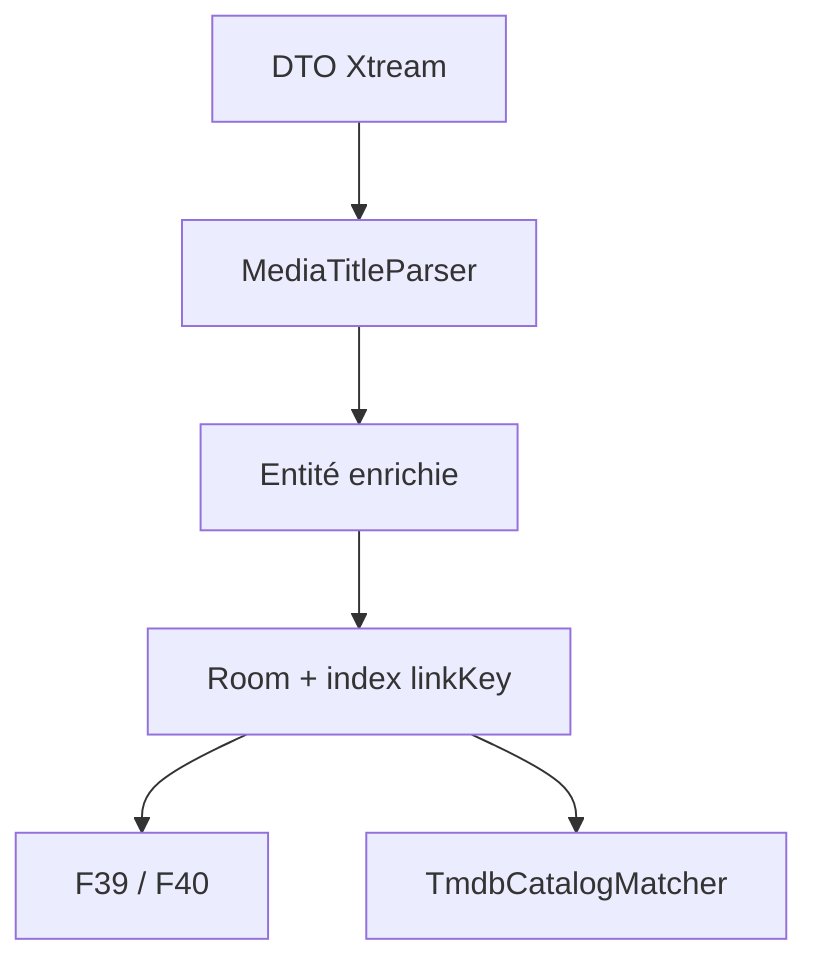

# T21 - Normalisation des titres, extraction des attributs et clé de liaison entre médias

## Informations générales

Status:
ARCHITECTURE

Created:
2026-08-15

Dépendances:
Aucune. Fondation de F39, F40 et de l'appariement TMDB (T22).

---

# 1. Description

Les libellés renvoyés par le panel Xtream mélangent le titre de l'œuvre et des
attributs techniques : langue et version (`VF`, `VOSTFR`, `MULTI`, `TRUEFRENCH`),
qualité (`4K`, `1080p`, `HD`, `SD`), codec, marqueurs divers entre crochets ou
barres verticales. La même œuvre y apparaît plusieurs fois sous des libellés
différents, sans qu'aucun lien ne soit matérialisé entre ces entrées.

Cette tâche fait de la décomposition de ces libellés une opération de première
classe, réalisée une seule fois pendant la synchronisation du catalogue et
persistée en base :

- un **titre nettoyé**, dépourvu de tout attribut technique ;
- les **attributs extraits** (langue/version, qualité) conservés à part ;
- une **clé de liaison** qui regroupe les entrées désignant la même œuvre ou la
  même chaîne.

La tâche ne produit **aucun changement visible** dans l'interface : elle ne
fabrique que la donnée. Son exploitation appartient à F39 (étiquettes et
sélecteur de versions VOD/séries) et F40 (qualité des chaînes).

---

# 2. Contexte

Trois besoins convergent vers la même donnée manquante.

1. **Appariement TMDB.** `TitleNormalizer` (`domain/model/TitleNormalizer.kt`)
   nettoie déjà les titres à la volée, mais avec une liste de tags courte, sans
   conserver ce qu'il retire, et en recalculant à chaque appel. `TmdbCatalogMatcher`
   et `ApproximateTitleMatcher` travaillent donc sur une base à la fois imprécise
   et coûteuse : un titre nettoyé stocké et indexé rendrait l'appariement plus
   rapide et plus juste.
2. **Versions d'un même média.** Aucun lien n'existe aujourd'hui entre
   « Film X VF 1080p » et « Film X MULTI 4K ». Sans clé de liaison, un sélecteur
   de version est impossible.
3. **Variantes d'une même chaîne.** Même problème pour « TF1 FHD » / « TF1 HD » /
   « TF1 SD », qui doivent être présentées comme des qualités d'une seule chaîne.

Faire ce calcul à l'affichage a été écarté : le catalogue dépasse plusieurs
dizaines de milliers de lignes, et l'écran « Tout » a déjà fait l'objet d'une
optimisation dédiée (T9, index couvrants sur `vod_streams` et `live_streams`).
Recalculer en permanence annulerait ce travail et interdirait toute requête SQL
par clé de liaison.

---

# 3. Objectif

- Chaque film, série et chaîne du cache Room porte un titre nettoyé, ses
  attributs extraits et une clé de liaison, calculés à la synchronisation.
- Deux entrées désignant la même œuvre ou la même chaîne partagent la même clé
  de liaison ; deux œuvres distinctes ne la partagent pas.
- L'appariement TMDB s'appuie sur le titre nettoyé stocké, sans recalcul.
- Le catalogue déjà en cache est mis à niveau sans resynchronisation réseau ni
  perte des données hors ligne.
- Aucun changement de comportement observable pour l'utilisateur.

---

# 4. Décisions produit prises à l'étape 1

| Sujet | Décision |
|---|---|
| Emplacement du calcul | Dans l'application, pendant la synchronisation du catalogue ; résultat persisté en base. Ni à la volée à l'affichage, ni côté backend (le catalogue IPTV ne quitte jamais l'appareil). |
| Portée V1 | Données uniquement. Aucune étiquette, aucun filtre, aucun regroupement de vignettes dans cette tâche. |
| Clé de liaison films/séries | Titre nettoyé seul ; deux entrées sont **séparées** si leurs années de sortie sont toutes deux connues et différentes. L'année absente n'empêche pas le regroupement. |
| Clé de liaison chaînes | Retrait des seuls marqueurs de qualité connus (`HD`, `FHD`, `UHD`, `4K`, `SD`, `1080p`…). « TF1 Séries Films » reste distincte de « TF1 ». Pas de regroupement agressif (préfixes pays, numéros, suffixes libres). |
| Reprise de l'existant | Recalcul en base pendant la migration Room, au premier lancement après mise à jour. Pas de colonnes vides en attente de synchronisation, pas de resynchronisation complète forcée. |
| Plateformes | Sans objet (aucune surface UI). |
| Ordre de livraison | Premier ticket du lot, avant F39 et F40. |

## Décisions produit prises à l'étape 2

| Sujet | Décision |
|---|---|
| Attribut brut | Le fragment brut d'origine de chaque attribut détecté est conservé en plus de sa valeur normalisée (coût de stockage négligeable, évite un retour au libellé source complet si un affichage futur veut un badge fidèle au marqueur d'origine). |
| Titre vide après nettoyage | Le libellé original complet est conservé comme titre nettoyé (comportement défensif, aucune perte de donnée ; l'entrée n'est simplement reliée à aucune autre par la clé de liaison). |

---

# 5. Hypothèses

- Les attributs utiles se déduisent du seul libellé : le panel n'expose aucun
  champ structuré de langue ou de qualité (à confirmer sur `get_live_streams`,
  `get_vod_streams`, `get_series`).
- Le vocabulaire des marqueurs est fini et énumérable pour ce panel ; une liste
  fermée, enrichie au fil des observations, suffit. Un modèle probabiliste n'est
  pas nécessaire.
- Le nombre de versions par œuvre reste faible (quelques unités), donc une
  requête par clé de liaison reste peu coûteuse.
- Le recalcul complet en migration reste dans une durée acceptable au démarrage
  sur box Android TV. À mesurer à l'étape 3 ; si ce n'est pas le cas, un
  traitement en tâche de fond avec indicateur de progression sera arbitré.
- Le catalogue conserve des libellés stables entre deux synchronisations : la
  clé de liaison d'une entrée ne change pas d'une synchro à l'autre.

---

# 6. Questions ouvertes

| Point traité à l'étape 3 | Décision |
|---|---|
| Indexation | Les clés de liaison sont indexées dès T21 sur les trois tables. F39 et F40 en dépendent immédiatement et une livraison intermédiaire sans lecteur de clé ne justifie pas une seconde migration. |
| Recalcul de l'existant | Migration Room en Kotlin, paginée par clé primaire et exécutée dans la transaction de migration ; SQLite ne dispose pas des expressions régulières nécessaires pour reproduire le parseur. |
| Composant de normalisation | Un nouveau `MediaTitleParser` retourne un résultat structuré. `TitleNormalizer` devient une façade compatible qui délègue au parseur, puis les appelants sont migrés progressivement. |
| Clé et année | `linkKey` encode uniquement le titre canonique. L'année reste une colonne séparée et le filtrage est appliqué par paire dans les DAO consommateurs : une année absente reste compatible, deux années connues différentes ne le sont pas. |
| Marqueurs contradictoires | Règle déterministe : la valeur de rang le plus élevé est retenue, avec son fragment brut (`2160p/4K > FHD/1080p > HD/720p > SD`). Les autres fragments sont retirés du titre mais non persistés en V1. |

Aucune question bloquante ne reste ouverte pour l'étape 4.

---

# 7. Spécification fonctionnelle

## 7.1 Résultat attendu

T21 ne modifie aucun écran : le résultat se constate uniquement en base et dans
le comportement interne de la synchronisation et de l'appariement TMDB. Le
« parcours utilisateur » de cette tâche est le pipeline de synchronisation du
catalogue lui-même, pas une interaction visible.

## 7.2 Pipeline de traitement

Le calcul a lieu à deux moments :

1. **Synchronisation courante** : pour chaque entrée reçue via
   `get_live_streams`, `get_vod_streams`, `get_series`, avant persistance en
   base Room.
2. **Reprise de l'existant** : pendant la migration Room qui suit la mise à
   jour de l'application, pour chaque entrée déjà en cache — sans appel
   réseau (décision étape 1).

Pour chaque libellé source, dans cet ordre :

1. Détection des marqueurs connus (langue/version, qualité — voir 7.3), quelle
   que soit leur position dans le libellé et leur casse, délimités par
   crochets, parenthèses, barres verticales, tirets ou simples espaces.
2. Retrait de ces marqueurs pour obtenir le titre nettoyé ; normalisation des
   espaces multiples et de la ponctuation résiduelle laissée par le retrait
   (crochets ou tirets orphelins, espaces en double).
3. Stockage du titre nettoyé, de la valeur normalisée de chaque attribut
   détecté, du fragment brut d'origine de chaque attribut (décision étape 2),
   et de la clé de liaison calculée.

## 7.3 Règles métier — extraction des attributs

- **Langue/version** (liste fermée, insensible à la casse) : `VF`, `VFQ`,
  `VFF`, `VOSTFR`, `VOST`, `VO`, `MULTI`, `TRUEFRENCH`, `SUBFRENCH`. Liste
  enrichie au fil des observations sur le catalogue réel (hypothèse étape 1).
- **Qualité** (liste fermée, insensible à la casse) : `4K`, `UHD`, `2160p`,
  `FHD`, `1080p`, `HD`, `720p`, `SD`.
- Chaque catégorie retient au plus une valeur par entrée. En cas de plusieurs
  marqueurs de la même catégorie dans un même libellé, le plus qualitatif
  prime par défaut (`4K` avant `HD`) — comportement exact à confirmer étape 3
  (voir Questions ouvertes).

## 7.4 Règles métier — clé de liaison films/séries

- Base : titre nettoyé normalisé pour la comparaison (minuscules, accents
  supprimés, espaces multiples réduits), afin de tolérer les variations de
  casse et d'accentuation entre panels.
- Séparation par année : deux entrées de même titre nettoyé partagent la clé
  de liaison sauf si elles ont toutes les deux une année connue et que ces
  années diffèrent. Une entrée sans année connue ne bloque jamais le
  regroupement avec une entrée qui en a une.
- Cette règle n'est pas nécessairement transitive (une entrée sans année peut
  être compatible avec deux entrées d'années différentes qui, elles, sont
  incompatibles entre elles) : accepté comme hypothèse, modèle de stockage
  exact renvoyé à l'étape 3 (voir Questions ouvertes).

## 7.5 Règles métier — clé de liaison chaînes

- Retrait des seuls marqueurs de qualité (`HD`, `FHD`, `UHD`, `4K`, `SD`,
  `1080p`…) du nom de la chaîne pour obtenir la clé ; aucun autre retrait
  (pas de préfixe pays, numérotation, suffixes libres) — décision étape 1
  explicite : « TF1 Séries Films » reste distinct de « TF1 ».
- Comparaison insensible à la casse et aux espaces superflus.

## 7.6 Cas limites

- **Titre vide après nettoyage** : le libellé original complet est conservé
  comme titre nettoyé (décision étape 2) ; la clé de liaison qui en découle
  peut ne rassembler que cette seule entrée, ce qui est le comportement
  attendu, pas une erreur.
- **Aucun attribut détecté** : titre nettoyé identique au libellé source,
  attributs vides, entrée fonctionnellement inchangée par rapport à
  aujourd'hui.
- **Doublons stricts** (même libellé exact présent deux fois dans le
  catalogue) : même titre nettoyé, même clé — comportement attendu, pas un
  cas particulier à gérer.
- **Marqueur faisant partie du titre légitime d'une œuvre** (ex. un titre
  contenant littéralement « HD » ou « 4K ») : risque accepté comme hypothèse
  étape 1 (liste fermée plutôt que modèle probabiliste) ; aucune correction
  algorithmique prévue en V1, à surveiller en usage réel.

## 7.7 Critères d'acceptation

- Pour un échantillon de libellés représentatif du catalogue réel (tests
  unitaires avec cas volontairement « sales », conformément à AGENTS.md
  § Stratégie de tests), le titre nettoyé ne contient plus aucun marqueur de
  la liste fermée.
- Deux entrées désignant la même œuvre sous des libellés différents (ex.
  « Film X VF 1080p » et « Film X MULTI 4K ») partagent la même clé de
  liaison.
- Deux œuvres distinctes de titres différents ne partagent jamais la même
  clé.
- Deux entrées de même titre nettoyé mais années connues différentes ne sont
  jamais proposées comme versions l'une de l'autre par les fonctionnalités
  consommatrices (F39, F40).
- Le catalogue déjà en cache est recalculé pendant la migration Room sans
  appel réseau ni perte des favoris, de l'historique, des positions de
  lecture ou des téléchargements existants.
- L'appariement TMDB (`TmdbCatalogMatcher`, `ApproximateTitleMatcher`)
  consomme le titre nettoyé stocké sans le recalculer à chaque appel.

## 7.8 Gestion des erreurs

- Libellé source `null` ou vide : traité comme les autres champs manquants du
  parsing Xtream (AGENTS.md § Conventions de code) — titre nettoyé vide, pas
  de crash.
- Échec du calcul sur une entrée pendant la migration : n'interrompt pas la
  migration des autres entrées ; l'entrée en échec se comporte comme le cas
  « titre vide » (libellé source conservé tel quel, clé de liaison qui lui
  est propre).

---

# 8. Spécification technique

## 8.1 Choix structurants

La normalisation devient un service de domaine pur, sans dépendance Android :

- `MediaTitleParser.parse(rawTitle, mediaKind, releaseYear)` produit un
  `ParsedMediaTitle` immuable ;
- `TitleNormalizer.normalize()` est conservé comme façade de compatibilité et
  délègue au nouveau parseur ;
- le résultat est calculé aux frontières d'entrée du catalogue, puis stocké ;
  aucun composable et aucun matcher ne reparsent le libellé brut ;
- la liste des marqueurs et leur rang sont centralisés dans le parseur, pas
  dupliqués dans les repositories ou les écrans.

Types proposés :

```kotlin
data class ParsedMediaTitle(
    val cleanTitle: String,
    val linkKey: String,
    val language: MediaLanguage?,
    val languageRaw: String?,
    val quality: MediaQuality?,
    val qualityRaw: String?
)

enum class MediaQuality(val rank: Int) {
    SD(10), HD(20), FHD(30), UHD_4K(40)
}
```

Les valeurs Room sont des codes stables en minuscules (`vf`, `vostfr`,
`multi`, `sd`, `hd`, `fhd`, `uhd_4k`) et non les noms Kotlin des enums, afin
de permettre un renommage de code sans migration de données.

## 8.2 Modèle Room

Les colonnes suivantes sont ajoutées à `vod_streams`, `series_streams` et
`live_streams` :

| Colonne | Type | Règle |
|---|---|---|
| `cleanTitle` | `TEXT NOT NULL DEFAULT ''` | Titre d'affichage nettoyé ; repli sur le libellé source si le nettoyage produit moins de deux caractères. |
| `linkKey` | `TEXT NOT NULL DEFAULT ''` | Clé canonique, non réversible, dérivée de `cleanTitle`. |
| `languageTag` | `TEXT NULL` | Valeur normalisée de langue/version. |
| `languageRaw` | `TEXT NULL` | Fragment exact extrait du libellé. |
| `qualityTag` | `TEXT NULL` | Valeur normalisée de qualité. |
| `qualityRaw` | `TEXT NULL` | Fragment exact extrait du libellé. |

Un index simple `Index(value = ["linkKey"])` est créé sur chacune des trois
tables. L'année n'est pas incluse dans l'index : les groupes sont petits et la
règle de compatibilité avec une année absente ne se traduit pas par une clé
composite correcte. Les index couvrants T9 existants restent inchangés pour ne
pas multiplier leur taille ; seuls les champs `languageTag` et `qualityTag`
sont ajoutés aux projections de listes qui doivent afficher les badges de F39.

La clé est produite par : minuscules avec `Locale.ROOT`, décomposition Unicode
NFD, suppression des diacritiques, ponctuation ramenée à un espace, espaces
réduits, puis SHA-256 tronqué à 128 bits encodé en hexadécimal. Le titre
canonique n'est donc pas dupliqué dans chaque index. Une clé de singleton
défensive utilise le préfixe `invalid:` suivi du type et de l'identifiant
fournisseur lorsque le titre est vide ou invalide.

## 8.3 Règle de compatibilité des années

`linkKey` reste transitive et indépendante de l'année. Les requêtes de versions
chargent les quelques lignes partageant la clé, puis appliquent :

```kotlin
fun yearsAreCompatible(left: Int?, right: Int?): Boolean =
    left == null || left <= 0 || right == null || right <= 0 || left == right
```

Le filtre est toujours évalué contre le média courant, jamais entre tous les
éléments du groupe. Ainsi, deux œuvres datées différemment ne se présentent pas
l'une comme version directe de l'autre, tandis qu'une entrée non datée peut
rejoindre une entrée datée conformément à la décision produit. Cette limite
non transitive est couverte par des tests explicites et ne doit pas être
transformée en regroupement global en mémoire.

## 8.4 Écriture pendant les synchronisations

Les mappers de `LiveTvRepositoryImpl`, `VodRepositoryImpl` et
`SeriesRepositoryImpl` appellent le parseur avant de construire les entités.
Les méthodes `insertStreamsWithFts` continuent de réaliser une seule écriture
transactionnelle ; la normalisation est effectuée hors transaction sur
`Dispatchers.Default`, puis les entités prêtes sont insérées par lots.

Les enrichissements ultérieurs (`get_vod_info`, `get_series_info`) ne recalculent
pas le titre lorsqu'ils ajoutent `releaseYear`. La clé ne change pas ; seule la
compatibilité par année est évaluée à la lecture. Cela évite de déplacer un
média entre groupes au milieu d'une session.

## 8.5 Migration Room 28 → 29

`MIGRATION_28_29` :

1. ajoute les six colonnes avec leurs valeurs par défaut ;
2. crée les trois index `linkKey` ;
3. parcourt chaque table par pages de 500 lignes, ordonnées par clé primaire ;
4. calcule `ParsedMediaTitle` en Kotlin et met à jour chaque page avec un
   `SupportSQLiteStatement` préparé réutilisable ;
5. laisse la transaction Room englober l'ensemble de la migration : aucune base
   partiellement normalisée ne devient visible.

Le parcours par clé (`WHERE streamId > ? ORDER BY streamId LIMIT 500`, ou
`seriesId`) évite `OFFSET` et les gros `CursorWindow`. Aucune erreur d'une ligne
ne doit annuler le reste du lot : le repli défensif produit le titre source et
une clé singleton. La migration ne fait aucun appel réseau et ne touche ni aux
favoris, ni aux positions, ni aux téléchargements.

Budget de performance : le parseur ne compile aucune regex par ligne, toutes les
expressions sont précompilées. Cible indicative sur un catalogue de 100 000
entrées : moins de 10 secondes sur un appareil bas de gamme ; au-delà de
30 secondes sur le benchmark JVM/SQLite de référence, l'implémentation doit être
optimisée avant livraison, sans basculer vers une migration asynchrone qui
laisserait les colonnes incohérentes.

## 8.6 Appariement TMDB

`TmdbCatalogMatcher.CatalogCandidate` reçoit `normalizedTitle` depuis les
modèles persistés. `prepareMovies` et `prepareSeries` ne doivent plus appeler
`TitleNormalizer` pour les données Room. Une surcharge interne conservée pour
les tests ou les objets externes peut encore parser une valeur brute, mais elle
n'est jamais utilisée par le chemin catalogue de production.

`ApproximateTitleMatcher` reste inchangé. L'année continue d'être fournie par
`releaseYear` avec le repli historique `yearFromTitle` uniquement lorsque la
colonne n'a pas encore été enrichie ; ce repli n'affecte pas `linkKey`.

## 8.7 Compatibilité, sécurité et observabilité

- aucune donnée IPTV n'est envoyée au backend ; le traitement reste local ;
- aucune nouvelle dépendance Gradle ;
- les codes d'attribut inconnus sont ignorés, jamais désérialisés par `enumValueOf` ;
- un compteur debug agrégé (`parsed`, `fallback`, `multipleMarkers`) peut être
  journalisé sans inclure les titres ni les URLs ;
- la migration est couverte par un test SQLite réel et la création fraîche par
  un test de schéma Room/SQL selon le patron existant.

## 8.8 Fichiers impactés ou nouveaux

**Nouveaux**

- `domain/model/MediaTitleParser.kt`
- `domain/model/ParsedMediaTitle.kt`
- `domain/model/MediaLanguage.kt`
- `domain/model/MediaQuality.kt`
- tests unitaires associés et `Migration28To29SqlTest.kt`

**Modifiés**

- `domain/model/TitleNormalizer.kt`
- `domain/model/TmdbCatalogMatcher.kt`
- `domain/model/LiveStream.kt`, `VodStream.kt`, `SeriesStream.kt`
- `data/local/entity/LiveStreamEntity.kt`, `VodStreamEntity.kt`,
  `SeriesStreamEntity.kt`
- `data/local/dao/LiveTvDao.kt`, `VodDao.kt`, `SeriesDao.kt`,
  `CatalogListRow.kt`
- `data/local/db/AppDatabase.kt`, `Migrations.kt`
- `data/repository/LiveTvRepositoryImpl.kt`, `VodRepositoryImpl.kt`,
  `SeriesRepositoryImpl.kt`
- les tests de mapping, DAO et synchronisation existants concernés.

---

# 9. Architecture

## 9.1 Flux de données



## 9.2 Responsabilités

- **`MediaTitleParser`** : lexique, extraction, nettoyage, choix du marqueur
  dominant et génération de la clé ; fonction pure et déterministe.
- **Repositories catalogue** : orchestrent le calcul une fois, avant
  persistance, sans contenir de règle de parsing.
- **Room/DAO** : stockent et retrouvent les groupes par `linkKey`, puis exposent
  l'année nécessaire à la compatibilité par paire.
- **Consommateurs** : F39 et F40 choisissent les versions ; le matcher TMDB
  consomme le titre déjà normalisé. Aucun consommateur ne reconstruit la clé.
- **Migration** : applique exactement le même parseur que la synchronisation,
  garantissant l'identité du résultat entre anciennes et nouvelles lignes.

## 9.3 Dépendances et risques

- dépendance fonctionnelle sortante vers F39, F40 et T22 ; aucune dépendance
  logicielle nouvelle ;
- risque principal : faux positif lorsqu'un marqueur appartient réellement au
  titre. La délimitation stricte par token et les fixtures issues du catalogue
  réel sont la protection V1 ;
- risque de démarrage long pendant la migration, maîtrisé par pagination,
  statements préparés et benchmark obligatoire ;
- la non-transitivité de l'année est volontaire : toute tentative future de
  matérialiser un groupe unique devra faire l'objet d'une nouvelle décision
  produit.

---

# 10. Plan de développement

_À compléter — étape 4._

---

# 11. Notes de développement

---

# 12. Review

## Critique

## Majeur

## Mineur

## Corrections demandées

---

# 13. Release

Version :

Commit :

Date :
