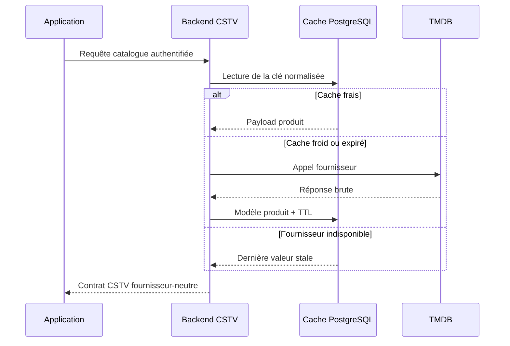

# T22 - Centralisation des appels TMDB dans le backend

## Informations générales

Status:
TASK BREAKDOWN

Created:
2026-08-15

Dépendances:
Aucune. Bloquant pour F44 (restriction par âge).

---

# 1. Description

L'application interroge TMDB directement (`data/remote/api/TmdbApiService.kt`,
clé lue depuis `local.properties`). Cette tâche déplace **l'intégralité** de ces
appels derrière le backend CSTV (`backend/`, déjà déployé sur alwaysdata) :

- l'application n'appelle plus que le backend, avec son authentification
  existante ;
- le backend interroge TMDB, met en cache les réponses et sert tous les
  utilisateurs depuis ce cache ;
- la clé TMDB disparaît de l'application et de ses artefacts de build ;
- le contrat exposé à l'application est **indépendant du fournisseur** : changer
  TMDB pour une autre source ne nécessite plus de mise à jour de l'application.

---

# 2. Contexte

Trois limites de la situation actuelle :

1. **Volume d'appels.** Chaque installation interroge TMDB pour son propre
   compte : tendances, fiches, notes, bandes-annonces, appariement du catalogue.
   Les mêmes données sont retéléchargées par chaque appareil, et les quotas TMDB
   sont consommés sans mutualisation.
2. **Fournisseur figé dans l'application.** Le format TMDB est propagé jusqu'aux
   DTO. Changer de source imposerait une nouvelle version de l'application, avec
   le délai d'adoption que cela suppose.
3. **Clé embarquée.** La clé vit dans l'APK. Sa rotation impose une livraison.

Le backend existe déjà, avec authentification, quotas et durcissement HTTP
(T14, T16, T17, T18) : il fournit le socle nécessaire.

---

# 3. Objectif

- Aucun appel réseau de l'application vers TMDB, ni aucune clé TMDB dans l'APK.
- Le nombre d'appels sortants vers TMDB devient indépendant du nombre
  d'utilisateurs pour les données partagées.
- Le contrat backend est exprimé dans le vocabulaire du produit, pas dans celui
  de TMDB.
- Une indisponibilité du backend ne dégrade que les enrichissements, jamais la
  navigation ni la lecture.
- Aucun changement visible pour l'utilisateur en fonctionnement nominal.

---

# 4. Décisions produit prises à l'étape 1

| Sujet | Décision |
|---|---|
| Périmètre | **Tous** les appels TMDB existants, migrés d'un bloc : tendances, fiches, notes, bandes-annonces, appariement. Pas de migration progressive, pas de double chemin durable. |
| Backend injoignable | Dégradation silencieuse : cache local, puis absence d'enrichissement. Pas de repli sur un appel TMDB direct (qui imposerait de conserver la clé), pas de message d'erreur. |
| Cache serveur | Cache partagé entre tous les utilisateurs, avec des durées de validité différenciées selon le type de donnée (tendances : heures ; fiches et classifications : semaines). |
| Contrat d'API | Exprimé dans le vocabulaire du produit, sans exposer la forme des réponses TMDB. |
| Plateformes | Sans objet côté UI ; s'applique à mobile et TV par construction. |

## Décisions produit prises à l'étape 2

| Sujet | Décision |
|---|---|
| Images (affiches, jaquettes) | Chargées directement par l'application depuis le CDN d'images du fournisseur, sans passer par le backend. Le backend construit et renvoie l'URL complète (pas un chemin brut), donc l'app ne connaît pas le fournisseur — le contrat reste indépendant du fournisseur malgré ce contournement du proxy. Aucune clé n'est nécessaire pour charger une image (URLs publiques) : l'objectif « zéro clé dans l'APK » reste respecté. |
| Cache local applicatif | Conservé, en plus du cache serveur, mais à courte durée (quelques heures — détail exact à l'étape 3). Objectif : éviter de resolliciter le backend à chaque navigation dans une même session et améliorer la résilience aux coupures réseau courtes, sans dupliquer la logique fine de fraîcheur du cache serveur qui reste la source de vérité. |

---

# 5. Hypothèses

- L'hébergement alwaysdata supporte le volume d'appels et le stockage de cache
  nécessaires, sans dépasser les quotas du plan actuel.
- Les conditions d'utilisation de TMDB autorisent un relais serveur mutualisé
  avec cache. **À vérifier explicitement avant l'étape 3.**
- Le cache peut être partagé sans donnée personnelle : les requêtes portent sur
  des titres et des identifiants d'œuvres, pas sur des profils.
- Les données d'appariement (recherche par titre et année) sont assez répétitives
  entre utilisateurs pour que le cache soit efficace.
- L'authentification backend existante suffit ; aucun nouveau mécanisme d'accès
  n'est requis.
- La liste exhaustive des appels TMDB actuels est identifiable dans le dépôt
  (`TmdbApiService`, `TmdbCatalogMatcher`, écrans Accueil, fiches, bandes-annonces).

---

# 6. Questions ouvertes

| Point traité à l'étape 3 | Décision |
|---|---|
| TTL serveur | Tendances et populaires : 6 h ; recherche/appariement : 7 j ; bandes-annonces : 7 j ; fiches et classifications : 30 j ; absence de résultat : 24 h. Une copie périmée peut être servie 7 jours de plus si TMDB est indisponible. |
| Appariement | La normalisation et la sélection dans le catalogue IPTV restent locales (T21). Le backend résout uniquement la requête produit `type + titre + année` vers une identité média canonique et ses métadonnées. Aucun catalogue IPTV n'est envoyé au serveur. |
| Secret TMDB | Clé exclusivement dans `TMDB_API_TOKEN` du backend et dans `~/.cstv-production.env`. Suppression du champ `BuildConfig.TMDB_API_KEY`, du provider Hilt et de toute lecture de `local.properties` côté app. |
| Contrat et R8 | API versionnée sous `/v1/catalog`; nouvelle interface Retrofit `CstvCatalogApiService` avec règle `-keep` explicite. Les DTO n'exposent aucun nom de champ TMDB. |
| Cache local | TTL fixe de 4 h, indépendant du TTL serveur. Il amortit une session et sert le mode dégradé sans dupliquer les règles de fraîcheur du fournisseur. |
| Absence d'enrichissement | Réponse HTTP 200 avec `status = matched|not_found` et `item` nullable. Les pannes du fournisseur sont des 502/503 côté backend, ou une réponse cache périmée marquée `stale`; elles ne sont jamais confondues avec `not_found`. |

Aucune question technique bloquante ne reste ouverte. La mise en production
reste conditionnée au respect de la licence TMDB applicable au projet et à
l'attribution officielle dans l'écran À propos.

---

## Arbitrages structurants ratifiés à l'étape 3

| Sujet | Décision |
|---|---|
| Nouvelle dépendance backend | `ext-curl` ajouté à `backend/composer.json` — validé. **À vérifier avant la livraison** : que l'extension est bien activée sur l'hébergement alwaysdata, faute de quoi le déploiement échouera après coup. `composer.lock` doit être régénéré selon la procédure ciblée d'AGENTS.md, jamais par un `composer update` général. |
| Nouvelle surface d'API | 4 routes `/v1/catalog` (tendances, populaires, appariement, vidéos) derrière le middleware JWT existant — validé. |
| Cache serveur | Table PostgreSQL `media_metadata_cache` partagée entre tous les utilisateurs, sans donnée personnelle — validé. |

---

# 7. Spécification fonctionnelle

## 7.1 Résultat attendu

En fonctionnement nominal, aucun changement perceptible pour l'utilisateur :
mêmes écrans, mêmes données affichées. Ce qui change est invisible — la
source des données (backend CSTV au lieu de TMDB direct) — et se vérifie par
l'absence de tout appel réseau de l'app vers un domaine TMDB et l'absence de
clé TMDB dans l'APK.

## 7.2 Parcours utilisateur (nominal)

- **Accueil (tendances, F1)** : la section tendances demande sa liste
  d'œuvres au backend au lieu de TMDB directement. Aucun changement visible
  à l'écran.
- **Fiche film/série** : les enrichissements TMDB (note, bande-annonce)
  proviennent d'un appel backend paramétré avec le vocabulaire produit
  (titre, année, éventuellement identifiants du catalogue T21) plutôt que
  d'un appel direct à l'API TMDB.
- **Bande-annonce** : l'identifiant ou l'URL YouTube nécessaire à
  l'intégration du lecteur (périmètre validé AGENTS.md) provient de la
  réponse backend.
- **Appariement catalogue** (T21 → TMDB, utilisé pour F44 notamment) : la
  recherche par titre/année passe par un point d'entrée backend dédié, qui
  interroge TMDB et sert depuis son cache partagé.

## 7.3 Règles métier

- Migration en un seul bloc de tous les appels existants (décision étape 1) :
  après livraison, aucun code applicatif n'appelle plus directement l'API
  TMDB — seul le backend le fait.
- Le contrat backend expose des champs produit (ex. note, synopsis, URL de
  bande-annonce, URL d'affiche) plutôt que la structure brute des réponses
  TMDB, pour rester indépendant du fournisseur.
- Cache serveur partagé entre tous les utilisateurs, avec des durées
  différenciées par type de donnée (tendances : heures ; fiches et
  classifications : semaines — valeurs précises à l'étape 3).
- Cache local applicatif court terme en complément (décision étape 2),
  purgé automatiquement par expiration, jamais présenté comme à jour
  au-delà de sa durée de vie.

## 7.4 Cas limites

- **Backend injoignable ou en erreur** : dégradation silencieuse (décision
  étape 1) — l'écran s'affiche sans les enrichissements concernés, sans
  bandeau d'erreur, sans jamais bloquer la navigation ni la lecture. Si le
  cache local contient encore une réponse valide, elle est utilisée en
  attendant.
- **Backend joignable mais TMDB indisponible côté serveur** : le backend
  applique lui-même la dégradation silencieuse en interne (répond sans
  l'enrichissement plutôt que de propager une erreur à l'app) — contrat de
  réponse exact renvoyé à l'étape 3.
- **Œuvre absente de TMDB** (pas de correspondance trouvée) : réponse
  backend distincte d'une erreur technique. L'app affiche la fiche sans
  enrichissement, sans retenter en boucle.
- **Cache serveur froid** pour une donnée jamais demandée : la latence de
  l'appel TMDB initial est assumée par le premier appelant ; les suivants
  bénéficient du cache. Aucun préchauffage explicite prévu en V1.

## 7.5 Critères d'acceptation

- Aucun artefact de build (APK) ne contient de clé TMDB ni n'émet de requête
  réseau vers un domaine TMDB.
- Les écrans Accueil (tendances), fiche film/série et bande-annonce
  fonctionnent à l'identique en usage nominal, sans changement perceptible.
- Une indisponibilité du backend n'empêche jamais l'affichage d'une fiche,
  la navigation ni la lecture — seuls les enrichissements TMDB sont absents.
- L'appariement catalogue (T21) obtient ses correspondances via le backend,
  sans régression du taux de correspondance par rapport au comportement
  actuel (appel TMDB direct).

## 7.6 Gestion des erreurs

- Timeout ou erreur réseau vers le backend : traité comme une
  indisponibilité (dégradation silencieuse), jamais de message d'erreur
  technique affiché à l'utilisateur (cohérent avec AGENTS.md § Gestion des
  erreurs, même si ce flux reste secondaire par rapport à l'authentification
  ou à la lecture).
- Réponse backend malformée : traitée comme un enrichissement absent,
  journalisée côté application pour diagnostic (log, jamais affichée à
  l'utilisateur).

---

# 8. Spécification technique

## 8.1 Frontière de fournisseur

Le backend introduit un port fournisseur :

```php
interface MediaMetadataProvider
{
    public function trending(string $locale): array;
    public function popular(string $kind, int $page, string $locale): array;
    public function match(string $kind, string $title, ?int $year, string $locale): ?array;
    public function videos(string $canonicalId, string $locale): array;
}
```

`TmdbMediaMetadataProvider` est le seul composant qui connaît les routes, les
identifiants et les champs TMDB. Les actions HTTP, le cache et l'application ne
manipulent que des modèles produit (`CatalogItem`, `MediaMatch`,
`TrailerCandidate`, `AgeRating`). Le `canonicalId` retourné à l'app est une
chaîne opaque versionnée ; l'app la persiste ou la retransmet sans l'interpréter.

Le client HTTP serveur repose sur `ext-curl`, ajouté explicitement à
`backend/composer.json` et à l'image/validation d'environnement. Aucun SDK TMDB
tiers n'est ajouté. Connexion 3 s, timeout total 8 s, TLS obligatoire, deux
tentatives maximum uniquement sur erreurs réseau/429/5xx avec backoff et jitter.
La clé est envoyée en en-tête `Authorization: Bearer`, jamais dans les URLs ni
les logs.

## 8.2 Contrat HTTP CSTV

Toutes les routes sont protégées par le middleware JWT existant :

| Route | Usage |
|---|---|
| `GET /v1/catalog/trending?locale=fr-FR` | Tendances hebdomadaires. |
| `GET /v1/catalog/popular?kind=movie|series&page=1&locale=fr-FR` | Populaires paginés. |
| `POST /v1/catalog/matches` | Résolution d'une œuvre par `kind`, `title`, `year`, `locale`. |
| `GET /v1/catalog/items/{canonicalId}/videos?locale=fr-FR` | Bande-annonce et vidéos candidates. |

`POST /matches` évite les titres dans la query string et donc dans les access
logs. Le backend normalise la clé de cache mais ne conserve pas de catalogue
IPTV ni de relation utilisateur ↔ média.

Réponse d'appariement :

```json
{
  "status": "matched",
  "item": {
    "id": "opaque-id",
    "kind": "movie",
    "title": "Titre",
    "originalTitle": "Original title",
    "releaseYear": 2024,
    "overview": "…",
    "rating": 7.4,
    "posterUrl": "https://…",
    "backdropUrl": "https://…",
    "ageRatingFr": 12
  },
  "cache": {"stale": false}
}
```

`ageRatingFr` vaut `0`, `10`, `12`, `16`, `18` ou `null`. Les URLs d'images
sont complètes, HTTPS et issues de la configuration fournisseur côté backend ;
le contrat ne renvoie jamais `poster_path` ou une base URL TMDB.

Les erreurs du fournisseur ne sont pas converties en `not_found` : si aucune
copie périmée n'est disponible, le backend répond avec l'erreur CSTV
`CATALOG_PROVIDER_UNAVAILABLE` (503) ou `CATALOG_PROVIDER_BAD_RESPONSE` (502).
L'application mappe ces réponses vers l'absence silencieuse d'enrichissement.

## 8.3 Cache serveur partagé

Migration PostgreSQL `006_media_metadata_cache.sql` — `backend/migrations/`
s'arrête à `005_playback_locks.sql` à la rédaction de cette fiche, mais F44
ajoute lui aussi une migration backend : **le numéro se prend au moment de la
livraison**, pas ici (voir T21 §8.5 pour la même règle côté Room) :

```sql
CREATE TABLE media_metadata_cache (
    cache_key VARCHAR(255) PRIMARY KEY,
    payload JSONB NOT NULL,
    result_status VARCHAR(16) NOT NULL,
    expires_at TIMESTAMPTZ NOT NULL,
    stale_until TIMESTAMPTZ NOT NULL,
    updated_at TIMESTAMPTZ NOT NULL DEFAULT NOW()
);
CREATE INDEX media_metadata_cache_expiry_idx
    ON media_metadata_cache (expires_at);
```

La clé est un SHA-256 de `contractVersion|operation|locale|arguments
normalisés`. Le payload ne contient aucune donnée personnelle. Un verrou
advisory PostgreSQL par `cache_key` empêche le *cache stampede* : un seul appel
TMDB remplit une clé froide, les requêtes concurrentes relisent ensuite le
résultat. Le traitement suit `fresh → refresh → stale-if-error → erreur`.

TTL :

| Donnée | TTL frais | Cache négatif |
|---|---:|---:|
| Tendances / populaires | 6 h | n/a |
| Appariement titre + année | 7 j | 24 h |
| Vidéos / bande-annonce | 7 j | 24 h |
| Fiche / classification FR | 30 j | 24 h |

Toute valeur positive peut être servie jusqu'à 7 jours après expiration en cas
de panne fournisseur, avec `cache.stale = true`. Une tâche opportuniste purge
les lignes dont `stale_until` est dépassé ; aucun cron n'est requis en V1.

## 8.4 Cache et repositories Android

Une interface Retrofit dédiée `CstvCatalogApiService` utilise le Retrofit CSTV
existant (`@Named("cstv")`) et son authentification. Les DTO vivent dans
`data/remote/dto/CatalogDtos.kt` et sont immédiatement mappés vers des modèles
de domaine.

Les repositories `TrendingRepositoryImpl`, `PopularRepositoryImpl` et
`TrailerRepositoryImpl` ne dépendent plus de `TmdbApiService` ni d'une clé.
Leurs caches existants sont conservés, renommés pour retirer `tmdb` de leurs
clés, et utilisent un TTL positif fixe de 4 heures. Le cache négatif local des
bandes-annonces est ramené à 4 heures ; le backend porte désormais le cache
négatif long. Une réponse locale expirée n'est utilisée que pendant une erreur
réseau dans la limite de 24 heures, marquée en mémoire comme donnée de repli.

T21 reste responsable du titre canonique local et de l'appariement avec les
entrées IPTV. Le backend retourne l'identité et les métadonnées de l'œuvre ;
`TmdbCatalogMatcher` est renommé ultérieurement en `CatalogMatcher` ou reçoit
des types fournisseur-neutres, mais l'algorithme de correspondance au catalogue
reste dans l'application.

## 8.5 Secret, configuration et build

- `Config` ajoute `tmdbApiToken`, obligatoire en production, nullable en test
  pour permettre un faux provider ;
- `.env.example` ajoute `TMDB_API_TOKEN=` sans valeur ;
- `~/.cstv-production.env` reçoit la vraie valeur via le processus de
  déploiement, jamais via Git ;
- `app/build.gradle.kts` supprime la lecture `TMDB_API_KEY` et le
  `buildConfigField` correspondant ;
- `TmdbApiService.kt`, `@TmdbApiKey` et `provideTmdbApiService` sont supprimés ;
- `app/proguard-rules.pro` remplace la règle TMDB par une règle explicite pour
  `CstvCatalogApiService` ;
- l'API reste sous `/v1`; toute rupture future du schéma produit impose `/v2`
  ou une nouvelle représentation compatible, jamais l'exposition du JSON TMDB.

La documentation officielle TMDB impose l'attribution et distingue l'usage
commercial de l'usage développeur. L'écran À propos doit conserver le logo et
la mention officielle. La livraison commerciale nécessite la licence adaptée ;
le relais serveur et ses TTL ne valent pas autorisation juridique implicite.

## 8.6 Sécurité, quotas et observabilité

- validation stricte de `kind`, `locale`, `page`, longueur de titre (200) et
  plage d'année ;
- rate limit par compte/IP sur `/matches` afin d'éviter que le backend ne
  devienne un proxy arbitraire ;
- `canonicalId` est validé par le codec interne et ne devient jamais une URL ;
- logs structurés : opération, hit/miss/stale, durée, statut fournisseur,
  jamais le token ni le titre brut ;
- métriques minimales : taux de hit, appels sortants, 429/5xx, latence p95,
  taille et ancienneté du cache ;
- réponse `Cache-Control: private, max-age=300` au client : le cache applicatif
  reste maître et aucun proxy partagé ne mélange les réponses authentifiées.

## 8.7 Tests automatisés

Backend : tests unitaires du mapping fournisseur, TTL, clés de cache et
stale-if-error ; tests d'intégration PostgreSQL du verrou/cache ; tests
fonctionnels des quatre routes avec faux provider, authentification, validation,
`matched`, `not_found`, 502 et 503. Aucun test ne contacte TMDB.

Android : tests des DTO/mappers, des repositories cache frais/périmé/repli, de
l'absence d'appel direct, de la dégradation silencieuse et du matcher avec les
types neutres. Le build release vérifie que `TMDB_API_KEY` et
`api.themoviedb.org` ne sont plus présents dans les artefacts textuels générés.

## 8.8 Fichiers impactés ou nouveaux

**Backend nouveaux** : `Catalog/MediaMetadataProvider.php`,
`Catalog/TmdbMediaMetadataProvider.php`, `Catalog/TmdbClient.php`,
`Catalog/MediaMetadataCacheRepository.php`, `Catalog/CatalogService.php`,
`Http/Action/CatalogAction.php`, migration `006_media_metadata_cache.sql` et
tests associés.

**Backend modifiés** : `composer.json`, `composer.lock`, `Bootstrap.php`,
`Shared/Config.php`, `.env.example`, `openapi.yaml`, scripts/configuration de
déploiement.

**Android nouveaux** : `data/remote/api/CstvCatalogApiService.kt`,
`data/remote/dto/CatalogDtos.kt`, modèles et mappers produit neutres.

**Android modifiés/supprimés** : `AppModule.kt`, `build.gradle.kts`,
`proguard-rules.pro`, `TrendingRepositoryImpl.kt`, `PopularRepositoryImpl.kt`,
`TrailerRepositoryImpl.kt`, `TmdbCatalogMatcher.kt` et ses consommateurs ;
suppression de `TmdbApiService.kt` et des DTO exclusivement fournisseur qui ne
sont plus utilisés.

---

# 9. Architecture

## 9.1 Flux nominal et dégradé



## 9.2 Responsabilités

- **Application** : cache court, affichage, dégradation silencieuse et
  rapprochement avec le catalogue local T21 ; aucune connaissance de TMDB.
- **Actions/Service catalogue** : validation, contrat HTTP et orchestration
  cache/fournisseur ; aucune logique spécifique TMDB dans les contrôleurs.
- **Provider TMDB** : traduction unique du fournisseur vers le modèle produit.
- **Cache PostgreSQL** : mutualisation, verrou anti-stampede, cache négatif et
  stale-if-error.
- **Configuration** : secret et licence gérés au déploiement backend.

## 9.3 Risques et garde-fous

- quota/429 : cache partagé, verrou par clé, backoff borné et métriques ;
- croissance PostgreSQL : payloads compacts, TTL, purge opportuniste et index
  d'expiration ;
- changement TMDB : seul l'adapter fournisseur change ; contrat `/v1/catalog`
  et tests fonctionnels protègent l'app ;
- indisponibilité backend : caches locaux puis absence d'enrichissement, jamais
  blocage de navigation ou de lecture ;
- conformité : attribution obligatoire et validation de la licence avant
  production commerciale.

---

# 10. Plan de développement

Le backend se construit et se teste sans l'application (faux provider,
tests fonctionnels des routes). Les tâches 1 à 6 sont donc réalisables et
déployables sur un environnement de test avant qu'aucune tâche Android ne
commence. Les tâches 7 à 10 câblent l'application sur ce backend déjà en
place. La tâche 11 (suppression de l'ancien code) ne doit être faite qu'une
fois les tâches 7 à 10 vertes, pour ne jamais casser le build entre deux
commits.

- [ ] 1. Backend — dépendance `ext-curl` et vérification d'hébergement

Objectif:
Ajouter la dépendance validée à l'étape 3 et s'assurer qu'elle est utilisable
en production avant de construire quoi que ce soit dessus.

Fichiers:
- `backend/composer.json`, `backend/composer.lock` (procédure ciblée
  AGENTS.md — jamais `composer update` général)

Validation:
`composer validate --no-check-publish --strict` (procédure Docker décrite
dans AGENTS.md). Vérification manuelle, avant de poursuivre, que `ext-curl`
est disponible sur l'hébergement alwaysdata cible — sinon la suite du
ticket construit sur une hypothèse fausse.

---

- [ ] 2. Backend — migration PostgreSQL du cache partagé

Objectif:
Créer `media_metadata_cache` (§8.3), avec le numéro de migration réellement
disponible au moment de l'exécution (vérifier `backend/migrations/`, pas la
fiche — même règle que T21 §8.5).

Fichiers:
- `backend/migrations/0XX_media_metadata_cache.sql` (nouveau, numéro à
  vérifier)

Validation:
Migration appliquée sur l'environnement Docker de dev (`docker compose`,
patron des migrations existantes). Table et index d'expiration créés,
rollback si le projet en a la convention.

---

- [ ] 3. Backend — port fournisseur et client TMDB

Objectif:
Implémenter `MediaMetadataProvider` (interface), `TmdbMediaMetadataProvider`
et `TmdbClient` (§8.1) : seul composant qui connaît les routes et champs
TMDB, timeouts et retries sur erreurs réseau/429/5xx, clé en en-tête
`Authorization: Bearer` jamais journalisée.

Fichiers:
- `backend/src/Catalog/MediaMetadataProvider.php` (nouveau)
- `backend/src/Catalog/TmdbMediaMetadataProvider.php` (nouveau)
- `backend/src/Catalog/TmdbClient.php` (nouveau)
- tests unitaires du mapping fournisseur → modèle produit (nouveau)

Validation:
Tests unitaires avec faux transport HTTP (pas d'appel réseau réel vers TMDB,
conformément à AGENTS.md et §8.7) : mapping correct des 4 opérations,
gestion des 429/5xx avec backoff, jamais la clé dans un message d'erreur ou
un log.

---

- [ ] 4. Backend — cache partagé, verrou anti-stampede, stale-if-error

Objectif:
Implémenter `MediaMetadataCacheRepository` : lecture/écriture par
`cache_key` (SHA-256 normalisé), verrou advisory PostgreSQL par clé, cycle
`fresh → refresh → stale-if-error → erreur`, TTL différenciés (§8.3).

Fichiers:
- `backend/src/Catalog/MediaMetadataCacheRepository.php` (nouveau)
- tests d'intégration PostgreSQL du verrou/cache (nouveau)

Validation:
Tests d'intégration : deux lectures concurrentes sur une clé froide ne
déclenchent qu'un seul appel fournisseur ; une entrée expirée mais dans la
fenêtre `stale_until` est servie marquée `stale` sur panne fournisseur ; les
TTL du tableau §8.3 sont respectés.

---

- [ ] 5. Backend — routes HTTP, validation, quotas

Objectif:
Exposer les 4 routes `/v1/catalog/*` (§8.2) derrière le middleware JWT
existant, avec validation stricte des paramètres et rate limit sur
`/matches` (§8.6).

Fichiers:
- `backend/src/Catalog/CatalogService.php` (nouveau, orchestration)
- `backend/src/Http/Action/CatalogAction.php` (nouveau)
- `backend/openapi.yaml` (mis à jour)
- tests fonctionnels des 4 routes (nouveau) : faux provider, authentification,
  validation, `matched`, `not_found`, 502, 503

Validation:
Tests fonctionnels verts pour chaque route et chaque cas de la matrice
ci-dessus, aucun test ne contacte TMDB (§8.7). Réponse d'appariement conforme
au contrat JSON de §8.2, `ageRatingFr` dans l'ensemble `{0,10,12,16,18,null}`.

---

- [ ] 6. Backend — secrets, configuration, documentation de déploiement

Objectif:
Sortir la clé du code et documenter son emplacement de production, sans
jamais la faire transiter par Git (§8.5).

Fichiers:
- `backend/src/Shared/Config.php` (`tmdbApiToken`)
- `backend/.env.example` (`TMDB_API_TOKEN=`)
- documentation de déploiement (`~/.cstv-production.env`, hors dépôt)

Validation:
`grep` sur le dépôt confirmant l'absence de toute clé TMDB en clair. Le
backend démarre en échouant proprement si `TMDB_API_TOKEN` est absent en
production, et fonctionne en test avec un faux provider sans token.

---

- [ ] 7. Android — client HTTP et DTO du contrat CSTV

Objectif:
Poser l'interface Retrofit `CstvCatalogApiService` sur le Retrofit CSTV
existant, ses DTO et leurs mappers vers des modèles produit neutres — sans
encore les brancher aux repositories.

Fichiers:
- `data/remote/api/CstvCatalogApiService.kt` (nouveau)
- `data/remote/dto/CatalogDtos.kt` (nouveau)
- modèles et mappers produit neutres (nouveau)
- `app/proguard-rules.pro` (règle `-keep` pour la nouvelle interface —
  obligation AGENTS.md)

Validation:
Tests unitaires des mappers DTO → domaine sur des réponses « sales »
(champ manquant, `item` nul, `ageRatingFr` nul), conformément à AGENTS.md
§ Stratégie de tests. Compile en configuration release avec la règle R8.

---

- [ ] 8. Android — bascule des repositories tendances/populaires/bandes-annonces

Objectif:
`TrendingRepositoryImpl`, `PopularRepositoryImpl` et `TrailerRepositoryImpl`
consomment `CstvCatalogApiService` au lieu de `TmdbApiService`, avec le
cache local 4 h et le repli sur cache expiré en cas d'erreur réseau (§8.4).

Fichiers:
- `data/repository/TrendingRepositoryImpl.kt`, `PopularRepositoryImpl.kt`,
  `TrailerRepositoryImpl.kt`
- tests de repository existants, adaptés

Validation:
Tests avec client HTTP fake (AGENTS.md § Stratégie de tests) : cache frais
servi sans appel, cache expiré servi en repli sur erreur réseau dans la
limite de 24 h, dégradation silencieuse sans exception remontée à l'UI sur
échec total.

---

- [ ] 9. Android — appariement catalogue sur le contrat backend

Objectif:
`TmdbCatalogMatcher` (ou son successeur) résout les correspondances via
`POST /matches` au lieu d'un appel TMDB direct ; l'algorithme de
correspondance au catalogue local (T21) ne change pas.

Fichiers:
- `domain/model/TmdbCatalogMatcher.kt` et ses consommateurs

Validation:
Tests existants de correspondance toujours verts, sans changement du taux
de correspondance attendu (§7.5) — seule la source de données change.

---

- [ ] 10. Android — suppression du chemin TMDB direct

Objectif:
Retirer tout ce qui n'a plus de raison d'exister une fois les tâches 7 à 9
vertes : ancienne interface, clé, configuration de build.

Fichiers:
- suppression : `data/remote/api/TmdbApiService.kt`, `@TmdbApiKey`,
  `provideTmdbApiService` (`AppModule.kt`)
- `app/build.gradle.kts` (retrait de la lecture `TMDB_API_KEY` et du
  `buildConfigField`)
- suppression des DTO exclusivement fournisseur devenus inutilisés

Validation:
`./gradlew assembleRelease` : le build release échoue si un chemin de code
référence encore `TMDB_API_KEY`. Recherche dans les artefacts textuels
générés confirmant l'absence de `api.themoviedb.org` et de toute clé
(§8.7) — c'est le critère d'acceptation central du ticket (§7.5).

---

- [ ] 11. Non-régression et documentation de conformité

Objectif:
Vérifier l'ensemble du ticket avant review, et traiter le point de
conformité identifié à l'étape 3 (attribution TMDB, licence).

Fichiers:
- écran « À propos » (logo et mention TMDB, si non déjà présents)
- l'ensemble des fichiers listés en §8.8

Validation:
`./gradlew assembleDebug`, `./gradlew testDebugUnitTest`, `./gradlew
lintDebug` verts côté Android ; suite PHPUnit verte côté backend. Aucun
appel réseau de test ne contacte un domaine TMDB réel. Déploiement backend
via `scripts/deploy-backend.sh --dry-run` avant le déploiement réel
(AGENTS.md § Déploiement du backend).

---

# 11. Notes de développement

---

# 12. Review

## Critique

## Majeur

## Mineur

## Corrections demandées

---

# 13. Release

Version :

Commit :

Date :
