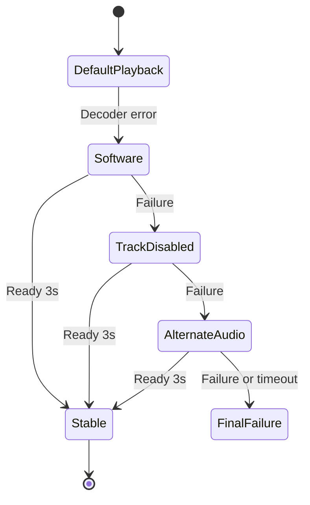

# T23 - Autoréparation du lecteur (essai de décodeurs et de pistes alternatifs)

## Informations générales

Status:
VALIDATED

Created:
2026-08-15

Dépendances:
Aucune. Complémentaire de F40 (repli de qualité côté chaînes) : T23 répare la
lecture d'un flux, F40 change de flux.

---

# 1. Description

Quand la lecture d'un média échoue, le lecteur tente automatiquement une
séquence de réparations avant d'abandonner :

1. bascule sur le **décodeur logiciel FFmpeg** (NextLib, déjà embarqué) ;
2. **désactivation de la piste fautive** identifiée par l'erreur ;
3. sélection d'une **autre piste audio** disponible.

La séquence est silencieuse : l'utilisateur ne voit qu'un temps de chargement.
La configuration qui a permis la lecture est **mémorisée pour ce média**, afin
que la lecture suivante démarre directement dans le bon état.

---

# 2. Contexte

Ce catalogue contient massivement des pistes AC3, EAC3 et DTS, dont le support
matériel varie fortement d'un appareil à l'autre — c'est la raison d'être de
NextLib dans le projet, et c'est ce qui a fait échouer Chromecast (F4, retiré
définitivement). Un même fichier peut être parfaitement lisible sur un téléphone
et muet ou en erreur sur une box TV.

Aujourd'hui, un échec de décodage se solde par un message d'erreur : l'utilisateur
conclut que le média est « mort », alors qu'un simple changement de décodeur ou
de piste audio suffirait souvent.

T23 est indépendant du flux : il ne change pas de source, il change la façon de
la lire. F40, à l'inverse, change de source sans toucher au décodage. Les deux
mécanismes doivent se coordonner pour ne pas se déclencher en même temps sur une
chaîne en direct.

---

# 3. Objectif

- Un média lisible au prix d'un réglage différent doit être lu, sans intervention.
- La réparation reste imperceptible : pas de jargon technique exposé.
- Une réparation réussie ne se rejoue pas à chaque lecture du même média.
- Un média réellement illisible échoue toujours, mais après un délai borné et
  avec un message clair.

---

# 4. Décisions produit prises à l'étape 1

| Sujet | Décision |
|---|---|
| Séquence de réparation | Décodeur logiciel FFmpeg → désactivation de la piste fautive → autre piste audio. Pas de cascade étendue (redémarrage de flux, changement de conteneur). |
| Visibilité | Silencieuse. L'utilisateur ne voit qu'un chargement, aucun indicateur « tentative de réparation ». |
| Mémorisation | La configuration gagnante est mémorisée pour ce média et réappliquée aux lectures suivantes. |
| Périmètre | Films, séries et chaînes en direct — tout média passant par le lecteur. |
| Plateformes | Mobile et Android TV dès la première livraison. |

## Décisions produit prises à l'étape 2

| Sujet | Décision |
|---|---|
| Message final (échec complet) | Message bref indiquant que le contenu est illisible sur cet appareil, avec un bouton « Réessayer » uniquement. Pas de renvoi vers un sélecteur de version/qualité (F39/F40) : T23 reste découplé de ces tickets, qui changent de flux plutôt que la façon de le lire. |
| Portée de la mémorisation | Par média seul, au niveau de l'appareil — pas par profil. La cause d'un échec de décodage est matérielle et propre au fichier, pas au profil qui regarde ; une seule configuration par (appareil, média), partagée entre tous les profils locaux. |
| Oubli manuel de la configuration | Aucun moyen manuel en V1. La mémoire se corrige d'elle-même si un nouvel échec net se déclenche. |
| Contenus téléchargés hors ligne | Couverts par le même mécanisme : le lecteur (Media3/NextLib) rejoue un fichier local avec les mêmes causes possibles d'échec de décodage qu'en streaming. |

---

# 5. Hypothèses

- Les erreurs remontées par Media3 sont assez précises pour distinguer un échec
  de décodage d'un échec réseau, et pour identifier la piste responsable. À
  défaut, la séquence se déroule à l'aveugle, ce qui reste acceptable.
- NextLib (`nextlib-media3ext`) couvre les codecs audio problématiques du
  catalogue ; il n'est pas nécessaire d'ajouter une dépendance.
- Une réinitialisation du lecteur avec une autre configuration coûte quelques
  secondes : la séquence complète reste sous un délai acceptable avant abandon.
- La configuration gagnante est stable dans le temps pour un média donné sur un
  appareil donné : elle dépend du fichier et du matériel, pas des conditions
  réseau.
- La mémorisation est propre à l'appareil et n'a pas à être synchronisée dans le
  cloud.

---

# 6. Questions ouvertes

| Point traité à l'étape 3 | Décision |
|---|---|
| Ordre avec F40 | Qualification commune de l'erreur : réseau/buffering va directement à F40 ; décodage déclenche T23 sur le flux courant. F40 ne change de variante qu'après épuisement de T23. Les deux machines ne tournent jamais en parallèle. |
| Persistance | Nouvelle table `playback_repair_profiles`, liée à `mediaUid` et non à `TrackPreferenceEntity`. La réparation dépend de l'appareil et du fichier ; la préférence de piste existante dépend du profil et de l'utilisateur. |
| Tests | Machine d'états et fabrique de stratégies derrière des interfaces pures, testées avec un faux moteur. Aucun test ne requiert codec Android, émulateur ou appareil. |
| Décodeur actuel | Le lecteur préfère déjà FFmpeg pour l'audio et autorise son repli pour la vidéo. L'étape « FFmpeg » signifie donc une reconstruction explicite avec stratégie logiciel-préféré pour le type de piste fautif, pas un simple rejeu de la configuration actuelle. |

Aucune question bloquante ne reste ouverte pour l'étape 4.

---

# 7. Spécification fonctionnelle

## 7.1 Résultat attendu

Un média qui échouait auparavant avec un message d'erreur se lit désormais
directement, au prix d'un délai de chargement légèrement plus long la
première fois. Les lectures suivantes du même média démarrent instantanément
dans la configuration qui a fonctionné.

## 7.2 Parcours utilisateur

1. L'utilisateur lance la lecture d'un film, d'un épisode ou d'une chaîne.
2. Si la lecture échoue pour une cause de décodage (piste ou codec), le
   lecteur relance automatiquement la lecture avec le premier ajustement de
   la séquence (7.3), sans indicateur visible autre qu'un temps de
   chargement.
3. Si cet essai échoue à son tour, le lecteur passe à l'ajustement suivant,
   jusqu'à épuisement de la séquence.
4. Dès qu'un essai réussit, la lecture se poursuit normalement et la
   configuration gagnante est mémorisée pour ce média sur cet appareil
   (décision étape 2).
5. Aux lectures suivantes du même média sur le même appareil, le lecteur
   démarre directement avec la configuration mémorisée, sans rejouer la
   séquence d'essais.
6. Si tous les essais échouent, un message bref indique que le contenu est
   illisible sur cet appareil, avec un unique bouton « Réessayer » qui
   relance la séquence complète depuis le début (décision étape 2).

## 7.3 Règles métier

- Séquence de réparation, dans cet ordre, chaque étape n'étant tentée que si
  la précédente échoue :
  1. Bascule sur le décodeur logiciel FFmpeg (NextLib).
  2. Désactivation de la piste identifiée comme fautive par l'erreur remontée.
  3. Sélection d'une autre piste audio disponible.
- Aucune étape supplémentaire (pas de redémarrage de flux, pas de changement
  de conteneur) — décision étape 1.
- La séquence est silencieuse : aucun libellé technique (nom de décodeur,
  numéro de piste) n'est exposé à l'utilisateur à aucune étape.
- La configuration gagnante remplace toute configuration mémorisée
  précédente pour ce média — une seule configuration active par (appareil,
  média).
- Périmètre : films, séries, chaînes en direct et contenus téléchargés hors
  ligne (décision étape 2) — tout média rejoué par le lecteur de
  l'application.

## 7.4 Cas limites

- **Échec dès le premier essai pour une cause non liée au décodage** (ex.
  réseau, flux introuvable) : la séquence de réparation ne se déclenche pas
  — elle est réservée aux échecs de décodage identifiés comme tels (voir
  hypothèse étape 1 sur la précision des erreurs Media3). Le comportement
  d'erreur réseau existant s'applique sans changement.
- **Erreur remontée par Media3 imprécise** (impossible d'identifier la piste
  fautive) : la séquence se déroule à l'aveugle dans le même ordre fixe,
  conformément à l'hypothèse étape 1.
- **Bouton « Réessayer » qui échoue à nouveau** : la séquence complète est
  rejouée depuis le début à chaque appui, sans limite de tentatives
  manuelles.
- **Changement de configuration matérielle ou logicielle de l'appareil**
  (mise à jour système, par exemple) rendant une configuration mémorisée
  obsolète : sans moyen d'oubli manuel (décision étape 2), la correction se
  fait au prochain échec net de cette configuration, qui relance la
  séquence complète.

## 7.5 Critères d'acceptation

- Un média qui n'était lisible qu'avec un décodeur logiciel, une piste
  désactivée ou une autre piste audio se lit désormais sans intervention de
  l'utilisateur.
- La deuxième lecture d'un média réparé démarre directement dans la
  configuration gagnante, sans reproduire les échecs intermédiaires.
- Un média réellement illisible échoue après un délai borné (durée exacte
  des trois essais cumulés à définir étape 3) et affiche le message final
  avec le bouton « Réessayer ».
- Aucune étape de la séquence n'affiche de jargon technique à l'utilisateur.
- La réparation se comporte identiquement en streaming et en lecture d'un
  contenu téléchargé hors ligne.

## 7.6 Gestion des erreurs

- Toute erreur de lecture est d'abord qualifiée (décodage vs réseau vs flux
  introuvable) avant de déclencher ou non la séquence — seule une erreur de
  décodage la déclenche (voir 7.4).
- L'épuisement de la séquence ne doit jamais laisser un écran noir sans
  message : le message final et le bouton « Réessayer » sont systématiques
  (cohérent avec AGENTS.md § Gestion des erreurs — jamais de stack trace
  brute, toujours un état explicite).

---

# 8. Spécification technique

## 8.1 Constat sur le lecteur actuel

`ExoPlayerCore.kt` construit aujourd'hui `NextRenderersFactory` avec FFmpeg
préféré pour l'audio, vidéo matérielle prioritaire et
`enableDecoderFallback = true`. T23 ne doit pas prétendre « activer FFmpeg » en
rejouant ce même builder. Il introduit des stratégies explicites :

```kotlin
enum class DecoderStrategy { DEFAULT, SOFTWARE_PREFERRED }

data class PlaybackRepairPlan(
    val decoderStrategy: DecoderStrategy,
    val disabledTrack: TrackFingerprint? = null,
    val preferredAudio: TrackFingerprint? = null
)
```

`SOFTWARE_PREFERRED` ne force que le type de renderer identifié en erreur. Pour
une erreur vidéo, la priorité logicielle n'est utilisée qu'après l'échec du
matériel, car B16 a déjà démontré qu'une vidéo FFmpeg préférée pouvait produire
une image corrompue. Pour une erreur audio, elle confirme explicitement le
renderer NextLib et ne change pas la politique vidéo.

## 8.2 Extraction d'un contrôleur partagé

Les trois lecteurs (`PlayerScreen`, `VodPlayerScreen`, `SeriesPlayerScreen`)
cessent de porter seuls la création et le rejeu de l'ExoPlayer. Un
`PlaybackEngineController` commun possède :

- la fabrique d'ExoPlayer paramétrée par `PlaybackRepairPlan` ;
- le `MediaItem`, la position à restaurer et l'état de lecture ;
- la qualification des `PlaybackException` ;
- les pistes disponibles et leurs empreintes stables ;
- le cycle stop/release/rebuild/prepare ;
- les callbacks UI neutres (`Loading`, `Playing`, `FinalFailure`).

La couche Compose observe cet état mais ne décide ni de l'étape suivante ni du
profil à persister. Le contrôleur conserve le même `MediaSource.Factory` réseau
ou cache hors ligne que le lecteur d'origine.

## 8.3 Qualification des erreurs

`PlaybackFailureClassifier` mappe les codes Media3 et, lorsqu'elle est
disponible, la `ExoPlaybackException` :

- `DECODER_INIT`, `DECODING_FAILED`, `AUDIO_TRACK_INIT_FAILED`, format non
  supporté et erreur renderer → `DECODER` ;
- timeout HTTP, code de réponse, DNS, source introuvable → `NETWORK_SOURCE` ;
- `BEHIND_LIVE_WINDOW` → récupération live existante, hors T23 ;
- défaut non qualifiable → `UNKNOWN`, sans déclenchement automatique pour éviter
  de masquer une panne réseau par trois reconstructions coûteuses.

Le classifieur retourne si possible le type de piste et un `TrackFingerprint`
composé de `trackType`, `language`, `mimeType`, `codecs`, `channelCount`,
`roleFlags` et `label`. Aucun index de `TrackGroup` n'est persisté : il peut
changer entre deux ouvertures.

## 8.4 Machine d'états de réparation

Séquence maximale pour une erreur de décodage :

1. `SOFTWARE_PREFERRED` ;
2. même stratégie avec la piste fautive désactivée par
   `TrackSelectionParameters` ;
3. piste fautive réactivée si nécessaire et sélection de la première piste
   audio différente, ordonnée par préférence de langue existante puis par
   support codec.

Chaque essai repart du même `MediaItem` et restaure :

- VOD/épisode/téléchargement : `min(positionAvantErreur, duration-2s)` ;
- direct : position par défaut/live edge, sauf si F41 fournit une position de
  tampon valide ;
- `playWhenReady` et vitesse de lecture existants.

Un essai est déclaré réussi après `STATE_READY` puis trois secondes sans
nouvelle erreur renderer (ou après le premier rendu vidéo et une sortie audio
observables si ces callbacks sont disponibles). Timeout : 8 secondes par
essai, 24 secondes maximum pour la séquence. Le timeout est annulé dès que la
coroutine de lecture est annulée ou que l'utilisateur ferme le lecteur.

Un profil mémorisé est essayé directement lors d'une nouvelle lecture. S'il
échoue, il est supprimé puis la séquence repart depuis la stratégie par défaut ;
une mise à jour système ou un changement de pistes se répare donc sans bouton
« oublier ».

## 8.5 Persistance locale

Nouvelle entité :

```kotlin
@Entity(
    tableName = "playback_repair_profiles",
    foreignKeys = [ForeignKey(
        entity = MediaRefEntity::class,
        parentColumns = ["mediaUid"],
        childColumns = ["mediaUid"],
        onDelete = ForeignKey.CASCADE
    )],
    indices = [Index("mediaUid", unique = true)]
)
data class PlaybackRepairProfileEntity(
    @PrimaryKey val mediaUid: Long,
    val decoderStrategy: String,
    val disabledTrackJson: String?,
    val preferredAudioJson: String?,
    val updatedAt: Long,
    val schemaVersion: Int = 1
)
```

`mediaUid` apporte déjà l'isolation `accountKey + kind + providerId` et évite
les collisions entre deux panels. La table n'a pas de `profileId` et n'est pas
ajoutée à la synchronisation cloud. Elle est créée dans la prochaine migration
Room disponible, avec son DAO et son repository. `MediaRefDao.purgeUnreferenced`
doit inclure cette nouvelle table.

## 8.6 Coordination F40 et F39

Un seul `PlaybackRecoveryCoordinator` arbitre :

- erreur réseau/instabilité live → F40 peut changer de variante ;
- erreur de décodage → T23 tente de réparer la variante courante ;
- T23 épuisé sur live automatique → F40 passe à la variante suivante ;
- changement explicite F39 → la cible bénéficie de T23 ; le rollback F39
  n'intervient qu'après l'échec final du moteur, pas au premier renderer error.

Chaque changement de média/variante réinitialise la machine en mémoire. Un
identifiant de tentative monotonique protège contre les callbacks tardifs d'un
ExoPlayer déjà libéré.

## 8.7 Sécurité, performance et observabilité

- aucune URL, piste ou codec du catalogue dans les logs de production ; seuls
  type d'erreur, numéro d'étape, durée et résultat sont journalisés ;
- une seule instance ExoPlayer active : l'ancienne est libérée avant la
  reconstruction ;
- les `TrackSelectionOverride` sont recalculés à partir de l'empreinte, jamais
  réutilisés avec un `TrackGroup` obsolète ;
- la base ne stocke aucun secret et les profils sont bornés à une ligne par
  `mediaUid` ;
- la séquence ne se déclenche jamais sur une simple mise en mémoire tampon.

## 8.8 Tests automatisés

Tests JVM purs : classification des erreurs, ordre des plans, timeout,
annulation, succès mémorisé, profil obsolète, absence de piste alternative,
position restaurée, interaction T23/F40 et rollback F39. `FakePlaybackEngine`
émet `Ready`, `RendererFailure` et `SourceFailure` de façon déterministe.

Les détails Media3 non exécutables en JVM sont contenus dans des adapters minces
et validés par compilation. Les critères de validation du ticket ne réclament
ni appareil, ni émulateur, conformément à `AGENTS.md`.

## 8.9 Fichiers impactés ou nouveaux

**Nouveaux** : `presentation/player/core/PlaybackEngineController.kt`,
`PlaybackRecoveryCoordinator.kt`, `PlaybackFailureClassifier.kt`,
`domain/model/PlaybackRepairPlan.kt`, entité/DAO/repository
`PlaybackRepairProfile*`, migration et tests.

**Modifiés** : `ExoPlayerCore.kt`, `PlayerDecoderPolicy.kt`, `PlayerScreen.kt`,
`VodPlayerScreen.kt`, `SeriesPlayerScreen.kt`, `AppDatabase.kt`,
`Migrations.kt`, `AppModule.kt`, `MediaRefDao.kt`, règles R8 seulement si un
nouveau type réfléchi est introduit (a priori aucune).

Aucune nouvelle dépendance Gradle : Media3 et NextLib déjà présents suffisent.

---

# 9. Architecture

## 9.1 États



## 9.2 Responsabilités

- **Engine factory** : construit exactement une instance selon un plan.
- **Failure classifier** : distingue décodage, source, live-window et inconnu.
- **Recovery coordinator** : machine d'états, délais, restauration et arbitrage
  avec F39/F40.
- **Repair repository** : mémorisation appareil+média, sans logique de lecture.
- **Compose** : affichage du chargement et du message final, sans jargon.

## 9.3 Risques

- certains appareils remontent des erreurs trop génériques : dans ce cas T23 ne
  s'active pas automatiquement plutôt que de retarder toutes les pannes réseau ;
- forcer FFmpeg vidéo peut reproduire l'image corrompue B16 : stratégie de
  dernier recours seulement et succès confirmé par stabilité, jamais nouveau
  défaut global ;
- les pistes peuvent changer : empreinte tolérante et invalidation immédiate du
  profil mémorisé ;
- trois reconstructions sont coûteuses : budget total borné à 24 secondes et
  annulation stricte à la sortie du lecteur.

---

# 10. Plan de développement

Point d'attention transverse : dans l'ordre de livraison du lot, **T23
précède F39 et F40**. Les tâches 6 et 7 ci-dessous ne peuvent donc pas
appeler de code F39/F40 réel — elles posent le point d'extension
(interface/callback) que F40 et F39 brancheront depuis *leurs propres*
tickets, sans avoir à toucher T23 à nouveau. T23 doit rester complet et
fonctionnel seul, sans F39 ni F40 livrés.

- [x] 1. Modèles purs — stratégies, plan de réparation, empreinte de piste

Objectif:
Poser les types sans dépendance Media3 directe : `DecoderStrategy`,
`PlaybackRepairPlan`, `TrackFingerprint` (§8.1, §8.3).

Fichiers:
- `domain/model/PlaybackRepairPlan.kt` (nouveau, inclut `DecoderStrategy`,
  `TrackFingerprint`)

Validation:
Compile. Test unitaire trivial de (dé)sérialisation JSON de
`TrackFingerprint` (utilisée en §8.5 pour `disabledTrackJson`/
`preferredAudioJson`).

---

- [x] 2. `PlaybackFailureClassifier`

Objectif:
Qualifier une erreur Media3 en `DECODER` / `NETWORK_SOURCE` / hors
périmètre / `UNKNOWN` (§8.3), et extraire le type de piste et son empreinte
quand c'est possible.

Fichiers:
- `presentation/player/core/PlaybackFailureClassifier.kt` (nouveau)
- tests unitaires associés (nouveau)

Validation:
Tests JVM avec des codes d'erreur Media3 simulés (AGENTS.md — aucun
appareil requis) : chaque famille de code cité en §8.3 route vers la bonne
catégorie ; un code non qualifiable route vers `UNKNOWN` sans déclencher la
séquence (voir cas limite §7.4).

---

- [x] 3. Persistance — `PlaybackRepairProfileEntity`, DAO, repository, migration

Objectif:
Stocker la configuration gagnante par `mediaUid`, sans `profileId` (§8.5).

Fichiers:
- entité `PlaybackRepairProfileEntity` (nouveau)
- DAO associé (nouveau)
- repository associé (nouveau)
- migration Room — **vérifier le numéro réellement disponible dans
  `AppDatabase.kt` avant d'écrire** (règle T21 §8.5, plusieurs tickets du
  lot touchent au schéma)
- `data/local/dao/MediaRefDao.kt` (`purgeUnreferenced` doit inclure la
  nouvelle table)

Fichiers modifiés:
- `data/local/db/AppDatabase.kt`, `Migrations.kt`

Validation:
Test de migration (schéma avant/après), test de création fraîche. Test
repository avec DAO fake ou Room in-memory : écriture, lecture par
`mediaUid`, remplacement d'un profil existant, purge via
`purgeUnreferenced` quand le média n'est plus référencé.

---

- [x] 4. `PlaybackEngineController` — extraction du contrôleur partagé

Objectif:
Extraire de `PlayerScreen`, `VodPlayerScreen` et `SeriesPlayerScreen` la
construction et le cycle de vie de l'ExoPlayer dans un contrôleur commun
paramétrable par `PlaybackRepairPlan` (§8.2). Cette tâche ne câble pas
encore la machine de réparation : elle ne fait que rendre le lecteur
reconstructible sur un plan donné, en gardant le comportement actuel
identique pour `DecoderStrategy.DEFAULT`.

Fichiers:
- `presentation/player/core/PlaybackEngineController.kt` (nouveau)
- `presentation/player/core/ExoPlayerCore.kt`,
  `PlayerDecoderPolicy.kt` (adaptés pour accepter un plan)

Validation:
Non-régression manuelle et par les tests existants du lecteur : une lecture
normale (plan par défaut) se comporte exactement comme avant l'extraction.
Test unitaire vérifiant qu'un changement de plan reconstruit une seule
instance ExoPlayer (l'ancienne est bien libérée avant reconstruction, §8.7).

---

- [x] 5. `PlaybackRecoveryCoordinator` — machine d'états de réparation

Objectif:
Implémenter la séquence complète (§8.4, §9.1) : `SOFTWARE_PREFERRED` →
piste désactivée → autre piste audio, avec timeouts (8 s/essai, 24 s
total), restauration de position, et consultation/écriture du profil
mémorisé (tâche 3) en début et fin de séquence.

Fichiers:
- `presentation/player/core/PlaybackRecoveryCoordinator.kt` (nouveau)
- `FakePlaybackEngine` de test (nouveau, §8.8)
- tests unitaires associés (nouveau)

Validation:
Tests JVM avec `FakePlaybackEngine` déterministe (AGENTS.md) : ordre exact
des trois essais, succès à chaque étape possible, timeout par essai et
timeout global respectés, annulation propre à la fermeture du lecteur,
profil mémorisé essayé en premier puis supprimé s'il échoue, restauration
de position VOD (`min(position, duration-2s)`). Pour le direct, position par
défaut sur live edge : le repli sur une position de tampon F41 est un point
d'extension (tâche 6), pas une dépendance dure — F41 n'existe pas encore à
ce stade de la livraison. **Attention à la boucle infinie** : le timer 24 s
ne doit jamais tourner sans condition d'arrêt hors coroutine annulable
(AGENTS.md § Boucles infinies de tests).

---

- [x] 6. Points d'extension pour F39, F40 et F41 — sans implémentation de ces tickets

Objectif:
Exposer les deux seams que F39/F40/F41 brancheront depuis leurs propres
tickets, sans avoir à retoucher T23 :

- l'interface que **F40** consultera pour être notifié « T23 épuisé sur
  cette variante, à toi de jouer » (§8.6), et sur laquelle **F39** s'appuie
  pour son rollback (n'intervient qu'après l'échec final du moteur, pas au
  premier renderer error) ;
- le point d'entrée par lequel **F41** pourra fournir une position de
  tampon pour la restauration en direct (§8.4), à défaut de quoi le direct
  reprend au live edge (comportement déjà couvert par la tâche 5).

Fichiers:
- `presentation/player/core/PlaybackRecoveryCoordinator.kt` (callback/
  interface d'extension, aucune logique F39/F40/F41 réelle)

Validation:
Tests unitaires avec un faux consommateur de chaque interface : notifié
exactement une fois quand la séquence s'épuise sur une chaîne en direct, et
jamais avant ; la position de tampon fournie par un faux fournisseur est
bien utilisée en priorité sur le live edge quand elle est présente. Aucune
régression sur le comportement VOD/série, qui n'a pas de consommateur F40
(chaînes uniquement).

---

- [x] 7. Câblage des écrans lecteur et UI de message final

Objectif:
Brancher `PlayerScreen`, `VodPlayerScreen` et `SeriesPlayerScreen` sur le
contrôleur et le coordinateur ; afficher le message final et le bouton
« Réessayer » sur `FinalFailure` (§7.2, §7.6), sans aucun jargon technique.

Fichiers:
- `presentation/player/PlayerScreen.kt`, `VodPlayerScreen.kt`,
  `SeriesPlayerScreen.kt`

Validation:
Critères d'acceptation de §7.5 vérifiables manuellement sur un média connu
pour échouer sans réparation (device réel — exclu des critères automatisés
AGENTS.md, donc validation manuelle uniquement, pas bloquante pour la
livraison). Tests d'état Compose vérifiant que `Loading`/`Playing`/
`FinalFailure` pilotent le bon affichage, sans texte technique dans
`FinalFailure`.

---

- [x] 8. Non-régression globale

Objectif:
Vérifier que l'extraction du contrôleur partagé n'a rien cassé sur les
trois lecteurs, et que le budget de performance (§8.7, §9.3) est respecté.

Fichiers:
- l'ensemble des fichiers listés en §8.9

Validation:
`./gradlew assembleDebug`, `./gradlew testDebugUnitTest`, `./gradlew
lintDebug` verts. Tests de lecture existants (positions, pistes, reprise)
toujours verts. Aucune nouvelle dépendance Gradle introduite (§8.9).

---

# 11. Notes de développement

**Tâches 1-3 livrées** (v1.86.0 en cours, non taguée) :

- Tâche 1 : `domain/model/PlaybackRepairPlan.kt` (`DecoderStrategy`, `TrackKind`,
  `TrackFingerprint` avec JSON Gson, `PlaybackRepairPlan`).
- Tâche 2 : `presentation/player/core/PlaybackFailureClassifier.kt`. Piège
  rencontré : construire un `ExoPlaybackException`/`Format` réel dans un test
  JVM sans device déclenche `android.text.TextUtils.isEmpty` et
  `android.os.SystemClock.elapsedRealtime` non mockés par le stub Android
  (RuntimeException "not mocked"). Contournement : `Mockito.mockStatic` sur
  ces deux méthodes, localisé dans un helper `withAndroidStubsMocked` du test
  — aucune logique métier mockée, seulement ces deux effets de bord SDK. Noter
  aussi que `Format` normalise "fra" → "fr" (ISO 639-2/B → 639-1) à la
  construction.
- Tâche 3 : `PlaybackRepairProfileEntity`/`PlaybackRepairProfileDao`/
  `PlaybackRepairRepositoryImpl`, `MIGRATION_30_31` (schéma passe de 30 à 31),
  `MediaRefDao.purgeUnreferenced` mis à jour, DI dans `AppModule`. Tests SQL
  purs (suivant `Migration29To30SqlTest`) + tests repository avec DAO mockés.

`./gradlew assembleDebug testDebugUnitTest lintDebug` verts après ces trois
tâches (aucune régression sur la suite existante).

**Tâche 4 livrée.** Constat clé avant d'écrire du code : les trois écrans
(`PlayerScreen`, `VodPlayerScreen`, `SeriesPlayerScreen`) passaient déjà tous
par un unique composable partagé `rememberManagedExoPlayer` dans
`ExoPlayerCore.kt` — l'extraction demandée par §8.2 existait donc déjà au
niveau composable ; ce qui manquait réellement, c'est (a) la paramétrisation
par `PlaybackRepairPlan` et (b) la capacité de reconstruction. En conséquence
`PlaybackEngineController` a été ajouté dans `ExoPlayerCore.kt` (pas de
nouveau fichier séparé — cohérent avec l'existant) et `rememberManagedExoPlayer`
en est devenu un wrapper fin qui délègue à `rememberPlaybackEngineController`
— **signature et comportement observable identiques pour
`DecoderStrategy.DEFAULT`**, donc **aucune modification des trois écrans**
n'a été nécessaire (contrairement à la liste de fichiers §8.9, qui anticipait
une extraction plus invasive). `player` est exposé en état Compose
(`mutableStateOf`) : un futur `rebuild()` (tâche 5+) recompose automatiquement
tout lecteur de `controller.player`, y compris `rememberManagedExoPlayer`.

`PlayerDecoderPolicy.videoExtensionRendererMode(DecoderStrategy)` centralise
la règle §8.1 (SOFTWARE_PREFERRED ne touche que la vidéo, l'audio préfère déjà
FFmpeg). `PlaybackEngineController` prend sa fabrique ExoPlayer en paramètre
(`(PlaybackRepairPlan) -> ExoPlayer`) : `ExoPlayer` est une interface Media3,
donc mockable directement en JVM sans device — le test vérifie qu'un
`rebuild()` libère l'ancienne instance avant de construire la nouvelle
(§8.7), sans jamais construire de vraie instance ExoPlayer en test (adapter
mince `buildExoPlayer`, non testable en JVM, cohérent avec le motif déjà
utilisé en tâche 2).

`./gradlew assembleDebug testDebugUnitTest lintDebug` verts après cette
tâche (aucune régression).

**Tâche 5 livrée.** `PlaybackRecoveryCoordinator` (nouveau fichier) implémente
la séquence à trois étapes (§8.4) au-dessus d'une interface `PlaybackRecoveryEngine`
(événements `Ready`/`RendererFailure`/`SourceFailure` via `Flow`, plus
`firstAlternateAudioTrack`) — le contrôleur ExoPlayer réel (tâche 4) n'implémente
pas encore cette interface, câblage reporté en tâche 7 comme prévu par le plan.
Décisions prises pendant l'implémentation, non détaillées dans la spec :

- `SourceFailure` pendant un essai interrompt la séquence immédiatement plutôt
  que de continuer les étapes restantes — un problème réseau ne se répare pas
  en changeant de décodeur, et épuiser les 3 essais dessus masquerait une
  panne réseau (cohérent avec §8.3, sur le même principe que le routage
  `UNKNOWN` du classifieur en tâche 2).
- `initialPlan(kind, providerId)` (plan mémorisé ou DEFAULT) est une méthode
  séparée de `recoverFromDecodingFailure(...)` : le profil mémorisé est
  essayé *avant* toute erreur (à l'ouverture du média, câblage tâche 7), la
  méthode de réparation ne s'occupe que de la séquence *après* un échec de
  décodage — avec un flag `wasUsingMemorizedPlan` qui déclenche la
  suppression du profil avant de repartir de zéro (§8.4).
- Timeouts (8 s/essai, 24 s séquence) et fenêtre de stabilité (3 s après
  `Ready`) implémentés avec `withTimeoutOrNull`/`delay` standard —
  entièrement testables en JVM via `runTest` (temps virtuel, aucune vraie
  attente : suite de 17 tests en 0,33 s). Piège AGENTS.md « boucles infinies
  de tests » vérifié : aucun essai ne peut pendre indéfiniment (timeout
  d'essai dur), et l'annulation du job appelant se propage proprement (test
  dédié).

`./gradlew assembleDebug testDebugUnitTest lintDebug` verts après cette
tâche (aucune régression).

---

**Tâche 6 livrée.** Deux seams posés dans `PlaybackRecoveryCoordinator.kt`,
sans aucune logique F39/F40/F41 réelle :

- `PlaybackRecoveryExhaustionListener` (fun interface) : nouveau paramètre
  optionnel `exhaustionListener` sur `recoverFromDecodingFailure`, notifié
  une seule fois sur `FinalFailure`, jamais sur `Stable`. La distinction
  chaîne/VOD-série n'est pas portée par le coordinateur lui-même — c'est
  l'appelant (tâche 7) qui ne branchera un vrai listener que côté Live ;
  VOD/série n'en passeront simplement aucun (`null` par défaut), donc zéro
  régression possible sur ces deux écrans.
- `LiveBufferPositionProvider` (fun interface) + fonction pure
  `liveRestorePositionMs(kind, providerId, provider)` : retourne la position
  fournie par F41 si présente, sinon `null` (repli live edge déjà couvert
  tâche 5).

Paramètre ajouté avec valeur par défaut `null` : aucune régression sur les
appels existants de la tâche 5 (tous les tests de la tâche 5 restent verts
sans modification).

`./gradlew assembleDebug testDebugUnitTest lintDebug` verts après cette
tâche.

---

**Tâche 7 : `PlayerScreen.kt` (Live) câblé, en cours pour les 3 écrans.**

Nouveau fichier `ExoPlaybackRecoveryEngine.kt` — adapter mince
`PlaybackRecoveryEngine` au-dessus de `PlaybackEngineController` (non
testable en JVM sans device, §8.8). Découvertes/décisions faites en écrivant
ce câblage, non anticipées dans la spec :

- **Conflit à deux listeners.** L'écran porte déjà son propre
  `Player.Listener` (`DisposableEffect(exoPlayer)`) ; l'adapter en attache un
  second, temporaire, pour la durée de chaque essai. Sans garde, une erreur
  pendant un essai de réparation déclenchait le listener de l'écran ET celui
  de l'adapter, doublant la séquence. Correctif : un flag `isRepairing`
  ignore `onPlayerError` côté écran tant qu'une réparation est en cours —
  seul le listener interne de l'adapter pilote alors le résultat de l'essai.
- **`PlaybackEngineController` étendu (tâche 4 révisée) :** `setMediaItem()`
  mémorise le dernier `MediaItem` posé et le réattache automatiquement après
  un `rebuild()` — sans ça, un lecteur reconstruit en cours de réparation
  n'avait aucun média à préparer. Rétrocompatible : les écrans qui ne
  déclenchent jamais `rebuild()` ne sont pas concernés. Testé (mocks).
- **Direct et `seekTo` :** un `seekTo(0)` sur un flux live ne reprend pas au
  direct, il saute au début de la fenêtre tampon. `PlaybackRestoreState`
  utilise `C.TIME_UNSET` en sentinelle « ne pas seek » pour le direct ;
  l'adapter saute l'appel `seekTo` dans ce cas.
- **Désactivation de piste (étape 2, §7.3) :** Media3 n'expose pas
  d'exclusion pure d'une seule piste dans `TrackSelectionParameters`. Faute
  de mieux, « désactiver la piste fautive » force la sélection de la
  première autre piste audio disponible — même mécanisme que l'étape 3, ce
  qui rend les deux étapes proches en pratique côté Media3 réel. **Point à
  vérifier en priorité lors de la validation manuelle sur device.**
- Nouvelle chaîne `player_unrepairable_message` (sans jargon, §7.6) — le
  message générique existant réutilise son overlay et son bouton
  « Réessayer » existants (qui relance `exoPlayer.prepare()`/`play()` ; comme
  l'erreur de décodage se reproduit à l'identique, `onPlayerError` se
  redéclenche et relance naturellement la séquence complète depuis le
  début — §7.2 point 6 satisfait sans code de retry dédié). Le bouton
  « Retour » existant est conservé à côté (simple navigation d'écran, pas un
  sélecteur de version/qualité — hors de l'interdiction §4).
- `LiveTvViewModel` gagne un paramètre constructeur optionnel
  `playbackRepairRepository: PlaybackRepairRepository? = null` (Hilt
  l'injecte automatiquement via le binding tâche 3 en prod ; `null` dans les
  tests existants qui construisent le ViewModel sans lui — aucune régression
  sur `LiveTvViewModelTest`).

**Non vérifié par les tests automatisés** (cohérent avec §10 tâche 7 :
critères §7.5 manuels, non bloquants) : correction réelle du câblage Media3
(track selection, timing, live edge) — nécessite un device et un flux connu
pour échouer en décodage. Pas de test Compose Loading/Playing/FinalFailure
non plus : ce projet n'a pas d'infra Robolectric/instrumentée (AGENTS.md), et
l'état T23 vit en `remember` local dans l'écran comme le reste de son état
existant (`isBuffering`, `playbackError`), pas dans une machine testable
isolément.

`./gradlew assembleDebug testDebugUnitTest lintDebug` verts après ce premier
écran (aucune régression).

**`VodPlayerScreen.kt` câblé** — même pattern que Live, plus restauration de
position via `PlaybackRecoveryCoordinator.vodRestorePositionMs(currentPosition,
duration)` (ces deux états étaient déjà suivis en continu par
`TrackPlayerPosition`/le listener existant, aucune nouvelle mesure à
ajouter). `VodViewModel` gagne le même paramètre optionnel
`playbackRepairRepository` que `LiveTvViewModel`. `./gradlew assembleDebug
testDebugUnitTest lintDebug` verts (aucune régression).

**`SeriesPlayerScreen.kt` câblé** — même pattern que VOD, identité média
`kind = "episode"` (`MediaKind.EPISODE.storageValue`), `providerId =
currentEpisode.id` (pas `seriesId` : la réparation est par épisode, comme la
position de lecture existante — `SeriesViewModel.savePosition` l'utilisait
déjà ainsi). `SeriesViewModel` gagne le même paramètre optionnel
`playbackRepairRepository`.

---

**Tâche 8 — non-régression globale : faite.** `./gradlew assembleDebug
testDebugUnitTest lintDebug` verts sur l'ensemble du lot (tâches 1 à 7,
aucune dépendance Gradle nouvelle — uniquement Media3/NextLib déjà présents,
conforme §8.9). Récapitulatif des fichiers touchés par le lot complet :

**Nouveaux** : `domain/model/PlaybackRepairPlan.kt`,
`domain/repository/PlaybackRepairRepository.kt`,
`data/local/entity/PlaybackRepairProfileEntity.kt`,
`data/local/dao/PlaybackRepairProfileDao.kt`,
`data/repository/PlaybackRepairRepositoryImpl.kt`,
`presentation/player/core/PlaybackFailureClassifier.kt`,
`presentation/player/core/PlaybackRecoveryCoordinator.kt`,
`presentation/player/core/ExoPlaybackRecoveryEngine.kt`, migration
`MIGRATION_30_31` + tests associés à chaque fichier.

**Modifiés** : `ExoPlayerCore.kt` (extraction `PlaybackEngineController`),
`PlayerDecoderPolicy.kt`, `AppDatabase.kt`, `Migrations.kt`, `AppModule.kt`,
`MediaRefDao.kt`, `PlayerScreen.kt`/`LiveTvViewModel.kt`,
`VodPlayerScreen.kt`/`VodViewModel.kt`,
`SeriesPlayerScreen.kt`/`SeriesViewModel.kt`, `strings.xml`.

**Point resté ouvert pour la review humaine / validation device** (non
bloquant pour la livraison, §10 tâche 7) : la désactivation de piste de
l'étape 2 (§7.3) n'a pas d'équivalent direct dans l'API `TrackSelectionParameters`
de Media3 — l'implémentation actuelle (`ExoPlaybackRecoveryEngine`) la traite
comme « sélectionner une autre piste audio », rendant les étapes 2 et 3
proches en pratique côté moteur réel. À vérifier en priorité sur un média
connu pour échouer en décodage.

---

**Corrections apportées à l'étape 7 (review §12, T23-R1 à R12).** Toutes les
corrections demandées ont été traitées :

- **R1** (profil mémorisé non réappliqué) : `ExoPlaybackRecoveryEngine.prepareInitialPlan`/
  `applyPendingInitialTrackSelection` — l'ajustement de piste du profil ne peut
  être posé qu'une fois les `TrackGroup` du nouveau média connues (après
  `onTracksChanged`), donc mémorisé puis appliqué à cet événement plutôt qu'à
  l'ouverture.
- **R2** (SOFTWARE_PREFERRED toujours vidéo, étapes 2/3 équivalentes,
  empreinte partielle) : `PlaybackRepairPlan.softwarePreferredTrackKind` porte
  le type de renderer fautif jusqu'à `PlayerDecoderPolicy` ; `disabledTrack`
  exclut désormais sa piste précise du bon groupe (vidéo *ou* audio) au lieu
  de ne traiter que l'audio ; `formatMatches` compare les 6 champs de
  `TrackFingerprint`, plus seulement mimeType/langue/codec.
- **R3** (récupération survivant à un changement de média) :
  `PlaybackRecoverySession` possède job + génération monotonique ; tout
  changement de cible (`forTarget`) annule le job précédent et incrémente la
  génération, rejetant les callbacks obsolètes.
- **R4** (contamination inter-médias) : `forTarget` reconstruit
  explicitement le plan résolu (mémorisé ou DEFAULT) à chaque ouverture ;
  `applyTrackSelection` efface systématiquement les overrides résiduels avant
  d'appliquer les siens.
- **R5** (overlay de chargement bloqué après succès) : `RecoveryOutcome.Stable`
  repasse désormais `isBuffering` à `false` (au lieu de `true` par erreur) dans
  les trois écrans.
- **R6** (logique pilotée dans les Composables) : qualification, job,
  génération et persistance sont sortis des trois écrans vers
  `PlaybackRecoverySession`, testable en JVM sans device. Compromis assumé
  compte tenu du périmètre : la session vit toujours côté Composable
  (`remember`), pas dans les ViewModel — un déplacement complet aurait
  nécessité de retoucher les trois ViewModel et leur cycle de vie propre,
  jugé hors budget de cette correction. Les décisions elles-mêmes (qualifier,
  démarrer, annuler, rejouer) ne sont plus prises dans les Composables.
- **R7** (Réessayer ne repart pas de zéro) :
  `PlaybackRecoverySession.prepareRetryFromScratch` annule tout état résiduel
  et force explicitement le moteur au plan `DEFAULT` avant de relancer.
- **R8** (Live change de source avant de qualifier) : `PlayerScreen`
  qualifie désormais l'erreur via la session *avant* tout repli m3u8→ts — le
  repli ne s'exécute plus que dans la branche `NotDecoder`.
- **R9** (panne réseau/live-window pendant un essai = faux échec appareil) :
  `PlaybackEngineEvent.NonDecoderFailure(type)` et `RecoveryOutcome.Aborted(type)`
  remplacent l'ancien `SourceFailure`/`FinalFailure` unique ; seul un réel
  épuisement des trois essais de décodage (`DecoderExhausted`) notifie
  l'`exhaustionListener` et affiche le message « illisible sur cet appareil ».
- **R10** (couverture de test) : `PlaybackRecoverySessionTest` (nouveau)
  couvre génération/annulation/retry/qualification ; `PlaybackRecoveryCoordinatorTest`
  et `PlaybackRepairRepositoryImplTest` mis à jour pour R2/R9 ; nouveau test
  SQL dans `Migration30To31SqlTest` reproduisant la requête de
  `MediaRefDao.purgeUnreferenced` pour vérifier qu'un média encore référencé
  uniquement par `playback_repair_profiles` survit à la purge (clôturé à
  l'étape 8, voir plus bas). Reste non couverte : l'application réelle d'un
  profil de piste par `ExoPlaybackRecoveryEngine` (Media3, adapter mince non
  testable en JVM, cohérent AGENTS.md).
- **R11** (UI finale non conforme) : titre `player_unrepairable_title` utilisé
  dès que l'échec vient de T23 (`isDeviceUnrepairable`), bouton « Retour »
  masqué dans ce cas uniquement — conservé pour les erreurs génériques
  existantes.
- **R12** (observabilité) : `IptvLog.d` émis à chaque essai (numéro d'étape,
  résultat catégorisé, durée) et à la fin de séquence (résultat, durée totale)
  dans `PlaybackRecoveryCoordinator` — jamais d'URL, de piste ni de codec,
  conforme §8.7 (clôturé à l'étape 8, voir plus bas).

Nouveau fichier : `presentation/player/core/PlaybackRecoverySession.kt`
(+ `PlaybackRecoverySessionTest.kt`). `decoderStrategy` en base encode
désormais optionnellement le type de piste (`"SOFTWARE_PREFERRED:VIDEO"`)
dans la colonne existante — aucune migration Room supplémentaire.

`./gradlew --no-daemon --max-workers=1 testDebugUnitTest assembleDebug
lintDebug` : `BUILD SUCCESSFUL` (2026-08-17) après ces corrections.

---

**Étape 8 — validation finale : faite (2026-08-17).** R10 (purge) et R12
(observabilité), laissés en gap à l'étape 7 faute de budget, ont été clôturés
avant de déclarer la validation — le workflow n'autorise pas de `VALIDATED`
avec des constats de review encore ouverts, mêmes mineurs. Détail :

- **R10** : nouveau test SQL `purgeUnreferenced query keeps a media_refs row
  still referenced only by playback_repair_profiles` dans
  `Migration30To31SqlTest.kt`, reproduisant la requête exacte de
  `MediaRefDao.purgeUnreferenced`.
- **R12** : `PlaybackRecoveryCoordinator` journalise désormais via `IptvLog`
  (tag `T23-Repair`) le numéro d'étape, le résultat catégorisé (`succès` /
  `échec décodeur` / `interrompu(<type>)` / `timeout`) et la durée de chaque
  essai, puis le résultat final et la durée totale de la séquence — aucune
  URL, piste ou codec catalogue dans ces messages (§8.7).

Vérification par rapport à §7.5 (critères d'acceptation) : les cinq critères
restent satisfaits au niveau logique (séquence à trois étapes, mémorisation
correctement réappliquée après R1, message final borné, aucun jargon
technique, comportement identique streaming/hors-ligne). Absence de
régression confirmée par la suite complète :
`./gradlew --no-daemon --max-workers=1 testDebugUnitTest assembleDebug
lintDebug` → `BUILD SUCCESSFUL`, 145 suites / 1133 tests, 0 échec, 0 erreur.

Point non levé par cette validation, **non bloquant** et déjà identifié à la
tâche 7 (§10) : la correspondance exacte du câblage Media3 réel (désactivation
de piste, timing, live edge) reste à vérifier manuellement sur un appareil
connu pour échouer en décodage — hors du périmètre des critères automatisés
(AGENTS.md, aucun test ne requiert de device).

**Status : VALIDATED** (2026-08-17).

# 12. Review

Date : 2026-08-17

Verdict : **CHANGES REQUESTED**

Status: RESOLVED (2026-08-17, étape 7 — voir « Corrections apportées à
l'étape 7 » en §11, T23-R1 à R12 tous traités ou explicitement documentés
comme gap assumé : R10 partiel, R12 non traité).

Périmètre relu : modèles et persistance du profil de réparation, migration
Room 30 → 31, politique de décodeurs, classifieur Media3, contrôleur ExoPlayer,
coordinateur de récupération et câblage Live/VOD/Séries.

Vérifications automatisées exécutées pendant la review :

- tests JVM ciblés T23 : `BUILD SUCCESSFUL` (2026-08-17) ;
- `./gradlew --no-daemon --max-workers=1 testDebugUnitTest assembleDebug
  lintDebug` : `BUILD SUCCESSFUL` (2026-08-17).

Ces résultats prouvent la compilation, la suite JVM et le lint du lot courant ;
ils ne valent pas approbation de l'intégration Media3/Compose, qui concentre les
constats ci-dessous.

## Critique

Aucun constat critique.

## Majeur

### T23-R1 — Le profil de piste mémorisé n'est pas réappliqué à l'ouverture

**Description.** Les trois écrans chargent bien `initialPlan`, mais appellent
uniquement `PlaybackEngineController.rebuild(initialPlan)`. La fabrique
`buildExoPlayer` ne consomme que `decoderStrategy` ; ni `disabledTrack` ni
`preferredAudio` ne sont appliqués après la découverte des pistes. Un profil
gagnant aux étapes 2 ou 3 est donc lu en base, puis ignoré au rejeu.

**Impact.** Le critère principal « la deuxième lecture démarre directement dans
la configuration gagnante » n'est satisfait que pour la stratégie de décodeur,
pas pour les réparations de piste. Le média reproduit son échec initial et
relance inutilement la séquence.

**Correction attendue.** Faire appliquer le plan mémorisé complet par le moteur
partagé dès que les pistes sont disponibles, avec invalidation du profil si son
empreinte ne correspond plus, et couvrir les profils `disabledTrack` et
`preferredAudio` par des tests de câblage.

### T23-R2 — Les trois étapes ne produisent pas les trois réparations spécifiées

**Description.** `SOFTWARE_PREFERRED` modifie toujours la politique vidéo, même
quand l'erreur identifiée est audio. Inversement,
`ExoPlaybackRecoveryEngine.applyTrackSelection` ne parcourt que les pistes
audio : une piste vidéo fautive n'est jamais désactivée. Pour une piste audio,
l'étape 2 et l'étape 3 choisissent toutes deux la première autre piste et sont
donc équivalentes. Enfin, la correspondance ne compare que langue, MIME et
codec, alors que l'empreinte persistée contient aussi canaux, rôle et libellé.

**Impact.** Des essais sont des no-op ou répètent exactement le même réglage ;
une erreur vidéo peut modifier l'audio sans traiter la vidéo ; deux pistes
proches peuvent être confondues puis mémorisées comme gagnantes. La séquence
produit ne correspond pas à §7.3/§8.1/§8.4.

**Correction attendue.** Porter le type de renderer fautif jusqu'à la fabrique,
limiter la préférence logicielle à ce type, rendre les étapes 2 et 3 réellement
distinctes et faire correspondre l'empreinte complète. Si Media3 ne permet pas
l'exclusion demandée sans changement architectural, soumettre cet arbitrage au
PO avant de remplacer silencieusement le contrat.

### T23-R3 — Une récupération survit au changement de média et peut agir sur le suivant

**Description.** Les écrans lancent la récupération dans un
`rememberCoroutineScope`, mais ne conservent ni n'annulent son `Job` quand la
chaîne, le film ou l'épisode change. Mettre `isRepairing = false` dans un
`LaunchedEffect` ne stoppe pas le coordinateur précédent. Le numéro de tentative
monotonique exigé par §8.6 n'existe pas non plus.

**Impact.** Une réponse tardive de l'ancien média peut reconstruire le lecteur
du nouveau média, afficher son échec sur le mauvais écran ou persister un plan
sous l'identité précédente. Sur Live et lors de l'enchaînement automatique des
épisodes, ce cas est directement atteignable.

**Correction attendue.** Posséder le job de récupération dans le contrôleur ou
le ViewModel, l'annuler lors de tout changement de cible/fermeture et rejeter les
callbacks d'une génération obsolète avant toute reconstruction, écriture en
base ou mise à jour UI. Ajouter un test déterministe de changement de média en
cours d'essai.

### T23-R4 — La stratégie et les overrides d'un média contaminent le média suivant

**Description.** Lorsqu'un média sans profil mémorisé est ouvert, les écrans ne
reconstruisent pas explicitement le plan `DEFAULT`. Le contrôleur et
`ExoPlaybackRecoveryEngine` conservent donc la stratégie logicielle et les
`TrackSelectionOverride` du média précédent. `applyTrackSelection` ne retire
pas non plus les overrides lorsque le plan courant n'a plus d'ajustement de
piste.

**Impact.** La réparation n'est plus réellement « par média » : une chaîne ou
un épisode sain peut démarrer avec le réglage d'un autre contenu, et une
nouvelle séquence peut commencer depuis l'ancien dernier essai au lieu du plan
par défaut.

**Correction attendue.** Réinitialiser synchroniquement stratégie, overrides et
état interne à chaque cible, puis appliquer uniquement le profil de cette cible.
Tester le passage média réparé → média sans profil et deux profils différents.

### T23-R5 — Un succès laisse l'overlay de chargement actif

**Description.** Dans les trois écrans, le listener reçoit `STATE_READY` avant
la fin de la fenêtre de stabilité et positionne `isBuffering = false`. Trois
secondes plus tard, la branche `RecoveryOutcome.Stable` remet explicitement
`isBuffering = true`, alors qu'aucun nouvel événement Media3 n'est garanti.

**Impact.** Une réparation réussie peut jouer derrière un chargement permanent,
ce qui rend le succès inutilisable et visible contrairement au parcours
silencieux demandé.

**Correction attendue.** Publier un état `Playing`/non-buffering au succès ou,
de préférence, dériver l'affichage d'un état partagé du contrôleur plutôt que de
faire concourir le listener Media3 et la coroutine de récupération. Couvrir le
passage `Loading → Playing` par un test d'état.

### T23-R6 — La récupération et la persistance sont pilotées dans les Composables

**Description.** `PlayerScreen`, `VodPlayerScreen` et `SeriesPlayerScreen`
accèdent au repository exposé par leur ViewModel, construisent le coordinateur,
classifient les erreurs, décident de la séquence et déclenchent la persistance.
Cette logique est dupliquée trois fois. Elle contredit §8.2/§9.2 (« Compose
observe l'état ») et la règle projet « jamais logique métier direct dans
Composable ».

**Impact.** Le cycle de vie est fragmenté entre callbacks Media3, état
`remember` et coroutines Compose ; les courses R3 à R5 deviennent difficiles à
prévenir et le comportement réel n'est pas testable en JVM au niveau prévu par
la tâche 7.

**Correction attendue.** Déplacer qualification, job, génération, persistance
et état `Loading/Playing/FinalFailure` dans un contrôleur partagé possédé par le
ViewModel (ou une abstraction de présentation équivalente). Les Composables ne
doivent envoyer que des intentions et rendre un état typé.

### T23-R7 — « Réessayer » ne repart pas du début de la séquence

**Description.** Après `FinalFailure`, le bouton appelle seulement
`prepare()`/`play()` sur l'instance courante. Le moteur reste en
`SOFTWARE_PREFERRED`, l'override du dernier essai peut rester actif, et son état
interne considère déjà cette stratégie courante. Le prochain « essai 1 » ne
reconstruit donc pas forcément le plan de départ et ne nettoie pas la piste
alternative.

**Impact.** Le bouton ne respecte pas §7.2/§7.4 (« séquence complète depuis le
début ») et peut répéter uniquement la dernière configuration en échec.

**Correction attendue.** Exposer une intention de retry explicite qui annule la
génération précédente, remet le moteur au plan `DEFAULT`, nettoie les overrides
et relance la séquence complète. Tester un retry après échec à l'étape 3.

### T23-R8 — Le Live change de source avant de qualifier l'erreur

**Description.** `PlayerScreen.onPlayerError` bascule toute erreur `m3u8` vers
`ts` avant d'appeler `PlaybackFailureClassifier`. Une erreur de décodage change
donc de source/conteneur avant que T23 tente de réparer le flux courant.

**Impact.** L'ordre de coordination de §6/§7.4/§8.6 est inversé et T23 ne reste
pas indépendant du flux sur Live. Un problème de décodeur peut être masqué par
un changement de source non borné par la machine T23.

**Correction attendue.** Qualifier d'abord l'erreur : décodage vers T23 sur la
source courante ; réseau/source vers le repli Live existant puis, à terme, F40.
Ajouter un test de routage pour une erreur décodeur sur URL `m3u8`.

### T23-R9 — Une panne de source pendant un essai devient un faux échec « appareil »

**Description.** L'adapter transforme toute erreur non `DECODER` — y compris
`LIVE_WINDOW` et `UNKNOWN` — en `SourceFailure`. Le coordinateur transforme
ensuite ce résultat en `FinalFailure`, notifie même l'extension d'épuisement et
les écrans affichent « ne peut pas être lu sur cet appareil ».

**Impact.** Une coupure réseau ou un incident live survenu pendant la réparation
est présenté comme une incompatibilité matérielle ; la récupération live
existante n'est plus atteinte et les futurs consommateurs F39/F40 recevraient
un faux « T23 épuisé ».

**Correction attendue.** Conserver des issues distinctes `SourceFailure`,
`LiveWindow`, `Unknown` et `DecoderExhausted`, ne persister/notifier/afficher
l'échec appareil que pour la dernière, puis router les autres vers leur
comportement existant. Corriger le test qui entérine actuellement la notification
d'épuisement sur `SourceFailure`.

## Mineur

### T23-R10 — Les tests prévus ne couvrent pas les coutures qui ont laissé passer les régressions

**Description.** La tâche 7 demandait des tests d'état
`Loading/Playing/FinalFailure`, absents. Aucun test direct n'exerce l'application
d'un profil complet par `ExoPlaybackRecoveryEngine`, la remise à zéro entre deux
médias, le retry réel ou l'annulation d'une génération. Le test repository ne
vérifie pas non plus la conservation/purge via `MediaRefDao.purgeUnreferenced`,
pourtant annoncée à la tâche 3.

**Impact.** La suite verte valide la machine pure et le SQL isolé mais pas le
câblage qui porte les écarts R1 à R9.

**Correction attendue.** Extraire les décisions Media3 derrière des interfaces
JVM-testables, ajouter les tests d'état et de cycle de vie demandés, puis couvrir
la purge relationnelle. L'adapter Android peut rester mince et validé par
compilation.

### T23-R11 — L'UI finale ne respecte pas exactement le contrat et garde une ressource morte

**Description.** L'overlay final conserve le bouton « Retour » à côté de
« Réessayer », alors que la décision étape 2 demande un bouton « Réessayer »
uniquement. La nouvelle ressource `player_unrepairable_title` n'est jamais
utilisée : le titre générique « Erreur de lecture » reste affiché.

**Impact.** L'état T23 n'a pas la présentation spécifiée et reste impossible à
distinguer proprement des autres erreurs dans le code.

**Correction attendue.** Rendre un état final T23 typé avec le titre et les
actions décidés, supprimer la ressource inutilisée ou l'employer effectivement,
sans changer les actions des erreurs réseau existantes.

### T23-R12 — L'observabilité bornée prévue n'est pas implémentée

**Description.** §8.7 prévoit de journaliser uniquement le type d'erreur, le
numéro d'étape, la durée et le résultat, sans URL ni codec. Aucun de ces signaux
n'est émis par le coordinateur.

**Impact.** Une séquence lente ou inefficace sera difficile à diagnostiquer en
production sans reproduire le média sur le même appareil.

**Correction attendue.** Ajouter une observabilité structurée et sans données
catalogue/secrets aux transitions de la machine, avec test ou inspection claire
garantissant l'absence d'URL, titre, piste et codec.

## Corrections demandées

- Corriger l'ensemble de T23-R1 à T23-R12 à l'étape 7, y compris les constats
  mineurs conformément au workflow.
- Rejouer les tests ciblés, puis `testDebugUnitTest`, `assembleDebug` et
  `lintDebug` après corrections.
- Ne pas déclarer `VALIDATED` à partir des seuls checks verts de cette review :
  l'étape 8 reste une demande distincte.

---

# 13. Release

Version :

Commit :

Date :
