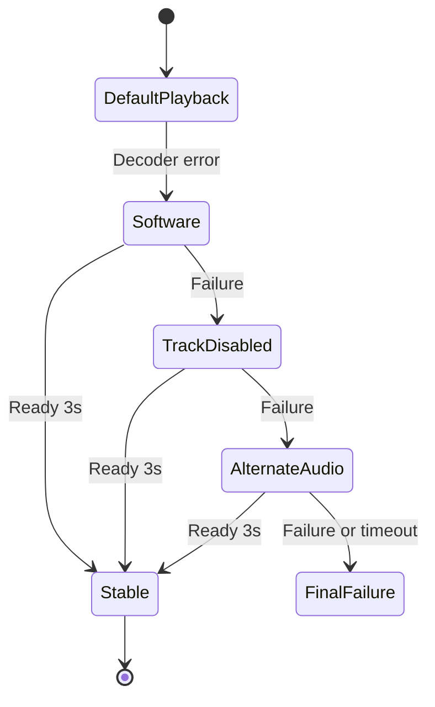

# T23 - Autoréparation du lecteur (essai de décodeurs et de pistes alternatifs)

## Informations générales

Status:
TASK BREAKDOWN

Created:
2026-08-15

Dépendances:
Aucune. Complémentaire de F40 (repli de qualité côté chaînes) : T23 répare la
lecture d'un flux, F40 change de flux.

---

# 1. Description

Quand la lecture d'un média échoue, le lecteur tente automatiquement une
séquence de réparations avant d'abandonner :

1. bascule sur le **décodeur logiciel FFmpeg** (NextLib, déjà embarqué) ;
2. **désactivation de la piste fautive** identifiée par l'erreur ;
3. sélection d'une **autre piste audio** disponible.

La séquence est silencieuse : l'utilisateur ne voit qu'un temps de chargement.
La configuration qui a permis la lecture est **mémorisée pour ce média**, afin
que la lecture suivante démarre directement dans le bon état.

---

# 2. Contexte

Ce catalogue contient massivement des pistes AC3, EAC3 et DTS, dont le support
matériel varie fortement d'un appareil à l'autre — c'est la raison d'être de
NextLib dans le projet, et c'est ce qui a fait échouer Chromecast (F4, retiré
définitivement). Un même fichier peut être parfaitement lisible sur un téléphone
et muet ou en erreur sur une box TV.

Aujourd'hui, un échec de décodage se solde par un message d'erreur : l'utilisateur
conclut que le média est « mort », alors qu'un simple changement de décodeur ou
de piste audio suffirait souvent.

T23 est indépendant du flux : il ne change pas de source, il change la façon de
la lire. F40, à l'inverse, change de source sans toucher au décodage. Les deux
mécanismes doivent se coordonner pour ne pas se déclencher en même temps sur une
chaîne en direct.

---

# 3. Objectif

- Un média lisible au prix d'un réglage différent doit être lu, sans intervention.
- La réparation reste imperceptible : pas de jargon technique exposé.
- Une réparation réussie ne se rejoue pas à chaque lecture du même média.
- Un média réellement illisible échoue toujours, mais après un délai borné et
  avec un message clair.

---

# 4. Décisions produit prises à l'étape 1

| Sujet | Décision |
|---|---|
| Séquence de réparation | Décodeur logiciel FFmpeg → désactivation de la piste fautive → autre piste audio. Pas de cascade étendue (redémarrage de flux, changement de conteneur). |
| Visibilité | Silencieuse. L'utilisateur ne voit qu'un chargement, aucun indicateur « tentative de réparation ». |
| Mémorisation | La configuration gagnante est mémorisée pour ce média et réappliquée aux lectures suivantes. |
| Périmètre | Films, séries et chaînes en direct — tout média passant par le lecteur. |
| Plateformes | Mobile et Android TV dès la première livraison. |

## Décisions produit prises à l'étape 2

| Sujet | Décision |
|---|---|
| Message final (échec complet) | Message bref indiquant que le contenu est illisible sur cet appareil, avec un bouton « Réessayer » uniquement. Pas de renvoi vers un sélecteur de version/qualité (F39/F40) : T23 reste découplé de ces tickets, qui changent de flux plutôt que la façon de le lire. |
| Portée de la mémorisation | Par média seul, au niveau de l'appareil — pas par profil. La cause d'un échec de décodage est matérielle et propre au fichier, pas au profil qui regarde ; une seule configuration par (appareil, média), partagée entre tous les profils locaux. |
| Oubli manuel de la configuration | Aucun moyen manuel en V1. La mémoire se corrige d'elle-même si un nouvel échec net se déclenche. |
| Contenus téléchargés hors ligne | Couverts par le même mécanisme : le lecteur (Media3/NextLib) rejoue un fichier local avec les mêmes causes possibles d'échec de décodage qu'en streaming. |

---

# 5. Hypothèses

- Les erreurs remontées par Media3 sont assez précises pour distinguer un échec
  de décodage d'un échec réseau, et pour identifier la piste responsable. À
  défaut, la séquence se déroule à l'aveugle, ce qui reste acceptable.
- NextLib (`nextlib-media3ext`) couvre les codecs audio problématiques du
  catalogue ; il n'est pas nécessaire d'ajouter une dépendance.
- Une réinitialisation du lecteur avec une autre configuration coûte quelques
  secondes : la séquence complète reste sous un délai acceptable avant abandon.
- La configuration gagnante est stable dans le temps pour un média donné sur un
  appareil donné : elle dépend du fichier et du matériel, pas des conditions
  réseau.
- La mémorisation est propre à l'appareil et n'a pas à être synchronisée dans le
  cloud.

---

# 6. Questions ouvertes

| Point traité à l'étape 3 | Décision |
|---|---|
| Ordre avec F40 | Qualification commune de l'erreur : réseau/buffering va directement à F40 ; décodage déclenche T23 sur le flux courant. F40 ne change de variante qu'après épuisement de T23. Les deux machines ne tournent jamais en parallèle. |
| Persistance | Nouvelle table `playback_repair_profiles`, liée à `mediaUid` et non à `TrackPreferenceEntity`. La réparation dépend de l'appareil et du fichier ; la préférence de piste existante dépend du profil et de l'utilisateur. |
| Tests | Machine d'états et fabrique de stratégies derrière des interfaces pures, testées avec un faux moteur. Aucun test ne requiert codec Android, émulateur ou appareil. |
| Décodeur actuel | Le lecteur préfère déjà FFmpeg pour l'audio et autorise son repli pour la vidéo. L'étape « FFmpeg » signifie donc une reconstruction explicite avec stratégie logiciel-préféré pour le type de piste fautif, pas un simple rejeu de la configuration actuelle. |

Aucune question bloquante ne reste ouverte pour l'étape 4.

---

# 7. Spécification fonctionnelle

## 7.1 Résultat attendu

Un média qui échouait auparavant avec un message d'erreur se lit désormais
directement, au prix d'un délai de chargement légèrement plus long la
première fois. Les lectures suivantes du même média démarrent instantanément
dans la configuration qui a fonctionné.

## 7.2 Parcours utilisateur

1. L'utilisateur lance la lecture d'un film, d'un épisode ou d'une chaîne.
2. Si la lecture échoue pour une cause de décodage (piste ou codec), le
   lecteur relance automatiquement la lecture avec le premier ajustement de
   la séquence (7.3), sans indicateur visible autre qu'un temps de
   chargement.
3. Si cet essai échoue à son tour, le lecteur passe à l'ajustement suivant,
   jusqu'à épuisement de la séquence.
4. Dès qu'un essai réussit, la lecture se poursuit normalement et la
   configuration gagnante est mémorisée pour ce média sur cet appareil
   (décision étape 2).
5. Aux lectures suivantes du même média sur le même appareil, le lecteur
   démarre directement avec la configuration mémorisée, sans rejouer la
   séquence d'essais.
6. Si tous les essais échouent, un message bref indique que le contenu est
   illisible sur cet appareil, avec un unique bouton « Réessayer » qui
   relance la séquence complète depuis le début (décision étape 2).

## 7.3 Règles métier

- Séquence de réparation, dans cet ordre, chaque étape n'étant tentée que si
  la précédente échoue :
  1. Bascule sur le décodeur logiciel FFmpeg (NextLib).
  2. Désactivation de la piste identifiée comme fautive par l'erreur remontée.
  3. Sélection d'une autre piste audio disponible.
- Aucune étape supplémentaire (pas de redémarrage de flux, pas de changement
  de conteneur) — décision étape 1.
- La séquence est silencieuse : aucun libellé technique (nom de décodeur,
  numéro de piste) n'est exposé à l'utilisateur à aucune étape.
- La configuration gagnante remplace toute configuration mémorisée
  précédente pour ce média — une seule configuration active par (appareil,
  média).
- Périmètre : films, séries, chaînes en direct et contenus téléchargés hors
  ligne (décision étape 2) — tout média rejoué par le lecteur de
  l'application.

## 7.4 Cas limites

- **Échec dès le premier essai pour une cause non liée au décodage** (ex.
  réseau, flux introuvable) : la séquence de réparation ne se déclenche pas
  — elle est réservée aux échecs de décodage identifiés comme tels (voir
  hypothèse étape 1 sur la précision des erreurs Media3). Le comportement
  d'erreur réseau existant s'applique sans changement.
- **Erreur remontée par Media3 imprécise** (impossible d'identifier la piste
  fautive) : la séquence se déroule à l'aveugle dans le même ordre fixe,
  conformément à l'hypothèse étape 1.
- **Bouton « Réessayer » qui échoue à nouveau** : la séquence complète est
  rejouée depuis le début à chaque appui, sans limite de tentatives
  manuelles.
- **Changement de configuration matérielle ou logicielle de l'appareil**
  (mise à jour système, par exemple) rendant une configuration mémorisée
  obsolète : sans moyen d'oubli manuel (décision étape 2), la correction se
  fait au prochain échec net de cette configuration, qui relance la
  séquence complète.

## 7.5 Critères d'acceptation

- Un média qui n'était lisible qu'avec un décodeur logiciel, une piste
  désactivée ou une autre piste audio se lit désormais sans intervention de
  l'utilisateur.
- La deuxième lecture d'un média réparé démarre directement dans la
  configuration gagnante, sans reproduire les échecs intermédiaires.
- Un média réellement illisible échoue après un délai borné (durée exacte
  des trois essais cumulés à définir étape 3) et affiche le message final
  avec le bouton « Réessayer ».
- Aucune étape de la séquence n'affiche de jargon technique à l'utilisateur.
- La réparation se comporte identiquement en streaming et en lecture d'un
  contenu téléchargé hors ligne.

## 7.6 Gestion des erreurs

- Toute erreur de lecture est d'abord qualifiée (décodage vs réseau vs flux
  introuvable) avant de déclencher ou non la séquence — seule une erreur de
  décodage la déclenche (voir 7.4).
- L'épuisement de la séquence ne doit jamais laisser un écran noir sans
  message : le message final et le bouton « Réessayer » sont systématiques
  (cohérent avec AGENTS.md § Gestion des erreurs — jamais de stack trace
  brute, toujours un état explicite).

---

# 8. Spécification technique

## 8.1 Constat sur le lecteur actuel

`ExoPlayerCore.kt` construit aujourd'hui `NextRenderersFactory` avec FFmpeg
préféré pour l'audio, vidéo matérielle prioritaire et
`enableDecoderFallback = true`. T23 ne doit pas prétendre « activer FFmpeg » en
rejouant ce même builder. Il introduit des stratégies explicites :

```kotlin
enum class DecoderStrategy { DEFAULT, SOFTWARE_PREFERRED }

data class PlaybackRepairPlan(
    val decoderStrategy: DecoderStrategy,
    val disabledTrack: TrackFingerprint? = null,
    val preferredAudio: TrackFingerprint? = null
)
```

`SOFTWARE_PREFERRED` ne force que le type de renderer identifié en erreur. Pour
une erreur vidéo, la priorité logicielle n'est utilisée qu'après l'échec du
matériel, car B16 a déjà démontré qu'une vidéo FFmpeg préférée pouvait produire
une image corrompue. Pour une erreur audio, elle confirme explicitement le
renderer NextLib et ne change pas la politique vidéo.

## 8.2 Extraction d'un contrôleur partagé

Les trois lecteurs (`PlayerScreen`, `VodPlayerScreen`, `SeriesPlayerScreen`)
cessent de porter seuls la création et le rejeu de l'ExoPlayer. Un
`PlaybackEngineController` commun possède :

- la fabrique d'ExoPlayer paramétrée par `PlaybackRepairPlan` ;
- le `MediaItem`, la position à restaurer et l'état de lecture ;
- la qualification des `PlaybackException` ;
- les pistes disponibles et leurs empreintes stables ;
- le cycle stop/release/rebuild/prepare ;
- les callbacks UI neutres (`Loading`, `Playing`, `FinalFailure`).

La couche Compose observe cet état mais ne décide ni de l'étape suivante ni du
profil à persister. Le contrôleur conserve le même `MediaSource.Factory` réseau
ou cache hors ligne que le lecteur d'origine.

## 8.3 Qualification des erreurs

`PlaybackFailureClassifier` mappe les codes Media3 et, lorsqu'elle est
disponible, la `ExoPlaybackException` :

- `DECODER_INIT`, `DECODING_FAILED`, `AUDIO_TRACK_INIT_FAILED`, format non
  supporté et erreur renderer → `DECODER` ;
- timeout HTTP, code de réponse, DNS, source introuvable → `NETWORK_SOURCE` ;
- `BEHIND_LIVE_WINDOW` → récupération live existante, hors T23 ;
- défaut non qualifiable → `UNKNOWN`, sans déclenchement automatique pour éviter
  de masquer une panne réseau par trois reconstructions coûteuses.

Le classifieur retourne si possible le type de piste et un `TrackFingerprint`
composé de `trackType`, `language`, `mimeType`, `codecs`, `channelCount`,
`roleFlags` et `label`. Aucun index de `TrackGroup` n'est persisté : il peut
changer entre deux ouvertures.

## 8.4 Machine d'états de réparation

Séquence maximale pour une erreur de décodage :

1. `SOFTWARE_PREFERRED` ;
2. même stratégie avec la piste fautive désactivée par
   `TrackSelectionParameters` ;
3. piste fautive réactivée si nécessaire et sélection de la première piste
   audio différente, ordonnée par préférence de langue existante puis par
   support codec.

Chaque essai repart du même `MediaItem` et restaure :

- VOD/épisode/téléchargement : `min(positionAvantErreur, duration-2s)` ;
- direct : position par défaut/live edge, sauf si F41 fournit une position de
  tampon valide ;
- `playWhenReady` et vitesse de lecture existants.

Un essai est déclaré réussi après `STATE_READY` puis trois secondes sans
nouvelle erreur renderer (ou après le premier rendu vidéo et une sortie audio
observables si ces callbacks sont disponibles). Timeout : 8 secondes par
essai, 24 secondes maximum pour la séquence. Le timeout est annulé dès que la
coroutine de lecture est annulée ou que l'utilisateur ferme le lecteur.

Un profil mémorisé est essayé directement lors d'une nouvelle lecture. S'il
échoue, il est supprimé puis la séquence repart depuis la stratégie par défaut ;
une mise à jour système ou un changement de pistes se répare donc sans bouton
« oublier ».

## 8.5 Persistance locale

Nouvelle entité :

```kotlin
@Entity(
    tableName = "playback_repair_profiles",
    foreignKeys = [ForeignKey(
        entity = MediaRefEntity::class,
        parentColumns = ["mediaUid"],
        childColumns = ["mediaUid"],
        onDelete = ForeignKey.CASCADE
    )],
    indices = [Index("mediaUid", unique = true)]
)
data class PlaybackRepairProfileEntity(
    @PrimaryKey val mediaUid: Long,
    val decoderStrategy: String,
    val disabledTrackJson: String?,
    val preferredAudioJson: String?,
    val updatedAt: Long,
    val schemaVersion: Int = 1
)
```

`mediaUid` apporte déjà l'isolation `accountKey + kind + providerId` et évite
les collisions entre deux panels. La table n'a pas de `profileId` et n'est pas
ajoutée à la synchronisation cloud. Elle est créée dans la prochaine migration
Room disponible, avec son DAO et son repository. `MediaRefDao.purgeUnreferenced`
doit inclure cette nouvelle table.

## 8.6 Coordination F40 et F39

Un seul `PlaybackRecoveryCoordinator` arbitre :

- erreur réseau/instabilité live → F40 peut changer de variante ;
- erreur de décodage → T23 tente de réparer la variante courante ;
- T23 épuisé sur live automatique → F40 passe à la variante suivante ;
- changement explicite F39 → la cible bénéficie de T23 ; le rollback F39
  n'intervient qu'après l'échec final du moteur, pas au premier renderer error.

Chaque changement de média/variante réinitialise la machine en mémoire. Un
identifiant de tentative monotonique protège contre les callbacks tardifs d'un
ExoPlayer déjà libéré.

## 8.7 Sécurité, performance et observabilité

- aucune URL, piste ou codec du catalogue dans les logs de production ; seuls
  type d'erreur, numéro d'étape, durée et résultat sont journalisés ;
- une seule instance ExoPlayer active : l'ancienne est libérée avant la
  reconstruction ;
- les `TrackSelectionOverride` sont recalculés à partir de l'empreinte, jamais
  réutilisés avec un `TrackGroup` obsolète ;
- la base ne stocke aucun secret et les profils sont bornés à une ligne par
  `mediaUid` ;
- la séquence ne se déclenche jamais sur une simple mise en mémoire tampon.

## 8.8 Tests automatisés

Tests JVM purs : classification des erreurs, ordre des plans, timeout,
annulation, succès mémorisé, profil obsolète, absence de piste alternative,
position restaurée, interaction T23/F40 et rollback F39. `FakePlaybackEngine`
émet `Ready`, `RendererFailure` et `SourceFailure` de façon déterministe.

Les détails Media3 non exécutables en JVM sont contenus dans des adapters minces
et validés par compilation. Les critères de validation du ticket ne réclament
ni appareil, ni émulateur, conformément à `AGENTS.md`.

## 8.9 Fichiers impactés ou nouveaux

**Nouveaux** : `presentation/player/core/PlaybackEngineController.kt`,
`PlaybackRecoveryCoordinator.kt`, `PlaybackFailureClassifier.kt`,
`domain/model/PlaybackRepairPlan.kt`, entité/DAO/repository
`PlaybackRepairProfile*`, migration et tests.

**Modifiés** : `ExoPlayerCore.kt`, `PlayerDecoderPolicy.kt`, `PlayerScreen.kt`,
`VodPlayerScreen.kt`, `SeriesPlayerScreen.kt`, `AppDatabase.kt`,
`Migrations.kt`, `AppModule.kt`, `MediaRefDao.kt`, règles R8 seulement si un
nouveau type réfléchi est introduit (a priori aucune).

Aucune nouvelle dépendance Gradle : Media3 et NextLib déjà présents suffisent.

---

# 9. Architecture

## 9.1 États



## 9.2 Responsabilités

- **Engine factory** : construit exactement une instance selon un plan.
- **Failure classifier** : distingue décodage, source, live-window et inconnu.
- **Recovery coordinator** : machine d'états, délais, restauration et arbitrage
  avec F39/F40.
- **Repair repository** : mémorisation appareil+média, sans logique de lecture.
- **Compose** : affichage du chargement et du message final, sans jargon.

## 9.3 Risques

- certains appareils remontent des erreurs trop génériques : dans ce cas T23 ne
  s'active pas automatiquement plutôt que de retarder toutes les pannes réseau ;
- forcer FFmpeg vidéo peut reproduire l'image corrompue B16 : stratégie de
  dernier recours seulement et succès confirmé par stabilité, jamais nouveau
  défaut global ;
- les pistes peuvent changer : empreinte tolérante et invalidation immédiate du
  profil mémorisé ;
- trois reconstructions sont coûteuses : budget total borné à 24 secondes et
  annulation stricte à la sortie du lecteur.

---

# 10. Plan de développement

Point d'attention transverse : dans l'ordre de livraison du lot, **T23
précède F39 et F40**. Les tâches 6 et 7 ci-dessous ne peuvent donc pas
appeler de code F39/F40 réel — elles posent le point d'extension
(interface/callback) que F40 et F39 brancheront depuis *leurs propres*
tickets, sans avoir à toucher T23 à nouveau. T23 doit rester complet et
fonctionnel seul, sans F39 ni F40 livrés.

- [ ] 1. Modèles purs — stratégies, plan de réparation, empreinte de piste

Objectif:
Poser les types sans dépendance Media3 directe : `DecoderStrategy`,
`PlaybackRepairPlan`, `TrackFingerprint` (§8.1, §8.3).

Fichiers:
- `domain/model/PlaybackRepairPlan.kt` (nouveau, inclut `DecoderStrategy`,
  `TrackFingerprint`)

Validation:
Compile. Test unitaire trivial de (dé)sérialisation JSON de
`TrackFingerprint` (utilisée en §8.5 pour `disabledTrackJson`/
`preferredAudioJson`).

---

- [ ] 2. `PlaybackFailureClassifier`

Objectif:
Qualifier une erreur Media3 en `DECODER` / `NETWORK_SOURCE` / hors
périmètre / `UNKNOWN` (§8.3), et extraire le type de piste et son empreinte
quand c'est possible.

Fichiers:
- `presentation/player/core/PlaybackFailureClassifier.kt` (nouveau)
- tests unitaires associés (nouveau)

Validation:
Tests JVM avec des codes d'erreur Media3 simulés (AGENTS.md — aucun
appareil requis) : chaque famille de code cité en §8.3 route vers la bonne
catégorie ; un code non qualifiable route vers `UNKNOWN` sans déclencher la
séquence (voir cas limite §7.4).

---

- [ ] 3. Persistance — `PlaybackRepairProfileEntity`, DAO, repository, migration

Objectif:
Stocker la configuration gagnante par `mediaUid`, sans `profileId` (§8.5).

Fichiers:
- entité `PlaybackRepairProfileEntity` (nouveau)
- DAO associé (nouveau)
- repository associé (nouveau)
- migration Room — **vérifier le numéro réellement disponible dans
  `AppDatabase.kt` avant d'écrire** (règle T21 §8.5, plusieurs tickets du
  lot touchent au schéma)
- `data/local/dao/MediaRefDao.kt` (`purgeUnreferenced` doit inclure la
  nouvelle table)

Fichiers modifiés:
- `data/local/db/AppDatabase.kt`, `Migrations.kt`

Validation:
Test de migration (schéma avant/après), test de création fraîche. Test
repository avec DAO fake ou Room in-memory : écriture, lecture par
`mediaUid`, remplacement d'un profil existant, purge via
`purgeUnreferenced` quand le média n'est plus référencé.

---

- [ ] 4. `PlaybackEngineController` — extraction du contrôleur partagé

Objectif:
Extraire de `PlayerScreen`, `VodPlayerScreen` et `SeriesPlayerScreen` la
construction et le cycle de vie de l'ExoPlayer dans un contrôleur commun
paramétrable par `PlaybackRepairPlan` (§8.2). Cette tâche ne câble pas
encore la machine de réparation : elle ne fait que rendre le lecteur
reconstructible sur un plan donné, en gardant le comportement actuel
identique pour `DecoderStrategy.DEFAULT`.

Fichiers:
- `presentation/player/core/PlaybackEngineController.kt` (nouveau)
- `presentation/player/core/ExoPlayerCore.kt`,
  `PlayerDecoderPolicy.kt` (adaptés pour accepter un plan)

Validation:
Non-régression manuelle et par les tests existants du lecteur : une lecture
normale (plan par défaut) se comporte exactement comme avant l'extraction.
Test unitaire vérifiant qu'un changement de plan reconstruit une seule
instance ExoPlayer (l'ancienne est bien libérée avant reconstruction, §8.7).

---

- [ ] 5. `PlaybackRecoveryCoordinator` — machine d'états de réparation

Objectif:
Implémenter la séquence complète (§8.4, §9.1) : `SOFTWARE_PREFERRED` →
piste désactivée → autre piste audio, avec timeouts (8 s/essai, 24 s
total), restauration de position, et consultation/écriture du profil
mémorisé (tâche 3) en début et fin de séquence.

Fichiers:
- `presentation/player/core/PlaybackRecoveryCoordinator.kt` (nouveau)
- `FakePlaybackEngine` de test (nouveau, §8.8)
- tests unitaires associés (nouveau)

Validation:
Tests JVM avec `FakePlaybackEngine` déterministe (AGENTS.md) : ordre exact
des trois essais, succès à chaque étape possible, timeout par essai et
timeout global respectés, annulation propre à la fermeture du lecteur,
profil mémorisé essayé en premier puis supprimé s'il échoue, restauration
de position VOD (`min(position, duration-2s)`). Pour le direct, position par
défaut sur live edge : le repli sur une position de tampon F41 est un point
d'extension (tâche 6), pas une dépendance dure — F41 n'existe pas encore à
ce stade de la livraison. **Attention à la boucle infinie** : le timer 24 s
ne doit jamais tourner sans condition d'arrêt hors coroutine annulable
(AGENTS.md § Boucles infinies de tests).

---

- [ ] 6. Points d'extension pour F39, F40 et F41 — sans implémentation de ces tickets

Objectif:
Exposer les deux seams que F39/F40/F41 brancheront depuis leurs propres
tickets, sans avoir à retoucher T23 :

- l'interface que **F40** consultera pour être notifié « T23 épuisé sur
  cette variante, à toi de jouer » (§8.6), et sur laquelle **F39** s'appuie
  pour son rollback (n'intervient qu'après l'échec final du moteur, pas au
  premier renderer error) ;
- le point d'entrée par lequel **F41** pourra fournir une position de
  tampon pour la restauration en direct (§8.4), à défaut de quoi le direct
  reprend au live edge (comportement déjà couvert par la tâche 5).

Fichiers:
- `presentation/player/core/PlaybackRecoveryCoordinator.kt` (callback/
  interface d'extension, aucune logique F39/F40/F41 réelle)

Validation:
Tests unitaires avec un faux consommateur de chaque interface : notifié
exactement une fois quand la séquence s'épuise sur une chaîne en direct, et
jamais avant ; la position de tampon fournie par un faux fournisseur est
bien utilisée en priorité sur le live edge quand elle est présente. Aucune
régression sur le comportement VOD/série, qui n'a pas de consommateur F40
(chaînes uniquement).

---

- [ ] 7. Câblage des écrans lecteur et UI de message final

Objectif:
Brancher `PlayerScreen`, `VodPlayerScreen` et `SeriesPlayerScreen` sur le
contrôleur et le coordinateur ; afficher le message final et le bouton
« Réessayer » sur `FinalFailure` (§7.2, §7.6), sans aucun jargon technique.

Fichiers:
- `presentation/player/PlayerScreen.kt`, `VodPlayerScreen.kt`,
  `SeriesPlayerScreen.kt`

Validation:
Critères d'acceptation de §7.5 vérifiables manuellement sur un média connu
pour échouer sans réparation (device réel — exclu des critères automatisés
AGENTS.md, donc validation manuelle uniquement, pas bloquante pour la
livraison). Tests d'état Compose vérifiant que `Loading`/`Playing`/
`FinalFailure` pilotent le bon affichage, sans texte technique dans
`FinalFailure`.

---

- [ ] 8. Non-régression globale

Objectif:
Vérifier que l'extraction du contrôleur partagé n'a rien cassé sur les
trois lecteurs, et que le budget de performance (§8.7, §9.3) est respecté.

Fichiers:
- l'ensemble des fichiers listés en §8.9

Validation:
`./gradlew assembleDebug`, `./gradlew testDebugUnitTest`, `./gradlew
lintDebug` verts. Tests de lecture existants (positions, pistes, reprise)
toujours verts. Aucune nouvelle dépendance Gradle introduite (§8.9).

---

# 11. Notes de développement

---

# 12. Review

## Critique

## Majeur

## Mineur

## Corrections demandées

---

# 13. Release

Version :

Commit :

Date :
