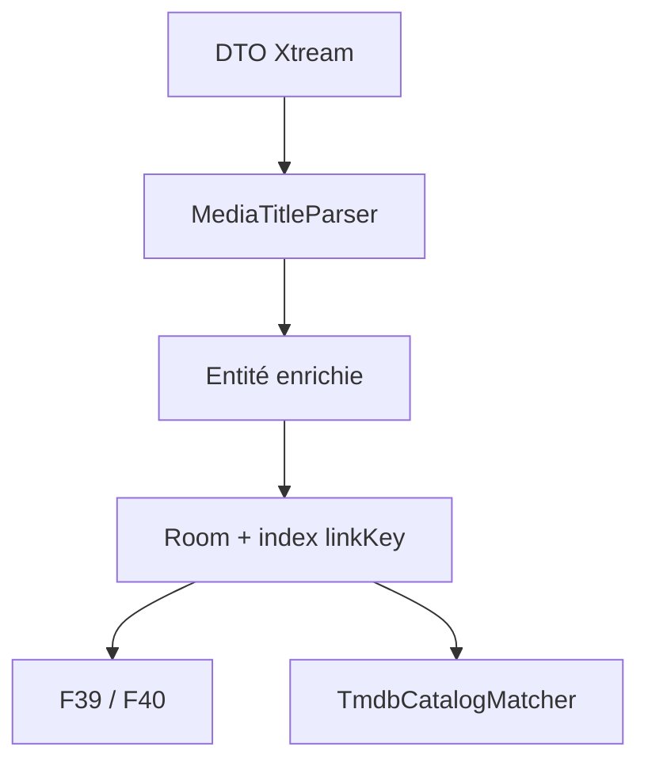

# T21 - Normalisation des titres, extraction des attributs et clé de liaison entre médias

## Informations générales

Status:
RELEASED

Created:
2026-08-15

Dépendances:
Aucune. Fondation de F39, F40 et de l'appariement TMDB (T22).

---

# 1. Description

Les libellés renvoyés par le panel Xtream mélangent le titre de l'œuvre et des
attributs techniques : langue et version (`VF`, `VOSTFR`, `MULTI`, `TRUEFRENCH`),
qualité (`4K`, `1080p`, `HD`, `SD`), codec, marqueurs divers entre crochets ou
barres verticales. La même œuvre y apparaît plusieurs fois sous des libellés
différents, sans qu'aucun lien ne soit matérialisé entre ces entrées.

Cette tâche fait de la décomposition de ces libellés une opération de première
classe, réalisée une seule fois pendant la synchronisation du catalogue et
persistée en base :

- un **titre nettoyé**, dépourvu de tout attribut technique ;
- les **attributs extraits** (langue/version, qualité) conservés à part ;
- une **clé de liaison** qui regroupe les entrées désignant la même œuvre ou la
  même chaîne.

La tâche ne produit **aucun changement visible** dans l'interface : elle ne
fabrique que la donnée. Son exploitation appartient à F39 (étiquettes et
sélecteur de versions VOD/séries) et F40 (qualité des chaînes).

---

# 2. Contexte

Trois besoins convergent vers la même donnée manquante.

1. **Appariement TMDB.** `TitleNormalizer` (`domain/model/TitleNormalizer.kt`)
   nettoie déjà les titres à la volée, mais avec une liste de tags courte, sans
   conserver ce qu'il retire, et en recalculant à chaque appel. `TmdbCatalogMatcher`
   et `ApproximateTitleMatcher` travaillent donc sur une base à la fois imprécise
   et coûteuse : un titre nettoyé stocké et indexé rendrait l'appariement plus
   rapide et plus juste.
2. **Versions d'un même média.** Aucun lien n'existe aujourd'hui entre
   « Film X VF 1080p » et « Film X MULTI 4K ». Sans clé de liaison, un sélecteur
   de version est impossible.
3. **Variantes d'une même chaîne.** Même problème pour « TF1 FHD » / « TF1 HD » /
   « TF1 SD », qui doivent être présentées comme des qualités d'une seule chaîne.

Faire ce calcul à l'affichage a été écarté : le catalogue dépasse plusieurs
dizaines de milliers de lignes, et l'écran « Tout » a déjà fait l'objet d'une
optimisation dédiée (T9, index couvrants sur `vod_streams` et `live_streams`).
Recalculer en permanence annulerait ce travail et interdirait toute requête SQL
par clé de liaison.

---

# 3. Objectif

- Chaque film, série et chaîne du cache Room porte un titre nettoyé, ses
  attributs extraits et une clé de liaison, calculés à la synchronisation.
- Deux entrées désignant la même œuvre ou la même chaîne partagent la même clé
  de liaison ; deux œuvres distinctes ne la partagent pas.
- L'appariement TMDB s'appuie sur le titre nettoyé stocké, sans recalcul.
- Le catalogue déjà en cache est mis à niveau sans resynchronisation réseau ni
  perte des données hors ligne.
- Aucun changement de comportement observable pour l'utilisateur.

---

# 4. Décisions produit prises à l'étape 1

| Sujet | Décision |
|---|---|
| Emplacement du calcul | Dans l'application, pendant la synchronisation du catalogue ; résultat persisté en base. Ni à la volée à l'affichage, ni côté backend (le catalogue IPTV ne quitte jamais l'appareil). |
| Portée V1 | Données uniquement. Aucune étiquette, aucun filtre, aucun regroupement de vignettes dans cette tâche. |
| Clé de liaison films/séries | Titre nettoyé seul ; deux entrées sont **séparées** si leurs années de sortie sont toutes deux connues et différentes. L'année absente n'empêche pas le regroupement. |
| Clé de liaison chaînes | Retrait des seuls marqueurs de qualité connus (`HD`, `FHD`, `UHD`, `4K`, `SD`, `1080p`…). « TF1 Séries Films » reste distincte de « TF1 ». Pas de regroupement agressif (préfixes pays, numéros, suffixes libres). |
| Reprise de l'existant | ~~Recalcul en base pendant la migration Room, au premier lancement après mise à jour. Pas de colonnes vides en attente de synchronisation~~ — **révisé à l'étape 3** : recalcul en tâche de fond après le démarrage, pour ne pas geler l'ouverture de l'app (voir §8.5). Pas de resynchronisation complète forcée : cette partie reste valable. |
| Plateformes | Sans objet (aucune surface UI). |
| Ordre de livraison | Premier ticket du lot, avant F39 et F40. |

## Décisions produit prises à l'étape 2

| Sujet | Décision |
|---|---|
| Attribut brut | Le fragment brut d'origine de chaque attribut détecté est conservé en plus de sa valeur normalisée (coût de stockage négligeable, évite un retour au libellé source complet si un affichage futur veut un badge fidèle au marqueur d'origine). |
| Titre vide après nettoyage | Le libellé original complet est conservé comme titre nettoyé (comportement défensif, aucune perte de donnée ; l'entrée n'est simplement reliée à aucune autre par la clé de liaison). |

---

# 5. Hypothèses

- Les attributs utiles se déduisent du seul libellé : le panel n'expose aucun
  champ structuré de langue ou de qualité (à confirmer sur `get_live_streams`,
  `get_vod_streams`, `get_series`).
- Le vocabulaire des marqueurs est fini et énumérable pour ce panel ; une liste
  fermée, enrichie au fil des observations, suffit. Un modèle probabiliste n'est
  pas nécessaire.
- Le nombre de versions par œuvre reste faible (quelques unités), donc une
  requête par clé de liaison reste peu coûteuse.
- ~~Le recalcul complet en migration reste dans une durée acceptable au
  démarrage sur box Android TV.~~ **Hypothèse écartée à l'étape 3** : le
  risque de geler l'ouverture de l'application a été jugé inacceptable sans
  attendre de le mesurer. Le traitement passe en tâche de fond, mais **sans**
  l'indicateur de progression envisagé ici — l'état transitoire est rendu
  indiscernable d'un catalogue sans versions alternatives (voir §8.5.2).
- Le catalogue conserve des libellés stables entre deux synchronisations : la
  clé de liaison d'une entrée ne change pas d'une synchro à l'autre.

---

# 6. Questions ouvertes

| Point traité à l'étape 3 | Décision |
|---|---|
| Indexation | Les clés de liaison sont indexées dès T21 sur les trois tables. F39 et F40 en dépendent immédiatement et une livraison intermédiaire sans lecteur de clé ne justifie pas une seconde migration. |
| Recalcul de l'existant | Migration Room en Kotlin, paginée par clé primaire et exécutée dans la transaction de migration ; SQLite ne dispose pas des expressions régulières nécessaires pour reproduire le parseur. |
| Composant de normalisation | Un nouveau `MediaTitleParser` retourne un résultat structuré. `TitleNormalizer` devient une façade compatible qui délègue au parseur, puis les appelants sont migrés progressivement. |
| Clé et année | `linkKey` encode uniquement le titre canonique. L'année reste une colonne séparée et le filtrage est appliqué par paire dans les DAO consommateurs : une année absente reste compatible, deux années connues différentes ne le sont pas. |
| Marqueurs contradictoires | Règle déterministe : la valeur de rang le plus élevé est retenue, avec son fragment brut (`2160p/4K > FHD/1080p > HD/720p > SD`). Les autres fragments sont retirés du titre mais non persistés en V1. |

Aucune question bloquante ne reste ouverte pour l'étape 4.

---

## Arbitrages structurants ratifiés à l'étape 3

| Sujet | Décision |
|---|---|
| Recalcul du catalogue existant | **En tâche de fond après le démarrage** (WorkManager), pas dans la migration Room. Révise la décision d'étape 1 : le gel du démarrage sur box Android TV a été jugé inacceptable face à un état transitoire non observable. Voir §8.5. |
| État transitoire assumé | Une partie du catalogue reste sans `linkKey` le temps du traitement. F39 et F40 le traitent comme une entrée sans attribut (pas de badge, pas de bouton), sans écran d'attente ni indicateur de progression. |
| Fixtures de test issues du panel réel | Les libellés de chaînes observés sur le panel suivent la forme `\|FR\| TF1 HD`, `\|FR\| TF1 SD`, `\|FR\| FRANCE 2 HD`, `\|FR\| FRANCE 2 SD` : préfixe pays entre barres verticales, nom, marqueur de qualité en suffixe. Ils doivent servir de fixtures aux tests plutôt que des exemples inventés. Deux confirmations qu'ils apportent : le préfixe pays étant **constant**, la décision d'étape 1 (« retrait des seuls marqueurs de qualité, pas de regroupement agressif sur les préfixes ») regroupe correctement HD et SD sous `\|FR\| TF1` sans traitement supplémentaire ; et le champ `epg_channel_id` vaut `france2.fr` sur une variante et `France2.fr` sur l'autre, ce qui valide la comparaison insensible à la casse retenue en §7.5. |

---

## Décisions produit prises à l'étape 6

Arbitrages soumis à la suite de la review technique (voir §12).

| Sujet | Décision |
|---|---|
| Titre d'affichage et clé de liaison (M1, M2) | **Séparés.** `cleanTitle` redevient fidèle au libellé source : seuls les marqueurs détectés et la ponctuation devenue orpheline sont retirés ; ponctuation et année sont conservées. `linkKey` reste calculé sur une forme canonique dont l'année est retirée, afin de préserver le regroupement des versions dont un seul libellé porte l'année (« Odyssée 2016 » / « Odyssée (2016) » / « Odyssee.2016.MULTI »). Le risque d'homonymie d'un titre contenant réellement une année (« Blade Runner 2049 ») est **assumé comme limite V1**, au même titre que le risque « marqueur légitime dans le titre » déjà accepté en §7.6 ; il s'atténue dès que `releaseYear` est enrichi, via `yearsAreCompatible`. |
| Marqueurs de langue sur les chaînes (m2) | **§7.5 fait foi** : le parseur ne retire que les marqueurs de qualité quand `mediaKind == LIVE`. Deux flux linguistiques distincts d'une même chaîne restent des chaînes distinctes, conformément à la décision d'étape 1 (« pas de regroupement agressif »). |
| État d'avancement du worker (m4) | **`linkKey = ''` EST l'état persisté.** Aucune entité ni clé DataStore supplémentaire : le curseur durable ne peut pas se désynchroniser de la donnée, et §8.5.2 n'exige d'aucun consommateur qu'il affiche l'avancement. §8.5.1 et la tâche 7 sont révisées en ce sens. |
| Projections de listes (m6) | **Report explicite vers F39.** `CatalogListRow` n'est pas modifié par T21 : aucun écran ne lit encore `languageTag`/`qualityTag`, et §8.2 lie cet ajout aux badges de F39. Évite d'élargir les index couvrants T9 sans consommateur. |

---

# 7. Spécification fonctionnelle

## 7.1 Résultat attendu

T21 ne modifie aucun écran : le résultat se constate uniquement en base et dans
le comportement interne de la synchronisation et de l'appariement TMDB. Le
« parcours utilisateur » de cette tâche est le pipeline de synchronisation du
catalogue lui-même, pas une interaction visible.

## 7.2 Pipeline de traitement

Le calcul a lieu à deux moments :

1. **Synchronisation courante** : pour chaque entrée reçue via
   `get_live_streams`, `get_vod_streams`, `get_series`, avant persistance en
   base Room.
2. **Reprise de l'existant** : en tâche de fond après le premier démarrage qui
   suit la mise à jour, pour chaque entrée déjà en cache — sans appel réseau
   (décision d'étape 1 révisée à l'étape 3, voir §8.5). La migration Room
   elle-même n'ajoute que les colonnes et les index, sans rien calculer, afin
   de ne pas geler l'ouverture de l'application.

Pour chaque libellé source, dans cet ordre :

1. Détection des marqueurs connus (langue/version, qualité — voir 7.3), quelle
   que soit leur position dans le libellé et leur casse, délimités par
   crochets, parenthèses, barres verticales, tirets ou simples espaces.
2. Retrait de ces marqueurs pour obtenir le titre nettoyé ; normalisation des
   espaces multiples et de la ponctuation résiduelle laissée par le retrait
   (crochets ou tirets orphelins, espaces en double).
3. Stockage du titre nettoyé, de la valeur normalisée de chaque attribut
   détecté, du fragment brut d'origine de chaque attribut (décision étape 2),
   et de la clé de liaison calculée.

## 7.3 Règles métier — extraction des attributs

- **Langue/version** (liste fermée, insensible à la casse) : `VF`, `VFQ`,
  `VFF`, `VOSTFR`, `VOST`, `VO`, `MULTI`, `TRUEFRENCH`, `SUBFRENCH`. Liste
  enrichie au fil des observations sur le catalogue réel (hypothèse étape 1).
- **Qualité** (liste fermée, insensible à la casse) : `4K`, `UHD`, `2160p`,
  `FHD`, `1080p`, `HD`, `720p`, `SD`.
- **Marqueurs VOD/séries non persistés** : `HDR`, `X265`, `X264`, `H265`,
  `H264`, `3D`, `FR`, `EN` sont retirés pour l'appariement et la clé, sans
  devenir des attributs affichables. Ils ne sont jamais retirés des chaînes.
- Chaque catégorie retient au plus une valeur par entrée. En cas de plusieurs
  marqueurs de la même catégorie dans un même libellé, le plus qualitatif
  prime par défaut (`4K` avant `HD`) — comportement exact à confirmer étape 3
  (voir Questions ouvertes).

## 7.4 Règles métier — clé de liaison films/séries

- Base : titre nettoyé normalisé pour la comparaison (minuscules, accents
  supprimés, espaces multiples réduits), afin de tolérer les variations de
  casse et d'accentuation entre panels.
- Séparation par année : deux entrées de même titre nettoyé partagent la clé
  de liaison sauf si elles ont toutes les deux une année connue et que ces
  années diffèrent. Une entrée sans année connue ne bloque jamais le
  regroupement avec une entrée qui en a une.
- Cette règle n'est pas nécessairement transitive (une entrée sans année peut
  être compatible avec deux entrées d'années différentes qui, elles, sont
  incompatibles entre elles) : accepté comme hypothèse, modèle de stockage
  exact renvoyé à l'étape 3 (voir Questions ouvertes).

## 7.5 Règles métier — clé de liaison chaînes

- Retrait des seuls marqueurs de qualité (`HD`, `FHD`, `UHD`, `4K`, `SD`,
  `1080p`…) du nom de la chaîne pour obtenir la clé ; aucun autre retrait
  (pas de préfixe pays, numérotation, suffixes libres) — décision étape 1
  explicite : « TF1 Séries Films » reste distinct de « TF1 ».
- Comparaison insensible à la casse et aux espaces superflus.

## 7.6 Cas limites

- **Titre vide après nettoyage** : le libellé original complet est conservé
  comme titre nettoyé (décision étape 2) ; la clé de liaison qui en découle
  peut ne rassembler que cette seule entrée, ce qui est le comportement
  attendu, pas une erreur.
- **Aucun attribut détecté** : titre nettoyé identique au libellé source,
  attributs vides, entrée fonctionnellement inchangée par rapport à
  aujourd'hui.
- **Doublons stricts** (même libellé exact présent deux fois dans le
  catalogue) : même titre nettoyé, même clé — comportement attendu, pas un
  cas particulier à gérer.
- **Marqueur faisant partie du titre légitime d'une œuvre** (ex. un titre
  contenant littéralement « HD » ou « 4K ») : risque accepté comme hypothèse
  étape 1 (liste fermée plutôt que modèle probabiliste) ; aucune correction
  algorithmique prévue en V1, à surveiller en usage réel.

## 7.7 Critères d'acceptation

- Pour un échantillon de libellés représentatif du catalogue réel (tests
  unitaires avec cas volontairement « sales », conformément à AGENTS.md
  § Stratégie de tests), le titre nettoyé ne contient plus aucun marqueur de
  la liste fermée.
- Deux entrées désignant la même œuvre sous des libellés différents (ex.
  « Film X VF 1080p » et « Film X MULTI 4K ») partagent la même clé de
  liaison.
- Deux œuvres distinctes de titres différents ne partagent jamais la même
  clé.
- Deux entrées de même titre nettoyé mais années connues différentes ne sont
  jamais proposées comme versions l'une de l'autre par les fonctionnalités
  consommatrices (F39, F40).
- Le catalogue déjà en cache est recalculé en tâche de fond après le
  démarrage, sans appel réseau ni perte des favoris, de l'historique, des
  positions de lecture ou des téléchargements existants.
- Le premier démarrage suivant la mise à jour n'est pas ralenti de façon
  perceptible : la migration Room ne calcule rien.
- Un recalcul interrompu (arrêt de l'application, redémarrage de l'appareil)
  reprend là où il s'était arrêté, sans repartir de zéro ni laisser d'entrée
  définitivement non normalisée.
- L'appariement TMDB (`TmdbCatalogMatcher`, `ApproximateTitleMatcher`)
  consomme le titre nettoyé stocké sans le recalculer à chaque appel.

## 7.8 Gestion des erreurs

- Libellé source `null` ou vide : traité comme les autres champs manquants du
  parsing Xtream (AGENTS.md § Conventions de code) — titre nettoyé vide, pas
  de crash.
- Échec du calcul sur une entrée pendant la migration : n'interrompt pas la
  migration des autres entrées ; l'entrée en échec se comporte comme le cas
  « titre vide » (libellé source conservé tel quel, clé de liaison qui lui
  est propre).

---

# 8. Spécification technique

## 8.1 Choix structurants

La normalisation devient un service de domaine pur, sans dépendance Android :

- `MediaTitleParser.parse(rawTitle, mediaKind, releaseYear)` produit un
  `ParsedMediaTitle` immuable ;
- `TitleNormalizer.normalize()` est conservé comme façade de compatibilité et
  délègue au nouveau parseur ;
- le résultat est calculé aux frontières d'entrée du catalogue, puis stocké ;
  aucun composable et aucun matcher ne reparsent le libellé brut ;
- la liste des marqueurs et leur rang sont centralisés dans le parseur, pas
  dupliqués dans les repositories ou les écrans.

Types proposés :

```kotlin
data class ParsedMediaTitle(
    val cleanTitle: String,
    val linkKey: String,
    val language: MediaLanguage?,
    val languageRaw: String?,
    val quality: MediaQuality?,
    val qualityRaw: String?
)

enum class MediaQuality(val rank: Int) {
    SD(10), HD(20), FHD(30), UHD_4K(40)
}
```

Les valeurs Room sont des codes stables en minuscules (`vf`, `vostfr`,
`multi`, `sd`, `hd`, `fhd`, `uhd_4k`) et non les noms Kotlin des enums, afin
de permettre un renommage de code sans migration de données.

## 8.2 Modèle Room

Les colonnes suivantes sont ajoutées à `vod_streams`, `series_streams` et
`live_streams` :

| Colonne | Type | Règle |
|---|---|---|
| `cleanTitle` | `TEXT NOT NULL DEFAULT ''` | Titre d'affichage nettoyé ; repli sur le libellé source si le nettoyage produit moins de deux caractères. |
| `linkKey` | `TEXT NOT NULL DEFAULT ''` | Clé canonique, non réversible, dérivée de `cleanTitle`. |
| `languageTag` | `TEXT NULL` | Valeur normalisée de langue/version. |
| `languageRaw` | `TEXT NULL` | Fragment exact extrait du libellé. |
| `qualityTag` | `TEXT NULL` | Valeur normalisée de qualité. |
| `qualityRaw` | `TEXT NULL` | Fragment exact extrait du libellé. |

Un index simple `Index(value = ["linkKey"])` est créé sur chacune des trois
tables. L'année n'est pas incluse dans l'index : les groupes sont petits et la
règle de compatibilité avec une année absente ne se traduit pas par une clé
composite correcte. Les index couvrants T9 existants restent inchangés pour ne
pas multiplier leur taille ; seuls les champs `languageTag` et `qualityTag`
sont ajoutés aux projections de listes qui doivent afficher les badges de F39.

La clé est produite par : minuscules avec `Locale.ROOT`, décomposition Unicode
NFD, suppression des diacritiques, ponctuation ramenée à un espace, espaces
réduits, puis SHA-256 tronqué à 128 bits encodé en hexadécimal. Le titre
canonique n'est donc pas dupliqué dans chaque index. Une clé de singleton
défensive utilise le préfixe `invalid:` suivi du type et de l'identifiant
fournisseur lorsque le titre est vide ou invalide.

## 8.3 Règle de compatibilité des années

`linkKey` reste transitive et indépendante de l'année. Les requêtes de versions
chargent les quelques lignes partageant la clé, puis appliquent :

```kotlin
fun yearsAreCompatible(left: Int?, right: Int?): Boolean =
    left == null || left <= 0 || right == null || right <= 0 || left == right
```

Le filtre est toujours évalué contre le média courant, jamais entre tous les
éléments du groupe. Ainsi, deux œuvres datées différemment ne se présentent pas
l'une comme version directe de l'autre, tandis qu'une entrée non datée peut
rejoindre une entrée datée conformément à la décision produit. Cette limite
non transitive est couverte par des tests explicites et ne doit pas être
transformée en regroupement global en mémoire.

## 8.4 Écriture pendant les synchronisations

Les mappers de `LiveTvRepositoryImpl`, `VodRepositoryImpl` et
`SeriesRepositoryImpl` appellent le parseur avant de construire les entités.
Le point d'écriture est `insertStreams` de chaque DAO catalogue (`LiveTvDao`,
`VodDao`, `SeriesDao`) : une méthode `@Transaction` qui calcule `searchText`
puis délègue à `insertStreamsRaw` (`@Upsert`). Elle continue de réaliser une
seule écriture transactionnelle ; la normalisation est effectuée hors
transaction sur `Dispatchers.Default`, puis les entités prêtes sont insérées
par lots.

Attention : les tables FTS4 et les méthodes `insertStreamsWithFts` /
`clearAllFts` n'existent plus depuis `MIGRATION_20_21`, qui les a remplacées
par la colonne `searchText`. Un commentaire de `Migrations.kt` les décrivait
encore au présent et a été corrigé ; ne pas s'y référer.

Les enrichissements ultérieurs (`get_vod_info`, `get_series_info`) ne recalculent
pas le titre lorsqu'ils ajoutent `releaseYear`. La clé ne change pas ; seule la
compatibilité par année est évaluée à la lecture. Cela évite de déplacer un
média entre groupes au milieu d'une session.

## 8.5 Migration Room 28 → 29

> **Numérotation.** La base est en version 28 à la rédaction de cette fiche
> (`AppDatabase.kt`, dernière migration livrée `MIGRATION_27_28` — AGENTS.md
> mentionne encore 27, l'information y est périmée). Le couple 28 → 29 vaut
> donc **si T21 est le premier ticket du lot effectivement livré**, ce que
> prévoit l'ordre de livraison décidé à l'étape 1. Cinq autres tickets du lot
> touchent au schéma Room (F39 table `series_version_preferences`, F42
> colonnes catch-up sur `live_streams`, F43 cache des bornes de générique,
> F44 niveau d'âge du profil, T23 configuration de réparation) : chacun prend
> le numéro suivant **au moment de sa livraison**, pas celui écrit dans sa
> fiche. Vérifier la version réelle dans `AppDatabase.kt` avant d'écrire la
> migration, jamais la valeur citée dans un ticket.

> **Révision de la décision d'étape 1 (ratifiée à l'étape 3).** L'étape 1
> prévoyait le recalcul complet *pendant* la migration, donc au démarrage.
> Arbitrage soumis et tranché : **le recalcul se fait en tâche de fond après
> le démarrage**, pour ne pas geler l'ouverture de l'application sur box
> Android TV. La ligne « Reprise de l'existant » du tableau d'étape 1 est
> remplacée par cette décision. Conséquence acceptée : la base traverse un
> état transitoire où les colonnes ne sont pas encore calculées, ce que
> l'étape 1 avait écarté — F39 et F40 doivent donc gérer cet état (voir 8.5.2).

La migration Room se limite au **schéma** :

1. ajoute les six colonnes avec leurs valeurs par défaut (`''` / `NULL`) ;
2. crée les trois index `linkKey` ;
3. ne calcule rien et ne parcourt aucune ligne : elle reste quasi instantanée
   quelle que soit la taille du catalogue.

### 8.5.1 Recalcul en tâche de fond

Un `CatalogNormalizationWorker` (WorkManager, déjà utilisé pour la synchro
planifiée) reprend le travail après le démarrage :

- déclenché une fois après la migration, contrainte batterie non faible, sans
  contrainte réseau — le traitement est purement local ;
- parcourt chaque table par pages de 500 lignes ordonnées par clé primaire
  (`WHERE streamId > ? ORDER BY streamId LIMIT 500`, ou `seriesId`), ce qui
  évite `OFFSET` et les gros `CursorWindow` ;
- calcule `ParsedMediaTitle` en Kotlin et écrit chaque page avec un
  `SupportSQLiteStatement` préparé réutilisable, **une transaction par page** :
  interrompu (arrêt de l'app, redémarrage), il reprend à la page suivante au
  lieu de tout refaire ;
- utilise `linkKey = ''` comme état persistant du travail restant : aucune
  entité de progression n'est nécessaire et les consommateurs excluent déjà
  cette valeur de leurs regroupements ;
- aucune erreur d'une ligne n'annule le reste du lot : le repli défensif
  produit le titre source et une clé singleton ;
- aucun appel réseau ; ne touche ni aux favoris, ni aux positions, ni aux
  téléchargements.

Les entrées écrites par une synchronisation normale sont, elles, toujours
normalisées à l'écriture (voir 8.4) : le worker ne concerne que le stock
préexistant.

### 8.5.2 État transitoire côté consommateurs

Tant que le worker n'a pas terminé, une partie du catalogue a `linkKey = ''` :

- **F39** n'affiche pas de badge et masque le bouton « Version » pour une
  entrée non encore normalisée — comportement identique à celui déjà prévu
  pour une entrée sans attribut détecté, donc sans surface UI nouvelle ;
- **F40** masque de même le bouton « Qualité » pour une chaîne non encore
  normalisée ;
- **aucun écran d'erreur ni indicateur de progression** n'est ajouté : l'état
  est indiscernable d'un catalogue sans versions alternatives, ce qui reste
  cohérent avec l'objectif « aucun changement de comportement observable ».

Une requête par `linkKey` ignore systématiquement les valeurs vides, pour ne
jamais regrouper entre elles toutes les entrées non encore traitées.

Budget de performance : le parseur ne compile aucune regex par ligne, toutes les
expressions sont précompilées. Cible indicative sur un catalogue de 100 000
entrées : moins de 10 secondes de traitement cumulé sur un appareil bas de
gamme. Ce budget n'est plus bloquant pour le démarrage, mais reste le seuil
au-delà duquel l'implémentation doit être optimisée.

## 8.6 Appariement TMDB

`TmdbCatalogMatcher.CatalogCandidate` reçoit `normalizedTitle` depuis les
modèles persistés. `prepareMovies` et `prepareSeries` ne doivent plus appeler
`TitleNormalizer` pour les données Room. Une surcharge interne conservée pour
les tests ou les objets externes peut encore parser une valeur brute, mais elle
n'est jamais utilisée par le chemin catalogue de production.

`ApproximateTitleMatcher` reste inchangé. L'année continue d'être fournie par
`releaseYear` avec le repli historique `yearFromTitle` uniquement lorsque la
colonne n'a pas encore été enrichie ; ce repli n'affecte pas `linkKey`.

## 8.7 Compatibilité, sécurité et observabilité

- aucune donnée IPTV n'est envoyée au backend ; le traitement reste local ;
- aucune nouvelle dépendance Gradle ;
- les codes d'attribut inconnus sont ignorés, jamais désérialisés par `enumValueOf` ;
- un compteur debug agrégé (`parsed`, `fallback`, `multipleMarkers`) peut être
  journalisé sans inclure les titres ni les URLs ;
- la migration est couverte par un test SQLite réel et la création fraîche par
  un test de schéma Room/SQL selon le patron existant ;
- le `CatalogNormalizationWorker` est couvert par des tests JVM : reprise après
  interruption au milieu du parcours, idempotence (relancer sur un catalogue
  déjà normalisé ne change rien), et repli défensif sur une ligne en erreur
  sans annuler le lot. Aucun test ne requiert d'appareil connecté, conformément
  à AGENTS.md.

## 8.8 Fichiers impactés ou nouveaux

**Nouveaux**

- `domain/model/MediaTitleParser.kt`
- `domain/model/ParsedMediaTitle.kt`
- `domain/model/MediaLanguage.kt`
- `domain/model/MediaQuality.kt`
- `data/worker/CatalogNormalizationWorker.kt` (recalcul du stock existant en
  tâche de fond) et son état d'avancement persisté
- tests unitaires associés, tests du worker et test SQL de la migration de
  schéma (nom à aligner sur la version réellement attribuée à la livraison)

**Modifiés**

- `domain/model/TitleNormalizer.kt`
- `domain/model/TmdbCatalogMatcher.kt`
- `domain/model/LiveStream.kt`, `VodStream.kt`, `SeriesStream.kt`
- `data/local/entity/LiveStreamEntity.kt`, `VodStreamEntity.kt`,
  `SeriesStreamEntity.kt`
- `data/local/dao/LiveTvDao.kt`, `VodDao.kt`, `SeriesDao.kt`,
  `CatalogListRow.kt`
- `data/local/db/AppDatabase.kt`, `Migrations.kt`
- `data/repository/LiveTvRepositoryImpl.kt`, `VodRepositoryImpl.kt`,
  `SeriesRepositoryImpl.kt`
- les tests de mapping, DAO et synchronisation existants concernés.

---

# 9. Architecture

## 9.1 Flux de données



## 9.2 Responsabilités

- **`MediaTitleParser`** : lexique, extraction, nettoyage, choix du marqueur
  dominant et génération de la clé ; fonction pure et déterministe.
- **Repositories catalogue** : orchestrent le calcul une fois, avant
  persistance, sans contenir de règle de parsing.
- **Room/DAO** : stockent et retrouvent les groupes par `linkKey`, puis exposent
  l'année nécessaire à la compatibilité par paire.
- **Consommateurs** : F39 et F40 choisissent les versions ; le matcher TMDB
  consomme le titre déjà normalisé. Aucun consommateur ne reconstruit la clé.
- **Migration Room** : ajoute colonnes et index, sans aucun calcul, pour ne
  pas peser sur le démarrage.
- **`CatalogNormalizationWorker`** : applique exactement le même parseur que
  la synchronisation, garantissant l'identité du résultat entre anciennes et
  nouvelles lignes ; reprenable, une transaction par page.

## 9.3 Dépendances et risques

- dépendance fonctionnelle sortante vers F39, F40 et T22 ; aucune dépendance
  logicielle nouvelle ;
- risque principal : faux positif lorsqu'un marqueur appartient réellement au
  titre. La délimitation stricte par token et les fixtures issues du catalogue
  réel sont la protection V1 ;
- risque de démarrage long pendant la migration, maîtrisé par pagination,
  statements préparés et benchmark obligatoire ;
- la non-transitivité de l'année est volontaire : toute tentative future de
  matérialiser un groupe unique devra faire l'objet d'une nouvelle décision
  produit.

---

# 10. Plan de développement

Ordre de réalisation recommandé : les tâches 1 à 3 sont un socle pur sans
dépendance Android, testable isolément avant de toucher à Room. Les tâches 4
à 7 câblent ce socle au reste de l'application, dans l'ordre où elles
deviennent nécessaires. La tâche 8 est indépendante des autres et peut se
faire en parallèle dès que la tâche 3 est livrée.

- [x] 1. Modèles de domaine (langue, qualité, résultat de parsing)

Objectif:
Poser les types purs sur lesquels tout le reste s'appuie, sans logique
d'extraction — juste la représentation du résultat.

Fichiers:
- `domain/model/MediaLanguage.kt` (nouveau)
- `domain/model/MediaQuality.kt` (nouveau, enum à rang — voir §8.1)
- `domain/model/ParsedMediaTitle.kt` (nouveau)

Validation:
Compile. Les codes Room associés à chaque valeur (`vf`, `vostfr`, `sd`, `hd`,
`fhd`, `uhd_4k`…) sont couverts par un test qui vérifie qu'aucun code n'est
dupliqué et que chacun reste stable si l'ordre des entrées de l'enum change.

---

- [x] 2. `MediaTitleParser` — extraction, nettoyage, clé de liaison

Objectif:
Implémenter la fonction pure `parse(rawTitle, mediaKind, releaseYear)` :
détection des marqueurs (§7.3), nettoyage du titre (§7.2), calcul de
`linkKey` (§8.2 — minuscules NFD, diacritiques supprimés, SHA-256 tronqué),
repli défensif titre vide (§7.6), priorité au marqueur de rang le plus élevé
en cas de conflit (§7.3 et Questions ouvertes étape 3).

Fichiers:
- `domain/model/MediaTitleParser.kt` (nouveau)
- tests unitaires associés (nouveau)

Validation:
Tests unitaires sur les fixtures issues du panel réel (`|FR| TF1 HD` / `|FR|
TF1 SD` doivent produire la même `linkKey`, `epg_channel_id` en casses
différentes ne doit pas être un obstacle ailleurs — voir T21 §Arbitrages) et
sur des cas volontairement sales : libellé vide, un seul marqueur, marqueurs
multiples de la même catégorie, aucun marqueur, ponctuation résiduelle après
retrait. Le parseur ne doit lever aucune exception, quelle que soit l'entrée.
Aucune regex compilée par appel (vérifiable par relecture, pas par un test de
performance à ce stade).

---

- [x] 3. Compatibilité par année et fonction `yearsAreCompatible`

Objectif:
Implémenter la règle de séparation par année (§8.3) comme fonction pure,
séparée du parseur, puisqu'elle s'applique à la lecture et non au calcul de
la clé.

Fichiers:
- `domain/model/MediaTitleParser.kt` (ou fichier dédié si plus lisible)
- tests unitaires associés

Validation:
Tests couvrant les quatre cas (deux années connues égales/différentes, une
année manquante d'un côté, les deux manquantes) et un test explicite de
non-transitivité (A sans année compatible avec B et C, B et C d'années
différentes et incompatibles entre elles) — cf. §8.3, ne doit jamais être
« corrigé » vers un regroupement global.

---

- [x] 4. Entités et DAO Room — nouvelles colonnes et index

Objectif:
Ajouter les six colonnes (`cleanTitle`, `linkKey`, `languageTag`,
`languageRaw`, `qualityTag`, `qualityRaw`) aux entités catalogue et à
`CatalogListRow`, avec l'index `linkKey` sur les trois tables.

Fichiers:
- `data/local/entity/LiveStreamEntity.kt`, `VodStreamEntity.kt`,
  `SeriesStreamEntity.kt`
- `data/local/dao/CatalogListRow.kt`
- `data/local/dao/LiveTvDao.kt`, `VodDao.kt`, `SeriesDao.kt` (requêtes par
  `linkKey`, en excluant systématiquement les valeurs vides — §8.5.2)
- `domain/model/LiveStream.kt`, `VodStream.kt`, `SeriesStream.kt`

Validation:
Compile et Room valide le schéma (`./gradlew compileDebugKotlin`). Pas de
test dédié à ce stade : les entités ne sont pas encore écrites nulle part.

---

- [x] 5. Migration Room — schéma seul (numéro à vérifier avant d'écrire)

Objectif:
Poser la migration qui ajoute colonnes et index, sans aucun calcul — voir
l'avertissement de numérotation en §8.5 : vérifier `AppDatabase.kt` avant
d'écrire quoi que ce soit, ne jamais se fier au numéro cité dans la fiche.

Fichiers:
- `data/local/db/Migrations.kt` (nouvelle migration, ajoutée à
  `ALL_MIGRATIONS`)
- `data/local/db/AppDatabase.kt` (bump de version)
- test SQL de la migration (nouveau, patron `MIGRATION_9_10` existant)
- test de création fraîche du schéma (patron existant)

Validation:
`./gradlew testDebugUnitTest` sur le test de migration (base v(n-1) réelle →
migrée → schéma attendu) et sur le test de création fraîche. Aucune perte de
ligne existante. Migration mesurée quasi instantanée quel que soit le volume
(elle ne parcourt aucune ligne).

---

- [x] 6. Intégration à l'écriture de synchronisation

Objectif:
Appeler `MediaTitleParser` dans les mappers avant persistance, pour que
toute entrée écrite par une synchronisation normale soit normalisée dès
l'écriture (§8.4) — indépendamment du worker de la tâche 7, qui ne concerne
que le stock déjà en base.

Fichiers:
- `data/repository/LiveTvRepositoryImpl.kt`, `VodRepositoryImpl.kt`,
  `SeriesRepositoryImpl.kt`
- tests de mapping et de synchronisation existants concernés

Validation:
Tests unitaires : une entrée synchronisée porte un `cleanTitle`/`linkKey`
calculés sans appel réseau supplémentaire. Non-régression sur les tests de
synchronisation existants (`./gradlew testDebugUnitTest`).

---

- [x] 7. `CatalogNormalizationWorker` — recalcul du stock existant

Objectif:
Recalculer en tâche de fond les entrées déjà en cache au moment de la mise à
jour (§8.5.1) : pagination par clé primaire, une transaction par page,
reprenable après interruption, état d'avancement persisté.

Fichiers:
- `data/worker/CatalogNormalizationWorker.kt` (nouveau)
- pas d'entité/DataStore : `linkKey = ''` est le curseur persistant ;
- déclenchement après migration (`AppModule.kt` ou point d'amorçage existant
  des workers planifiés)
- tests unitaires du worker (nouveau)

Validation:
Tests JVM (AGENTS.md — aucun test ne requiert d'appareil connecté) : reprise
après interruption au milieu du parcours sans reperdre ni dupliquer de
lignes, idempotence sur un catalogue déjà normalisé, repli défensif sur une
ligne en erreur sans annuler le lot. Vérification manuelle du budget de
performance (§8.5.2) sur un catalogue volumineux, à titre indicatif.

---

- [x] 8. Bascule de l'appariement TMDB sur le titre stocké

Objectif:
`TmdbCatalogMatcher` consomme `cleanTitle`/`linkKey` persistés au lieu
d'appeler `TitleNormalizer` à la volée (§8.6). `TitleNormalizer` devient une
façade de compatibilité qui délègue au nouveau parseur.

Fichiers:
- `domain/model/TitleNormalizer.kt`
- `domain/model/TmdbCatalogMatcher.kt`
- tests existants de `TmdbCatalogMatcher`/`ApproximateTitleMatcher`

Validation:
Tests existants toujours verts sans modification de leurs attentes (le
résultat de l'appariement ne doit pas changer, seule sa source change).
Aucun appel à `TitleNormalizer.normalize()` ne subsiste sur le chemin
catalogue de production (vérifiable par recherche dans le code).

---

- [x] 9. Non-régression et nettoyage final

Objectif:
Vérifier l'ensemble du ticket avant review : build, tests, absence de
référence aux méthodes FTS obsolètes repérées à l'étape 3 (§8.4).

Fichiers:
- l'ensemble des fichiers listés en §8.8

Validation:
`./gradlew assembleDebug`, `./gradlew testDebugUnitTest`, `./gradlew
lintDebug` verts. Aucune régression sur les tests de synchronisation, de
DAO ou d'appariement TMDB préexistants. AGENTS.md mis à jour avec le nouveau
numéro de version Room réellement livré (l'entrée actuelle y est déjà
périmée, indépendamment de ce ticket).

---

# 11. Notes de développement

## Étape 5 — 2026-08-16

- Ajout du parseur pur `MediaTitleParser`, de ses types stables et de la règle
  de compatibilité des années. La clé est un SHA-256 tronqué à 128 bits du
  titre canonique ; une clé `invalid:<kind>:<id>` protège les libellés vides.
- Schéma bumpé de 28 à 29 : six colonnes et un index `linkKey` par table
  catalogue. `MIGRATION_28_29` est strictement structurelle ; le test SQL
  vérifie conservation des lignes, valeurs par défaut et index.
- Les synchronisations Live, VOD et séries enrichissent maintenant les entités
  avant leur écriture. `TmdbCatalogMatcher` consomme `cleanTitle` déjà stocké,
  avec un repli limité aux objets externes et au stock non encore rattrapé.
- `CatalogNormalizationWorker` traite le stock 28 par pages de 500 sans réseau.
  `linkKey = ''` matérialise le travail restant : chaque page est transactionnelle
  et une synchronisation concurrente garde priorité grâce aux `UPDATE ... AND
  linkKey = ''` ciblés.
- Tests ajoutés : parseur/années/codes, migration SQLite et reprise/idempotence
  de la boucle de rattrapage. `testDebugUnitTest` a d'abord révélé trois
  régressions de compatibilité du matcher ; elles sont corrigées et le rerun
  ciblé est vert. `assembleDebug` a produit l'APK debug. La vérification lint
  complète reste à obtenir : les lancements ont été interrompus par la session
  d'exécution avant la tâche `lintDebug`, sans nouveau rapport exploitable.

## Étape 7 — 2026-08-16 — Corrections de review

- `cleanTitle` conserve désormais l'année et la ponctuation du libellé ; la
  clé et le matching TMDB emploient séparément une forme canonique sans année.
  Les titres dont l'année fait partie du nom conservent ainsi un affichage
  fidèle, tout en regroupant les variantes attendues.
- La façade historique ne construit plus de clé, le hachage du worker emploie
  un digest par thread et un encodage hexadécimal sans formatage par octet.
- Le worker respecte l'annulation, journalise les échecs et isole une ligne
  défectueuse avec son repli défensif ; les enrichissements VOD/séries
  recalculent les colonnes T21 avant leur upsert, afin de ne pas réintroduire
  un `linkKey` vide après un passage concurrent du worker.
- Les mappages Room sont centralisés, les langues restent dans l'identité LIVE,
  et les tests couvrent la non-transitivité des années, les variantes LIVE,
  le repli du worker, l'écriture normalisée et les trois tables de migration.
- `testDebugUnitTest` et `assembleDebug` sont verts après correction. Le
  lancement `lintDebug` s'arrête anormalement dans l'environnement d'exécution
  après la compilation Kotlin, sans rapport lint ni verdict Gradle ; la tâche
  9 reste donc ouverte et l'étape 8 n'est pas engagée.

---

# 12. Review

## Étape 6 — 2026-08-16 — Review technique

### Vérifications factuelles

| Contrôle | Résultat |
|---|---|
| `./gradlew testDebugUnitTest` | 1039 tests, 0 échec, 0 erreur, 0 ignoré |
| `./gradlew lintDebug --rerun-tasks` | `BUILD SUCCESSFUL` — aucune erreur, aucun avertissement nouveau (seul `w:` restant : `CstvAuthRepositoryImpl.kt:80`, pré-existant) |
| `compileDebugKotlin` | OK (schéma Room accepté à la compilation) |

Le point resté ouvert à l'étape 5 (« la vérification lint complète reste à obtenir ») est
donc levé.

### Ce qui est solide

- Migration `MIGRATION_28_29` strictement structurelle, `IF NOT EXISTS` sur les index,
  noms d'index conformes à ceux que Room génère (`index_<table>_linkKey`), ajoutée à
  `ALL_MIGRATIONS`, version bumpée. Aucun parcours de ligne : l'objectif « démarrage non
  ralenti » est atteint.
- Garde `WHERE … AND linkKey = ''` sur les trois `applyNormalization` : une synchronisation
  concurrente l'emporte toujours sur le rattrapage, et `linkKey = ''` sert de curseur durable
  sans table d'état supplémentaire — la reprise après interruption est correcte par construction.
- Les trois seuls points de construction d'entité catalogue (`LiveTvRepositoryImpl:133`,
  `VodRepositoryImpl:396`, `SeriesRepositoryImpl:334`) normalisent tous ; les chemins
  d'enrichissement `get_vod_info`/`get_series_info` passent par `copy()` et préservent donc la
  clé, conformément à §8.4.
- `CatalogNormalizationWorker` suit la convention `@EntryPoint` du projet (identique à
  `DatabaseSyncWorker`), sans `@HiltWorker` ni `WorkerFactory` à câbler.
- Aucune dépendance Gradle ajoutée, aucune donnée catalogue envoyée au backend, requêtes de
  lecture par clé excluant systématiquement `''` (§8.5.2).

---

## Critique

Aucun problème critique. Ni perte de données, ni risque de crash, ni régression fonctionnelle
observable n'a été identifié.

---

## Majeur

### M1 — `cleanTitle` retire l'année : deux œuvres distinctes peuvent partager la même `linkKey`

**Description.** `MediaTitleParser.parse` (l. 83-86) supprime, pour VOD et SERIES, tout token
`19xx`/`20xx` du titre nettoyé — comportement hérité de l'ancien `TitleNormalizer`, où il
servait uniquement à l'appariement TMDB. Or `linkKey` dérive désormais de `cleanTitle`.
« Blade Runner 2049 » produit donc la même clé que « Blade Runner » ; idem « Space 1999 » /
« Space », « Death Race 2000 » / « Death Race ».

**Impact.** Viole le critère d'acceptation §7.7 « Deux œuvres distinctes de titres différents
ne partagent jamais la même clé ». Le garde-fou `yearsAreCompatible` ne rattrape rien tant que
`releaseYear` n'est pas enrichi — état majoritaire du catalogue, la colonne n'étant remplie que
par `get_vod_info` à la consultation — et §7.4 pose explicitement qu'une année absente ne bloque
jamais le regroupement. F39 proposerait donc « Blade Runner » comme version de
« Blade Runner 2049 ».

**Correction attendue.** Décorréler le titre servant au matching TMDB (qui doit continuer à
retirer l'année, sans quoi « Gladiator 2000 » cesse d'apparier « Gladiator ») du titre servant à
la liaison. Voir arbitrage à l'étape 6.

### M2 — `cleanTitle` n'est pas un titre d'affichage : toute la ponctuation est écrasée

**Description.** `removableSeparators` (l. 79) remplace `| - _ / + . [ ] ( ) : { }` par des
espaces sur **l'intégralité** du libellé, alors que §7.2 ne prévoit que la normalisation de la
« ponctuation résiduelle laissée par le retrait ». « Spider-Man: No Way Home » devient
« Spider Man No Way Home » ; « |FR| TF1 HD » devient « FR TF1 ».

**Impact.** §8.2 définit `cleanTitle` comme le « titre d'affichage nettoyé », que F39 est censé
exposer. Soit F39 l'affiche et les titres perdent leur typographie, soit il ne l'affiche pas et
la colonne fait doublon avec `canonicalize`, qui refait déjà ce travail pour la clé.

**Correction attendue.** Laisser `cleanTitle` fidèle au libellé source moins les marqueurs
détectés (et la ponctuation devenue orpheline), la normalisation agressive restant confinée à
`canonicalize`. Alternative : acter que `cleanTitle` n'est pas destiné à l'affichage et corriger
§8.2 en conséquence. Même arbitrage que M1.

### M3 — `TitleNormalizer.normalize()` calcule puis jette une clé SHA-256 à chaque appel

**Description.** La façade appelle `MediaTitleParser.parse()`, qui calcule systématiquement
`linkKey` (SHA-256 + 16 `String.format("%02x")`) avant que la façade n'en conserve que
`cleanTitle`. Or `normalize()` reste présent sur des chemins chauds :
`ApproximateTitleMatcher.computeSimilarity` (l. 6-7), `TmdbCatalogMatcher.yearFromTitle`
(l. 71) — appelée pour **chaque** ligne de catalogue non encore enrichie dans `prepareMovies` /
`prepareSeries` — et `findBestMatches` (l. 81).

**Impact.** Régression de performance nette sur l'appariement TMDB, alors que T21 avait pour
objectif de le rendre plus rapide (§3, §7.7). Le coût s'ajoute exactement là où le catalogue est
le moins enrichi, c'est-à-dire après une installation neuve.

**Correction attendue.** Extraire la partie nettoyage (`cleanTitleOf(raw, kind)`) sans calcul de
clé, ou rendre `linkKey` paresseux dans `ParsedMediaTitle`.

### M4 — Le budget de performance du rattrapage est menacé par la génération hexadécimale

**Description.** `hashKey` (l. 110-113) instancie `MessageDigest.getInstance("SHA-256")` **par
ligne**, puis convertit les 16 octets par 16 appels à `"%02x".format(it)`.

**Impact.** `String.format` coûte de l'ordre de la microseconde ; à 16 appels par ligne,
100 000 entrées représentent 1,6 million de formatages, soit plusieurs secondes de CPU pur sur
box Android TV — face au budget explicite de §8.5.2 (« moins de 10 secondes de traitement cumulé
sur un appareil bas de gamme »). Le budget n'est plus bloquant pour le démarrage, mais il reste
le seuil au-delà duquel la fiche impose une optimisation.

**Correction attendue.** `MessageDigest` en `ThreadLocal` (l'objet n'est pas thread-safe) et
conversion hexadécimale par table de caractères.

### M5 — `catch (_: Exception)` avale `CancellationException` dans `doWork`

**Description.** `CatalogNormalizationWorker.doWork` (l. 46) capture toute `Exception`, y compris
l'annulation coopérative émise quand WorkManager stoppe le worker : celui-ci répond alors
`Result.retry()` au lieu de laisser l'annulation se propager. `DatabaseSyncWorker` et les
repositories du projet appliquent partout le motif inverse (`if (e is CancellationException)
throw e`).

**Impact.** Annulation non honorée, réenfilement parasite après un arrêt volontaire, et masquage
total de toute erreur réelle : aucune trace n'est écrite alors que le projet dispose de
`IptvLog`.

**Correction attendue.** Relancer `CancellationException` et journaliser l'échec avant
`Result.retry()`.

### M6 — Couverture de tests en retrait de ce qu'exigeait le découpage de l'étape 4

**Description.** Quatre garde-fous explicitement demandés manquent :

- **Tâche 3** imposait « un test explicite de non-transitivité » de `yearsAreCompatible` (A sans
  année compatible avec B et C, B et C incompatibles entre elles). `MediaTitleParserTest` ne
  couvre que les quatre cas simples.
- **Tâche 7** imposait un test de « repli défensif sur une ligne en erreur sans annuler le lot » :
  absent. Le seul test du worker exerce `drainPages` avec des lambdas factices ; ni
  `applyNormalization` (dont la garde `AND linkKey = ''` est le cœur de la protection contre la
  synchronisation concurrente) ni `getUnnormalizedStreams` ne sont exercées, alors que le patron
  sqlite-jdbc du projet permettrait de le faire sans appareil connecté.
- **Tâche 6** imposait « une entrée synchronisée porte un `cleanTitle`/`linkKey` calculés » :
  aucun test de mapping ou de synchronisation n'a été ajouté ni modifié.
- **Tâche 5** imposait un test de création fraîche du schéma, et `Migration28To29SqlTest`
  n'assertionne que `vod_streams` : ni `live_streams` ni `series_streams` ne sont vérifiées,
  colonnes comme index.

**Impact.** Les trois régressions de compatibilité du matcher signalées dans les notes de l'étape
5 montrent que ces chemins bougent réellement ; ils restent aujourd'hui sans filet.

**Correction attendue.** Ajouter les quatre tests manquants.

---

## Mineur

### m1 — `MediaTitleParser.parse` déclare `releaseYear` sans jamais l'utiliser

Le paramètre est transmis par `VodRepositoryImpl`, `SeriesRepositoryImpl` et le worker, mais le
corps de `parse` ne le lit nulle part. Le comportement est conforme à §8.3 (la clé ignore
l'année) ; c'est la signature qui laisse croire l'inverse. Retirer le paramètre, ou documenter en
KDoc pourquoi il est volontairement ignoré.

### m2 — Les marqueurs de langue sont retirés aussi sur les chaînes

§7.5 prescrit, pour la clé de liaison des chaînes, « le retrait des **seuls** marqueurs de
qualité ». `parse` applique `languageMarkers` quel que soit `mediaKind` (l. 57-61). Deux flux
distincts d'un même panel — « Ciné+ VF » et « Ciné+ VO » — seraient fusionnés sous une seule
clé. Sauter `languageMarkers` quand `mediaKind == LIVE`, ou amender §7.5.

### m3 — La liste `ignoredVodTokens` n'apparaît nulle part dans la fiche

`HDR`, `X265`, `X264`, `H265`, `H264`, `3D`, `FR`, `EN` sont retirés du titre VOD/séries, alors
que §7.3 ne connaît que langue et qualité. Le comportement est légitime (héritage
`TitleNormalizer`, nécessaire au matching TMDB) mais non spécifié : le reporter en §7.3, pour que
F39 sache ce qui disparaît du titre sans être persisté.

### m4 — L'état d'avancement persisté prévu par §8.5.1 n'existe pas

La fiche prévoyait un état observable `pending` / `running` / `done` persisté ; l'implémentation
utilise `linkKey = ''` comme état implicite. Le choix se défend (§8.5.2 n'exige d'aucun
consommateur qu'il affiche l'avancement, et le curseur durable est de fait plus simple), mais il
diverge de §8.5.1 et de la tâche 7. À trancher : implémenter, ou réviser la fiche.

### m5 — Course perdante entre l'enrichissement et le rattrapage

`VodRepositoryImpl:589` et `SeriesRepositoryImpl:603` enrichissent via
`insertStreams(listOf(cached.copy(...)))`, c'est-à-dire un upsert de ligne **complète** construit
à partir d'une lecture antérieure. Si le worker normalise la ligne entre cette lecture et
l'upsert, l'upsert réécrit `linkKey = ''` et annule le travail. La garde `AND linkKey = ''` ne
protège que le sens inverse. Impact transitoire seulement — le worker est réenfilé à chaque
`onCreate` et rattrapera la ligne au démarrage suivant. Correction : `UPDATE` ciblé sur les
seules colonnes enrichies, ou relecture dans la même transaction.

### m6 — `CatalogListRow.kt` n'a pas été modifié alors que la tâche 4 le listait

§8.2 prévoyait d'ajouter `languageTag`/`qualityTag` aux projections de listes. Les écrans passent
par `VodStreamListRow` / `LiveStreamListRow` / `SeriesStreamListRow` : les objets domaine qu'ils
produisent porteront donc toujours `cleanTitle` et `linkKey` vides. Sans conséquence en T21
(aucun consommateur), mais F39 en aura besoin. À acter comme report explicite vers F39, ou à
compléter maintenant.

### m7 — Six copies du même mappage de colonnes

Le bloc `cleanTitle = …, linkKey = …, languageTag = parsed.language?.storageCode, …` est répété
dans les trois repositories et dans les trois extensions `withParsedTitle` du worker. §8.4
prévoyait au contraire un point d'écriture unique côté DAO (`insertStreams`), à l'image de
`searchText`. Factoriser en une extension partagée `ParsedMediaTitle.applyTo(entity)`.

### m8 — `scheduleCatalogNormalization` avale l'exception sans journaliser

`IptvApplication` l. 124-129 : `catch (_: Exception) {}` avec un commentaire sur l'absence de
WorkManager en test JVM. En production, un échec d'enfilement resterait totalement invisible et
le rattrapage ne se ferait jamais. Journaliser via `IptvLog.e`.

### m9 — `withContext(Dispatchers.Default)` sans effet dans le worker

`doWork` d'un `CoroutineWorker` s'exécute déjà sur `Dispatchers.Default`. Le `withContext` des
trois méthodes `normalizeXxx` ne déporte rien. Sans conséquence, mais trompeur : le retirer, ou
basculer explicitement le worker sur `Dispatchers.IO` comme le fait `DatabaseSyncWorker`.

---

## Corrections demandées

À traiter à l'étape 7, dans cet ordre :

1. M1 + M2 — décorréler titre d'affichage et titre de liaison (selon l'arbitrage ci-dessous).
2. M3 + M4 — supprimer le calcul de clé inutile dans la façade, optimiser `hashKey`.
3. M5 — `CancellationException` relancée, échec journalisé.
4. M6 — quatre tests manquants ajoutés.
5. m1, m3, m5, m7, m8, m9 — corrections directes, sans arbitrage.
6. m2 — le parseur ne retire plus les marqueurs de langue sur `LIVE`.
7. m4 et m6 — pas de code : réviser §8.5.1 et la tâche 7 (`linkKey = ''` est l'état
   persisté), et acter en §8.2 / tâche 4 le report de `CatalogListRow` vers F39.

Arbitrages correspondants : voir *Décisions produit prises à l'étape 6*.

Une fois ces corrections appliquées, la tâche 9 du plan de développement peut être cochée :
son contrôle (`assembleDebug`, `testDebugUnitTest`, `lintDebug`) est déjà vert sur l'état
actuel, mais devra être rejoué après les corrections.

## Étape 8 — 2026-08-16 — Validation finale

**Statut : `VALIDATED`.** Les corrections de l'étape 7 et l'ensemble du
comportement interne de T21 sont validés par les contrôles automatisés.

| Contrôle | Résultat | Portée de la preuve |
|---|---|---|
| Intégrité du diff | `git diff --check` vert | Aucun espace final ni marqueur de conflit dans le changement T21. |
| Câblage de production | Vérifié | Les trois synchronisations normalisent les entités, la migration 28 → 29 est enregistrée, le worker est enfilé au démarrage et le matcher TMDB lit `cleanTitle` persistant avec son repli explicitement limité. |
| Tests JVM | `./gradlew --no-daemon --max-workers=1 testDebugUnitTest` — `BUILD SUCCESSFUL` (46 s) | Non-régression automatisée du parseur, de la migration, du worker, des synchronisations et du matcher, avec les sources finales. |
| Build debug | `./gradlew --no-daemon --max-workers=1 assembleDebug` — `BUILD SUCCESSFUL` (17 s) | Compilation et génération de l'APK debug confirmées. |
| Lint | `./gradlew --no-daemon --max-workers=1 lintDebug` — `BUILD SUCCESSFUL` (11 s) | Le parseur utilise bien l'initialisation manuelle compatible API 21 ; l'erreur `ThreadLocal.withInitial` lue dans un ancien rapport ne s'applique pas à l'état final. |
| Appareil / émulateur | Hors critère et indisponible | T21 n'a aucune surface UI et AGENTS.md impose une validation entièrement automatisée. L'ADB SDK est présent, mais son daemon ne peut pas ouvrir son socket dans cet environnement (`Operation not permitted`). |

Le ticket n'engage ni documentation globale, ni commit, ni release : ces activités relèvent
des étapes 9 et 10, non demandées ici.

## Étape 9 — 2026-08-16 — Documentation

- `docs/changelog.md` : entrée `v1.84.0` (T21, fondation données sans écran modifié) —
  parseur, migration 28 → 29, worker de rattrapage, bascule TMDB. Entrée séparée pour le
  correctif HUD lecteur VOD/TV (`clickable` répondant au `KeyUp` de la touche OK et refermant
  aussitôt le HUD ouvert par la pause), livré dans la même release mais hors périmètre T21.
- `docs/architecture.md` : nouveau paragraphe « Normalisation des titres et clé de liaison
  (T21) » sous la couche données, décrivant le pipeline `MediaTitleParser` →
  entité enrichie → Room/`linkKey` → worker de rattrapage → consommateurs.
- `docs/features.md` / `docs/user-guide.md` : non modifiés, comme pour T20 — aucune surface
  UI nouvelle (§7.1).

## Étape 10 — 2026-08-16 — Livraison Git et compilation

- Commit `f2171798` sur `main`, tag annoté `v1.84.0` poussé sur `origin`.
- `./scripts/release-local.sh` : tests ciblés + `lintDebug` verts, `assembleRelease` réussi,
  signature vérifiée, APK copié dans `releases/app-release.apk` et amendé au commit.
- `git push origin main` a d'abord été rejeté (deux commits `AI_DEVELOPMENT_WORKFLOW.md` publiés
  entretemps sur `origin/main`, sans recouvrement de fichiers avec ce ticket) : rebase propre,
  tag recréé sur le nouveau commit, push refait avec succès.
- Publication de la Release GitHub (`gh release create`) bloquée par le classifieur de
  permissions auto (action outward-facing) : tag et APK sont prêts sur `origin`, la commande
  reste à lancer manuellement ou avec une autorisation explicite (voir §13).

---

# 13. Release

Version : v1.84.0

Commit : f2171798 (`main`, tag annoté `v1.84.0`, poussé sur `origin`)

Date : 2026-08-16

Release GitHub : **non publiée** — `gh release create v1.84.0 --title "Release v1.84.0"
--generate-notes app/build/outputs/apk/release/app-release.apk` bloqué par le classifieur de
permissions auto ; à lancer manuellement.
