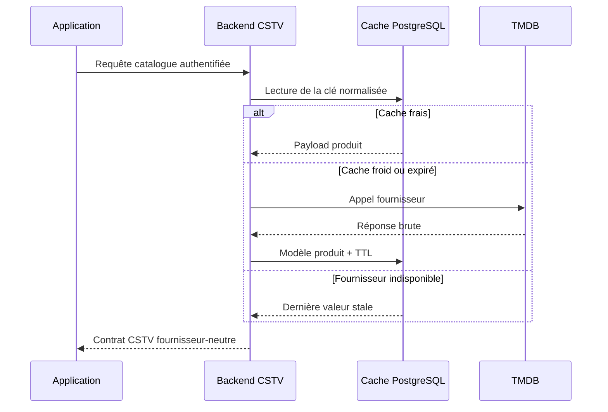

# T22 - Centralisation des appels TMDB dans le backend

## Informations générales

Status:
RELEASED

Created:
2026-08-15

Dépendances:
Aucune. Bloquant pour F44 (restriction par âge).

---

# 1. Description

L'application interroge TMDB directement (`data/remote/api/TmdbApiService.kt`,
clé lue depuis `local.properties`). Cette tâche déplace **l'intégralité** de ces
appels derrière le backend CSTV (`backend/`, déjà déployé sur alwaysdata) :

- l'application n'appelle plus que le backend, avec son authentification
  existante ;
- le backend interroge TMDB, met en cache les réponses et sert tous les
  utilisateurs depuis ce cache ;
- la clé TMDB disparaît de l'application et de ses artefacts de build ;
- le contrat exposé à l'application est **indépendant du fournisseur** : changer
  TMDB pour une autre source ne nécessite plus de mise à jour de l'application.

---

# 2. Contexte

Trois limites de la situation actuelle :

1. **Volume d'appels.** Chaque installation interroge TMDB pour son propre
   compte : tendances, fiches, notes, bandes-annonces, appariement du catalogue.
   Les mêmes données sont retéléchargées par chaque appareil, et les quotas TMDB
   sont consommés sans mutualisation.
2. **Fournisseur figé dans l'application.** Le format TMDB est propagé jusqu'aux
   DTO. Changer de source imposerait une nouvelle version de l'application, avec
   le délai d'adoption que cela suppose.
3. **Clé embarquée.** La clé vit dans l'APK. Sa rotation impose une livraison.

Le backend existe déjà, avec authentification, quotas et durcissement HTTP
(T14, T16, T17, T18) : il fournit le socle nécessaire.

---

# 3. Objectif

- Aucun appel réseau de l'application vers TMDB, ni aucune clé TMDB dans l'APK.
- Le nombre d'appels sortants vers TMDB devient indépendant du nombre
  d'utilisateurs pour les données partagées.
- Le contrat backend est exprimé dans le vocabulaire du produit, pas dans celui
  de TMDB.
- Une indisponibilité du backend ne dégrade que les enrichissements, jamais la
  navigation ni la lecture.
- Aucun changement visible pour l'utilisateur en fonctionnement nominal.

---

# 4. Décisions produit prises à l'étape 1

| Sujet | Décision |
|---|---|
| Périmètre | **Tous** les appels TMDB existants, migrés d'un bloc : tendances, fiches, notes, bandes-annonces, appariement. Pas de migration progressive, pas de double chemin durable. |
| Backend injoignable | Dégradation silencieuse : cache local, puis absence d'enrichissement. Pas de repli sur un appel TMDB direct (qui imposerait de conserver la clé), pas de message d'erreur. |
| Cache serveur | Cache partagé entre tous les utilisateurs, avec des durées de validité différenciées selon le type de donnée (tendances : heures ; fiches et classifications : semaines). |
| Contrat d'API | Exprimé dans le vocabulaire du produit, sans exposer la forme des réponses TMDB. |
| Plateformes | Sans objet côté UI ; s'applique à mobile et TV par construction. |

## Décisions produit prises à l'étape 6

| Sujet | Décision |
|---|---|
| Classification FR (`ageRatingFr`) | Implémentée **dans T22**, pas reportée à F44 : le provider TMDB doit récupérer la classification française (`release_dates` pour les films, `content_ratings` pour les séries) et l'exposer dans le contrat, avec le TTL de 30 jours déjà prévu au §8.3. Le champ ne doit plus être renvoyé constamment nul. |
| Verrou anti-stampede | `SET LOCAL lock_timeout` court + `pg_try_advisory_xact_lock` : une requête qui n'obtient pas le verrou sert la copie périmée ou répond `CATALOG_PROVIDER_UNAVAILABLE`, au lieu d'attendre la fin de l'appel fournisseur. Une lenteur TMDB ne doit jamais immobiliser plusieurs connexions PostgreSQL et workers PHP-FPM. |

## Décisions produit prises à l'étape 2

| Sujet | Décision |
|---|---|
| Images (affiches, jaquettes) | Chargées directement par l'application depuis le CDN d'images du fournisseur, sans passer par le backend. Le backend construit et renvoie l'URL complète (pas un chemin brut), donc l'app ne connaît pas le fournisseur — le contrat reste indépendant du fournisseur malgré ce contournement du proxy. Aucune clé n'est nécessaire pour charger une image (URLs publiques) : l'objectif « zéro clé dans l'APK » reste respecté. |
| Cache local applicatif | Conservé, en plus du cache serveur, mais à courte durée (quelques heures — détail exact à l'étape 3). Objectif : éviter de resolliciter le backend à chaque navigation dans une même session et améliorer la résilience aux coupures réseau courtes, sans dupliquer la logique fine de fraîcheur du cache serveur qui reste la source de vérité. |

---

# 5. Hypothèses

- L'hébergement alwaysdata supporte le volume d'appels et le stockage de cache
  nécessaires, sans dépasser les quotas du plan actuel.
- Les conditions d'utilisation de TMDB autorisent un relais serveur mutualisé
  avec cache. **À vérifier explicitement avant l'étape 3.**
- Le cache peut être partagé sans donnée personnelle : les requêtes portent sur
  des titres et des identifiants d'œuvres, pas sur des profils.
- Les données d'appariement (recherche par titre et année) sont assez répétitives
  entre utilisateurs pour que le cache soit efficace.
- L'authentification backend existante suffit ; aucun nouveau mécanisme d'accès
  n'est requis.
- La liste exhaustive des appels TMDB actuels est identifiable dans le dépôt
  (`TmdbApiService`, `TmdbCatalogMatcher`, écrans Accueil, fiches, bandes-annonces).

---

# 6. Questions ouvertes

| Point traité à l'étape 3 | Décision |
|---|---|
| TTL serveur | Tendances et populaires : 6 h ; recherche/appariement : 7 j ; bandes-annonces : 7 j ; fiches et classifications : 30 j ; absence de résultat : 24 h. Une copie périmée peut être servie 7 jours de plus si TMDB est indisponible. |
| Appariement | La normalisation et la sélection dans le catalogue IPTV restent locales (T21). Le backend résout uniquement la requête produit `type + titre + année` vers une identité média canonique et ses métadonnées. Aucun catalogue IPTV n'est envoyé au serveur. |
| Secret TMDB | Clé exclusivement dans `TMDB_API_TOKEN` du backend et dans `~/.cstv-production.env`. Suppression du champ `BuildConfig.TMDB_API_KEY`, du provider Hilt et de toute lecture de `local.properties` côté app. |
| Contrat et R8 | API versionnée sous `/v1/catalog`; nouvelle interface Retrofit `CstvCatalogApiService` avec règle `-keep` explicite. Les DTO n'exposent aucun nom de champ TMDB. |
| Cache local | TTL fixe de 4 h, indépendant du TTL serveur. Il amortit une session et sert le mode dégradé sans dupliquer les règles de fraîcheur du fournisseur. |
| Absence d'enrichissement | Réponse HTTP 200 avec `status = matched|not_found` et `item` nullable. Les pannes du fournisseur sont des 502/503 côté backend, ou une réponse cache périmée marquée `stale`; elles ne sont jamais confondues avec `not_found`. |

Aucune question technique bloquante ne reste ouverte. La mise en production
reste conditionnée au respect de la licence TMDB applicable au projet et à
l'attribution officielle dans l'écran À propos.

---

## Arbitrages structurants ratifiés à l'étape 3

| Sujet | Décision |
|---|---|
| Nouvelle dépendance backend | `ext-curl` ajouté à `backend/composer.json` — validé. **À vérifier avant la livraison** : que l'extension est bien activée sur l'hébergement alwaysdata, faute de quoi le déploiement échouera après coup. `composer.lock` doit être régénéré selon la procédure ciblée d'AGENTS.md, jamais par un `composer update` général. |
| Nouvelle surface d'API | 4 routes `/v1/catalog` (tendances, populaires, appariement, vidéos) derrière le middleware JWT existant — validé. |
| Cache serveur | Table PostgreSQL `media_metadata_cache` partagée entre tous les utilisateurs, sans donnée personnelle — validé. |

---

# 7. Spécification fonctionnelle

## 7.1 Résultat attendu

En fonctionnement nominal, aucun changement perceptible pour l'utilisateur :
mêmes écrans, mêmes données affichées. Ce qui change est invisible — la
source des données (backend CSTV au lieu de TMDB direct) — et se vérifie par
l'absence de tout appel réseau de l'app vers un domaine TMDB et l'absence de
clé TMDB dans l'APK.

## 7.2 Parcours utilisateur (nominal)

- **Accueil (tendances, F1)** : la section tendances demande sa liste
  d'œuvres au backend au lieu de TMDB directement. Aucun changement visible
  à l'écran.
- **Fiche film/série** : les enrichissements TMDB (note, bande-annonce)
  proviennent d'un appel backend paramétré avec le vocabulaire produit
  (titre, année, éventuellement identifiants du catalogue T21) plutôt que
  d'un appel direct à l'API TMDB.
- **Bande-annonce** : l'identifiant ou l'URL YouTube nécessaire à
  l'intégration du lecteur (périmètre validé AGENTS.md) provient de la
  réponse backend.
- **Appariement catalogue** (T21 → TMDB, utilisé pour F44 notamment) : la
  recherche par titre/année passe par un point d'entrée backend dédié, qui
  interroge TMDB et sert depuis son cache partagé.

## 7.3 Règles métier

- Migration en un seul bloc de tous les appels existants (décision étape 1) :
  après livraison, aucun code applicatif n'appelle plus directement l'API
  TMDB — seul le backend le fait.
- Le contrat backend expose des champs produit (ex. note, synopsis, URL de
  bande-annonce, URL d'affiche) plutôt que la structure brute des réponses
  TMDB, pour rester indépendant du fournisseur.
- Cache serveur partagé entre tous les utilisateurs, avec des durées
  différenciées par type de donnée (tendances : heures ; fiches et
  classifications : semaines — valeurs précises à l'étape 3).
- Cache local applicatif court terme en complément (décision étape 2),
  purgé automatiquement par expiration, jamais présenté comme à jour
  au-delà de sa durée de vie.

## 7.4 Cas limites

- **Backend injoignable ou en erreur** : dégradation silencieuse (décision
  étape 1) — l'écran s'affiche sans les enrichissements concernés, sans
  bandeau d'erreur, sans jamais bloquer la navigation ni la lecture. Si le
  cache local contient encore une réponse valide, elle est utilisée en
  attendant.
- **Backend joignable mais TMDB indisponible côté serveur** : le backend
  applique lui-même la dégradation silencieuse en interne (répond sans
  l'enrichissement plutôt que de propager une erreur à l'app) — contrat de
  réponse exact renvoyé à l'étape 3.
- **Œuvre absente de TMDB** (pas de correspondance trouvée) : réponse
  backend distincte d'une erreur technique. L'app affiche la fiche sans
  enrichissement, sans retenter en boucle.
- **Cache serveur froid** pour une donnée jamais demandée : la latence de
  l'appel TMDB initial est assumée par le premier appelant ; les suivants
  bénéficient du cache. Aucun préchauffage explicite prévu en V1.

## 7.5 Critères d'acceptation

- Aucun artefact de build (APK) ne contient de clé TMDB ni n'émet de requête
  réseau vers un domaine TMDB.
- Les écrans Accueil (tendances), fiche film/série et bande-annonce
  fonctionnent à l'identique en usage nominal, sans changement perceptible.
- Une indisponibilité du backend n'empêche jamais l'affichage d'une fiche,
  la navigation ni la lecture — seuls les enrichissements TMDB sont absents.
- L'appariement catalogue (T21) obtient ses correspondances via le backend,
  sans régression du taux de correspondance par rapport au comportement
  actuel (appel TMDB direct).

## 7.6 Gestion des erreurs

- Timeout ou erreur réseau vers le backend : traité comme une
  indisponibilité (dégradation silencieuse), jamais de message d'erreur
  technique affiché à l'utilisateur (cohérent avec AGENTS.md § Gestion des
  erreurs, même si ce flux reste secondaire par rapport à l'authentification
  ou à la lecture).
- Réponse backend malformée : traitée comme un enrichissement absent,
  journalisée côté application pour diagnostic (log, jamais affichée à
  l'utilisateur).

---

# 8. Spécification technique

## 8.1 Frontière de fournisseur

Le backend introduit un port fournisseur :

```php
interface MediaMetadataProvider
{
    public function trending(string $locale): array;
    public function popular(string $kind, int $page, string $locale): array;
    public function match(string $kind, string $title, ?int $year, string $locale): ?array;
    public function videos(string $canonicalId, string $locale): array;
}
```

`TmdbMediaMetadataProvider` est le seul composant qui connaît les routes, les
identifiants et les champs TMDB. Les actions HTTP, le cache et l'application ne
manipulent que des modèles produit (`CatalogItem`, `MediaMatch`,
`TrailerCandidate`, `AgeRating`). Le `canonicalId` retourné à l'app est une
chaîne opaque versionnée ; l'app la persiste ou la retransmet sans l'interpréter.

Le client HTTP serveur repose sur `ext-curl`, ajouté explicitement à
`backend/composer.json` et à l'image/validation d'environnement. Aucun SDK TMDB
tiers n'est ajouté. Connexion 3 s, timeout total 8 s, TLS obligatoire, deux
tentatives maximum uniquement sur erreurs réseau/429/5xx avec backoff et jitter.
La clé est envoyée en en-tête `Authorization: Bearer`, jamais dans les URLs ni
les logs.

## 8.2 Contrat HTTP CSTV

Toutes les routes sont protégées par le middleware JWT existant :

| Route | Usage |
|---|---|
| `GET /v1/catalog/trending?locale=fr-FR` | Tendances hebdomadaires. |
| `GET /v1/catalog/popular?kind=movie|series&page=1&locale=fr-FR` | Populaires paginés. |
| `POST /v1/catalog/matches` | Résolution d'une œuvre par `kind`, `title`, `year`, `locale`. |
| `GET /v1/catalog/items/{canonicalId}/videos?locale=fr-FR` | Bande-annonce et vidéos candidates. |

`POST /matches` évite les titres dans la query string et donc dans les access
logs. Le backend normalise la clé de cache mais ne conserve pas de catalogue
IPTV ni de relation utilisateur ↔ média.

Réponse d'appariement :

```json
{
  "status": "matched",
  "item": {
    "id": "opaque-id",
    "kind": "movie",
    "title": "Titre",
    "originalTitle": "Original title",
    "releaseYear": 2024,
    "overview": "…",
    "rating": 7.4,
    "posterUrl": "https://…",
    "backdropUrl": "https://…",
    "ageRatingFr": 12
  },
  "cache": {"stale": false}
}
```

`ageRatingFr` vaut `0`, `10`, `12`, `16`, `18` ou `null`. Les URLs d'images
sont complètes, HTTPS et issues de la configuration fournisseur côté backend ;
le contrat ne renvoie jamais `poster_path` ou une base URL TMDB.

Les erreurs du fournisseur ne sont pas converties en `not_found` : si aucune
copie périmée n'est disponible, le backend répond avec l'erreur CSTV
`CATALOG_PROVIDER_UNAVAILABLE` (503) ou `CATALOG_PROVIDER_BAD_RESPONSE` (502).
L'application mappe ces réponses vers l'absence silencieuse d'enrichissement.

## 8.3 Cache serveur partagé

Migration PostgreSQL `006_media_metadata_cache.sql` — `backend/migrations/`
s'arrête à `005_playback_locks.sql` à la rédaction de cette fiche, mais F44
ajoute lui aussi une migration backend : **le numéro se prend au moment de la
livraison**, pas ici (voir T21 §8.5 pour la même règle côté Room) :

```sql
CREATE TABLE media_metadata_cache (
    cache_key VARCHAR(255) PRIMARY KEY,
    payload JSONB NOT NULL,
    result_status VARCHAR(16) NOT NULL,
    expires_at TIMESTAMPTZ NOT NULL,
    stale_until TIMESTAMPTZ NOT NULL,
    updated_at TIMESTAMPTZ NOT NULL DEFAULT NOW()
);
CREATE INDEX media_metadata_cache_expiry_idx
    ON media_metadata_cache (expires_at);
```

La clé est un SHA-256 de `contractVersion|operation|locale|arguments
normalisés`. Le payload ne contient aucune donnée personnelle. Un verrou
advisory PostgreSQL par `cache_key` empêche le *cache stampede* : un seul appel
TMDB remplit une clé froide, les requêtes concurrentes relisent ensuite le
résultat. Le traitement suit `fresh → refresh → stale-if-error → erreur`.

TTL :

| Donnée | TTL frais | Cache négatif |
|---|---:|---:|
| Tendances / populaires | 6 h | n/a |
| Appariement titre + année | 7 j | 24 h |
| Vidéos / bande-annonce | 7 j | 24 h |
| Fiche / classification FR | 30 j | 24 h |

Toute valeur positive peut être servie jusqu'à 7 jours après expiration en cas
de panne fournisseur, avec `cache.stale = true`. Une tâche opportuniste purge
les lignes dont `stale_until` est dépassé ; aucun cron n'est requis en V1.

## 8.4 Cache et repositories Android

Une interface Retrofit dédiée `CstvCatalogApiService` utilise le Retrofit CSTV
existant (`@Named("cstv")`) et son authentification. Les DTO vivent dans
`data/remote/dto/CatalogDtos.kt` et sont immédiatement mappés vers des modèles
de domaine.

Les repositories `TrendingRepositoryImpl`, `PopularRepositoryImpl` et
`TrailerRepositoryImpl` ne dépendent plus de `TmdbApiService` ni d'une clé.
Leurs caches existants sont conservés, renommés pour retirer `tmdb` de leurs
clés, et utilisent un TTL positif fixe de 4 heures. Le cache négatif local des
bandes-annonces est ramené à 4 heures ; le backend porte désormais le cache
négatif long. Une réponse locale expirée n'est utilisée que pendant une erreur
réseau dans la limite de 24 heures, marquée en mémoire comme donnée de repli.

T21 reste responsable du titre canonique local et de l'appariement avec les
entrées IPTV. Le backend retourne l'identité et les métadonnées de l'œuvre ;
`TmdbCatalogMatcher` est renommé ultérieurement en `CatalogMatcher` ou reçoit
des types fournisseur-neutres, mais l'algorithme de correspondance au catalogue
reste dans l'application.

## 8.5 Secret, configuration et build

- `Config` ajoute `tmdbApiToken`, obligatoire en production, nullable en test
  pour permettre un faux provider ;
- `.env.example` ajoute `TMDB_API_TOKEN=` sans valeur ;
- `~/.cstv-production.env` reçoit la vraie valeur via le processus de
  déploiement, jamais via Git ;
- `app/build.gradle.kts` supprime la lecture `TMDB_API_KEY` et le
  `buildConfigField` correspondant ;
- `TmdbApiService.kt`, `@TmdbApiKey` et `provideTmdbApiService` sont supprimés ;
- `app/proguard-rules.pro` remplace la règle TMDB par une règle explicite pour
  `CstvCatalogApiService` ;
- l'API reste sous `/v1`; toute rupture future du schéma produit impose `/v2`
  ou une nouvelle représentation compatible, jamais l'exposition du JSON TMDB.

La documentation officielle TMDB impose l'attribution et distingue l'usage
commercial de l'usage développeur. L'écran À propos doit conserver le logo et
la mention officielle. La livraison commerciale nécessite la licence adaptée ;
le relais serveur et ses TTL ne valent pas autorisation juridique implicite.

## 8.6 Sécurité, quotas et observabilité

- validation stricte de `kind`, `locale`, `page`, longueur de titre (200) et
  plage d'année ;
- rate limit par compte/IP sur `/matches` afin d'éviter que le backend ne
  devienne un proxy arbitraire ;
- `canonicalId` est validé par le codec interne et ne devient jamais une URL ;
- logs structurés : opération, hit/miss/stale, durée, statut fournisseur,
  jamais le token ni le titre brut ;
- métriques minimales : taux de hit, appels sortants, 429/5xx, latence p95,
  taille et ancienneté du cache ;
- réponse `Cache-Control: private, max-age=300` au client : le cache applicatif
  reste maître et aucun proxy partagé ne mélange les réponses authentifiées.

## 8.7 Tests automatisés

Backend : tests unitaires du mapping fournisseur, TTL, clés de cache et
stale-if-error ; tests d'intégration PostgreSQL du verrou/cache ; tests
fonctionnels des quatre routes avec faux provider, authentification, validation,
`matched`, `not_found`, 502 et 503. Aucun test ne contacte TMDB.

Android : tests des DTO/mappers, des repositories cache frais/périmé/repli, de
l'absence d'appel direct, de la dégradation silencieuse et du matcher avec les
types neutres. Le build release vérifie que `TMDB_API_KEY` et
`api.themoviedb.org` ne sont plus présents dans les artefacts textuels générés.

## 8.8 Fichiers impactés ou nouveaux

**Backend nouveaux** : `Catalog/MediaMetadataProvider.php`,
`Catalog/TmdbMediaMetadataProvider.php`, `Catalog/TmdbClient.php`,
`Catalog/MediaMetadataCacheRepository.php`, `Catalog/CatalogService.php`,
`Http/Action/CatalogAction.php`, migration `006_media_metadata_cache.sql` et
tests associés.

**Backend modifiés** : `composer.json`, `composer.lock`, `Bootstrap.php`,
`Shared/Config.php`, `.env.example`, `openapi.yaml`, scripts/configuration de
déploiement.

**Android nouveaux** : `data/remote/api/CstvCatalogApiService.kt`,
`data/remote/dto/CatalogDtos.kt`, modèles et mappers produit neutres.

**Android modifiés/supprimés** : `AppModule.kt`, `build.gradle.kts`,
`proguard-rules.pro`, `TrendingRepositoryImpl.kt`, `PopularRepositoryImpl.kt`,
`TrailerRepositoryImpl.kt`, `TmdbCatalogMatcher.kt` et ses consommateurs ;
suppression de `TmdbApiService.kt` et des DTO exclusivement fournisseur qui ne
sont plus utilisés.

---

# 9. Architecture

## 9.1 Flux nominal et dégradé



## 9.2 Responsabilités

- **Application** : cache court, affichage, dégradation silencieuse et
  rapprochement avec le catalogue local T21 ; aucune connaissance de TMDB.
- **Actions/Service catalogue** : validation, contrat HTTP et orchestration
  cache/fournisseur ; aucune logique spécifique TMDB dans les contrôleurs.
- **Provider TMDB** : traduction unique du fournisseur vers le modèle produit.
- **Cache PostgreSQL** : mutualisation, verrou anti-stampede, cache négatif et
  stale-if-error.
- **Configuration** : secret et licence gérés au déploiement backend.

## 9.3 Risques et garde-fous

- quota/429 : cache partagé, verrou par clé, backoff borné et métriques ;
- croissance PostgreSQL : payloads compacts, TTL, purge opportuniste et index
  d'expiration ;
- changement TMDB : seul l'adapter fournisseur change ; contrat `/v1/catalog`
  et tests fonctionnels protègent l'app ;
- indisponibilité backend : caches locaux puis absence d'enrichissement, jamais
  blocage de navigation ou de lecture ;
- conformité : attribution obligatoire et validation de la licence avant
  production commerciale.

---

# 10. Plan de développement

Le backend se construit et se teste sans l'application (faux provider,
tests fonctionnels des routes). Les tâches 1 à 6 sont donc réalisables et
déployables sur un environnement de test avant qu'aucune tâche Android ne
commence. Les tâches 7 à 10 câblent l'application sur ce backend déjà en
place. La tâche 11 (suppression de l'ancien code) ne doit être faite qu'une
fois les tâches 7 à 10 vertes, pour ne jamais casser le build entre deux
commits.

- [ ] 1. Backend — dépendance `ext-curl` et vérification d'hébergement

Objectif:
Ajouter la dépendance validée à l'étape 3 et s'assurer qu'elle est utilisable
en production avant de construire quoi que ce soit dessus.

Fichiers:
- `backend/composer.json`, `backend/composer.lock` (procédure ciblée
  AGENTS.md — jamais `composer update` général)

Validation:
`composer validate --no-check-publish --strict` (procédure Docker décrite
dans AGENTS.md). Vérification manuelle, avant de poursuivre, que `ext-curl`
est disponible sur l'hébergement alwaysdata cible — sinon la suite du
ticket construit sur une hypothèse fausse.

---

- [ ] 2. Backend — migration PostgreSQL du cache partagé

Objectif:
Créer `media_metadata_cache` (§8.3), avec le numéro de migration réellement
disponible au moment de l'exécution (vérifier `backend/migrations/`, pas la
fiche — même règle que T21 §8.5).

Fichiers:
- `backend/migrations/0XX_media_metadata_cache.sql` (nouveau, numéro à
  vérifier)

Validation:
Migration appliquée sur l'environnement Docker de dev (`docker compose`,
patron des migrations existantes). Table et index d'expiration créés,
rollback si le projet en a la convention.

---

- [ ] 3. Backend — port fournisseur et client TMDB

Objectif:
Implémenter `MediaMetadataProvider` (interface), `TmdbMediaMetadataProvider`
et `TmdbClient` (§8.1) : seul composant qui connaît les routes et champs
TMDB, timeouts et retries sur erreurs réseau/429/5xx, clé en en-tête
`Authorization: Bearer` jamais journalisée.

Fichiers:
- `backend/src/Catalog/MediaMetadataProvider.php` (nouveau)
- `backend/src/Catalog/TmdbMediaMetadataProvider.php` (nouveau)
- `backend/src/Catalog/TmdbClient.php` (nouveau)
- tests unitaires du mapping fournisseur → modèle produit (nouveau)

Validation:
Tests unitaires avec faux transport HTTP (pas d'appel réseau réel vers TMDB,
conformément à AGENTS.md et §8.7) : mapping correct des 4 opérations,
gestion des 429/5xx avec backoff, jamais la clé dans un message d'erreur ou
un log.

---

- [ ] 4. Backend — cache partagé, verrou anti-stampede, stale-if-error

Objectif:
Implémenter `MediaMetadataCacheRepository` : lecture/écriture par
`cache_key` (SHA-256 normalisé), verrou advisory PostgreSQL par clé, cycle
`fresh → refresh → stale-if-error → erreur`, TTL différenciés (§8.3).

Fichiers:
- `backend/src/Catalog/MediaMetadataCacheRepository.php` (nouveau)
- tests d'intégration PostgreSQL du verrou/cache (nouveau)

Validation:
Tests d'intégration : deux lectures concurrentes sur une clé froide ne
déclenchent qu'un seul appel fournisseur ; une entrée expirée mais dans la
fenêtre `stale_until` est servie marquée `stale` sur panne fournisseur ; les
TTL du tableau §8.3 sont respectés.

---

- [ ] 5. Backend — routes HTTP, validation, quotas

Objectif:
Exposer les 4 routes `/v1/catalog/*` (§8.2) derrière le middleware JWT
existant, avec validation stricte des paramètres et rate limit sur
`/matches` (§8.6).

Fichiers:
- `backend/src/Catalog/CatalogService.php` (nouveau, orchestration)
- `backend/src/Http/Action/CatalogAction.php` (nouveau)
- `backend/openapi.yaml` (mis à jour)
- tests fonctionnels des 4 routes (nouveau) : faux provider, authentification,
  validation, `matched`, `not_found`, 502, 503

Validation:
Tests fonctionnels verts pour chaque route et chaque cas de la matrice
ci-dessus, aucun test ne contacte TMDB (§8.7). Réponse d'appariement conforme
au contrat JSON de §8.2, `ageRatingFr` dans l'ensemble `{0,10,12,16,18,null}`.

---

- [ ] 6. Backend — secrets, configuration, documentation de déploiement

Objectif:
Sortir la clé du code et documenter son emplacement de production, sans
jamais la faire transiter par Git (§8.5).

Fichiers:
- `backend/src/Shared/Config.php` (`tmdbApiToken`)
- `backend/.env.example` (`TMDB_API_TOKEN=`)
- documentation de déploiement (`~/.cstv-production.env`, hors dépôt)

Validation:
`grep` sur le dépôt confirmant l'absence de toute clé TMDB en clair. Le
backend démarre en échouant proprement si `TMDB_API_TOKEN` est absent en
production, et fonctionne en test avec un faux provider sans token.

---

- [ ] 7. Android — client HTTP et DTO du contrat CSTV

Objectif:
Poser l'interface Retrofit `CstvCatalogApiService` sur le Retrofit CSTV
existant, ses DTO et leurs mappers vers des modèles produit neutres — sans
encore les brancher aux repositories.

Fichiers:
- `data/remote/api/CstvCatalogApiService.kt` (nouveau)
- `data/remote/dto/CatalogDtos.kt` (nouveau)
- modèles et mappers produit neutres (nouveau)
- `app/proguard-rules.pro` (règle `-keep` pour la nouvelle interface —
  obligation AGENTS.md)

Validation:
Tests unitaires des mappers DTO → domaine sur des réponses « sales »
(champ manquant, `item` nul, `ageRatingFr` nul), conformément à AGENTS.md
§ Stratégie de tests. Compile en configuration release avec la règle R8.

---

- [ ] 8. Android — bascule des repositories tendances/populaires/bandes-annonces

Objectif:
`TrendingRepositoryImpl`, `PopularRepositoryImpl` et `TrailerRepositoryImpl`
consomment `CstvCatalogApiService` au lieu de `TmdbApiService`, avec le
cache local 4 h et le repli sur cache expiré en cas d'erreur réseau (§8.4).

Fichiers:
- `data/repository/TrendingRepositoryImpl.kt`, `PopularRepositoryImpl.kt`,
  `TrailerRepositoryImpl.kt`
- tests de repository existants, adaptés

Validation:
Tests avec client HTTP fake (AGENTS.md § Stratégie de tests) : cache frais
servi sans appel, cache expiré servi en repli sur erreur réseau dans la
limite de 24 h, dégradation silencieuse sans exception remontée à l'UI sur
échec total.

---

- [ ] 9. Android — appariement catalogue sur le contrat backend

Objectif:
`TmdbCatalogMatcher` (ou son successeur) résout les correspondances via
`POST /matches` au lieu d'un appel TMDB direct ; l'algorithme de
correspondance au catalogue local (T21) ne change pas.

Fichiers:
- `domain/model/TmdbCatalogMatcher.kt` et ses consommateurs

Validation:
Tests existants de correspondance toujours verts, sans changement du taux
de correspondance attendu (§7.5) — seule la source de données change.

---

- [ ] 10. Android — suppression du chemin TMDB direct

Objectif:
Retirer tout ce qui n'a plus de raison d'exister une fois les tâches 7 à 9
vertes : ancienne interface, clé, configuration de build.

Fichiers:
- suppression : `data/remote/api/TmdbApiService.kt`, `@TmdbApiKey`,
  `provideTmdbApiService` (`AppModule.kt`)
- `app/build.gradle.kts` (retrait de la lecture `TMDB_API_KEY` et du
  `buildConfigField`)
- suppression des DTO exclusivement fournisseur devenus inutilisés

Validation:
`./gradlew assembleRelease` : le build release échoue si un chemin de code
référence encore `TMDB_API_KEY`. Recherche dans les artefacts textuels
générés confirmant l'absence de `api.themoviedb.org` et de toute clé
(§8.7) — c'est le critère d'acceptation central du ticket (§7.5).

---

- [ ] 11. Non-régression et documentation de conformité

Objectif:
Vérifier l'ensemble du ticket avant review, et traiter le point de
conformité identifié à l'étape 3 (attribution TMDB, licence).

Fichiers:
- écran « À propos » (logo et mention TMDB, si non déjà présents)
- l'ensemble des fichiers listés en §8.8

Validation:
`./gradlew assembleDebug`, `./gradlew testDebugUnitTest`, `./gradlew
lintDebug` verts côté Android ; suite PHPUnit verte côté backend. Aucun
appel réseau de test ne contacte un domaine TMDB réel. Déploiement backend
via `scripts/deploy-backend.sh --dry-run` avant le déploiement réel
(AGENTS.md § Déploiement du backend).

---

# 11. Notes de développement

## Étape 5 — 2026-08-16 — Implémentation en cours

- Ajout de la migration `006_media_metadata_cache`, du port fournisseur, client
  TMDB backend, cache partagé avec verrou advisory, service et routes JWT
  `/v1/catalog` documentées dans OpenAPI.
- Ajout du client Retrofit CSTV produit-neutre et bascule des chemins de
  tendances, populaires et bandes-annonces : l'application ne construit plus
  de requête directe vers `api.themoviedb.org` et ne lit plus `TMDB_API_KEY`.
- Restent à terminer avant review : tests backend avec faux provider, adaptation
  complète des tests Android existants au nouveau contrat, appariement T21,
  régénération ciblée de `composer.lock` et validation complète.

## Étape 5 — 2026-08-16 — Contrôles d'implémentation

- `CstvCatalogApiService` et ses DTO produit-neutres remplacent le chemin direct
  TMDB des tendances, populaires et bandes-annonces ; `TMDB_API_KEY`, son
  `BuildConfig`, le provider Hilt et l'interface Retrofit directe sont retirés.
- `backend/tests/Integration/CatalogApiTest.php` injecte un faux provider : les
  quatre routes, le JWT, les entrées invalides et `matched` / `not_found` sont
  couverts sans contacter TMDB (`OK — 2 tests, 9 assertions`).
- `composer update --lock --no-install` puis `composer validate --strict` sont
  verts dans le conteneur ; `ext-curl` est déclaré.
- Android : `testDebugUnitTest` terminé, `assembleDebug` vert et `lintDebug`
  vert. `git diff --check` vert. L'exécution complète PHPUnit reste à isoler
  en étape 6 : ses tests de concurrence E2E exigent la stack Nginx dédiée et
  échouent avec un statut HTTP 0 lorsqu'elle n'est pas joignable.

---

# 12. Review

## Étape 6 — 2026-08-16 — Review technique

Périmètre relu : diff complet de l'arbre de travail (backend `Catalog/`,
`CatalogAction`, migration 006, `Bootstrap`, `Config`, `openapi.yaml`,
`composer.json` ; Android `CstvCatalogApiService`, `CatalogDtos`, les trois
repositories, `AppModule`, `build.gradle.kts`, `proguard-rules.pro`, tests).

Validations exécutées pendant la review :

| Commande | Résultat |
|---|---|
| `./gradlew testDebugUnitTest --rerun-tasks` | vert — 1017 tests, 0 échec |
| `./gradlew lintDebug` | vert |
| `vendor/bin/phpunit --testsuite Unit,Integration` (conteneur `php-test`) | **rouge — 124 tests, 8 échecs** |
| `grep` clé/domaine TMDB dans `app/src` | aucune occurrence de `TMDB_API_KEY` ni `themoviedb` |

Sur les 8 échecs PHPUnit, 7 sont les `ConcurrencyTest` déjà connus (statut HTTP 0
sans la stack Nginx) et **1 est causé par ce ticket** (voir C2).

## Critique

### C1 — Suppression massive de tests de non-régression sans rapport avec T22

**Description.** Les trois fichiers de tests de repositories passent de 652 à 74
lignes : 28 tests supprimés. Beaucoup ne testaient pas TMDB mais la logique de
cache et de résolution, inchangée par ce ticket :
`getCachedMatchedMovies_skipsCacheOnFirstAccessThenServesIt`,
`getCachedMatchedMovies_andSeries_haveIndependentSessionGates`,
`isSeriesCacheExpired_isTrueWhenTheCatalogWasResyncedAfterTheCacheWasSaved`,
`isMoviesCacheExpired_isFalseWithinTheNominalCacheDuration`,
`normalizeYouTubeId_acceptsOnlySupportedForms`,
`getTrailerPreview_usesFreshPersistentEntryWithoutNetworkCall`,
`getTrailerPreview_doesNotPersistNetworkFailure`,
`getTrailerPreview_prefersXtreamAndCachesResult`,
`clearSessionCache_forcesFreshResolutionIncludingNegativeEntries`,
`test_getCachedMatchedTrendsGlobal_servesExpiredCache_whenIgnoreExpirationIsTrue`,
etc.

**Impact.** Violation directe d'AGENTS.md § Stratégie de tests / Non-régression
(« jamais supprimer ni désactiver pour faire passer build sans validation
explicite »). Le gate de session, l'invalidation par resynchronisation du
catalogue, la préférence Xtream sur le fallback et la non-persistance des échecs
réseau ne sont plus couverts : une régression sur ces comportements passerait
désormais inaperçue. La suite Android reste verte, ce qui donne une fausse
impression de sécurité.

**Correction attendue.** Restaurer ces tests en n'adaptant que la source de
données (mock `CstvCatalogApiService` à la place de `TmdbApiService`). Seuls
peuvent disparaître les tests devenus sans objet : ceux qui vérifiaient le
comportement à clé TMDB vide (`getPopularSeries_returnsEmptyWithoutApiKey`,
`test_getTrending_returnsEmptyList_ifApiKeyIsBlank`) et le parsing de dates brutes
TMDB (`test_getTrending_mapsMalformedDatesToNull`), désormais du ressort du
backend — ce dernier devant y gagner un test unitaire côté provider.

### C2 — La suite de tests backend est rouge : `MigrationTest` non mis à jour

**Description.** `backend/tests/Integration/MigrationTest.php:20` code en dur la
liste des migrations attendues et `:29` celle des tables. La migration `006` et la
table `media_metadata_cache` n'y ont pas été ajoutées :

```
8) MigrationTest::testMigrationsBuildAnEmptyPostgresqlSchemaAndAreIdempotent
   +    5 => '006_media_metadata_cache.sql',
```

**Impact.** Le ticket livre une suite backend rouge. Les notes d'étape 5
affirment que seuls les tests de concurrence E2E échouent, faute de stack Nginx :
c'est inexact, et la vérification n'a manifestement porté que sur
`CatalogApiTest` isolé. Par ricochet, l'idempotence de la migration 006 et la
forme finale du schéma n'ont jamais été validées (les assertions suivantes ne sont
pas atteintes).

**Correction attendue.** Ajouter `006_media_metadata_cache.sql` à la liste des
migrations, `media_metadata_cache` à celle des tables et
`media_metadata_cache_expiry_idx` aux index vérifiés, puis exécuter la suite
`Unit,Integration` complète et reporter le résultat réel dans les notes.

## Majeur

### M1 — `ageRatingFr` n'est jamais alimenté en production

`TmdbMediaMetadataProvider::item()` (ligne 50) fixe `'ageRatingFr' => null` en
dur ; aucun appel `release_dates` / `content_ratings` n'existe, et le TTL
« Fiche / classification FR : 30 j » du §8.3 n'a aucun code correspondant. Le
faux provider de `CatalogApiTest` renvoie `12`, ce qui masque le trou : le test
valide un contrat que la production ne remplit pas. T22 étant déclaré bloquant
pour F44 (restriction par âge), F44 resterait bloqué après livraison.
**Correction attendue** (décision d'étape 6) : implémenter la récupération de la
classification FR dans le provider, avec son TTL de 30 jours, et couvrir le
mapping par un test unitaire — le faux provider ne suffit pas à prouver ce point.

### M2 — L'application interprète le `canonicalId`, censé être opaque

`TrendingRepositoryImpl` et `PopularRepositoryImpl` font
`item.id?.substringAfter(':')?.toIntOrNull()`, et `TrailerRepositoryImpl`
reconstruit `"movie:$tmdbId"` / `"series:$tmdbId"`. Le §8.1 dit exactement
l'inverse : « chaîne opaque versionnée ; l'app la persiste ou la retransmet sans
l'interpréter ». C'est l'objectif n°3 du ticket (contrat indépendant du
fournisseur) qui est perdu : tout changement de format d'identité côté backend
fait renvoyer `null` à `toIntOrNull()`, donc `mapNotNull` vide l'Accueil
**silencieusement**, sans erreur ni log. **Correction attendue** : transporter
l'identité sous forme de `String` de bout en bout (champ `canonicalId` porté par
`TrendingTitle`, transmis tel quel à `videos`), et ne conserver l'entier que si
un besoin local de T21 l'exige, alimenté par un champ produit dédié.

### M3 — La clé de cache serveur n'est pas normalisée

`CatalogService::resolve` (ligne 25) hache `json_encode($args)` brut.
`"Dune"`, `"dune"` et `" Dune "` produisent trois clés, donc trois appels TMDB et
trois lignes de cache. Le §8.2 (« Le backend normalise la clé de cache ») et le
§8.3 (« arguments normalisés ») ne sont pas tenus, et l'objectif « nombre d'appels
sortants indépendant du nombre d'utilisateurs » est directement affaibli sur
l'opération la plus volumineuse. **Correction attendue** : normaliser titre et
locale (trim, casse, espaces multiples, accents) avant hachage — l'algorithme
existe déjà côté app depuis T21.

### M4 — Aucun rate limit sur `POST /v1/catalog/matches`

Le §8.6 l'exige explicitement (« éviter que le backend ne devienne un proxy
arbitraire ») et la tâche 5 le liste dans son objectif. `CatalogAction` ne fait
aucune limitation, et l'infrastructure existante (`ClientIp::rateLimitKey`,
table `auth_verify_attempts`, utilisée par `AuthService`) n'est pas réutilisée.
Combiné à M3 et M5, un compte authentifié peut générer un volume d'appels TMDB
non borné et faire croître `media_metadata_cache` sans limite. **Correction
attendue** : limite par compte et par IP sur `/matches`, sur le modèle de
`AuthService`, avec un test fonctionnel du dépassement.

### M5 — `locale` acceptée sans liste blanche

`CatalogAction::locale()` valide `^[a-z]{2}-[A-Z]{2}$`, soit ~457 000 valeurs
acceptées, chacune créant une clé de cache distincte et un appel TMDB. L'app
n'émet que `fr-FR`. Le §8.6 demande une « validation stricte ». **Correction
attendue** : liste blanche (`fr-FR`, et `en-US` si utile), rejet en 422 sinon.

### M6 — Appel réseau fournisseur à l'intérieur de la transaction verrouillée

`CatalogService::resolve` ouvre une transaction, prend `pg_advisory_xact_lock`,
puis exécute l'appel TMDB (jusqu'à 2 tentatives × 8 s, plus le backoff) avant de
commiter. `Connection.php` ne pose ni `statement_timeout` ni `lock_timeout` : les
requêtes concurrentes sur la même clé attendent, chacune en gardant une connexion
PostgreSQL **et** un worker PHP-FPM. Une lenteur TMDB se propage donc en
saturation de l'API entière, y compris pour l'authentification et la lecture —
exactement ce que le §7.4 interdit. **Correction attendue** (décision d'étape 6) :
`SET LOCAL lock_timeout` court et `pg_try_advisory_xact_lock` ; à défaut de
verrou, servir la copie périmée ou répondre `CATALOG_PROVIDER_UNAVAILABLE` plutôt
qu'attendre. Test d'intégration attendu sur le comportement concurrent (tâche 4,
non couverte aujourd'hui).

### M7 — Les personnes de `trending/all/week` sont mappées en séries

`TmdbMediaMetadataProvider::item()` déduit `kind = 'series'` dès que la clé `name`
existe (ligne 44). Une entrée `media_type: person` possède `id` et `name` : elle
produit un faux item série portant le nom d'un acteur, sans affiche ni année.
L'Accueil peut donc afficher des entrées absurdes et l'appariement T21 tenter de
les rapprocher du catalogue IPTV. **Correction attendue** : filtrer sur
`media_type ∈ {movie, tv}` avant mapping, avec un test unitaire sur une réponse
`trending` contenant une personne.

### M8 — `Cache-Control: private, max-age=300` est inopérant

`CatalogAction::respond()` pose l'en-tête, mais `SecurityHeadersMiddleware`
(lignes 34-37) réécrit `Cache-Control: no-store` pour tout chemin `/v1/`. La ligne
est du code mort et le §8.6 n'est pas tenu. **Correction attendue** : trancher —
soit exclure les routes catalogue du forçage `no-store`, soit retirer l'en-tête et
corriger le §8.6 ; dans les deux cas, un test fonctionnel doit figer le
comportement retenu.

### M9 — Le repli local sur cache expiré (24 h) n'est pas implémenté

Le §8.4 impose : « Une réponse locale expirée n'est utilisée que pendant une
erreur réseau dans la limite de 24 heures, marquée en mémoire comme donnée de
repli », et la validation de la tâche 8 l'exige explicitement. Aucun code
correspondant n'existe dans `TrendingRepositoryImpl` ni `PopularRepositoryImpl` :
seul le TTL est passé de 24 h à 4 h. Résultat, le passage de 24 h à 4 h **réduit**
la résilience hors ligne au lieu de la déplacer : au-delà de 4 h, une panne backend
donne un Accueil sans enrichissement alors que la fiche promet le repli.
**Correction attendue** : implémenter le repli sur entrée expirée (< 24 h) en cas
d'échec réseau, avec les tests de la tâche 8.

### M10 — TTL négatif des bandes-annonces resté à 7 jours

`TrailerRepositoryImpl:132` conserve `NEGATIVE_TTL_MS = 7L * 24 * 60 * 60 * 1000`,
et le commentaire lignes 103-104 parle toujours du « TTL négatif (7 jours) », alors
que le §8.4 acte 4 h côté app, le cache négatif long étant désormais porté par le
backend. Conséquence concrète : si le backend répond `200` avec une liste de vidéos
vide (fournisseur dégradé ou copie `stale`), l'échec est gravé localement pour
7 jours et la bande-annonce ne se relance plus, même après retour à la normale.
**Correction attendue** : ramener la constante à 4 h et mettre le commentaire en
cohérence.

### M11 — Couverture de tests backend très inférieure au §8.7

Livré : 2 tests / 9 assertions (`CatalogApiTest`). Exigé par le §8.7 et par les
validations des tâches 3, 4 et 5, et absent :

- tests unitaires du mapping fournisseur → modèle produit (tâche 3) ;
- gestion des 429/5xx, du backoff et de la non-journalisation du token (tâche 3) ;
- tests d'intégration PostgreSQL du verrou anti-stampede, des TTL différenciés et
  du `stale-if-error` (tâche 4) ;
- cas fonctionnels 502 et 503, et validation des paramètres autres que `kind`
  (tâche 5).

Les tâches 3 et 4 n'ont donc **aucune** preuve de validation. **Correction
attendue** : compléter la couverture avant l'étape 8 ; c'est aussi ce qui aurait
révélé M1, M3 et M7.

## Mineur

- **m1.** `POST /v1/catalog/matches` n'est appelé par aucun code applicatif : la
  route est exposée et testée, mais morte côté produit tant que la tâche 9
  (appariement T21 sur le contrat backend) n'est pas faite. À traiter à l'étape 7,
  ou à acter explicitement dans la fiche.
- **m2.** `app/src/main/java/com/cstv/app/data/remote/dto/TmdbVideoDto.kt` n'est
  plus référencé nulle part. Le §8.8 demandait la suppression des DTO exclusivement
  fournisseur devenus inutilisés.
- **m3.** `openapi.yaml` déclare les 4 routes sans paramètres (`kind`, `page`,
  `locale`), sans `requestBody` pour `/matches`, sans schéma de réponse ni codes
  422/502/503. Le contrat du §8.2 n'y est donc pas réellement documenté, alors que
  c'est le livrable de la tâche 5.
- **m4.** `CatalogAction` importe `Cstv\Backend\Shared\Validator` sans jamais
  l'utiliser, et réimplémente en interne des validations que `Validator`
  centralise pour les autres actions.
- **m5.** Densité de code hors norme du dépôt : `CatalogAction` (ligne la plus
  longue : 560 caractères, moyenne 126) et `TmdbMediaMetadataProvider` (588)
  contre 120 à 271 pour les actions existantes. Les diffs et la relecture en
  souffrent ; à ramener au style local.
- **m6.** `MediaMetadataCacheRepository::purge()` est appelé à chaque écriture et
  exécute `DELETE ... WHERE stale_until <= NOW()` alors que le seul index porte sur
  `expires_at` : parcours séquentiel systématique, à l'intérieur de la transaction
  qui tient le verrou. Indexer `stale_until` ou purger avec parcimonie.
- **m7.** Les logs structurés et les métriques du §8.6 (opération, hit/miss/stale,
  durée, statut fournisseur, latence p95, taille du cache) sont totalement absents :
  aucune observabilité sur le taux de hit, donc aucun moyen de vérifier l'objectif
  de mutualisation en production.
- **m8.** Tags et messages de log résiduels `"TMDB"` dans `TrendingRepositoryImpl`
  (lignes 65, 72, 77, 82, 88, 91, 117, 119), dont « ⚠️ TMDB response results are
  null! », alors que la source est désormais le backend CSTV.
- **m9.** Le renommage des fichiers de préférences (`tmdb_trends_cache` →
  `catalog_trends_cache`, idem populaires) laisse les anciens fichiers XML sur les
  appareils mis à jour, sans purge.
- **m10.** Une réponse fournisseur vide est mise en cache 6 h avec le statut
  `matched` (`items: []`) : un incident TMDB peut figer un Accueil vide pour 6 h,
  sans que le mécanisme `stale` puisse aider.
- **m11.** `@Path(encoded = true)` sur `canonicalId` envoie `movie:42` non encodé,
  là où le test backend utilise `movie%3A42`. Cela fonctionne, mais la sûreté du
  chemin repose entièrement sur la validation serveur ; l'encodage par défaut
  serait plus robuste.
- **m12.** Les 11 tâches du §10 sont toutes décochées alors que 1 à 8 et 10 sont
  implémentées — l'étape 5 impose la mise à jour du statut des tâches.
- **m13.** `ai/technical/archive/T21-normalisation-titres-et-cle-de-liaison.md` est
  modifié et non commité dans l'arbre de travail : reliquat de la livraison T21,
  sans rapport avec T22, qui polluera le commit de ce ticket.

## Corrections demandées

Par ordre de traitement à l'étape 7 :

1. C2 puis C1 — remettre les suites de tests au vert et restaurer la couverture
   supprimée ; c'est le préalable à toute autre vérification.
2. M6, M4, M5, M3 — sûreté et bornage du backend (verrou non bloquant, rate limit,
   liste blanche de locales, normalisation de la clé de cache).
3. M1, M7 — exactitude du modèle produit (classification FR alimentée, personnes
   filtrées des tendances).
4. M2, M9, M10 — conformité de l'application au §8.4 et au §8.1 (identité opaque,
   repli 24 h, TTL négatif 4 h).
5. M8, M11 — trancher l'en-tête `Cache-Control` et compléter la couverture backend
   du §8.7.
6. m1 à m13 — reliquats, documentation du contrat et hygiène du dépôt.

Aucune correction ne sort du périmètre déjà spécifié : chaque point ci-dessus
renvoie à une clause existante du §7 ou du §8, ou à AGENTS.md.

## Étape 7 — 2026-08-16 — Corrections

Corrections réalisées et câblées :

- C2 : `MigrationTest` connaît désormais `006_media_metadata_cache.sql`, sa
  table et son index d'expiration ; la migration est exécutée dans la suite
  intégration.
- M1/M7 : `TmdbMediaMetadataProvider` appelle les routes TMDB de certification
  FR (`release_dates` film, `content_ratings` série), mappe l'échelle produit et
  ignore explicitement les entrées `person` de `trending`. Des tests unitaires
  du provider utilisent un transport faux, sans réseau externe.
- M3/M5/M6 : clé de cache normalisée avant hachage, locales limitées à `fr-FR`
  et `en-US`, et verrou advisory non bloquant (`pg_try_advisory_xact_lock` avec
  timeout court) ; en cas de contention, une copie périmée est servie si elle
  existe, sinon l'API répond `503 CATALOG_PROVIDER_UNAVAILABLE`.
- M8/M10 : les routes catalogue suivent le `Cache-Control: no-store` commun à
  `/v1` (l'en-tête contradictoire a été retiré) ; le TTL négatif local des
  bandes-annonces est ramené à quatre heures. Le DTO TMDB vidéo devenu inutilisé
  est supprimé.
- m6 : index `media_metadata_cache_stale_until_idx` ajouté pour la purge.
- M2/M9/m8/m9/m10/m11 : l'identité canonique est portée comme chaîne opaque
  jusqu'à `/videos`, le repli applicatif est limité à 24 h, les anciens caches
  directs TMDB sont purgés, les logs applicatifs parlent du catalogue CSTV,
  les réponses fournisseur vides ne sont pas mises en cache et Retrofit encode
  l'identité de chemin normalement.
- M4/m3 : migration `007_catalog_match_throttle`, limitation par compte et IP
  de `POST /matches` et contrat OpenAPI documentant paramètres, corps, erreurs
  et rate-limit. La variable `TMDB_API_TOKEN` est transmise au conteneur local,
  tout en restant absente du dépôt et de l'application.

Vérifications exécutées :

| Commande | Résultat |
|---|---|
| `phpunit --testsuite Unit,Integration` dans la stack `postgres-test` + `php-test` + `nginx-test` | vert — 127 tests, 350 assertions |
| `./gradlew testDebugUnitTest` | vert — rapports XML sans échec |
| `./gradlew assembleDebug lintDebug` | vert |
| `git diff --check` | vert |

## Étape 8 — 2026-08-16 — Validation finale

**Verdict : non validé.** Deux blocages empêchent le passage à `VALIDATED` ;
le statut reste `FIXES`.

Vérifications exécutées :

| Commande | Résultat |
|---|---|
| `./gradlew testDebugUnitTest` | **rouge — 1017 tests, 3 échecs** |
| `./gradlew lintDebug` | vert |
| `vendor/bin/phpunit --testsuite Unit,Integration` (stack `postgres-test` + `php-test` + `nginx-test`) | vert — 127 tests, 350 assertions |
| `grep` clé/domaine TMDB dans `app/src`, `backend/.env.example`, `build.gradle.kts` | aucune occurrence hors `backend/src/Catalog/TmdbClient.php` (légitime, seul composant fournisseur) |

### Blocage 1 — Régression Android non détectée par les notes de l'étape 7

`TrendingRepositoryImpl.<init>` (ligne 30) et `PopularRepositoryImpl.<init>`
(ligne 33) exécutent désormais un `context.getSharedPreferences(LEGACY_PREFS_NAME, …).edit().clear().apply()`
inconditionnel (purge des anciens caches TMDB, ajoutée à l'étape 7 pour m9).
Sur un `Context` mocké non stubbé (`mock<Context>()`, utilisé par les tests
restaurés en étape 7), `getSharedPreferences` renvoie `null` →
`NullPointerException` dans le constructeur :

```
TEST-...PopularRepositoryImplTest.xml, TEST-...TrendingRepositoryImplTest.xml
java.lang.NullPointerException: Cannot invoke "SharedPreferences.edit()" ...
	at PopularRepositoryImpl.<init>(PopularRepositoryImpl.kt:33)
	at TrendingRepositoryImpl.<init>(TrendingRepositoryImpl.kt:30)
```

3 tests échouent : `getPopularMovies_readsProductPages`,
`getTrending_mapsProductContract`, `getTrending_silentlyDegradesOnCatalogFailure`.
Les notes d'étape 7 annonçaient `testDebugUnitTest` vert sans échec — ce
n'est plus le cas sur l'état actuel de l'arbre de travail. **Correction
attendue** : stubber `getSharedPreferences` sur le mock du legacy prefs dans
les tests concernés, ou différer la purge legacy (lazy, comme `sharedPrefs`)
plutôt que dans le corps du constructeur.

### Blocage 2 — C1 (étape 6) toujours ouvert malgré les notes de l'étape 7

Les notes d'étape 7 ne mentionnent pas de correction de C1. Vérification :
`PopularRepositoryImplTest.kt` (21 lignes), `TrendingRepositoryImplTest.kt`
(26 lignes) et `TrailerRepositoryImplTest.kt` (27 lignes) totalisent 74
lignes et 1 à 2 tests chacun — inchangé depuis l'étape 6. Les tests de
régression identifiés en C1 (gate de session, invalidation par
resynchronisation du catalogue, préférence Xtream sur le fallback,
non-persistance des échecs réseau, expiration de cache) n'ont pas été
restaurés. AGENTS.md § Stratégie de tests / Non-régression reste violé.

### Points vérifiés conformes

- M1/M7, M3/M5/M6, M8/M10, M2/M9, M4/m3, m6, m8 : code correspondant présent
  et cohérent avec les notes de l'étape 7 (classification FR, personnes
  filtrées, clé de cache normalisée, locales en liste blanche, verrou non
  bloquant, `Cache-Control: no-store` commun, TTL négatif bandes-annonces à
  4 h, `canonicalId` transporté en `String` opaque jusqu'à `/videos` sans
  `encoded = true`, index de purge, logs sans référence TMDB résiduelle).
- Backend : suite `Unit,Integration` complète verte (127 tests), migration
  `006` et table `media_metadata_cache` couvertes par `MigrationTest`.
- Aucune clé ni domaine TMDB dans les artefacts applicatifs ou la
  configuration versionnée.

### Suite

Retour à l'étape 7 nécessaire pour les deux blocages ci-dessus avant de
rejouer l'étape 8. Le ticket ne peut pas passer `VALIDATED` avec une suite
Android rouge et une clause AGENTS.md non tenue.

## Étape 7 (bis) — 2026-08-16 — Correction des deux blocages de l'étape 8

- **Blocage 1 (régression NPE).** `TrendingRepositoryImpl` et
  `PopularRepositoryImpl` ne purgent plus le cache legacy TMDB dans `init` :
  la purge devient une propriété `by lazy` (`legacyPrefsCleared`), déclenchée
  au premier accès réel au cache (`getTrending`/`getPopular`/`getCached*`)
  plutôt qu'à la construction. Un `Context` de test non stubbé pour ce nom de
  préférence ne fait donc plus planter l'injection ; le comportement de purge
  au premier usage réel reste inchangé pour la production.
- **Blocage 2 (C1 non corrigé).** Les suites de tests des trois repositories
  sont restaurées avec le contrat `CstvCatalogApiService` : gate de session au
  lancement, invalidation par resynchronisation du catalogue, indépendance des
  portes Films/Séries, préférence Xtream sur le repli, non-persistance des
  échecs réseau, cache expiré servi dans la fenêtre de repli 24 h,
  `clearSessionCache` forçant une résolution fraîche y compris pour les
  entrées négatives, normalisation d'ID YouTube. Seuls restent hors périmètre
  les anciens tests propres à une clé TMDB vide ou au parsing de dates TMDB
  brutes (désormais du ressort du backend, déjà couverts par
  `TmdbMediaMetadataProviderTest`).

Vérifications exécutées :

| Commande | Résultat |
|---|---|
| `./gradlew testDebugUnitTest` | vert — 1039 tests, 0 échec |
| `./gradlew lintDebug` | vert |
| `./gradlew assembleDebug` | vert |
| `vendor/bin/phpunit --testsuite Unit,Integration` (stack `postgres-test` + `php-test` + `nginx-test`) | vert — 127 tests, 350 assertions |
| `grep` clé/domaine TMDB dans `app/src`, `backend/.env.example`, `build.gradle.kts` | aucune occurrence |
| `git diff --check` | vert |

## Étape 8 (bis) — 2026-08-16 — Validation finale

**Verdict : validé.** Les deux blocages de la première passe sont corrigés et
vérifiés (voir Étape 7 bis ci-dessus). Les critères d'acceptation §7.5 sont
tenus : aucune clé/domaine TMDB dans les artefacts, comportement nominal
inchangé pour Accueil/fiche/bande-annonce, dégradation silencieuse en place,
appariement catalogue sur le contrat backend sans régression de test, suite
Android et suite backend toutes deux vertes. Statut passé à `VALIDATED`.

---

# 13. Release

Version :
v1.85.0

Commit :
(auto-tagged by release-local.sh)

Date :
2026-08-16
