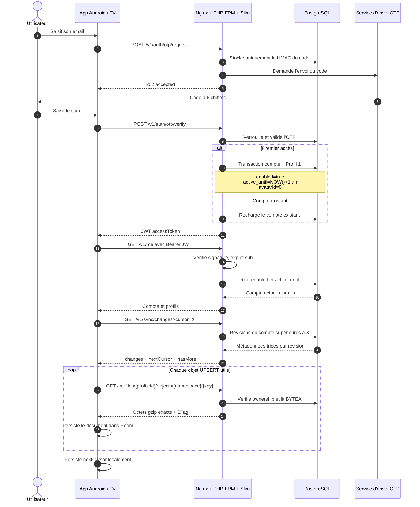
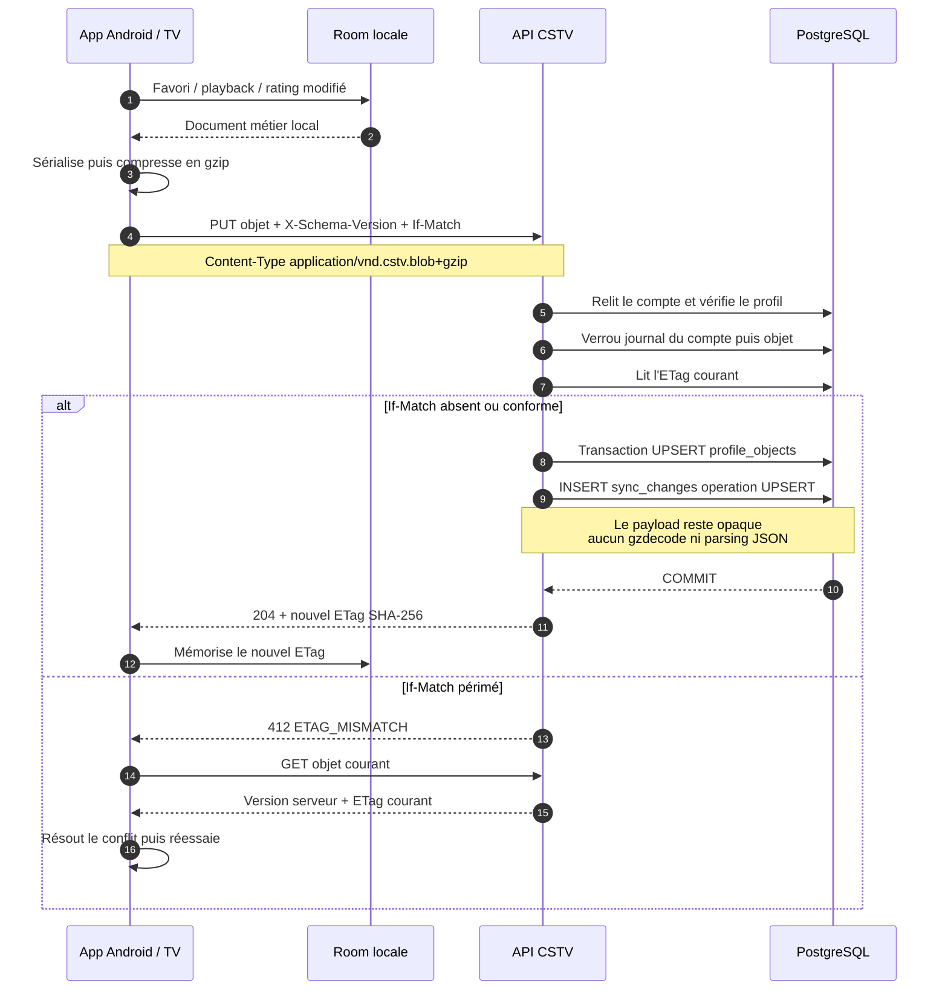
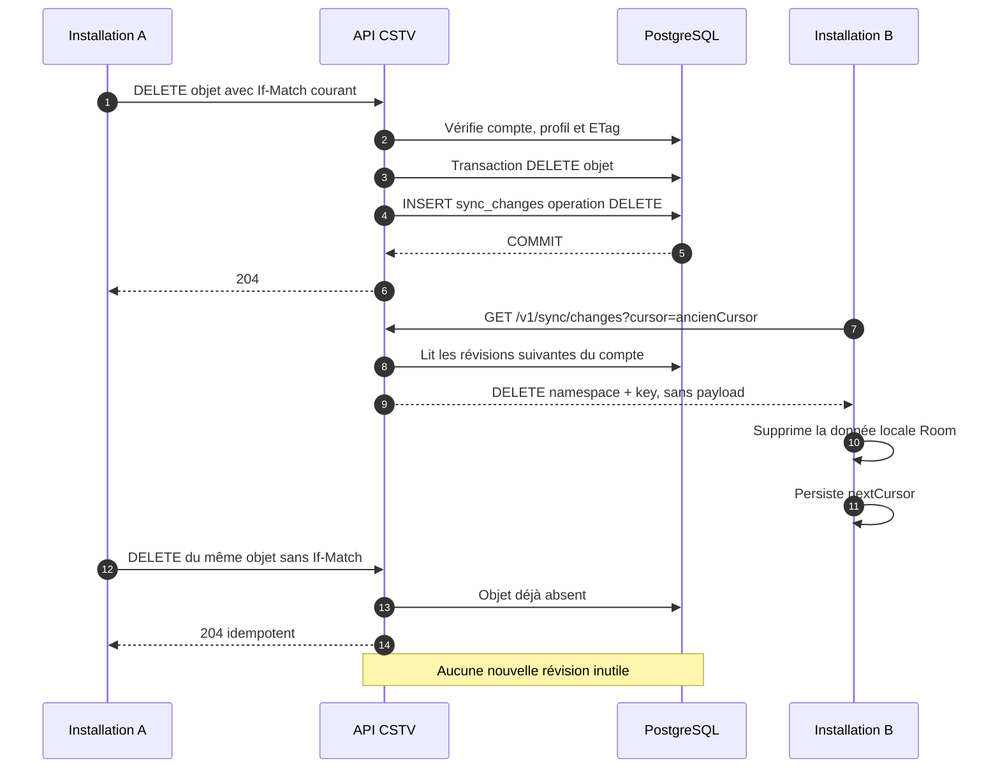
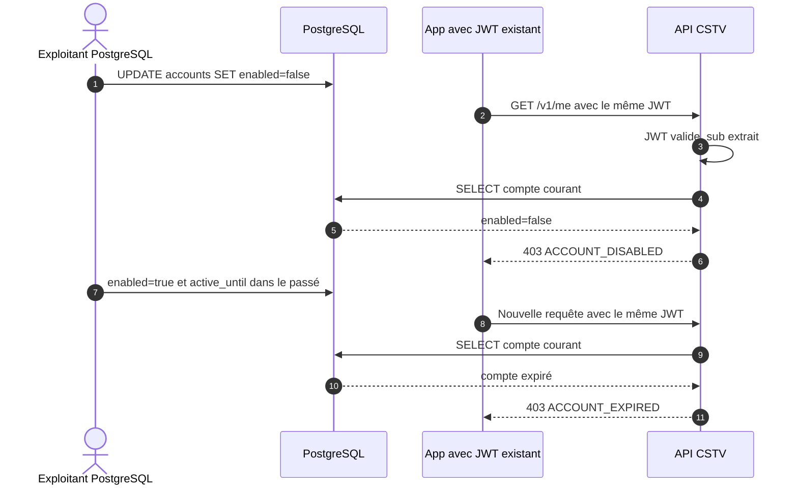

# Workflow application CSTV / API

Ces diagrammes décrivent le contrat actuellement implémenté. L'application Android conserve ses données locales dans Room et échange avec le backend uniquement des profils et des blobs gzip opaques. Le backend ne connaît ni appareil, ni installation, ni source ou credential IPTV.

## Vue d'ensemble

Points importants :

- `/otp/request` ne crée jamais le compte et répond de manière générique pour limiter l'énumération d'adresses ;
- la création du compte et de `Profil 1` est atomique après un OTP valide ;
- le JWT ne contient que l'identité technique du compte (`sub`) et sa durée de validité ;
- chaque endpoint authentifié relit le compte dans PostgreSQL avant d'autoriser l'accès ;
- le change feed ne contient jamais les blobs : l'application télécharge séparément les objets nécessaires.

## Écriture locale, ETag et conflit optimiste

Sans `If-Match`, la dernière écriture validée gagne. Avec `If-Match`, deux clients partis du même ETag ne peuvent pas écraser silencieusement leurs changements : le premier réussit et le second reçoit `412 ETAG_MISMATCH`.

## Suppression et propagation multi-installation

Pour un UPSERT effectué par l'installation A, l'installation B reçoit de la même façon la métadonnée dans `/v1/sync/changes`, puis télécharge les octets avec `GET /v1/profiles/{profileId}/objects/{namespace}/{key}`.

## Désactivation ou expiration immédiate

Il n'est donc pas nécessaire de révoquer ou régénérer les JWT pour appliquer une intervention manuelle : PostgreSQL reste la source de vérité à chaque requête.

## Responsabilités

| Application Android / TV | API CSTV |
|---|---|
| Afficher le flow email + OTP | Générer, hacher, limiter et valider les OTP |
| Stocker le JWT de manière sûre | Signer le JWT et en valider la signature/expiration |
| Conserver le cursor de chaque synchronisation | Servir un journal ordonné et isolé par compte |
| Sérialiser et compresser les documents | Stocker et restituer les octets sans les inspecter |
| Conserver les ETags et gérer les réponses 412 | Appliquer `If-Match` sous verrou transactionnel |
| Appliquer UPSERT/DELETE dans Room | Garantir l'atomicité objet + événement de synchronisation |
| Continuer à appeler directement Xtream/TMDB/YouTube | Ne jamais stocker ni relayer les données ou credentials IPTV |

Le contrat HTTP détaillé reste défini dans [`openapi.yaml`](openapi.yaml).
