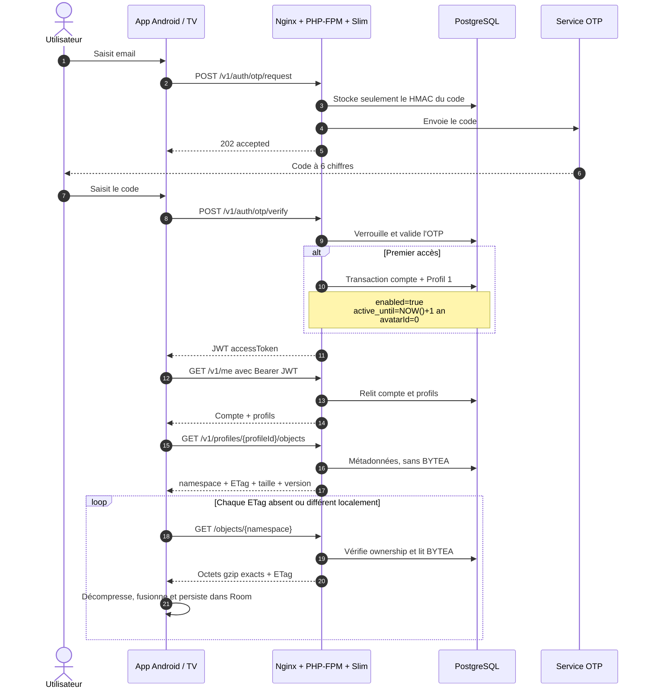
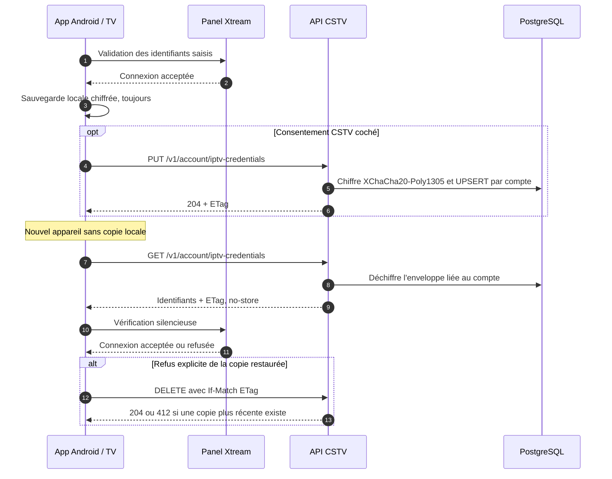
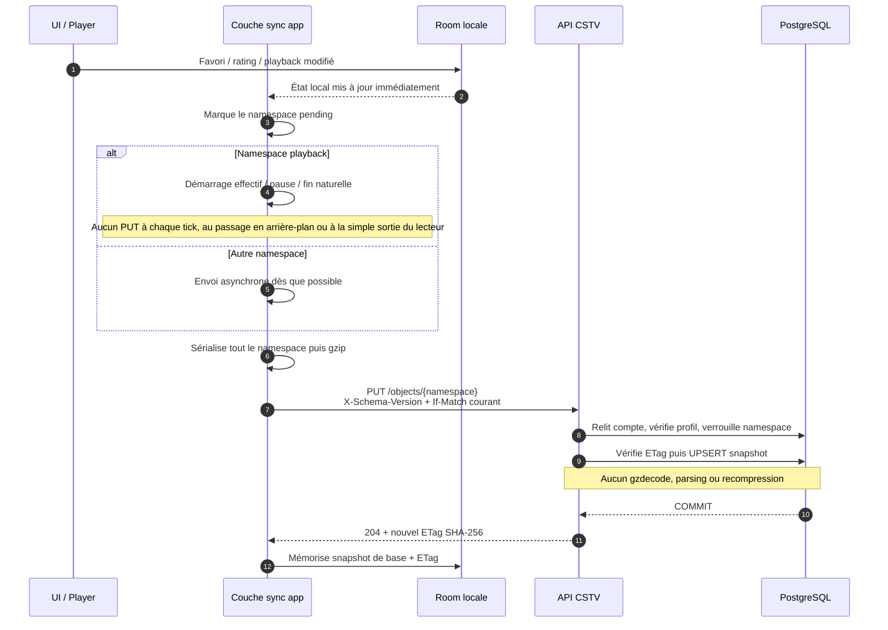
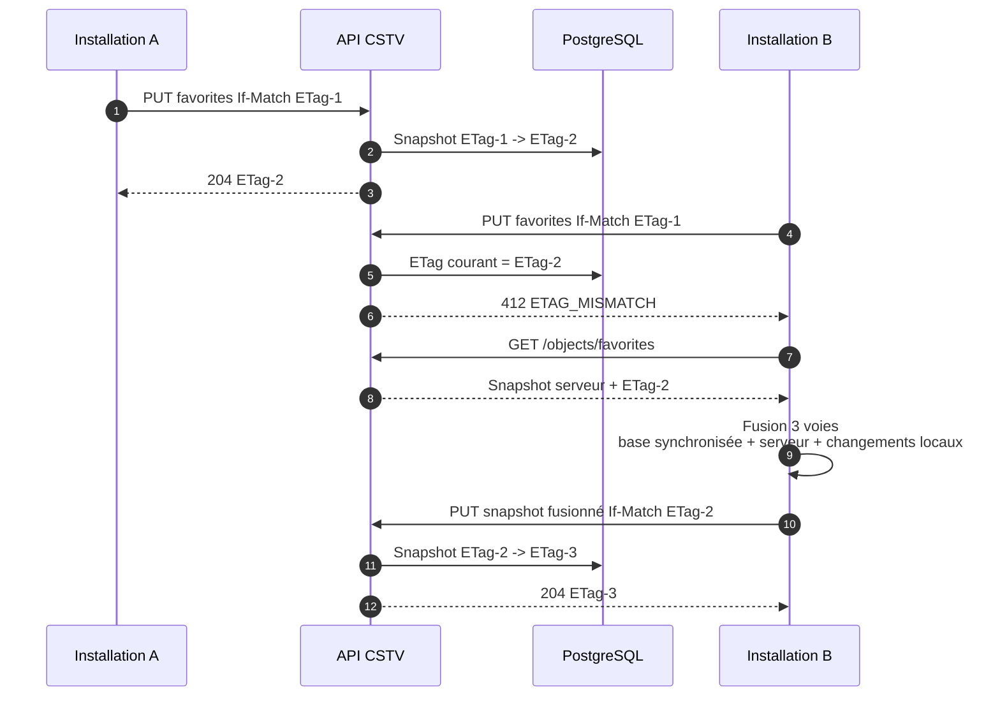
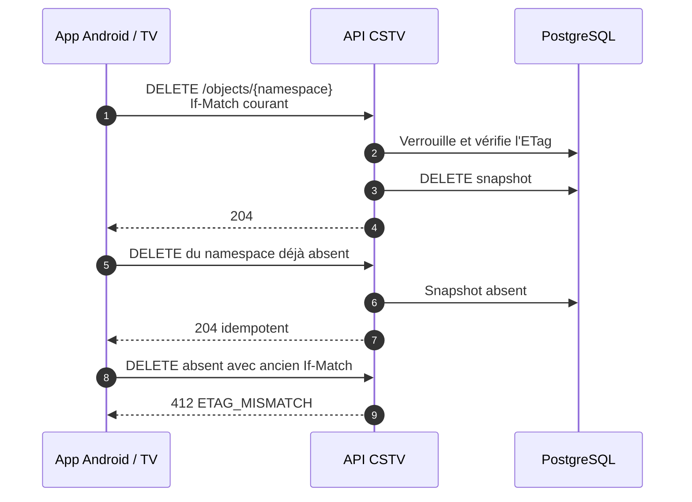
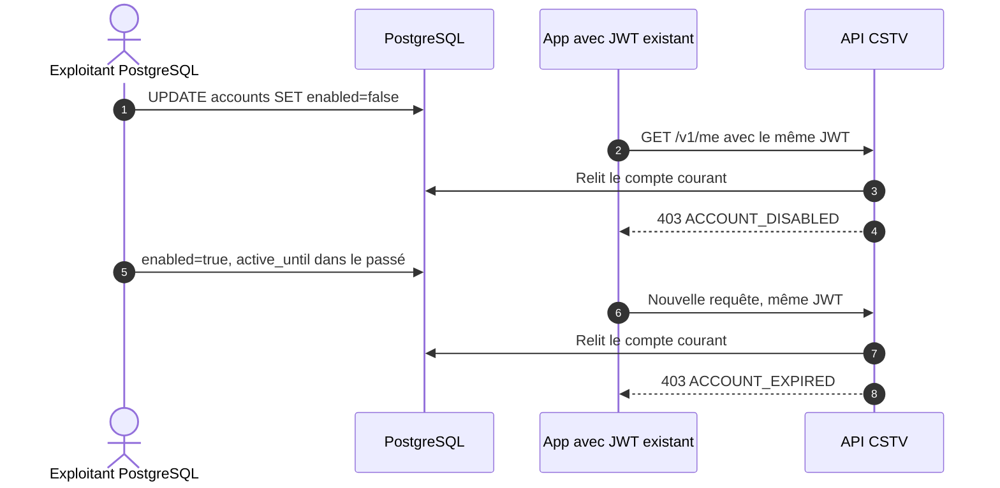

# Workflow application CSTV / API

L’application Android conserve la donnée métier dans Room. Le backend stocke les snapshots gzip opaques par `(profil, namespace)` et leur ETag. Une exception dédiée stocke au plus une sauvegarde d'identifiants IPTV chiffrée par compte CSTV ; elle ne partage ni le modèle par profil ni le format gzip opaque. L'API ne connaît ni appareil, ni installation ni catalogue IPTV.

## Authentification et chargement initial

Le même chargement des métadonnées est rejoué au démarrage, à la reprise de l’application et après un retour réseau. Il n’existe ni cursor ni journal `sync_changes`.

## Sauvegarde et restauration des identifiants IPTV

Une panne CSTV n'empêche jamais la connexion IPTV : l'intention d'écriture ou de suppression est persistée dans le stockage chiffré de l'application puis rejouée par un worker réseau. Une suppression en attente est prioritaire sur toute restauration ou écriture locale.

## Modification locale et envoi asynchrone

Seul un namespace absent peut être créé sans `If-Match`. Pour un snapshot existant, l’absence du header renvoie `428 PRECONDITION_REQUIRED`.

## Fusion applicative après conflit ETag

La politique de fusion appartient à l’application, car elle seule comprend les données. Par exemple, les favoris peuvent fusionner des ajouts/retraits par clé métier et le playback peut retenir la progression la plus récente selon le contrat local. Le serveur reste volontairement aveugle au JSON compressé.

## Suppression d’un namespace

## Désactivation ou expiration immédiate

## Responsabilités

| Application Android / TV | API CSTV |
|---|---|
| Conserver Room comme état métier local | Stocker un blob opaque par profil et namespace |
| Garder le dernier snapshot synchronisé et son ETag | Calculer l’ETag SHA-256 sur les octets reçus |
| Sérialiser, compresser et décompresser | Restituer exactement les octets sans les inspecter |
| Fusionner les conflits 412 puis réessayer | Imposer `If-Match` sous verrou transactionnel |
| Envoyer playback uniquement au démarrage effectif, à la pause et à la fin naturelle | Borner chaque snapshot par `MAX_OBJECT_SIZE_BYTES` |
| Resynchroniser au démarrage/reprise/reconnexion | Relire le compte PostgreSQL à chaque requête |
| Continuer à appeler Xtream/TMDB/YouTube | Ne jamais stocker catalogue ou fournisseur IPTV ; ne stocker les credentials qu'en enveloppe chiffrée par compte |

Le contrat HTTP détaillé reste défini dans [`openapi.yaml`](openapi.yaml).
