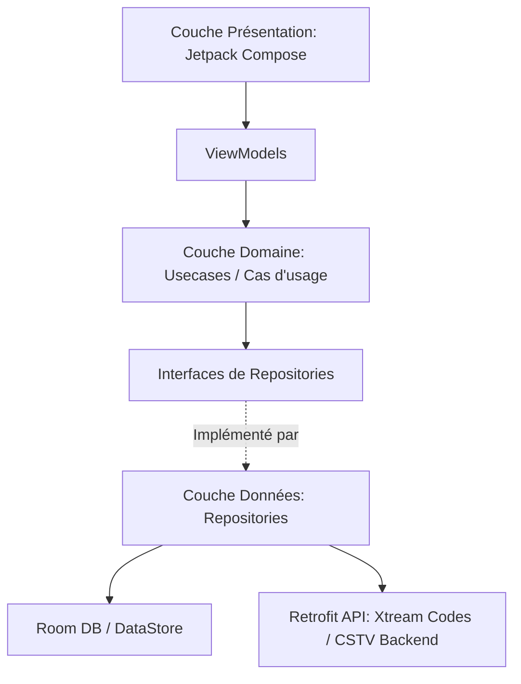

# Architecture de CSTV IPTV

## Métadonnées externes consolidées (F45)

Les flux IPTV restent la source de vérité pour la lecture, les versions et le catalogue brut. Les métadonnées externes sont une couche enrichissante, facultative et provider-neutral : le backend CSTV conserve les identifiants fournisseur et expose à Android uniquement un `externalId` UUID opaque et des champs métier.

Le backend résout d'abord son catalogue consolidé, puis interroge le fournisseur si nécessaire sous single-flight, budget global et respect de `Retry-After`. Android persiste les fiches et sous-ressources dans des tables Room `external_*`, séparées des tables Xtream. Les associations Trending/Popular utilisent le cache `external_catalog_links`, lui aussi indexé par `externalId` opaque.

Une file WorkManager persistante et séquentielle reçoit trois motifs : ouverture réelle de fiche, nouveau média IPTV, média existant sans métadonnées. Le rattrapage est paginé et borné ; aucune donnée stale n'est rafraîchie en arrière-plan. Une série hydrate ses saisons et épisodes seulement depuis une ouverture de fiche. Toute panne de la couche externe laisse l'interface et la lecture s'appuyer sur Room/Xtream.

Ce document présente l'architecture globale, les choix techniques majeurs, la structure des répertoires et les flux de données au sein de l'application.

---

## 1. Principes Architecturaux (Clean Architecture & MVVM)

L'application est structurée selon les principes de la **Clean Architecture** combinée au pattern **MVVM** (Model-View-ViewModel) pour assurer une séparation stricte des responsabilités, une grande testabilité et une excellente maintenabilité.

Elle se divise en 3 couches distinctes :

### 📂 Couch structurelle
```
app/src/main/java/com/cstv/app/
├── data/          # Couche Données (Implémentations, API, Stockage, Cache)
├── domain/        # Couche Domaine (Modèles métier purs, Cas d'usage, Interfaces Repositories)
└── presentation/  # Couche Présentation (Composables UI, ViewModels, Thème, Navigation)
```



### 🧱 Description des couches

#### A. Couche Domaine (`domain/`)
C'est le cœur de l'application, complètement indépendant des frameworks externes (Android, Room, Retrofit, etc.). Elle contient :
* **`model/`** : Les modèles de données métier purs (ex: `LiveStream`, `FavoriteItem`). Ils sont stables et testables unitairement sans dépendances Android. Contient également des utilitaires de calcul et de matching purs et réutilisables, tels que **`CatalogMatcher`** (qui centralise le rapprochement entre les tendances et le catalogue local en combinant similarité textuelle et validation stricte de l'année de sortie à +/- 1 an, amélioré avec un tri multicritère par rang d'année `YearRank` pour gérer finement les remakes et homonymes).
* **`repository/`** : Les interfaces de communication avec les données. Elles définissent les contrats de récupération ou de modification des données (ex: `LiveTvRepository`).
* **`usecase/`** : Les cas d'usage (facultatif mais fortement recommandé pour factoriser la logique métier).

#### B. Couche Données (`data/`)
Responsable de l'approvisionnement en données. Elle implémente les interfaces définies par la couche Domaine.
* **`remote/`** : Appels réseau avec **Retrofit** et **OkHttp** vers l'API Xtream Codes et le backend CSTV (API `/v1/catalog`). Contient les DTOs (Data Transfer Objects) et les adaptateurs Gson pour le parsing défensif (tolérance types string/int incohérents). Sans clé API TMDB embarquée.
* **`local/`** : Persistance avec **Room** (cache d'API, favoris, historique, profils).
* **`download/`** : Logique de téléchargement de vidéos hors-ligne via le gestionnaire dédié d'ExoPlayer / Media3.
* **`worker/`** : Tâches planifiées en arrière-plan avec **WorkManager** pour la synchronisation automatique du catalogue.
* **`repository/`** : Implémentations réelles des interfaces de repositories (ex: `LiveTvRepositoryImpl`), gérant la logique de cache (quand servir les données locales de Room vs quand appeler l'API réseau).

### Cache catalogue hors ligne & Synchronisation dynamique (T4 / T7)

Les écrans catalogue lisent des `Flow` Room et ne déclenchent pas directement le réseau. `CatalogSyncManager` coordonne les écritures Xtream vers Room pour les catégories et flux Live/VOD/Séries, avec fraîcheur par section, classement d'erreurs et remplacement transactionnel du catalogue. La clé de catalogue est liée au serveur (`host:port`) : un changement d'utilisateur sur le même serveur conserve la base, tandis qu'un changement de serveur la purge. La session hors ligne est contrôlée séparément par une clé chiffrée liée à l'utilisateur exact.

Depuis l'évolution **T7**, la durée de validité (fraîcheur) du catalogue n'est plus fixée à une valeur statique de 24 heures. Elle est calculée dynamiquement au runtime par `CatalogSyncManagerImpl` en interrogeant la fréquence de synchronisation (`DAILY`, `WEEKLY`, `MONTHLY`, `DISABLED`) configurée par l'utilisateur dans `SettingsManager`. Si le catalogue est expiré selon ce paramètre et que l'appareil est connecté à Internet (détection active via `NetworkMonitor`), l'application lance silencieusement et de manière asynchrone `syncIfStale()` sans perturber la navigation, sans bloquer l'UI par un loader, et sans faire apparaître de bannière d'erreur en cas d'échec transitoire. Le bandeau `OfflineBanner` est déconnecté de l'historique d'échecs de synchronisation et se fonde uniquement sur l'état de connectivité réseau réelle : il ne s'affiche plus que comme un simple indicateur informatif lorsque l'appareil est hors ligne.

#### Normalisation des titres et clé de liaison (T21)

Avant toute persistance Room, `LiveTvRepositoryImpl`, `VodRepositoryImpl` et `SeriesRepositoryImpl`
font passer chaque libellé Xtream par `MediaTitleParser.parse(rawTitle, mediaKind, releaseYear)`,
fonction pure et déterministe sans dépendance Android. Elle détecte les marqueurs de langue/version
(`VF`, `VOSTFR`, `MULTI`…) et de qualité (`HD`, `4K`…) quelle que soit leur position ou leur casse,
produit un `cleanTitle` fidèle au libellé source (marqueurs et ponctuation orpheline retirés) et une
`linkKey` — forme canonique (minuscules, diacritiques supprimés, sans année) hachée en SHA-256 tronqué
— qui rapproche les entrées désignant la même œuvre ou la même chaîne. Deux entrées ne partagent la
clé que si leurs années connues, quand les deux existent, coïncident (`yearsAreCompatible`) ; l'année
reste une colonne séparée, jamais intégrée à la clé, pour ne pas casser le regroupement lorsqu'un seul
libellé la porte. `TitleNormalizer` est conservé comme façade de compatibilité qui délègue au parseur,
et `TmdbCatalogMatcher` consomme désormais `cleanTitle`/`linkKey` déjà stockés plutôt que de reparser
à chaque appel. Le catalogue déjà en cache au moment de la migration Room 28 → 29 (schéma seul, sans
calcul) est rattrapé par `CatalogNormalizationWorker`, un `WorkManager` qui parcourt chaque table par
pages de 500 lignes ordonnées par clé primaire, une transaction par page ; `linkKey = ''` sert de
curseur persistant du travail restant, sans entité de progression dédiée. T21 ne modifie aucun écran :
la donnée sert de fondation à F39 (sélecteur de versions) et F40 (qualité des chaînes).

#### Étiquettes et sélecteur de versions (F39)

L'architecture de F39 consomme les colonnes `linkKey`, `releaseYear`, `languageTag` et `qualityTag` persistées par T21. Elle se structure autour des composants suivants :

* **`MediaVersionBadges`** : Composant de présentation pure qui mappe les tags extraits (`languageTag`/`qualityTag`) en 0, 1 ou 2 badges (langue puis qualité, ex: « VF · 4K ») pour les vignettes de films et de séries dans toutes les vues en liste.
* **`SeriesVersionResolver`** : Composant de domaine qui résout localement les séries candidates compatibles partageant la même `linkKey` en filtrant celles qui ne possèdent pas l'épisode équivalent (`seasonNum + episodeNum`) et en gérant la préférence série mémorisée par profil utilisateur.
* **`MediaVersionSwitchController`** (et son moteur `ExoMediaVersionSwitchEngine`) : Contrôleur transactionnel de haut niveau qui orchestre le changement à chaud d'une version de média en cours de lecture. Il sauvegarde l'état du lecteur source, prépare et charge la cible à la position équivalente (seek borné au début de la cible pour éviter les dépassements de durée), valide le changement après 3 secondes stables, ou exécute un rollback transactionnel complet et sécurisé vers la source d'origine en cas d'erreur de lecture ou de dépassement du timeout de 8 secondes.
* **`SeriesVersionSwitchCoordinator`** : Coordinateur d'écran de lecture de séries qui synchronise l'identité atomique lue (couple série + épisode), applique de manière fluide la préférence de version à l'ouverture ou lors d'un enchaînement automatique (binge-watching), et isole la logique de lecture hors-ligne.
* **`VersionSelectorSheet`** : Sélecteur graphique adaptatif qui affiche une `ModalBottomSheet` sur mobile et un dialogue focalisable (`AlertDialog`) sur Android TV.
* **Coexistence F39/T23 (Un seul pilote de moteur)** : Les listeners et contrôles de F39 et de l'auto-réparation technique de lecture (T23) sont coordonnés de manière exclusive afin qu'un seul mécanisme ne pilote le moteur `ExoPlayer` à la fois, interdisant tout conflit ou instabilité de lecture.

#### Sélecteur de qualité des chaînes et mode automatique avec repli (F40)

L'architecture de F40 s'appuie sur la clé de liaison T21 pour regrouper les flux de direct d'une même chaîne et se structure autour des composants suivants :

* **`LiveVariantRepository`** : Interface dans la couche `domain/repository` (et son implémentation dans `data/repository`) qui résout les variantes de chaînes en direct à partir de l'entité stockée de manière réactive, permettant d'exclure les clés de liaison vides et de trier de manière déterministe par qualité normalisée (`UHD_4K > FHD > HD > SD > UNKNOWN`), puis par `num` et `streamId` croissants.
* **`LiveStabilityMonitor`** : Composant de la couche de présentation chargé de mesurer la stabilité d'un flux de direct. Il enregistre sur un unique `Player.Listener` les états `STATE_READY` (mesure du délai d'ouverture) et `STATE_BUFFERING` (mesures d'occurrences et de durée cumulée). Il conserve ces événements sur une fenêtre glissante de 120 secondes avec un mécanisme de fusion pour les callbacks dupliqués à moins de 500 ms, et notifie l'épuisement ou le franchissement du seuil d'instabilité (5 coupures).
* **`LiveQualityController`** : Machine d'état automatique indépendante de la plateforme. Il gère la session courante `LiveQualitySession` et son cycle de vie (réinitialisé au zapping ou à la fermeture), enregistre les tentatives réelles et les mesures associées pour interdire toute oscillation ou réessai de flux rejetés, calcule le score lexicographique déterministe de la « moins mauvaise » variante en cas d'épuisement, et propose des points d'extension pour F41/F42 (via des interfaces fonctionnelles).
* **`QualitySelectorSheet`** : Bottom sheet sur mobile et dialogue sur TV qui liste les variantes d'une chaîne et permet la sélection manuelle. Un choix utilisateur positionne `automaticDisabledByUser = true` sur la session active pour désactiver l'automatisme pour le reste de la session de lecture.
* **Intégration unifiée et découplage (ViewModels & View)** : Les états F40 (session, contrôleur, moniteur, message de repli) sont hébergés de manière testable dans `LiveTvViewModel`. La coordination d'erreurs réelles dans `PlaybackRecoveryCoordinator` orchestre le partage entre F40 (erreurs réseau/source, instabilités) et T23 (erreurs de décodage).

#### C. Couche Présentation (`presentation/`)
Responsable de l'interface utilisateur. Elle utilise **Jetpack Compose** pour l'UI.
* **ViewModels** : Un ViewModel par écran. Il gère l'état de l'interface (StateFlow) et interagit avec la couche Domaine. Zéro logique métier directe dans les Composables.
* **Composables** : Séparés par dossiers thématiques (écrans principaux : `login`, `home`, `livetv`, `vod`, `series`, `player`, etc.). Préférer des composants stateless (state hoisting).
* **`theme/`** : Définition des couleurs, polices et formes (typo Bricolage Grotesque et Hanken Grotesk).
* **`components/`** : Composants graphiques réutilisables à travers l'application.

---

## 2. Choix Techniques Majeurs & Stack Technique

* **Kotlin uniquement** : Utilisation exclusive des fonctionnalités modernes de Kotlin (Coroutines, Flow/StateFlow).
* **Injection de Dépendances (Hilt)** : Gestion de la durée de vie des dépendances de manière déclarative (dans `di/AppModule.kt`).
* **Moteur d'enrichissement & Caches centralisés CSTV Backend (F9 / T8 / T22)** :
  * **Centralisation Réseau (T22)** : L'application n'accède plus directement à TMDB ni n'embarque de secrets d'API. Tous les appels d'enrichissement (tendances, populor, bandes-annonces, appariements) transitent par le backend CSTV via le contrôleur `CatalogAction` et l'interface `CstvCatalogApiService`.
  * **Id Canoniques & Opacité** : L'identité d'un média est transportée sous la forme d'un `canonicalId` (`String`) opaque de bout en bout (ex: `movie:438631`). L'application stocke et transmet cette clé brute sans l'analyser, découplant l'application du format et de la base de données du fournisseur de données.
  * **Paliers de cache dynamiques sur le serveur** : Le cache serveur (PostgreSQL) applique un cycle intelligent de rafraîchissement basé sur l'âge de l'œuvre (7 jours de cache si < 1 an d'âge, 30 jours entre 1 et 5 ans, 90 jours entre 5 et 10 ans, et 180 jours pour les œuvres de 10 ans et plus ; 15 jours si l'année est inconnue), mutualisant les appels pour tous les clients et toutes les versions d'affichage.
  * **Résilience Anti-Stampede & Stale-If-Error** : Un verrou Postgres (`pg_try_advisory_xact_lock`) empêche les appels concurrents de mitrailler le fournisseur en cas de cache froid. En cas d'indisponibilité du fournisseur TMDB, le backend retourne la copie périmée en mode dégradé (stale-if-error).
  * **Moteur Populaires local (F9)** : Un repository dédié `PopularRepository` gère la récupération de la première page des films et séries populaires via l'API CSTV Backend.
  * Utilisation d'un cache global persistant versionné dans le de l'app (namespace `catalog_popular_cache`) avec un TTL (Time-To-Live) de 24 heures pour éviter les requêtes réseau superflues.
  * Invalidation granulaire et réactive : les caches de films et de séries sont invalidés indépendamment lors d'une synchronisation réussie de leur catalogue respectif (`getVodAllStreamsSyncedAt` et `getSeriesAllStreamsSyncedAt`) ou de la fin de l'enrichissement des métadonnées du catalogue (`CatalogSection.ENRICHMENT`), fermant ainsi la fenêtre de cache obsolète pendant l'enrichissement d'arrière-plan du chemin `runSync`.
  * Parallélisme de traitement : Le cas d'usage `GetPopularTop10InCatalogUseCase` exécute les requêtes de films et de séries populaires en parallèle sur le pool de threads `Dispatchers.Default` pour éliminer tout goulot d'étranglement séquentiel, sous le contrôle d'un timeout de sécurité de 15 secondes dans `HomeViewModel` (découplé du spinner de chargement principal).
  * **Rafraîchissement silencieux et stabilité de session (T8)** : Pour éradiquer les sauts visuels (layout shifts) et les perturbations de focus lors de la navigation active de l'utilisateur, l'application applique un principe de figeage par session. Si un cache local existe (même périmé), il est immédiatement chargé et reste le seul contenu affiché dans la session active de `HomeViewModel`. Une coroutine d'arrière-plan, intégrée de façon structurée à la hiérarchie de `popularJob` pour éviter les lancements concurrents cumulés, interroge l'API et écrit silencieusement les nouvelles données en base de données locale (sans jamais modifier l'état UI en cours). Les données actualisées seront chargées de façon transparente au démarrage suivant de l'application. Des indicateurs de session figeant les listes VOD et Séries bloquent toute relecture ou réaffichage lors d'actions ultérieures dans l'onglet (comme le changement de préférences de catégories) ; seule l'absence initiale complète de cache (premier lancement à froid) autorise la mise à jour directe de l'état d'UI à réception du réseau pour éviter une ligne vide.
* **Gestion de l'historique de visionnage local & Geste TV Sécurisé (F8)** :
  * Un repository dédié `ViewingHistoryRepository` isole la logique de suppression de l'historique de visionnage et des chaînes récentes de celle des repositories de catalogue.
  * Réactivité par flux Room : Remplacement des chargements ponctuels des chaînes de télévision récentes par une observation réactive (`Flow`), alignant le comportement sur les reprises VOD/Série et éliminant tout rafraîchissement manuel.
  * Interception sécurisée de la touche TV : Interception personnalisée du D-pad (`onPreviewKeyEvent` de Compose) pour distinguer l'appui court (lecture directe) de l'appui long (maintien central). L'événement `KeyUp` associé est consommé de manière sécurisée si un appui long a été détecté, empêchant ainsi le lancement indésirable du lecteur vidéo après la fermeture du dialogue.
  * Invalidation granulaire des recommandations : La suppression d'un film ou d'un épisode d'une série invalide de manière réactive le cache des recommandations du profil, forçant sa mise à jour lors du prochain affichage de l'Accueil.
* **Lecteur Vidéo (Media3 / ExoPlayer + NextLib) & Socle Commun (T3 / B16)** :
  * ExoPlayer (Media3) pour la lecture HLS et MP4.
  * Extension **NextLib** (`nextlib-media3ext`) intégrant des décodeurs FFmpeg logiciels pour supporter les codecs audio EAC3, AC3, et DTS directement en local, évitant ainsi le problème récurrent des vidéos "muettes" sur les décodeurs matériels limités des box Android TV.
  * **Socle Commun Factorisé (`presentation/player/core/`)** : centralise et déduplique la mécanique technique des trois lecteurs (Live, VOD, Séries) :
    * `ExoPlayerCore` : gestion unifiée du cycle de vie du lecteur (`rememberManagedExoPlayer`) avec support sélectif du cache (opt-in pour VOD/Séries, désactivé pour le Live). Il s'appuie désormais sur une politique de décodage asymétrique et isolée (**PlayerDecoderPolicy**, introduite dans **B16**) pour configurer ses décodeurs.
    * **Politique de décodage asymétrique (PlayerDecoderPolicy & B16)** : Résout les corruptions visuelles d'image sur téléviseurs Android TV (lignes de décodage YUV déchirées) en dissociant la priorité des extensions de décodage par type de piste. Un nouveau renderer personnalisé (`VideoHardwarePreferredRenderersFactory`) est utilisé dans le pipeline d'ExoPlayer pour forcer le mode `ON` côté vidéo, reléguant le décodeur logiciel FFmpeg de NextLib en dernier recours afin de privilégier le décodage matériel natif du téléviseur (`MediaCodecVideoRenderer`), ce qui restaure l'affichage d'une image fluide et correcte. À l'inverse, le mode global reste réglé sur `PREFER` côté audio, garantissant la priorité au décodage logiciel FFmpeg pour continuer de couvrir EAC3, AC3 et DTS de façon fluide sur les équipements dépourvus de décodage matériel natif pour ces formats.
    * `PlayerLifecycleCore` : gestion globale de `KEEP_SCREEN_ON`, détection de l'état Picture-in-Picture (PiP) et application du workaround de relayout de la surface d'affichage.
    * `PlayerOverlayCore` : hôte d'overlay générique (`PlayerOverlayHost`) à slots configurables pour le masquage automatique des contrôles après inactivité, tout en conservant l'autonomie visuelle propre à chaque écran.
    * `PositionTrackerCore` : boucle temporelle générique de suivi de la position de lecture (`TrackPlayerPosition`) cadencée sur le temps réel monotone, gérant la mise à jour UI et raccordant de manière sécurisée les callbacks de sauvegarde finale (`onTrackerDispose`).
* **Système d'évaluation J'aime / Je n'aime pas (F7)** :
  * **Table profilée `media_ratings`** : Une nouvelle table est créée avec une clé primaire composite `(profileId, mediaType, mediaId)` pour stocker localement les évaluations. Le `mediaType` ("movie" ou "series") distingue un film et une série partageant exceptionnellement le même identifiant numérique.
  * **Transaction atomique de vote négatif** : L'enregistrement d'un `DISLIKE` (rejet) effectue de manière atomique via `AppDatabase.withTransaction` l'insertion du vote, le retrait du favori de même type/identifiant et la suppression de toutes les reprises de lecture associées (films ou épisodes de séries, rattachés soit via leur `seriesId` ou leurs `streamId`).
  * **Pondération explicite & Moteur de recommandation** : `RecommendationEngine` intègre des signaux d'évaluation pondérés : les contenus `LIKE` reçoivent un poids de `3.0` (contre `1.0` pour l'historique de visionnage neutre) pour amplifier leur contribution dans le profil de goûts. Les contenus `DISLIKE` sont totalement exclus du calcul des goûts.
  * **Exclusion & Cold Start** : Les contenus aimés (`LIKE`) et rejetés (`DISLIKE`) sont totalement exclus des carrousels de recommandations. Un seul `LIKE` sur le catalogue permet au moteur de générer des recommandations pertinentes, court-circuitant le seuil habituel de trois lectures pour les profils en cold start.
  * **Invalidation & Flux Réactifs** : `SetMediaRatingUseCase` délègue l'écriture au repository, puis invalide de façon synchronisée (sécurisée par un `Mutex`) le cache de `GetRecommendationsUseCase`. Les invalidations sont émises via un `SharedFlow` collecté par `HomeViewModel` pour forcer le recalcul des recommandations en temps réel sans affecter les autres éléments de l'Accueil (comme TMDB ou l'EPG).
* **Gestion dynamique des barres système & Insets (F11)** :
  * **Edge-to-Edge au démarrage** : `WindowCompat.setDecorFitsSystemWindows(window, false)` est appelé dans `MainActivity.onCreate` pour permettre au contenu Jetpack Compose de s'étendre sous les barres système.
  * **Thème découplé du plein écran** : Le thème de l'application hérite de `Theme.IptvXtream` parent de `Theme.Material.NoActionBar` (plutôt que `.Fullscreen`) pour permettre l'affichage de la barre de statut au runtime. La déclaration de `windowLayoutInDisplayCutoutMode` à `shortEdges` dans `res/values-v28/styles.xml` autorise le dessin sous le poinçon/l'encoche en paysage immersif.
  * **`SystemBarsController` réactif** : Composant/Effet Compose réutilisable encapsulant `WindowInsetsControllerCompat` qui contrôle dynamiquement la visibilité des barres système (toujours masquées sur TV, masquées uniquement dans les lecteurs sur mobile, visibles ailleurs sur mobile) avec des icônes claires adaptées au thème sombre global.
  * **Traitement des insets** : Utilisation sélective des modificateurs de padding Compose (`statusBarsPadding()`, `safeDrawingPadding()`) sur mobile pour écarter l'UI des découpes physiques d'écran, tandis que le `NavHost` applique `PaddingValues(0.dp)` pour les routes de lecteurs vidéo (`live_player`, `vod_player`, `series_player`) afin qu'ils occupent l'intégralité de l'écran physique.
* **Navigation vers la fiche détails depuis le clic sur la cover du player (F16)** :
  * **Règle de décision pure (`PlayerDetailsNavigation`)** : Isolation de la règle de routage au sein d'un objet Kotlin pur sans dépendance Android pour garantir une couverture de test unitaire JVM complète et robuste. Le résolveur détermine l'une des trois actions possibles (`POP_TO_DETAILS`, `REPLACE_WITH_DETAILS`, `UNAVAILABLE`) selon que la fiche cible est déjà présente ou non immédiatement derrière dans la pile (`backstack`).
  * **Composant partagé d'action de cover (`PlayerCoverAction`)** : Composable Jetpack Compose partagé affichant l'image ou un placeholder si elle est absente. La sémantique d'accessibilité est entièrement portée sur la zone interactive (avec `Role.Button` et annonce dynamique d'indisponibilité) et le focus Android TV y est rattaché explicitement par un lien `FocusRequester` depuis les boutons de transport.
  * **Unification du dépilage et de la navigation** : Utilisation d'une extension `NavHostController.openPlayerDetails` dans `NavGraph.kt` pour gérer de manière atomique la transition (dépilage du player, ré-initialisation de l'état hoisté requis par la fiche cible, puis navigation vers `"vod_details"` ou `"series_details"`).
  * **Garde d'unicité et résilience de sortie** : Utilisation de l'état local `isLeaving` assurant l'unicité de la transition. Si la fermeture échoue (par exemple, si la pile ne contient plus d'écran valide), le player réactive sa visibilité et ses contrôles au lieu de rester bloqué.
  * **Persistance fiable du `seriesId`** : Adaptation de la persistance de position de lecture dans `SeriesViewModel` pour accepter un identifiant explicite de série, garantissant que l'historique de position possède systématiquement son lien de série parent, indispensable lors d'une reprise directe depuis la page d'Accueil.
* **Lecture automatique du trailer YouTube sur les fiches de détail (F13)** :
  * **Composant Backdrop réutilisable (`MediaDetailsTrailerBackdrop`)** : Composant de fond unifié remplaçant dynamiquement le backdrop de fond statique (`AsyncImage` floutée) par une WebView YouTube (`YouTubeTrailerPreview`) après 5 secondes passées de façon stable et continue sur la fiche.
  * **Contrôle sonore dans la barre d'action supérieure** : Intégration d'un bouton Son Material 3 (mobile) et Android TV (télécommande) réactif placé dans la barre d'action d'en-tête, s'initialisant systématiquement en mode muet pour chaque média pour le respect des préférences de confort utilisateur.
  * **Orchestration Lifecycle du lecteur** : Observation stricte du cycle de vie Android (`ON_START` / `ON_STOP` du `LifecycleTracker`) pour interrompre instantanément l'autoplay ou la lecture de la WebView en arrière-plan et libérer ses ressources.
  * **Moteur de recherche TMDB asynchrone** : Mécanisme de résolution des `tmdbId` manquants pour les médias de catalogue IPTV locaux via des appels de recherche TMDB (`search/movie`, `search/tv`), s'appuyant sur un algorithme de correspondance testable et rigoureux (`TrailerLookupMatcher`) basé sur une similarité de titre normalisé >= 0,8 et une tolérance d'année de ± 1 an.
  * **Cache persistant local Room (v20)** : Mémorisation pérenne et partagée (sans liaison profil) des résultats de résolution de trailers en base SQLite via l'entité `TrailerCacheEntity` pour éradiquer les multiples appels réseau consécutifs, avec des TTL distincts : 30 jours pour un trailer trouvé, 7 jours pour un résultat négatif.
  * **Bannissement automatique sur échec de lecture** : Raccordement des callbacks d'erreurs de lecture (`reportTrailerPlaybackFailure`) pour déclencher l'invalidation immédiate en base de données de toute bande-annonce devenue indisponible sur YouTube, garantissant un retour propre sur l'affiche statique et déclenchant une nouvelle recherche à la prochaine visite.
* **Moteur de recherche unifié par sous-chaîne (F17)** :
  * **Suppression totale de FTS4** : Afin d'éliminer les limitations de FTS4 (impossible d'effectuer un LIKE avec un joker de début type `%keyword%`) et de simplifier le schéma SQL (suppression des tables virtuelles et des doubles écritures lors de la synchronisation), le moteur FTS4 a été intégralement retiré.
  * **Colonne dénormalisée `searchText`** : Ajout d'une colonne textuelle `searchText` sur les tables `live_streams`, `vod_streams` et `series_streams`. Elle stocke la concaténation de tous les champs recherchables (nom, catégorie, acteurs, réalisateur, genre, etc.) séparés par un saut de ligne (`\n`).
  * **Normalisation uniforme (Casse & Diacritiques)** : Une fonction de normalisation unifiée `LocalSearchQuery.normalize()` (minuscules, normalisation NFD via `java.text.Normalizer`, retrait des marques non espaçantes `\p{Mn}` et repli explicite des ligatures courantes comme `œ`→`oe`, `ß`→`ss`) est appliquée à la fois lors du calcul de `searchText` à l'écriture (recalculé systématiquement par les DAO lors de toute insertion/mise à jour via des wrappers `@Transaction`) et lors de la lecture des mots-clés de l'utilisateur. Cela contourne les limites d'insensibilité à la casse de SQLite sur les caractères non-ASCII et assure une recherche insensible à la casse et aux accents.
  - **Filtrage hybride performant** : La recherche multi-mots est traitée en deux temps pour garder des requêtes Room `@Query` statiques et performantes. Le token le plus long de la saisie utilisateur (token ancre) est évalué en SQL via un `LIKE :pattern ESCAPE '\'` (avec échappement strict des caractères `%`, `_` et `\`), réduisant considérablement le jeu de résultats retourné par SQLite. Les tokens restants sont ensuite filtrés en mémoire par Kotlin sur les résultats remontés.
  - **Unification de la recherche** : La recherche unifiée et la recherche avancée (`AdvancedCatalogSearchUseCase`) partagent le même modèle pur de validation `LocalSearchQuery`, évitant toute divergence de comportement pour une même saisie multi-mots.
  * **Gestion optimisée de l'Accueil et des Tendances (B15)** :
  - **Cache périmé toléré** : Afin d'éliminer la latence de démarrage (jusqu'à 2 secondes) liée aux requêtes réseau TMDB, le cache des tendances locales (même s'il est périmé au-delà de sa durée de fraîcheur nominale de 24 heures) est immédiatement lu et affiché en UI au lancement.
  - **Fusion asynchrone stable (Append on Refresh)** : Les tendances fraîches obtenues en tâche de fond ne remplacent pas brusquement le cache périmé affiché. Elles sont fusionnées de manière stable en ajoutant uniquement les nouveaux éléments à la fin de la liste affichée, assurant la continuité de l'expérience utilisateur et du focus.
  - **Dédoublonnage sémantique robuste** : Le filtrage des doublons entre cache périmé et nouvelles tendances s'effectue sur la paire sementique unique `(tmdbId, isMovie)` pour éviter d'évincer indûment des films et séries TMDB partageant le même identifiant numérique.
  - **Skeleton Loader non-focusable** : Si aucun cache n'est disponible, le loader plein écran n'est pas déclenché par les tendances. À la place, un composant d'attente visuelle Skeleton occupe l'emplacement Hero de manière non interactive, sans intercepter le D-pad et en conservant les autres sections d'Accueil pleinement interactives.
* **Base de données Room & SQLite** :
  * Base de données `AppDatabase` (actuellement en version **28**).
  * **Pas de fallbackToDestructiveMigration()** ! Toutes les migrations sont rédigées en SQL brut de manière explicite dans `Migrations.kt` pour préserver intactes les données des utilisateurs lors des mises à jour applicatives (par exemple, la transition 20 → 21 pour F17 et 21 → 22 pour F12).
  * **Migration 21 → 22 (F12)** : Ajout de la table physique `series_watch_states` gérée par l'entité Room `SeriesWatchStateEntity` et `SeriesWatchStateDao`, permettant de stocker par couple `(profileId, seriesId)` le dernier épisode connu/visionné d'une série pour la détection en tâche de fond.
  * **Normalisation relationnelle 27 → 28 (T20)** : les tables d'état utilisateur (favoris, reprises, historique Live, notes, préférences de piste, suivi de séries, préférences de catégorie, téléchargements) ne stockent plus aucune métadonnée de catalogue (titre, jaquette, catégorie, extension…) — seulement une référence et leurs valeurs métier propres. Deux tables d'identité neuves portent cette référence :
    * **`media_refs`** (`mediaUid`, `accountKey`, `kind` ∈ `live|movie|series|episode`, `providerId`) et **`category_refs`** (`catUid`, `accountKey`, `kind` ∈ `live|vod|series`, `providerCategoryId`) — identité parente commune, préférée à des références typées par table pour honorer de vraies clés étrangères Room malgré l'absence de FK polymorphe en SQLite. Elles n'indexent que les médias/catégories effectivement référencés par un état, jamais le catalogue entier.
    * **Identités inactives** : une identité survit à la disparition de son média/catégorie tant qu'un état (favori, reprise, préférence…) la référence ; elle ne porte ni titre ni jaquette. L'affichage résout toujours la métadonnée depuis le catalogue courant via un `INNER JOIN` (`FavoritesDao.FAVORITE_LIST_QUERY`, `VodDao.PLAYBACK_LIST_QUERY`, etc.) — un média absent ou inactif n'apparaît simplement dans aucune liste, sans carte dégradée.
    * **Cloisonnement par compte (`accountKey`)** : chaque identité et chaque projection d'affichage filtrent par le compte Xtream courant, pour qu'un même identifiant numérique sur deux comptes différents ne soit jamais confondu.
    * **Cycle de vie** : `MediaRefDao.resolve`/`CategoryRefDao.resolve` créent l'identité à la première écriture d'état ou à l'application d'un snapshot cloud (`INSERT OR IGNORE` + lecture) ; une identité sans plus aucun état référent est purgée après chaque suppression. `CatalogReconciler` (nouveau, `data/sync/`), déclenché seulement après un cycle de synchronisation catalogue **complet et réussi**, nettoie en plus `trailer_cache` et les téléchargements orphelins (`media_refs` conservant l'identité, la cascade ne se déclencherait jamais seule) selon la séquence marquer `ORPHANED` → retirer du média3 → supprimer la ligne ; un échec à une étape laisse la ligne rejouable au cycle suivant.
  * **Remplacement différentiel du catalogue (T20)** : `LiveTvDao`/`VodDao`/`SeriesDao` insèrent désormais via `@Upsert` (`INSERT … ON CONFLICT DO UPDATE`) au lieu de `@Insert(REPLACE)`, puis suppriment uniquement les lignes non revues dans le lot (`DELETE … WHERE cachedAt < :batchTs`, globalement ou par catégorie). `@Insert(REPLACE)` compile en `INSERT OR REPLACE`, qui supprime la ligne en conflit avant de la réinsérer et déclenchait donc `ON DELETE CASCADE` sur `epg_cache`/`series_seasons`/`series_episodes` à chaque synchronisation, même pour un média maintenu.
* **Détection de nouveaux épisodes en tâche de fond (F12)** :
  * **UseCase découplé (`DetectNewEpisodesUseCase`)** : Encapsule la logique d'interrogation de l'API Xtream Codes pour résoudre les saisons/épisodes des séries "suivies" (favorites ou présentes dans l'historique) de chaque profil, et de comparaison des nouveautés par rapport à l'état de lecture enregistré (`SeriesWatchState`).
  * **Intégration robuste dans `DatabaseSyncWorker`** : Intégration du post-traitement de détection au sein du worker de synchronisation (`DatabaseSyncWorker`) via `runPostSyncDetection`, de manière isolée pour ne pas impacter le résultat global de la synchronisation de catalogue en cas d'anomalie réseau ou de timeout.
  * **Notificateur abstrait (`NewEpisodeNotifier`)** : Abstraction de la logique de notification (`AndroidNewEpisodeNotifier` implémentant `NewEpisodeNotifier`) pour découpler la logique d'orchestration multi-profils des APIs de rendu graphique ou système d'Android (`NotificationManager`), simplifiant l'écriture de tests unitaires locaux JVM.
* **Masquage conditionnel des Téléchargements TV (F21)** :
  * Épuration visuelle ultra-robuste consistant à propager explicitement le drapeau de plateforme `isTv` pour conditionner Compose :
    - `HomeScreen` : Masque la rangée `"home_downloads"`.
    - `VodDetailsScreen` : Masque le bouton d'action de téléchargement global (`DownloadActionButton`).
    - `SeriesDetailsScreen` : Masque les contrôles de téléchargement individuel d'épisode (`EpisodeDownloadControl`).
  * Aucun impact sur les bases de données ou les fichiers téléchargés (qui restent préservés et actifs lors d'un basculement sur Mobile).
* **Séparation des fiches film Mobile / TV (F28)** :
  * `VodDetailsScreen` se réduit à un aiguillage : un `Box` racine porte l'hôte de snackbar commun aux deux plateformes, puis délègue soit à `VodDetailsTvLayout` (nouveau fichier `presentation/vod/VodDetailsTvLayout.kt`, toute la fiche TV), soit au chemin mobile défilant resté en place. `ClickableCreditsRow` et `CreditNameChip` sont passés en `internal` pour être partagés par les deux.
  * La fiche TV n'est pas défilante : elle tient en une page, et le bloc « Titres associés » posé sous le bloc principal dépasse volontairement de l'écran. La remontée au focus s'obtient par `graphicsLayer { translationY }` sur la colonne entière, jamais par un conteneur défilant : la distance vient d'une fonction pure (`tvDetailsRelatedShiftPx`, testée en JVM) alimentée par des hauteurs mesurées via `onSizeChanged`, ce qui évite tout `bringIntoView` implicite à combattre (leçon de B22) et garantit une position de repos exactement nulle. La colonne décalable est mesurée en `wrapContentHeight(unbounded = true)`, sans quoi le `Column` plafonnerait la rangée à la hauteur du débord.
  * Aucun impact `data`/`domain` : la refonte est strictement `presentation`.
* **Séparation des fiches série Mobile / TV (F29)** :
  * `SeriesDetailsScreen` délègue de la même manière son chemin TV à `SeriesDetailsTvLayout` (nouveau fichier `presentation/series/SeriesDetailsTvLayout.kt`), isolant le risque et assurant un non-impact sur le layout mobile et ses téléchargements.
  * L'affichage TV utilise un état de section local (`TvSeriesDetailsSection : HERO, EPISODES, RELATED`) réinitialisé à chaque série, géré entièrement côté présentation.
  * **Vue Hero** : Utilise la même mise en page cinéma (dégradé horizontal fluide, informations textuelles et d'actions séparées par des filets). Le bouton principal textuel de lecture s'adapte dynamiquement (« LIRE LA SÉRIE » ou « REPRENDRE SXXEXX ») avec l'intégration d'une barre de progression lavande sur piste sombre sous le bouton si l'épisode est entamé.
  * **Vue Épisodes** : Transition par glissement d'un écran complet via `graphicsLayer { translationY = -height * sectionIndex }` animée. Le panneau Épisodes contient un sélecteur de saisons horizontal en gélules fixes et la liste des épisodes dans une `LazyColumn` performante (avec vignettes paysages, résumés, index stables et barres de progression).
  * **Validation unitaire** : Écriture de tests JVM pour couvrir exhaustivement les algorithmes de choix de l'épisode ciblé, le calcul des fractions de progression bornées, la complétion défensive des saisons et les transitions d'état de focus aux frontières de navigation.
* **Système de navigation unifié (F18)** :
  * L'application utilise désormais un seul système de navigation via `AppNavGraph` (navigation-compose, `presentation/navigation/NavGraph.kt`) partagé entre Mobile et TV.
  * L'ancien double système (navigation manuelle par enum `AppScreen` et boucle `when` dans `MainActivity.kt`) est obsolète et a été entièrement supprimé.
* **Défilement TV à sélecteur fixe (Fixed Focus Scrolling - F19)** :
  * **Mécanisme transversal asynchrone (`TvPivotScroll.kt`)** : Centralisation de la logique de pivot au sein d'un helper unique dans `presentation/components/TvPivotScroll.kt`. Il calcule l'offset optimal (`pivotScrollOffset`) de manière pure et déterministe pour aligner les éléments sur les fractions visées.
  * **Exception de début de liste et détection de butée (T12)** : Ajout d'une réserve haute de 24 dp (`tvPivotVerticalStartReserve`) pour les listes (`LazyColumn`) et d'un padding asymétrique pour les grilles (`LazyVerticalGrid`) sur les écrans Live TV, Films, Séries et Favoris. L'introduction de la détection de butée (`isPivotClamped`) dans les fonctions de convergence de `TvPivotScroll.kt` permet de considérer la position d'arrêt physique de la liste comme stable, assurant ainsi la publication et l'affichage corrects du cadre de focus de surimpression (F23) même sur les éléments non centrables.
  * **Extensions Compose (`LazyListState`/`LazyGridState`)** : Des extensions gèrent de manière asynchrone le défilement fluide via `animateScrollToPivot`. Elles vérifient l'intégrité de l'index par rapport à `layoutInfo.totalItemsCount` et interceptent proprement les transitions sans bloquer les coroutines sous-jacentes.
  * **Attente réactive de Layout (`snapshotFlow`)** : Le pivot vertical (`tvPivotSection`) s'appuie sur une observation asynchrone du flux de layout via `snapshotFlow { state.layoutInfo.visibleItemsInfo }` avec un timeout de 200 ms. Cela résout la race condition de focus où une section nouvellement focalisée est composée hors du viewport ou apparaît de manière asynchrone, assurant son recentrage sans saccade.
  * **Propagation des contraintes dans les cellules de grille** : L'utilisation de `propagateMinConstraints = true` sur les wrappers de cellules des grilles (`LazyVerticalGrid`) garantit que les cartes VOD et Séries reçoivent les contraintes minimales de dimensionnement, évitant les déformations visuelles du focus.
  * **Clés de liste stables** : Les sections de l'Accueil, du Direct, de VOD, Séries et de la Recherche portent des clés stables (par ex: `key = "home_resume"`), ce qui permet de localiser instantanément la section focalisée à l'écran pour son centrage.
* **Double couche de navigation TV à sélecteur pivot fixe (F23)** :
  * **Couche avant immobile (`TvFocusSelector.kt`)** : Introduction de la classe d'état stable `TvFocusSelectorState` et de son overlay `TvFocusSelectorOverlay` dessinant un cadre unique au premier plan de l'écran (non cliquable et non focusable).
  * **Publication à la convergence du pivot** : Au lieu de peindre un contour de focus individuel sur chaque carte au moment de la réception du focus Compose (ce qui produit l'effet de saut/rebond transitoire), les cartes délèguent le dessin de la bordure active à l'overlay. `TvPivotScroll.kt` ne publie la géométrie stabilisée à l'état global qu'une fois la coroutine de recentrage de pivot terminée.
  * **Coordination temporelle des axes (`reportAxisStabilised`)** : Coordonne de manière asynchrone l'axe horizontal (déplacement d'item dans une LazyRow) et vertical (LazyColumn de sections) via un debounce de 2 frames Compose (`AXIS_SETTLE_FRAMES`) pour éviter toute publication transitoire asymétrique.
  * **Traduction de repère local (`localBounds`)** : Une fonction pure calcule la conversion de coordonnées globales (`boundsInRoot`) en offsets locaux par rapport au conteneur de l'overlay, absorbant automatiquement les décalages du rail de navigation TV et les insets système sans perturber le dimensionnement du cadre.
  * **Mesure et amorti unifiés** : Capture la surface clippée exacte des descendants (`onFocusedBoundsChanged`) pour s'adapté dynamiquement aux rayons des différentes familles de cartes (12.dp pour Live/Reprise, 14.dp par défaut, 16.dp pour la Hero Card) animées via une unique formule de ressort sans rebond (`spring(dampingRatio = DampingRatioNoBouncy, stiffness = StiffnessMediumLow)`).
* **Unification esthétique des cartes de Films et Séries (B18)** :
  * **Source unique de vérité visuelle (`HomeCards.kt`)** : Harmonisation visuelle totale par la suppression franche des cartes personnalisées `MovieTvCard`/`SeriesTvCard` et la migration globale vers `HomeVodMovieCard` et `HomeSeriesShowCard`.
  - **Dimensionnement double via `fillCell`** : Les cartes de référence intègrent un paramètre `fillCell` permettant de commuter dynamiquement entre une taille fixe de rangée (130x195 dp) et un mode adaptatif en cellule de grille (`fillMaxWidth().aspectRatio(2f/3f)`), assurant une régularité de mise en page TV et mobile.
  - **Badge de reprise d'épisode** : Overlay réactif « S01 E03 » calculé unitairement par `EpisodeLabel.buildResumeLabels` sur la rangée TV de reprise de lecture, offrant la lisibilité de l'épisode sans texte sous l'affiche.
* **Limitation des rangées horizontales du mode Tout à 250 éléments (T10)** :
  - **Optimisation dans le remember du groupBy** : Plafonnement technique à 250 éléments maximum par catégorie IPTV en mode "Tout", appliqué de manière pérenne et stable dans le bloc `remember(filteredStreams)` pour décharger l'arbre Compose (`LazyRow` interne) et optimiser la navigation au D-pad.
* **Favori en appui long sur les cartes de chaînes Android TV (F25)** :
  - **Généralisation du geste d'appui long (`TvLongPressActions.kt`)** : Extraction du mécanisme de distinction d'appui court/long et d'interception d'événements de touches (issu de l'historique) vers un modificateur générique et paramétrable `tvLongPressActions` réutilisé par l'ensemble des composants TV interactifs.
  - **Remplacement de la cible D-Pad de favori** : Remplacement du bouton d'étoile focalisable (`IconButton`) par une icône décorative (`Icon`) non interactive configurée avec `focusProperties { canFocus = false }` pour assainir l'arbre D-Pad et éliminer les cibles secondaires ambiguës.
  - **Aperçu vidéo retiré** : le support `LiveChannelPreview.kt` (lecteur `ExoPlayer` d'aperçu unique hissé dans `TvLayout`, temporisation de 1000 ms, bannissement des flux en échec) a été supprimé. Aucun `ExoPlayer` n'est plus instancié par l'écran Live TV : seul le lecteur immersif en crée un.
* **Robustesse des activations clavier et du pivot TV (correctifs 1.74.0)** :
  - **Appariement d'activation restreint aux pressions neuves (`ActivationKeyGate`)** : seul un `KeyDown` de `repeatCount == 0` apparie un `KeyUp`. Une fenêtre ouverte pendant que la touche centrale est maintenue hérite des `KeyDown` de répétition de cette pression ; les compter comme un appui légitime laissait passer le `KeyUp` de relâchement, refermant la fenêtre aussitôt. Ces répétitions héritées sont consommées, et `tvLongPressActions` remet son drapeau `consumeKeyUp` à zéro sur chaque nouvelle pression.
  - **Détection de butée avant animation (`isPivotBlocked`)** : `TvPivotScroll` teste `canScrollForward`/`canScrollBackward` avant `animateScrollBy`. Sans ce test, une rangée que la liste ne peut pas amener au pivot 50 % (premières rangées d'un catalogue) déroulait une animation entière sans rien déplacer, retardant d'autant la publication de la couche avant du focus (F23). `isPivotClamped` reste le filet de sécurité constaté *après* défilement.
* **Ajustement de la hauteur et des interlignes EPG sur les cartes Live TV (F26)** :
  - **Garantie de dimensionnement et interlignes déterministes** : Configuration de dimensions de hauteur explicites (`LIVE_TV_CARD_HEIGHT = 92.dp`) partagées de manière uniforme entre les cartes de chaînes (`StreamTvCard`) et les cartes de redirection d'enchaînement (`SeeAllCard`), évitant tout désalignement.
  - **Spécification stricte de lineHeight** : Application d'un budget vertical sécurisé (49 dp consommés pour 76 dp disponibles à l'intérieur de la carte) grâce à des tailles de police (`fontSize`) et de hauteur de lignes (`lineHeight`) explicites associées à une troncature automatique (`TextOverflow.Ellipsis`) pour immuniser l'affichage contre les forts grossissements d'accessibilité (`fontScale`).
  - **Carte unique partagée entre rangée et grille** : la grille de catégorie (`LazyVerticalGrid`) compose la même `StreamTvCard` que les rangées du mode « Tout », donc les mêmes dimensions et le même geste de favori en appui long, sans composant parallèle à maintenir.
* **Connexion automatique au profil au démarrage (F31)** :
  - **Stockage de clé scalaire unique dans SharedPreferences** : Au lieu d'ajouter un attribut booléen à `ProfileEntity` dans la base de données Room (qui exigerait une migration de schéma SQL version 25 -> 26 avec les risques de régression associés), le choix s'est porté sur une clé unique `auto_start_profile_id` dans `profile_prefs`. Cela garantit par construction l'unicité de la connexion automatique sans transaction SQL complexe de démarquage.
  - **Résolution de démarrage découplée (`StartupProfileResolution`)** : La décision finale du profil actif au démarrage et de la nécessité d'afficher ou non le sélecteur ("Qui regarde ?") est encapsulée dans le modèle domain `StartupProfileResolution`.
* **Refonte de l'écran des paramètres TV (F32)** :
  - **Composable d'action unifié et modulaire (`TvSettingsActionButton`)** : Centralisation du style et de l'état des boutons d'actions TV (taille, forme, couleurs de repos, liseré de focus de 2 dp réutilisant `Modifier.tvFocusHighlight(...)`) pour assurer l'homogénéité visuelle.
  - **Retrait complet du code mort TV** : Au lieu d'avoir un masquage conditionnel des cartes non applicables sur TV (Téléchargements hors-ligne et bouton Retour), ces cartes ont été purement et simplement retirées de la branche TV pour éliminer toute dette technique, tout en préservant le layout mobile existant.
* **Verrou de lecture simultanée par compte (F37)** :
  - **Table PostgreSQL dédiée** : Table `playback_locks` indexée par clé primaire `account_id` (garantissant structurellement un seul verrou actif par compte, tous profils confondus) stockant l'UUID de l'appareil (`device_id`), son nom déduit automatiquement du modèle matériel et du form factor, un jeton tournant unique (`lock_token`), ainsi que les horodatages de début et de rafraîchissement.
  - **Routes REST sécurisées** : Trois routes sous `/v1/account/playback-lock` derrière `AuthMiddleware` gérant l'acquisition (avec option de prise de main ou takeover), le rafraîchissement (heartbeat) et la libération.
  - **Gestionnaire d'état de session (`PlaybackLockManager`)** : Singleton gérant de manière atomique et asynchrone (via Mutex) l'acquisition, le heartbeat périodique de 30 s et la libération. En cas d'échec réseau ou de timeout (limite de 3 s), le manager bascule en état de fail-open (`FailOpen`) pour ne jamais bloquer la lecture devant le catalogue, en affichant un message de limite de connexions possiblement atteinte si le panel refuse ensuite le flux.
  - **Prise de main (Takeover) & Dépossession** : Les ViewModels coordonnent les intentions d'acquisition, d'annulation ou de prise de main en hoistant l'état dans l'UI. La dépossession de l'ancien détenteur est détectée de façon passive au heartbeat suivant (retour `409 PLAYBACK_LOCK_REVOKED`), arrêtant proprement la lecture en affichant un message explicite de prise de main et un bouton « Reprendre » ré-évaluant l'arbitrage normal.
  - **Intégration et cycle de vie** : L'acquisition s'effectue avant le chargement d'un flux Xtream (Live, VOD, Épisode), et le verrou est libéré dès la mise en pause explicite (`onPlayWhenReadyChanged(false)`), l'arrêt ou la sortie du lecteur. Le zapping Live et l'enchaînement d'épisodes de séries conservent le même verrou sans requête d'acquisition superflue.
* **Chargement différé de la WebView de bande-annonce de l'Accueil (T26)** :
  - **Dwell Timer & Politique pure (`TrailerPreviewDwellPolicy`)** : Extraction de la politique de temporisation (dwell-time) dans un helper pur `TrailerPreviewDwellPolicy` testable unitairement hors environnement Android. L'aperçu vidéo YouTube n'est éligible au chargement que si le focus de l'utilisateur reste stable et continu pendant plus de 1,5 seconde (`TRAILER_PREVIEW_DWELL_MS = 1500L`) sur la carte active.
  - **Annulation et Nettoyage de Cycle de Vie** : Intégration d'un `LaunchedEffect` s'appuyant sur l'identité de l'élément visuel actif et l'état de défilement du Pager (`pagerState.isScrollInProgress`). Tout déplacement ou geste tactile réinitialise instantanément le timer et détruit immédiatement toute WebView existante via son `DisposableEffect` (ré-aiguillage vers `about:blank`), évitant ainsi le blocage de 1,86 seconde du thread UI au démarrage.
* **Stabilisation du rendu de la grille Live TV de 3 000+ flux (T27)** :
  - **Découplage de l'EPG et Stabilité `@Immutable`** : Dissociation complète des listes de flux (favoris, histoire, catégories) de la map de programmes EPG réactive dans `LiveTvScreen.kt`. Encapsulation des données transmises dans des modèles d'UI et conteneurs de collections (`LiveStreamUiState`, `LiveStreamList`, `LiveCategoryList`, `FavoriteList`) annotés `@Immutable` de Compose pour forcer la "skippability" (capacité à sauter le rendu d'une cellule non modifiée lors d'une recomposition).
  - **Génération de Clés Stables et Virtualisation** : Emploi systématique de clés de rendu stables uniques et namespacées (par exemple, `"stream_$streamId"` ou `"placeholder_$index"`) via le helper `LiveTvGridKeyGenerator` sur les grilles TV et mobiles. Les cellules n'étant plus recréées inutilement lors des mises à jour EPG asynchrones d'autres chaînes, la navigation D-pad conserve une fluidité parfaite à 60 FPS sans aucune saccade `LayoutNode`.
* **Restriction par âge sur un profil (Contrôle parental) (F44)** :
  - **Gestion centralisée par politique pure (`ParentalAccessPolicy`)** : Introduction d'un composant de domaine pur qui détermine si la lecture ou le téléchargement est autorisé (`Allowed`) ou requiert un PIN parental (`PinRequired` avec raison `TOO_MATURE` ou `UNCLASSIFIED`) en confrontant le niveau d'âge maximum autorisé par le profil et la classification de l'œuvre (`AgeRating` : ALL, 10, 12, 16, 18).
  - **Garde d'accès centralisée et défensive** : Pour éviter tout contournement par deep link, reprise de lecture ou téléchargement asynchrone, la validation est embarquée de manière stricte dans les cas d'usage centraux (`CanPlayContentUseCase` et `StartDownloadUseCase`). En cas de classification absente ou d'œuvre introuvable en cache, la policy applique un refus défensif strict (renvoi de la raison `UNCLASSIFIED`).
  - **Stockage chiffré du PIN local (`ParentalPinStore`)** : Stockage hermétique n'enregistrant jamais le PIN en clair. Le secret est dérivé via PBKDF2-HMAC-SHA256 (120 000 itérations et sel aléatoire de 128 bits) et le hash, sel, version, et compteurs d'échecs sont conservés en local de manière chiffrée via l'Android Keystore (`EncryptedSharedPreferences`).
  - **Autorisations temporaires en mémoire (`OneShotPlaybackGrantStore`)** : Lorsqu'un parent saisit un code PIN valide pour débloquer un contenu, le store génère un grant d'accès en mémoire (`profileId + mediaUid + requestNonce`) à usage unique. Il est instantanément consommé au lancement de la lecture en cours, empêchant toute réutilisation ou relecture sans saisie du PIN. Pour éliminer les fuites de mémoire lentes sur les grants non consommés, le store est borné à 256 jetons avec une éviction automatique du plus ancien.
  - **Mise en cache réseau tolérante** : `ContentClassificationRepository` met en cache pour 30 minutes les classifications résolues par le backend (T22), mais ignore explicitement toute exception réseau transitoire pour éviter de polluer le cache avec un état "inconnu" et de bloquer l'utilisateur après le rétablissement de la connexion.
  - **Schéma et migration Room 35 → 36** : Ajout de la colonne nullable `maxAgeRating` sur la table `profiles`/`ProfileEntity`. La migration structurelle explicite sans destruction de base est intégrée dans `Migrations.kt` et `AppDatabase.kt`.
  - **Autorisation permanente par média (`ParentalAuthorizationRepository`, évolution v1.90.0)** : `CanPlayContentUseCase` interroge cette autorisation (table `parental_media_authorizations`, migration 37 → 38, clé `profileId + mediaUid` résolue via `MediaRefDao` comme les favoris/notes) avant de calculer la classification — un couple profil/œuvre déjà autorisé court-circuite entièrement `ContentClassificationRepository`. Posée par `ParentalUnlockUseCase.unlock(rememberTarget = ...)` quand la case « toujours autoriser » est cochée sur `ParentalPinEntryDialog`, elle porte toujours sur `ParentalAuthorizationTarget(kind, providerId)` — la série entière pour un épisode, jamais l'épisode isolé, comme la classification F44. Nouveau namespace de synchronisation cloud `parental-authorizations` (v1, `RoomSnapshotSerializer`/`SnapshotMerger` génériques, aucun code serveur dédié — réutilise l'endpoint objets `PUT/GET /v1/profiles/{id}/objects/{namespace}` déjà générique). Aucun écran de révocation en V1.

---

## 3. Flux de données & Sécurité

* **Identifiants IPTV locaux et sauvegarde CSTV (F36)** : `CredentialsManager` chiffre toujours la copie locale après validation Xtream. La sauvegarde facultative est une ressource par compte CSTV (`account_iptv_credentials`), distincte des snapshots opaques par profil : l'API la chiffre avec XChaCha20-Poly1305 (`ext-sodium`), une clé hors base et une AAD liée au compte. `IptvCredentialsBackupRepository` sérialise les écritures/suppressions, persiste l'intention chiffrée et utilise un worker WorkManager dédié ; une invalidation différée conserve son ETag (`DELETE_IF_MATCH`) pour ne jamais supprimer une sauvegarde modifiée sur un autre appareil.
* **Isolation des profils** : Les données privées des profils (favoris, avancement de lecture, préférences de langue) utilisent une clé composite incluant le `profileId` au niveau de Room (tables `FavoriteEntity`, `PlaybackPositionEntity`, etc.).
* **Règles ProGuard (R8)** : Pour le build de release (`assembleRelease`), toutes les nouvelles interfaces Retrofit doivent être annotées ou configurées avec une règle `-keep` spécifique dans `proguard-rules.pro` afin d'éviter que l'optimiseur R8 ne supprime ou ne renomme par réflexion des appels API génériques, ce qui provoquerait un crash à l'exécution.
* **Durcissement backend CSTV (T14/T16/T17)** : le backend impose des quotas durs par compte (10 profils, 32 namespaces par profil, 20 Mio par compte — `Config`, `ProfileService`, `ObjectService`, verrou consultatif par compte), une limitation de débit sur `POST /v1/auth/otp/verify` (IP normalisée /64 en IPv6, purge de rétention bornée par lot) en plus de celle déjà existante sur `otp/request`, et un `SecurityHeadersMiddleware` global (HSTS, `X-Content-Type-Options: nosniff`, `Referrer-Policy`, `Cache-Control: no-store` sous `/v1`) qui enveloppe aussi les réponses d'erreur.
* **Hygiène des snapshots de sync (T19)** : côté application, `data/cloudsync` plafonne chaque namespace synchronisé (favoris 500, positions de lecture 10 000, chaînes récentes 20) ; l'élagage est persistant (requêtes DAO bornées, pas seulement un `take(N)` en mémoire) et réappliqué après une fusion trois voies pour ne jamais dépasser un plafond via le contenu distant.
* **Format cloud v2, allégé et versionné par namespace (T20)** : `RoomSnapshotSerializer` sérialise désormais des DTO de transport dédiés (`FavoriteWire`, `PlaybackWire`, `RecentlyWatchedWire`…) construits par projection DAO (jointure sur `media_refs`/`category_refs`), et non plus des entités Room amputées de champs a posteriori — le format de transport n'est plus un sous-produit du schéma Room. Seuls `favorites`, `playback` et `recently-watched-live` passent en version **2** (`SyncNamespace.schemaVersion`, versionné par namespace et non plus par une constante globale unique) : la clé objet devient `"kind:providerId"` (ex. `"episode:99213"`, ce qui lève l'ambiguïté film/épisode d'un ancien `streamId` nu) et le corps ne porte plus que la valeur métier propre à l'état — aucun titre, jaquette, catégorie, extension ni `profileId`. Les quatre autres namespaces (`ratings`, `track-preferences`, `series-watch-state`, `category-preferences`) restent en version 1, forme JSON identique à l'ancienne. `SnapshotUpgrader` normalise un document v1 reçu (et la base de fusion stockée) vers la forme v2 avant toute fusion trois voies, pour que le merge ne compare jamais une clé v1 à une clé v2. Chaque clé cloud décodée est validée contre un ensemble de `kind` autorisés propre à son namespace avant toute résolution d'identité locale — une référence de type inconnu ou hors domaine n'est jamais appliquée.
* **Optimisation du moteur de recommandations (T25)** :
  - **Projections SQL Room minimales** : Remplacement des requêtes lourdes de chargement complet de `VodStream` et `SeriesStream` (contenant des colonnes de texte volumineuses telles que `plot`, `searchText`, etc.) par des requêtes de projection SQL ultra-légères (`RecommendableVodProjection` et `RecommendableSeriesProjection`). Room charge désormais uniquement les colonnes indispensables au calcul des scores, évitant la saturation de `CursorWindow` (2 Mo) et les lectures disque lentes.
  - **Pre-parsing de Domaine Paresseux (Lazy Loading CPU)** : Évolution de l'interface `RecommendableItem` pour intégrer des propriétés de pré-évaluation paresseuse (`by lazy`) pour les genres et les acteurs. Le parsing et le split (opérations Regex lourdes) ne s'exécutent ainsi qu'au plus une fois par candidat au lieu d'être recalculés à chaque comparaison de score de la boucle de scoring fermée. Le recalcul des recommandations sur 51 000 éléments passe de 19,7 secondes à moins de 500 ms (soit un gain de 95%).
  - **Rechargement Différé Final** : Après calcul du scoring et rétention des 100 meilleurs identifiants cibles, seuls les modèles de domaines complets correspondants sont rechargés depuis la base de données, minimisant à l'extrême l'impact mémoire et CPU.
* **Synchronisation et sécurité du contrôle parental (F44)** :
  - **Synchronisation du niveau d'âge** : Le champ `maxAgeRating` du profil est synchronisé de manière bidirectionnelle avec le backend PostgreSQL (`profiles.max_age_rating` SMALLINT). L'API profil existante valide l'ownership des profils pour prévenir toute modification IDOR (un profil ne peut modifier que ses propres données).
  - **PIN strictement local** : Le code PIN à 4 chiffres n'est jamais synchronisé ni stocké sur le backend. Il reste confiné localement de manière chiffrée sur l'appareil. Le backend ne gère aucune route pour le PIN ; il intervient uniquement comme autorité de certification pour réinitialiser localement le PIN après authentification par OTP (fenêtre de fraîcheur de 5 minutes).
  - **Payloads et compatibilité** : Les modifications cloud de profils s'appuient sur l'API de profils existante. Le champ `maxAgeRating` est toléré comme facultatif (nullable) au niveau de l'API pour conserver une compatibilité ascendante avec les anciennes versions de l'application pendant les phases de déploiement (un payload sans ce champ se traduit par une valeur `null`, signifiant un profil non bridé).
