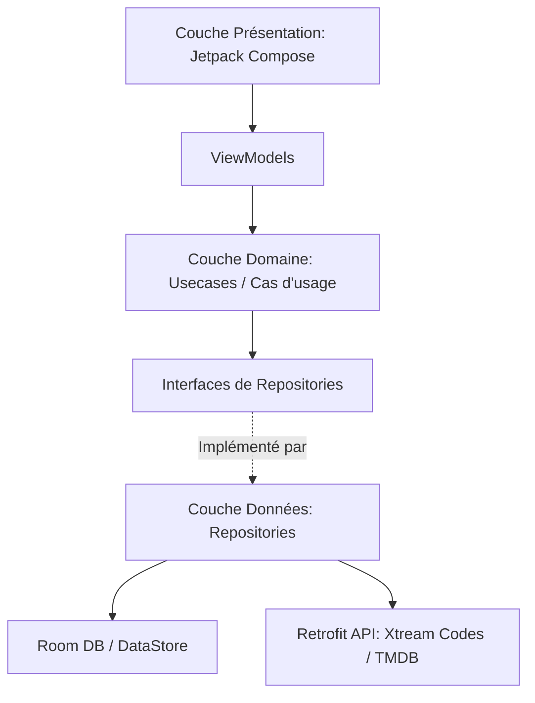

# Architecture de CSTV IPTV

Ce document présente l'architecture globale, les choix techniques majeurs, la structure des répertoires et les flux de données au sein de l'application.

---

## 1. Principes Architecturaux (Clean Architecture & MVVM)

L'application est structurée selon les principes de la **Clean Architecture** combinée au pattern **MVVM** (Model-View-ViewModel) pour assurer une séparation stricte des responsabilités, une grande testabilité et une excellente maintenabilité.

Elle se divise en 3 couches distinctes :

### 📂 Couch structurelle
```
app/src/main/java/com/cstv/app/
├── data/          # Couche Données (Implémentations, API, Stockage, Cache)
├── domain/        # Couche Domaine (Modèles métier purs, Cas d'usage, Interfaces Repositories)
└── presentation/  # Couche Présentation (Composables UI, ViewModels, Thème, Navigation)
```



### 🧱 Description des couches

#### A. Couche Domaine (`domain/`)
C'est le cœur de l'application, complètement indépendant des frameworks externes (Android, Room, Retrofit, etc.). Elle contient :
* **`model/`** : Les modèles de données métier purs (ex: `LiveStream`, `FavoriteItem`). Ils sont stables et testables unitairement sans dépendances Android. Contient également des utilitaires de calcul et de matching purs et réutilisables, tels que **`TmdbCatalogMatcher`** (qui centralise le rapprochement entre les tendances TMDB et le catalogue local en combinant similarité textuelle et validation stricte de l'année de sortie à +/- 1 an).
* **`repository/`** : Les interfaces de communication avec les données. Elles définissent les contrats de récupération ou de modification des données (ex: `LiveTvRepository`).
* **`usecase/`** : Les cas d'usage (facultatif mais fortement recommandé pour factoriser la logique métier).

#### B. Couche Données (`data/`)
Responsable de l'approvisionnement en données. Elle implémente les interfaces définies par la couche Domaine.
* **`remote/`** : Appels réseau avec **Retrofit** et **OkHttp** vers l'API Xtream Codes et l'API TMDB. Contient les DTOs (Data Transfer Objects) et les adaptateurs Gson pour le parsing défensif (tolérance types string/int incohérents).
* **`local/`** : Persistance avec **Room** (cache d'API, favoris, historique, profils).
* **`download/`** : Logique de téléchargement de vidéos hors-ligne via le gestionnaire dédié d'ExoPlayer / Media3.
* **`worker/`** : Tâches planifiées en arrière-plan avec **WorkManager** pour la synchronisation automatique du catalogue.
* **`repository/`** : Implémentations réelles des interfaces de repositories (ex: `LiveTvRepositoryImpl`), gérant la logique de cache (quand servir les données locales de Room vs quand appeler l'API réseau).

#### C. Couche Présentation (`presentation/`)
Responsable de l'interface utilisateur. Elle utilise **Jetpack Compose** pour l'UI.
* **ViewModels** : Un ViewModel par écran. Il gère l'état de l'interface (StateFlow) et interagit avec la couche Domaine. Zéro logique métier directe dans les Composables.
* **Composables** : Séparés par dossiers thématiques (écrans principaux : `login`, `home`, `livetv`, `vod`, `series`, `player`, etc.). Préférer des composants stateless (state hoisting).
* **`theme/`** : Définition des couleurs, polices et formes (typo Bricolage Grotesque et Hanken Grotesk).
* **`components/`** : Composants graphiques réutilisables à travers l'application.

---

## 2. Choix Techniques Majeurs & Stack Technique

* **Kotlin uniquement** : Utilisation exclusive des fonctionnalités modernes de Kotlin (Coroutines, Flow/StateFlow).
* **Injection de Dépendances (Hilt)** : Gestion de la durée de vie des dépendances de manière déclarative (dans `di/AppModule.kt`).
* **Moteur TMDB Popular & Caches Versionnés (F9)** :
  * Un repository dédié `PopularRepository` gère la récupération de la première page des films et séries populaires via l'API TMDB.
  * Utilisation d'un cache global persistant versionné dans le namespace `tmdb_popular_cache` avec un TTL (Time-To-Live) de 24 heures pour éviter les requêtes réseau superflues.
  * Invalidation granulaire et réactive : les caches de films et de séries sont invalidés indépendamment lors d'une synchronisation réussie de leur catalogue respectif (`getVodAllStreamsSyncedAt` et `getSeriesAllStreamsSyncedAt`).
  * Parallélisme de traitement : Le cas d'usage `GetPopularTop10InCatalogUseCase` exécute les requêtes de films et de séries populaires en parallèle sur le pool de threads `Dispatchers.Default` pour éliminer tout goulot d'étranglement séquentiel, sous le contrôle d'un timeout de sécurité de 15 secondes dans `HomeViewModel` (découplé du spinner de chargement principal).
* **Gestion de l'historique de visionnage local & Geste TV Sécurisé (F8)** :
  * Un repository dédié `ViewingHistoryRepository` isole la logique de suppression de l'historique de visionnage et des chaînes récentes de celle des repositories de catalogue.
  * Réactivité par flux Room : Remplacement des chargements ponctuels des chaînes de télévision récentes par une observation réactive (`Flow`), alignant le comportement sur les reprises VOD/Série et éliminant tout rafraîchissement manuel.
  * Interception sécurisée de la touche TV : Interception personnalisée du D-pad (`onPreviewKeyEvent` de Compose) pour distinguer l'appui court (lecture directe) de l'appui long (maintien central). L'événement `KeyUp` associé est consommé de manière sécurisée si un appui long a été détecté, empêchant ainsi le lancement indésirable du lecteur vidéo après la fermeture du dialogue.
  * Invalidation granulaire des recommandations : La suppression d'un film ou d'un épisode d'une série invalide de manière réactive le cache des recommandations du profil, forçant sa mise à jour lors du prochain affichage de l'Accueil.
* **Lecteur Vidéo (Media3 / ExoPlayer + NextLib) & Socle Commun (T3)** :
  * ExoPlayer (Media3) pour la lecture HLS et MP4.
  * Extension **NextLib** (`nextlib-media3ext`) intégrant des décodeurs FFmpeg logiciels pour supporter les codecs audio EAC3, AC3, et DTS directement en local, évitant ainsi le problème récurrent des vidéos "muettes" sur les décodeurs matériels limités des box Android TV.
  * **Socle Commun Factorisé (`presentation/player/core/`)** : centralise et déduplique la mécanique technique des trois lecteurs (Live, VOD, Séries) :
    * `ExoPlayerCore` : gestion unifiée du cycle de vie du lecteur (`rememberManagedExoPlayer`) avec support sélectif du cache (opt-in pour VOD/Séries, désactivé pour le Live).
    * `PlayerLifecycleCore` : gestion globale de `KEEP_SCREEN_ON`, détection de l'état Picture-in-Picture (PiP) et application du workaround de relayout de la surface d'affichage.
    * `PlayerOverlayCore` : hôte d'overlay générique (`PlayerOverlayHost`) à slots configurables pour le masquage automatique des contrôles après inactivité, tout en conservant l'autonomie visuelle propre à chaque écran.
    * `PositionTrackerCore` : boucle temporelle générique de suivi de la position de lecture (`TrackPlayerPosition`) cadencée sur le temps réel monotone, gérant la mise à jour UI et raccordant de manière sécurisée les callbacks de sauvegarde finale (`onTrackerDispose`).
* **Base de données Room & SQLite** :
  * Base de données `AppDatabase` (actuellement en version **16**).
  * **Pas de fallbackToDestructiveMigration()** ! Toutes les migrations sont rédigées en SQL brut de manière explicite dans `Migrations.kt` pour préserver intactes les données des utilisateurs (favoris, profils, historique) lors des mises à jour applicatives.
* **Double système de navigation (Piège connu)** :
  * Côté Mobile : Utilisation de `navigation-compose` via l'arbre de navigation `AppNavGraph`.
  * Côté Android TV : Navigation manuelle via un enum `AppScreen` géré dans `MainActivity.kt`.
  * *Important* : Tout nouvel écran doit être câblé dans les deux systèmes pour s'afficher correctement sur mobile et sur TV.

---

## 3. Flux de données & Sécurité

* **Chiffrement des identifiants** : Les identifiants Xtream Codes de l'utilisateur sont chiffrés et sauvegardés localement de manière sécurisée (DataStore chiffré / EncryptedSharedPreferences).
* **Isolation des profils** : Les données privées des profils (favoris, avancement de lecture, préférences de langue) utilisent une clé composite incluant le `profileId` au niveau de Room (tables `FavoriteEntity`, `PlaybackPositionEntity`, etc.).
* **Règles ProGuard (R8)** : Pour le build de release (`assembleRelease`), toutes les nouvelles interfaces Retrofit doivent être annotées ou configurées avec une règle `-keep` spécifique dans `proguard-rules.pro` afin d'éviter que l'optimiseur R8 ne supprime ou ne renomme par réflexion des appels API génériques, ce qui provoquerait un crash à l'exécution.
