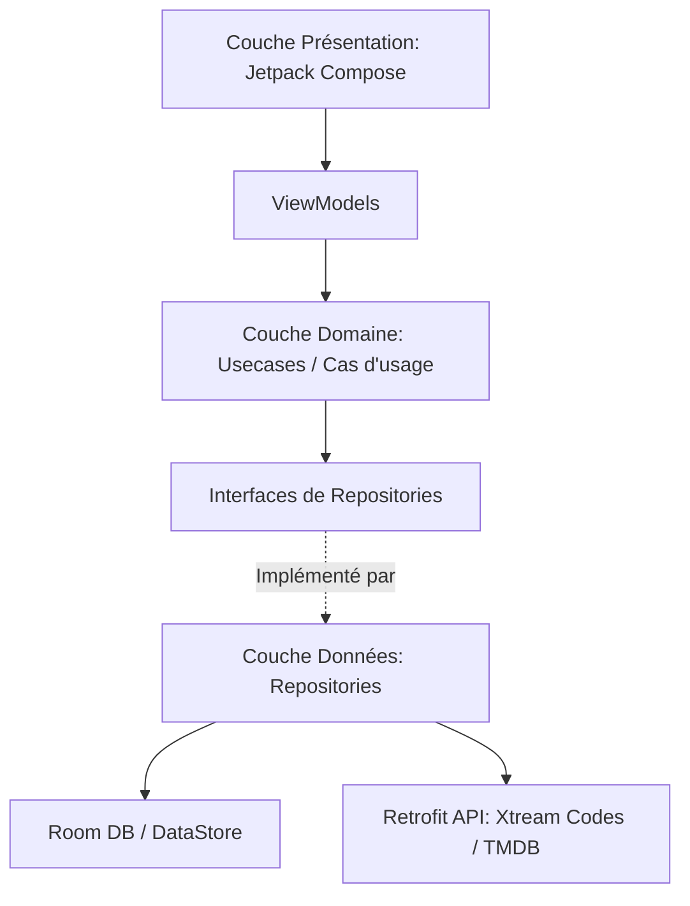

# Architecture de CSTV IPTV

Ce document présente l'architecture globale, les choix techniques majeurs, la structure des répertoires et les flux de données au sein de l'application.

---

## 1. Principes Architecturaux (Clean Architecture & MVVM)

L'application est structurée selon les principes de la **Clean Architecture** combinée au pattern **MVVM** (Model-View-ViewModel) pour assurer une séparation stricte des responsabilités, une grande testabilité et une excellente maintenabilité.

Elle se divise en 3 couches distinctes :

### 📂 Couch structurelle
```
app/src/main/java/com/cstv/app/
├── data/          # Couche Données (Implémentations, API, Stockage, Cache)
├── domain/        # Couche Domaine (Modèles métier purs, Cas d'usage, Interfaces Repositories)
└── presentation/  # Couche Présentation (Composables UI, ViewModels, Thème, Navigation)
```



### 🧱 Description des couches

#### A. Couche Domaine (`domain/`)
C'est le cœur de l'application, complètement indépendant des frameworks externes (Android, Room, Retrofit, etc.). Elle contient :
* **`model/`** : Les modèles de données métier purs (ex: `LiveStream`, `FavoriteItem`). Ils sont stables et testables unitairement sans dépendances Android. Contient également des utilitaires de calcul et de matching purs et réutilisables, tels que **`TmdbCatalogMatcher`** (qui centralise le rapprochement entre les tendances TMDB et le catalogue local en combinant similarité textuelle et validation stricte de l'année de sortie à +/- 1 an, amélioré avec un tri multicritère par rang d'année `YearRank` pour gérer finement les remakes et homonymes).
* **`repository/`** : Les interfaces de communication avec les données. Elles définissent les contrats de récupération ou de modification des données (ex: `LiveTvRepository`).
* **`usecase/`** : Les cas d'usage (facultatif mais fortement recommandé pour factoriser la logique métier).

#### B. Couche Données (`data/`)
Responsable de l'approvisionnement en données. Elle implémente les interfaces définies par la couche Domaine.
* **`remote/`** : Appels réseau avec **Retrofit** et **OkHttp** vers l'API Xtream Codes et l'API TMDB. Contient les DTOs (Data Transfer Objects) et les adaptateurs Gson pour le parsing défensif (tolérance types string/int incohérents).
* **`local/`** : Persistance avec **Room** (cache d'API, favoris, historique, profils).
* **`download/`** : Logique de téléchargement de vidéos hors-ligne via le gestionnaire dédié d'ExoPlayer / Media3.
* **`worker/`** : Tâches planifiées en arrière-plan avec **WorkManager** pour la synchronisation automatique du catalogue.
* **`repository/`** : Implémentations réelles des interfaces de repositories (ex: `LiveTvRepositoryImpl`), gérant la logique de cache (quand servir les données locales de Room vs quand appeler l'API réseau).

### Cache catalogue hors ligne & Synchronisation dynamique (T4 / T7)

Les écrans catalogue lisent des `Flow` Room et ne déclenchent pas directement le réseau. `CatalogSyncManager` coordonne les écritures Xtream vers Room pour les catégories et flux Live/VOD/Séries, avec fraîcheur par section, classement d'erreurs et remplacement transactionnel du catalogue. La clé de catalogue est liée au serveur (`host:port`) : un changement d'utilisateur sur le même serveur conserve la base, tandis qu'un changement de serveur la purge. La session hors ligne est contrôlée séparément par une clé chiffrée liée à l'utilisateur exact.

Depuis l'évolution **T7**, la durée de validité (fraîcheur) du catalogue n'est plus fixée à une valeur statique de 24 heures. Elle est calculée dynamiquement au runtime par `CatalogSyncManagerImpl` en interrogeant la fréquence de synchronisation (`DAILY`, `WEEKLY`, `MONTHLY`, `DISABLED`) configurée par l'utilisateur dans `SettingsManager`. Si le catalogue est expiré selon ce paramètre et que l'appareil est connecté à Internet (détection active via `NetworkMonitor`), l'application lance silencieusement et de manière asynchrone `syncIfStale()` sans perturber la navigation, sans bloquer l'UI par un loader, et sans faire apparaître de bannière d'erreur en cas d'échec transitoire. Le bandeau `OfflineBanner` est déconnecté de l'historique d'échecs de synchronisation et se fonde uniquement sur l'état de connectivité réseau réelle : il ne s'affiche plus que comme un simple indicateur informatif lorsque l'appareil est hors ligne.

#### C. Couche Présentation (`presentation/`)
Responsable de l'interface utilisateur. Elle utilise **Jetpack Compose** pour l'UI.
* **ViewModels** : Un ViewModel par écran. Il gère l'état de l'interface (StateFlow) et interagit avec la couche Domaine. Zéro logique métier directe dans les Composables.
* **Composables** : Séparés par dossiers thématiques (écrans principaux : `login`, `home`, `livetv`, `vod`, `series`, `player`, etc.). Préférer des composants stateless (state hoisting).
* **`theme/`** : Définition des couleurs, polices et formes (typo Bricolage Grotesque et Hanken Grotesk).
* **`components/`** : Composants graphiques réutilisables à travers l'application.

---

## 2. Choix Techniques Majeurs & Stack Technique

* **Kotlin uniquement** : Utilisation exclusive des fonctionnalités modernes de Kotlin (Coroutines, Flow/StateFlow).
* **Injection de Dépendances (Hilt)** : Gestion de la durée de vie des dépendances de manière déclarative (dans `di/AppModule.kt`).
* **Moteur TMDB Popular & Caches Versionnés (F9 / T8)** :
  * Un repository dédié `PopularRepository` gère la récupération de la première page des films et séries populaires via l'API TMDB.
  * Utilisation d'un cache global persistant versionné dans le namespace `tmdb_popular_cache` avec un TTL (Time-To-Live) de 24 heures pour éviter les requêtes réseau superflues.
  * Invalidation granulaire et réactive : les caches de films et de séries sont invalidés indépendamment lors d'une synchronisation réussie de leur catalogue respectif (`getVodAllStreamsSyncedAt` et `getSeriesAllStreamsSyncedAt`) ou de la fin de l'enrichissement des métadonnées du catalogue (`CatalogSection.ENRICHMENT`), fermant ainsi la fenêtre de cache obsolète pendant l'enrichissement d'arrière-plan du chemin `runSync`.
  * Parallélisme de traitement : Le cas d'usage `GetPopularTop10InCatalogUseCase` exécute les requêtes de films et de séries populaires en parallèle sur le pool de threads `Dispatchers.Default` pour éliminer tout goulot d'étranglement séquentiel, sous le contrôle d'un timeout de sécurité de 15 secondes dans `HomeViewModel` (découplé du spinner de chargement principal).
  * **Rafraîchissement silencieux et stabilité de session (T8)** : Pour éradiquer les sauts visuels (layout shifts) et les perturbations de focus lors de la navigation active de l'utilisateur, l'application applique un principe de figeage par session. Si un cache local existe (même périmé), il est immédiatement chargé et reste le seul contenu affiché dans la session active de `HomeViewModel`. Une coroutine d'arrière-plan, intégrée de façon structurée à la hiérarchie de `popularJob` pour éviter les lancements concurrents cumulés, interroge TMDB et écrit silencieusement les nouvelles données en base de données locale (sans jamais modifier l'état UI en cours). Les données actualisées seront chargées de façon transparente au démarrage suivant de l'application. Des indicateurs de session figeant les listes VOD et Séries bloquent toute relecture ou réaffichage lors d'actions ultérieures dans l'onglet (comme le changement de préférences de catégories) ; seule l'absence initiale complète de cache (premier lancement à froid) autorise la mise à jour directe de l'état d'UI à réception du réseau pour éviter une ligne vide.
* **Gestion de l'historique de visionnage local & Geste TV Sécurisé (F8)** :
  * Un repository dédié `ViewingHistoryRepository` isole la logique de suppression de l'historique de visionnage et des chaînes récentes de celle des repositories de catalogue.
  * Réactivité par flux Room : Remplacement des chargements ponctuels des chaînes de télévision récentes par une observation réactive (`Flow`), alignant le comportement sur les reprises VOD/Série et éliminant tout rafraîchissement manuel.
  * Interception sécurisée de la touche TV : Interception personnalisée du D-pad (`onPreviewKeyEvent` de Compose) pour distinguer l'appui court (lecture directe) de l'appui long (maintien central). L'événement `KeyUp` associé est consommé de manière sécurisée si un appui long a été détecté, empêchant ainsi le lancement indésirable du lecteur vidéo après la fermeture du dialogue.
  * Invalidation granulaire des recommandations : La suppression d'un film ou d'un épisode d'une série invalide de manière réactive le cache des recommandations du profil, forçant sa mise à jour lors du prochain affichage de l'Accueil.
* **Lecteur Vidéo (Media3 / ExoPlayer + NextLib) & Socle Commun (T3 / B16)** :
  * ExoPlayer (Media3) pour la lecture HLS et MP4.
  * Extension **NextLib** (`nextlib-media3ext`) intégrant des décodeurs FFmpeg logiciels pour supporter les codecs audio EAC3, AC3, et DTS directement en local, évitant ainsi le problème récurrent des vidéos "muettes" sur les décodeurs matériels limités des box Android TV.
  * **Socle Commun Factorisé (`presentation/player/core/`)** : centralise et déduplique la mécanique technique des trois lecteurs (Live, VOD, Séries) :
    * `ExoPlayerCore` : gestion unifiée du cycle de vie du lecteur (`rememberManagedExoPlayer`) avec support sélectif du cache (opt-in pour VOD/Séries, désactivé pour le Live). Il s'appuie désormais sur une politique de décodage asymétrique et isolée (**PlayerDecoderPolicy**, introduite dans **B16**) pour configurer ses décodeurs.
    * **Politique de décodage asymétrique (PlayerDecoderPolicy & B16)** : Résout les corruptions visuelles d'image sur téléviseurs Android TV (lignes de décodage YUV déchirées) en dissociant la priorité des extensions de décodage par type de piste. Un nouveau renderer personnalisé (`VideoHardwarePreferredRenderersFactory`) est utilisé dans le pipeline d'ExoPlayer pour forcer le mode `ON` côté vidéo, reléguant le décodeur logiciel FFmpeg de NextLib en dernier recours afin de privilégier le décodage matériel natif du téléviseur (`MediaCodecVideoRenderer`), ce qui restaure l'affichage d'une image fluide et correcte. À l'inverse, le mode global reste réglé sur `PREFER` côté audio, garantissant la priorité au décodage logiciel FFmpeg pour continuer de couvrir EAC3, AC3 et DTS de façon fluide sur les équipements dépourvus de décodage matériel natif pour ces formats.
    * `PlayerLifecycleCore` : gestion globale de `KEEP_SCREEN_ON`, détection de l'état Picture-in-Picture (PiP) et application du workaround de relayout de la surface d'affichage.
    * `PlayerOverlayCore` : hôte d'overlay générique (`PlayerOverlayHost`) à slots configurables pour le masquage automatique des contrôles après inactivité, tout en conservant l'autonomie visuelle propre à chaque écran.
    * `PositionTrackerCore` : boucle temporelle générique de suivi de la position de lecture (`TrackPlayerPosition`) cadencée sur le temps réel monotone, gérant la mise à jour UI et raccordant de manière sécurisée les callbacks de sauvegarde finale (`onTrackerDispose`).
* **Système d'évaluation J'aime / Je n'aime pas (F7)** :
  * **Table profilée `media_ratings`** : Une nouvelle table est créée avec une clé primaire composite `(profileId, mediaType, mediaId)` pour stocker localement les évaluations. Le `mediaType` ("movie" ou "series") distingue un film et une série partageant exceptionnellement le même identifiant numérique.
  * **Transaction atomique de vote négatif** : L'enregistrement d'un `DISLIKE` (rejet) effectue de manière atomique via `AppDatabase.withTransaction` l'insertion du vote, le retrait du favori de même type/identifiant et la suppression de toutes les reprises de lecture associées (films ou épisodes de séries, rattachés soit via leur `seriesId` ou leurs `streamId`).
  * **Pondération explicite & Moteur de recommandation** : `RecommendationEngine` intègre des signaux d'évaluation pondérés : les contenus `LIKE` reçoivent un poids de `3.0` (contre `1.0` pour l'historique de visionnage neutre) pour amplifier leur contribution dans le profil de goûts. Les contenus `DISLIKE` sont totalement exclus du calcul des goûts.
  * **Exclusion & Cold Start** : Les contenus aimés (`LIKE`) et rejetés (`DISLIKE`) sont totalement exclus des carrousels de recommandations. Un seul `LIKE` sur le catalogue permet au moteur de générer des recommandations pertinentes, court-circuitant le seuil habituel de trois lectures pour les profils en cold start.
  * **Invalidation & Flux Réactifs** : `SetMediaRatingUseCase` délègue l'écriture au repository, puis invalide de façon synchronisée (sécurisée par un `Mutex`) le cache de `GetRecommendationsUseCase`. Les invalidations sont émises via un `SharedFlow` collecté par `HomeViewModel` pour forcer le recalcul des recommandations en temps réel sans affecter les autres éléments de l'Accueil (comme TMDB ou l'EPG).
* **Gestion dynamique des barres système & Insets (F11)** :
  * **Edge-to-Edge au démarrage** : `WindowCompat.setDecorFitsSystemWindows(window, false)` est appelé dans `MainActivity.onCreate` pour permettre au contenu Jetpack Compose de s'étendre sous les barres système.
  * **Thème découplé du plein écran** : Le thème de l'application hérite de `Theme.IptvXtream` parent de `Theme.Material.NoActionBar` (plutôt que `.Fullscreen`) pour permettre l'affichage de la barre de statut au runtime. La déclaration de `windowLayoutInDisplayCutoutMode` à `shortEdges` dans `res/values-v28/styles.xml` autorise le dessin sous le poinçon/l'encoche en paysage immersif.
  * **`SystemBarsController` réactif** : Composant/Effet Compose réutilisable encapsulant `WindowInsetsControllerCompat` qui contrôle dynamiquement la visibilité des barres système (toujours masquées sur TV, masquées uniquement dans les lecteurs sur mobile, visibles ailleurs sur mobile) avec des icônes claires adaptées au thème sombre global.
  * **Traitement des insets** : Utilisation sélective des modificateurs de padding Compose (`statusBarsPadding()`, `safeDrawingPadding()`) sur mobile pour écarter l'UI des découpes physiques d'écran, tandis que le `NavHost` applique `PaddingValues(0.dp)` pour les routes de lecteurs vidéo (`live_player`, `vod_player`, `series_player`) afin qu'ils occupent l'intégralité de l'écran physique.
* **Navigation vers la fiche détails depuis le clic sur la cover du player (F16)** :
  * **Règle de décision pure (`PlayerDetailsNavigation`)** : Isolation de la règle de routage au sein d'un objet Kotlin pur sans dépendance Android pour garantir une couverture de test unitaire JVM complète et robuste. Le résolveur détermine l'une des trois actions possibles (`POP_TO_DETAILS`, `REPLACE_WITH_DETAILS`, `UNAVAILABLE`) selon que la fiche cible est déjà présente ou non immédiatement derrière dans la pile (`backstack`).
  * **Composant partagé d'action de cover (`PlayerCoverAction`)** : Composable Jetpack Compose partagé affichant l'image ou un placeholder si elle est absente. La sémantique d'accessibilité est entièrement portée sur la zone interactive (avec `Role.Button` et annonce dynamique d'indisponibilité) et le focus Android TV y est rattaché explicitement par un lien `FocusRequester` depuis les boutons de transport.
  * **Unification du dépilage et de la navigation** : Utilisation d'une extension `NavHostController.openPlayerDetails` dans `NavGraph.kt` pour gérer de manière atomique la transition (dépilage du player, ré-initialisation de l'état hoisté requis par la fiche cible, puis navigation vers `"vod_details"` ou `"series_details"`).
  * **Garde d'unicité et résilience de sortie** : Utilisation de l'état local `isLeaving` assurant l'unicité de la transition. Si la fermeture échoue (par exemple, si la pile ne contient plus d'écran valide), le player réactive sa visibilité et ses contrôles au lieu de rester bloqué.
  * **Persistance fiable du `seriesId`** : Adaptation de la persistance de position de lecture dans `SeriesViewModel` pour accepter un identifiant explicite de série, garantissant que l'historique de position possède systématiquement son lien de série parent, indispensable lors d'une reprise directe depuis la page d'Accueil.
* **Lecture automatique du trailer YouTube sur les fiches de détail (F13)** :
  * **Composant Backdrop réutilisable (`MediaDetailsTrailerBackdrop`)** : Composant de fond unifié remplaçant dynamiquement le backdrop de fond statique (`AsyncImage` floutée) par une WebView YouTube (`YouTubeTrailerPreview`) après 5 secondes passées de façon stable et continue sur la fiche.
  * **Contrôle sonore dans la barre d'action supérieure** : Intégration d'un bouton Son Material 3 (mobile) et Android TV (télécommande) réactif placé dans la barre d'action d'en-tête, s'initialisant systématiquement en mode muet pour chaque média pour le respect des préférences de confort utilisateur.
  * **Orchestration Lifecycle du lecteur** : Observation stricte du cycle de vie Android (`ON_START` / `ON_STOP` du `LifecycleTracker`) pour interrompre instantanément l'autoplay ou la lecture de la WebView en arrière-plan et libérer ses ressources.
  * **Moteur de recherche TMDB asynchrone** : Mécanisme de résolution des `tmdbId` manquants pour les médias de catalogue IPTV locaux via des appels de recherche TMDB (`search/movie`, `search/tv`), s'appuyant sur un algorithme de correspondance testable et rigoureux (`TrailerLookupMatcher`) basé sur une similarité de titre normalisé >= 0,8 et une tolérance d'année de ± 1 an.
  * **Cache persistant local Room (v20)** : Mémorisation pérenne et partagée (sans liaison profil) des résultats de résolution de trailers en base SQLite via l'entité `TrailerCacheEntity` pour éradiquer les multiples appels réseau consécutifs, avec des TTL distincts : 30 jours pour un trailer trouvé, 7 jours pour un résultat négatif.
  * **Bannissement automatique sur échec de lecture** : Raccordement des callbacks d'erreurs de lecture (`reportTrailerPlaybackFailure`) pour déclencher l'invalidation immédiate en base de données de toute bande-annonce devenue indisponible sur YouTube, garantissant un retour propre sur l'affiche statique et déclenchant une nouvelle recherche à la prochaine visite.
* **Moteur de recherche unifié par sous-chaîne (F17)** :
  * **Suppression totale de FTS4** : Afin d'éliminer les limitations de FTS4 (impossible d'effectuer un LIKE avec un joker de début type `%keyword%`) et de simplifier le schéma SQL (suppression des tables virtuelles et des doubles écritures lors de la synchronisation), le moteur FTS4 a été intégralement retiré.
  * **Colonne dénormalisée `searchText`** : Ajout d'une colonne textuelle `searchText` sur les tables `live_streams`, `vod_streams` et `series_streams`. Elle stocke la concaténation de tous les champs recherchables (nom, catégorie, acteurs, réalisateur, genre, etc.) séparés par un saut de ligne (`\n`).
  * **Normalisation uniforme (Casse & Diacritiques)** : Une fonction de normalisation unifiée `LocalSearchQuery.normalize()` (minuscules, normalisation NFD via `java.text.Normalizer`, retrait des marques non espaçantes `\p{Mn}` et repli explicite des ligatures courantes comme `œ`→`oe`, `ß`→`ss`) est appliquée à la fois lors du calcul de `searchText` à l'écriture (recalculé systématiquement par les DAO lors de toute insertion/mise à jour via des wrappers `@Transaction`) et lors de la lecture des mots-clés de l'utilisateur. Cela contourne les limites d'insensibilité à la casse de SQLite sur les caractères non-ASCII et assure une recherche insensible à la casse et aux accents.
  - **Filtrage hybride performant** : La recherche multi-mots est traitée en deux temps pour garder des requêtes Room `@Query` statiques et performantes. Le token le plus long de la saisie utilisateur (token ancre) est évalué en SQL via un `LIKE :pattern ESCAPE '\'` (avec échappement strict des caractères `%`, `_` et `\`), réduisant considérablement le jeu de résultats retourné par SQLite. Les tokens restants sont ensuite filtrés en mémoire par Kotlin sur les résultats remontés.
  - **Unification de la recherche** : La recherche unifiée et la recherche avancée (`AdvancedCatalogSearchUseCase`) partagent le même modèle pur de validation `LocalSearchQuery`, évitant toute divergence de comportement pour une même saisie multi-mots.
  * **Gestion optimisée de l'Accueil et des Tendances (B15)** :
  - **Cache périmé toléré** : Afin d'éliminer la latence de démarrage (jusqu'à 2 secondes) liée aux requêtes réseau TMDB, le cache des tendances locales (même s'il est périmé au-delà de sa durée de fraîcheur nominale de 24 heures) est immédiatement lu et affiché en UI au lancement.
  - **Fusion asynchrone stable (Append on Refresh)** : Les tendances fraîches obtenues en tâche de fond ne remplacent pas brusquement le cache périmé affiché. Elles sont fusionnées de manière stable en ajoutant uniquement les nouveaux éléments à la fin de la liste affichée, assurant la continuité de l'expérience utilisateur et du focus.
  - **Dédoublonnage sémantique robuste** : Le filtrage des doublons entre cache périmé et nouvelles tendances s'effectue sur la paire sementique unique `(tmdbId, isMovie)` pour éviter d'évincer indûment des films et séries TMDB partageant le même identifiant numérique.
  - **Skeleton Loader non-focusable** : Si aucun cache n'est disponible, le loader plein écran n'est pas déclenché par les tendances. À la place, un composant d'attente visuelle Skeleton occupe l'emplacement Hero de manière non interactive, sans intercepter le D-pad et en conservant les autres sections d'Accueil pleinement interactives.
* **Base de données Room & SQLite** :
  * Base de données `AppDatabase` (actuellement en version **21**).
  * **Pas de fallbackToDestructiveMigration()** ! Toutes les migrations sont rédigées en SQL brut de manière explicite dans `Migrations.kt` pour préserver intactes les données des utilisateurs (favoris, profils, historique) lors des mises à jour applicatives (comme la transition 20 → 21 de F17).
* **Système de navigation unifié (F18)** :
  * L'application utilise désormais un seul système de navigation via `AppNavGraph` (navigation-compose, `presentation/navigation/NavGraph.kt`) partagé entre Mobile et TV.
  * L'ancien double système (navigation manuelle par enum `AppScreen` et boucle `when` dans `MainActivity.kt`) est obsolète et a été entièrement supprimé.

---

## 3. Flux de données & Sécurité

* **Chiffrement des identifiants** : Les identifiants Xtream Codes de l'utilisateur sont chiffrés et sauvegardés localement de manière sécurisée (DataStore chiffré / EncryptedSharedPreferences).
* **Isolation des profils** : Les données privées des profils (favoris, avancement de lecture, préférences de langue) utilisent une clé composite incluant le `profileId` au niveau de Room (tables `FavoriteEntity`, `PlaybackPositionEntity`, etc.).
* **Règles ProGuard (R8)** : Pour le build de release (`assembleRelease`), toutes les nouvelles interfaces Retrofit doivent être annotées ou configurées avec une règle `-keep` spécifique dans `proguard-rules.pro` afin d'éviter que l'optimiseur R8 ne supprime ou ne renomme par réflexion des appels API génériques, ce qui provoquerait un crash à l'exécution.
